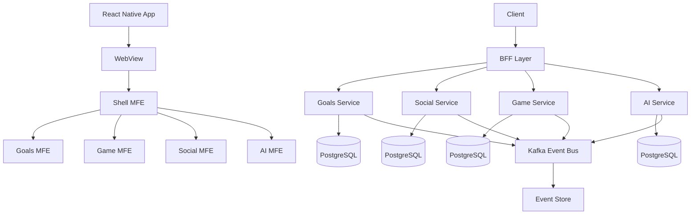

# SALT - Smart Asset Life Tool

금융과 재미를 결합한 새로운 방식의 자산 관리 플랫폼

## 소개
SALT는 저축 목표 관리, 게임화 요소, 소셜 기능을 결합하여 재미있고 지속 가능한 저축 습관을 만들어주는 서비스입니다.

## 주요 기능
- 목표 기반 저축 관리
- 게이미피케이션을 통한 동기 부여
- 소셜 챌린지와 커뮤니티 
- AI 기반 개인화 추천
- 실시간 피드와 알림

## 아키텍처

### 마이크로 프론트엔드 (MFA)
- **선택 이유**
 - 도메인별 독립적 개발/배포
 - 기술 스택 유연성
 - 확장성과 유지보수성 
 - 팀 단위 자율성

### BFF (Backend For Frontend)
- **선택 이유**
 - 효율적인 API 게이트웨이
 - 중앙화된 인증/인가
 - 마이크로서비스 통신 추상화
 - 클라이언트 최적화

### 마이크로 서비스 (MSA)
- **선택 이유**
 - 도메인 중심 설계 (DDD)
 - 서비스 독립성
 - 확장성
 - 장애 격리

### 이벤트 드리븐 아키텍처 (EDA)
- **선택 이유**
 - 실시간 데이터 처리 (목표 달성, 게임 보상, 알림)
 - 서비스간 느슨한 결합
 - 비동기 처리로 성능 향상
 - 이벤트 소싱을 통한 데이터 추적

## 🛠 기술 스택

### Mobile(뼈대)
- React Native (Expo)
- TypeScript
- Redux (상태관리)
- React Query (서버 상태)
- React Navigation
- Reanimated (애니메이션)

### Frontend (웹뷰)
- Next.js 14 (App Router)
- TypeScript
- Module Federation
- TailwindCSS
- Redux (핵심 상태)
- React-Query (서버 상태)
- Zustand (UI 상태)
- Sentry (에러 추적)

### Backend
- NestJS
- PostgreSQL
- Redis
- Kafka
- DDD
- CQRS
- Event Sourcing

### DevOps
- Docker
- Kubernetes
- Github Actions

## 아키텍처 다이어그램

## 프로젝트 구조
### 1. mobile mono
```bash
├── src/
│   ├── screens/       # 화면 컴포넌트
│   │   ├── auth/     # 인증 관련 화면
│   │   ├── goals/    # 목표 관리 화면
│   │   └── social/   # 소셜 기능 화면
│   ├── components/   # 재사용 컴포넌트
│   │   ├── common/   # 공통 컴포넌트
│   │   └── goals/    # 목표 관련 컴포넌트
│   └── store/        # 상태 관리
│       ├── slices/   # Redux 슬라이스
│       └── index.ts  # 스토어 설정

```
### 2. micro frontend
```bash
├── shell/            # 컨테이너 앱
│   ├── src/
│   │   ├── pages/   # 라우팅
│   │   ├── hooks/   # 커스텀 훅
│   │   └── stores/  # 상태 관리
├── goals/            # 목표 관리 앱
│   ├── src/
│   │   ├── pages/   # 페이지 컴포넌트
│   │   ├── hooks/   # 커스텀 훅
│   │   └── stores/  # 상태 관리
└── game/             # 게임 앱
    ├── src/
    │   ├── pages/   # 페이지 컴포넌트
    │   ├── hooks/   # 커스텀 훅
    │   └── stores/  # 상태 관리
```
### 3. bff gateway
```bash
├── src/
│   ├── modules/           # 기능 모듈
│   │   ├── auth/         # 인증 모듈
│   │   └── proxy/        # 프록시 모듈
│   ├── common/           # 공통 기능
│   │   ├── filters/      # 예외 필터
│   │   └── guards/       # 가드
│   └── config/           # 설정 파일
```
### 4. micro service
```bash
├── goals/                    # 목표 서비스
│   ├── src/
│   │   ├── domain/          # 도메인 모델
│   │   ├── application/     # 유스케이스
│   │   └── infrastructure/  # 인프라 계층
├── game/                     # 게임 서비스
│   ├── src/
│   │   ├── domain/          # 도메인 모델
│   │   ├── application/     # 유스케이스
│   │   └── infrastructure/  # 인프라 계층
└── social/                   # 소셜 서비스
    ├── src/
    │   ├── domain/          # 도메인 모델
    │   ├── application/     # 유스케이스
    │   └── infrastructure/  # 인프라 계층
```

## MVP(Minimum Viable Product)

- 목표 저축 기본 기능
- 간단한 게임화 요소
- 기본 소셜 기능
- 핵심 인프라 안정화
## 👥 팀 정보
개인 프로젝트
