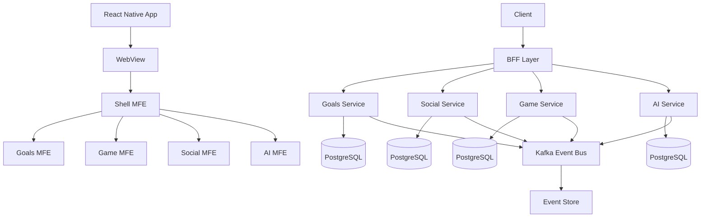

# SALT - Smart Asset Life Tool

금융과 재미를 결합한 새로운 방식의 자산 관리 플랫폼

## 소개
SALT는 저축 목표 관리, 게임화 요소, 소셜 기능을 결합하여 재미있고 지속 가능한 저축 습관을 만들어주는 서비스입니다.

## 주요 기능
- 목표 기반 저축 관리
- 게이미피케이션을 통한 동기 부여
- 소셜 챌린지와 커뮤니티 
- AI 기반 개인화 추천
- 실시간 피드와 알림

## 아키텍처

### 마이크로 프론트엔드 (MFA)
- **선택 이유**
 - 도메인별 독립적 개발/배포
 - 기술 스택 유연성
 - 확장성과 유지보수성 
 - 팀 단위 자율성

### BFF (Backend For Frontend)
- **선택 이유**
 - 효율적인 API 게이트웨이
 - 중앙화된 인증/인가
 - 마이크로서비스 통신 추상화
 - 클라이언트 최적화

### 마이크로서비스 (MSA)
- **선택 이유**
 - 도메인 중심 설계 (DDD)
 - 서비스 독립성
 - 확장성
 - 장애 격리

### 이벤트 드리븐 아키텍처 (EDA)
- **선택 이유**
 - 실시간 데이터 처리 (목표 달성, 게임 보상, 알림)
 - 서비스간 느슨한 결합
 - 비동기 처리로 성능 향상
 - 이벤트 소싱을 통한 데이터 추적

## 🛠 기술 스택

### Mobile(뼈대)
- React Native (Expo)
- TypeScript
- Redux (상태관리)
- React Query (서버 상태)
- React Navigation
- Reanimated (애니메이션)

### Frontend (웹뷰)
- Next.js 14 (App Router)
- TypeScript
- Module Federation
- TailwindCSS
- Redux (핵심 상태)
- React-Query (서버 상태)
- Zustand (UI 상태)
- Sentry (에러 추적)

### Backend
- NestJS
- PostgreSQL
- Redis
- Kafka
- DDD
- CQRS
- Event Sourcing

### DevOps
- Docker
- Kubernetes
- Github Actions

## 아키텍처 다이어그램

## 프로젝트 구조
```
salt/
├── client/
│   ├── mobile/              # 리액트 네이티브
│   └── webview/             # Micro Frontends
│       ├── shell/
│       ├── goals/
│       ├── game/
│       ├── social/
│       └── ai/
├── server/
│   ├── bff/                 # BFF Gateway
│   └── services/            # Micro Services
│       ├── goals/
│       ├── game/
│       ├── social/
│       └── ai/
└── k8s/                     # Kubernetes configs

```
## 👥 팀 정보
개인 프로젝트
