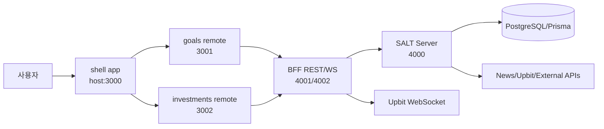

# SALT 현재 기능 맵

Last audited: 2026-05-25

이 문서는 `salt-microFe/**`, `bff/**`, `salt-server/**`, `salt-server/prisma/schema.prisma`를 기준으로 작성한 기능 인벤토리다. 상태는 코드 구조와 route/model 존재 여부 기준이며, 실제 UX 완성도는 기능별 기획서에서 추가 검증한다.

관련 상세 보고서:

- `pm/reports/feature-audits/2026-05-24-investment-backend-report.md` — 증권/투자 파트 현재 기능 상세 보고서

## 시스템 구성

## 기능 인벤토리

| 기능 | 상태 | 프론트 | BFF | 서버 | 데이터/Worker | 메모 |
|---|---|---|---|---|---|---|
| Shell/Home | Partial | `apps/shell/src/pages/home`, Home/Header/Tips components | `GET /api/app/home` | `GET /api/dashboard`, user dashboard | `User`, points/achievements | 홈 aggregation 의도는 있으나 FE-BFF 연결 상태 추가 확인 필요 |
| 인증 | Partial | shell auth store/hooks/mock, API constants | proxy `/api/auth/register`, `/api/auth/login`, `/api/auth/refresh`, `/api/auth/me` | `/api/auth/*` | `User`, JWT utils | 실제 로그인 화면/폼 노출 상태 추가 확인 필요 |
| 사용자 프로필/포인트/업적 | Backend Only | shell auth/user state 일부 | proxy `/api/users/*` | `/api/users/profile`, points, achievements, dashboard | `User`, `PointTransaction`, `UserAchievement` | 프론트 화면 연결은 제한적으로 보임 |
| 목표 저축 | Partial | `apps/goals`, shell `/goals`, `/goals/addgoals` | proxy `/api/goals*` | `/api/goals*` | `Goal`, `SavingTransaction` | 목표 목록/추가 UI 있음. submit과 실제 API 연결은 추가 확인 필요 |
| 목표 계좌 선택 이벤트 | Frontend Only | goals add form, `@repo/message-event-bus`, `ACCOUNT_SELECTED` | 없음 | 없음 | 없음 | MFE 간 계좌 선택 연동 의도. 은행/계좌 API는 확인 필요 |
| 데일리 미션 | Backend Only | README/제품 설명에는 존재 | proxy `/api/missions*` | `/api/missions*` | `DailyMission`, `UserMissionProgress`, points | 프론트 노출 화면 추가 필요 |
| 투자 시장 목록 | Implemented | investments `/investment`, MarketPreview/RealtimeInvestment/hooks | proxy `/api/investment/market/overview` | `GET /api/investment/market/overview` | `MarketAsset`, BFF price cache | FE API constants가 BFF 4001을 직접 사용 |
| 실시간 투자 가격 | Partial | investments WebSocket client/hooks | WS `ws://localhost:4002`, subscribe/unsubscribe | price update internal API | BFF Upbit WS, `market-price-updater`, `PriceHistoryWorker` | BFF/서버 worker 경계와 중복 구독 정책 지속 관리 필요 |
| 투자 차트 | Partial | TradingViewChart, chart preview hooks | proxy `/api/investment/crypto/:symbol/chart` | chart endpoint, price history | `PriceHistory`, `TechnicalIndicator` | period 오타(`miniute`) 등 계약 정리 필요 |
| 관심 종목 | Backend Only | investments API 일부 가능성 | proxy `/api/investment/watchlist` | watchlist CRUD | `InvestmentWatchlist` | 프론트에서 명시 UI 확인 필요 |
| 포트폴리오 | Backend/BFF Only | 투자 앱에 MyInvestments UI 일부 | `/api/app/portfolio`, proxy 일부 없음 | `/api/portfolio*` | `PortfolioTransaction`, `PortfolioHolding`, performance service | FE 연결/입력 플로우 추가 확인 필요 |
| 시장 인텔리전스 | Partial | MarketIntelligencePreview | proxy `/api/market-intelligence/:symbol/dashboard` | `/api/market-intelligence/:symbol/*` | `MarketSentiment`, `WhaleTransaction`, alerts | dashboard/sentiment/smart-money/whale API 존재 |
| 투자 인사이트 | Backend Only | 확인된 프론트 UI 제한 | proxy 일부 없음 | `/api/investment-insight/*` | `InvestmentInsight`, insight worker | ranking/generate/feedback류 route 존재. 상세 route 추가 파악 필요 |
| AI 투자 코치 | Backend/BFF Only | PM prototype 있음, 실제 투자 앱 UI 미연결 | proxy `/api/ai-coach/generate`, `/api/ai-coach`, app `/api/app/ai-coach/preview`, `/detail`, `/profile`, `/feedback`, `/explain` | `/api/ai-coach`, `/api/ai-coach/generate`, `/profile`, `/feedback`, `/explain` | `UserInvestmentProfile`, `InvestmentInsight`, Gemini explainer | 단타/장기 듀얼 판단, preview/detail, 프로필, 피드백, Gemini 기반 LLM 해설 계약 구현 |
| 외부 주문 전 체크 | Backend/BFF Only | PM prototype 있음, 실제 투자 앱 UI 미연결 | `POST /api/app/trade-preflight` | `POST /api/trade-preflight` | `PortfolioHolding`, `UserInvestmentProfile`, `MarketAsset` | 주문 실행 없이 손익비/최대손실/예상 비중/체크리스트 계산 |
| 행동 코치 | Backend/BFF Only | PM prototype 있음, 실제 투자 앱 UI 미연결 | `GET /api/app/behavior-coach` | `GET /api/behavior-coach` | `PortfolioTransaction`, `InvestmentInsight` | 거래 기록 기반 과잉거래/패닉셀/추격매수 등 편향 경고 |
| 익절/손절 플랜 | Backend/BFF Only | PM prototype 있음, 실제 투자 앱 UI 미연결 | `GET /api/app/profit-plan` | `GET /api/profit-plan` | `PortfolioHolding` | 보유 종목별 손실 제한, 1차 익절, 추세 유지 단계 카드 |
| 신호 성과 | Backend/BFF Only | PM prototype 있음, 실제 투자 앱 UI 미연결 | `GET /api/app/signal-performance` | `GET /api/signal-performance` | `InvestmentInsight`, `PriceHistory` | AI 코치 신호 이후 가격 변화로 sample/winRate/avgReturn/maxDrawdown 계산 |
| 투자 알림 | Backend/BFF Only | 확인된 프론트 UI 없음 | `/api/app/alerts` | `/api/investment-notifications*` | `InvestmentNotification`, cleanup worker | unread/read-all/read count 존재 |
| 투자 피드 | Backend/BFF Only | 확인된 프론트 UI 없음 | `/api/app/feed` | `/api/feed` | insight/news 기반 | 앱 홈용 feed aggregation으로 보임 |
| 뉴스 | Backend Only | 확인된 프론트 UI 없음 | proxy 명시 없음 | `/api/news*` | `NewsArticle`, `NewsBookmark`, news crawler | list/trending/detail/bookmark/crawl 존재 |
| 대시보드 | Backend Only | shell home과 연계 가능 | app home aggregation 가능 | `/api/dashboard` | user/goal/portfolio/mission 집계 가능성 | FE 요구사항으로 명확화 필요 |
| MFE 이벤트 버스 | Implemented | shell/goals/investments shared package | 없음 | 없음 | `packages/message-event-bus` | 앱 간 런타임 통신 기반 |
| UI 디자인 시스템 | Implemented | `packages/ui` | 없음 | 없음 | Storybook/docs | 공통 Button/Input 등 UI 패키지 |

## 주요 데이터 모델

- 사용자/인증: `User`
- 목표 저축: `Goal`, `SavingTransaction`
- 미션/게이미피케이션: `DailyMission`, `UserMissionProgress`, `UserAchievement`, `PointTransaction`
- 투자/시장: `InvestmentWatchlist`, `MarketAsset`, `PriceHistory`, `TechnicalIndicator`
- 포트폴리오: `PortfolioTransaction`, `PortfolioHolding`
- 뉴스/북마크: `NewsArticle`, `NewsBookmark`
- 인텔리전스/알림: `MarketSentiment`, `WhaleTransaction`, `SentimentAlert`, `SmartMoneyAlert`, `InvestmentNotification`
- AI/인사이트/코치: `UserInvestmentProfile`, `InvestmentInsight`, `ExecutionLog`

## 주요 백그라운드 작업

- 서버: market sync, market price updater, price history, technical indicator, investment insight, notification cleanup, news crawler
- BFF: Upbit WebSocket price updater, client WebSocket subscription broadcasting

## 확인 필요 Gap

- Shell 인증 화면과 실제 auth API 연결 범위
- 목표 추가 form submit이 `POST /api/goals`까지 연결되는지
- Goals 앱 API base URL이 현재 BFF/서버 포트와 일치하는지
- 투자 chart period query의 `miniute` 값이 서버 계약과 맞는지
- 포트폴리오/뉴스/미션/AI 코치/외부 주문 전 체크/행동 코치/익절 플랜/신호 성과의 실제 프론트 노출 계획
- BFF worker와 서버 worker의 가격 업데이트 책임 분리
- `UserInvestmentProfile` DTO에는 `defaultMode`, `notificationLevel`을 받지만 현재 Prisma model에는 영속 필드가 없어 응답에서 `unsupportedPersistedFields`로 관리됨
