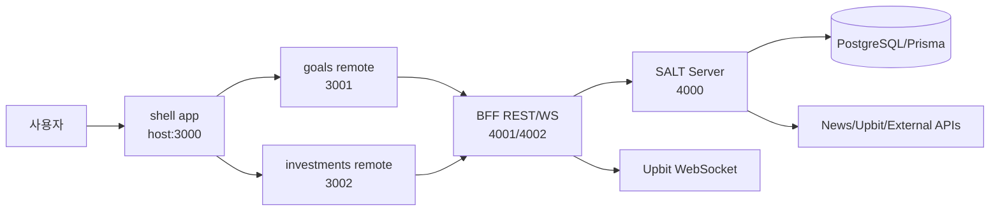

# SALT 현재 기능 맵

Last audited: 2026-05-25
Direction updated: 2026-09-08 (아래 '제품 방향 재정의' 참조)
Requirements mapped: 2026-09-10 (아래 '요구사항 지도 반영' 참조)

이 문서는 `salt-microFe/**`, `bff/**`, `salt-server/**`, `salt-server/prisma/schema.prisma`를 기준으로 작성한 기능 인벤토리다. 상태는 코드 구조와 route/model 존재 여부 기준이며, 실제 UX 완성도는 기능별 기획서에서 추가 검증한다.

관련 상세 보고서:

- `pm/reports/feature-audits/2026-05-24-investment-backend-report.md` — 증권/투자 파트 현재 기능 상세 보고서

> ⚠️ 아래 '기능 인벤토리'는 **2026-05-25 기준 실제 코드 상태**다. 2026-09-08에 제품 방향이 재정의되었고 제거/신규 결정이 내려졌으나 **아직 코드에 반영되지 않았다.** 결정 내용은 문서 하단 '제품 방향 재정의 (2026-09-08)' 절과 각 FEATURE 기획서를 참조한다.

## 시스템 구성

```mermaid
flowchart LR
  User[사용자] --> Shell[shell app<br/>host:3000]
  Shell --> Goals[goals remote<br/>3001]
  Shell --> Investments[investments remote<br/>3002]
  Goals --> BFF[BFF REST/WS<br/>4001/4002]
  Investments --> BFF
  BFF --> Server[SALT Server<br/>4000]
  Server --> DB[(PostgreSQL/Prisma)]
  BFF --> Upbit[Upbit WebSocket]
  Server --> External[News/Upbit/External APIs]
```

## 기능 인벤토리

| 기능 | 상태 | 프론트 | BFF | 서버 | 데이터/Worker | 메모 |
|---|---|---|---|---|---|---|
| Shell/Home | Partial | `apps/shell/src/pages/home`, Home/Header/Tips components | `GET /api/app/home` | `GET /api/dashboard`, user dashboard | `User`, points/achievements | 홈 aggregation 의도는 있으나 FE-BFF 연결 상태 추가 확인 필요 |
| 인증 | Partial | shell auth store/hooks/mock, API constants | proxy `/api/auth/register`, `/api/auth/login`, `/api/auth/refresh`, `/api/auth/me` | `/api/auth/*` | `User`, JWT utils | 실제 로그인 화면/폼 노출 상태 추가 확인 필요 |
| 사용자 프로필/포인트/업적 | Backend Only | shell auth/user state 일부 | proxy `/api/users/*` | `/api/users/profile`, points, achievements, dashboard | `User`, `PointTransaction`, `UserAchievement` | 프론트 화면 연결은 제한적으로 보임 |
| 목표 저축 | Partial | `apps/goals`, shell `/goals`, `/goals/addgoals` | proxy `/api/goals*` | `/api/goals*` | `Goal`, `SavingTransaction` | 목표 목록/추가 UI 있음. submit과 실제 API 연결은 추가 확인 필요 |
| 목표 계좌 선택 이벤트 | Frontend Only | goals add form, `@repo/message-event-bus`, `ACCOUNT_SELECTED` | 없음 | 없음 | 없음 | MFE 간 계좌 선택 연동 의도. 은행/계좌 API는 확인 필요 |
| 데일리 미션 | Backend Only | README/제품 설명에는 존재 | proxy `/api/missions*` | `/api/missions*` | `DailyMission`, `UserMissionProgress`, points | 프론트 노출 화면 추가 필요 |
| 투자 시장 목록 | Implemented | investments `/investment`, MarketPreview/RealtimeInvestment/hooks | proxy `/api/investment/market/overview` | `GET /api/investment/market/overview` | `MarketAsset`, BFF price cache | FE API constants가 BFF 4001을 직접 사용 |
| 실시간 투자 가격 | Partial | investments WebSocket client/hooks | WS `ws://localhost:4002`, subscribe/unsubscribe | price update internal API | BFF Upbit WS, `market-price-updater`, `PriceHistoryWorker` | BFF/서버 worker 경계와 중복 구독 정책 지속 관리 필요 |
| 투자 차트 | Partial | TradingViewChart, chart preview hooks | proxy `/api/investment/crypto/:symbol/chart` | chart endpoint, price history | `PriceHistory`, `TechnicalIndicator` | period 오타(`miniute`) 등 계약 정리 필요 |
| 관심 종목 | Backend Only | investments API 일부 가능성 | proxy `/api/investment/watchlist` | watchlist CRUD | `InvestmentWatchlist` | 프론트에서 명시 UI 확인 필요 |
| 포트폴리오 | Backend/BFF Only | 투자 앱에 MyInvestments UI 일부 | `/api/app/portfolio`, proxy 일부 없음 | `/api/portfolio*` | `PortfolioTransaction`, `PortfolioHolding`, performance service | FE 연결/입력 플로우 추가 확인 필요 |
| 시장 인텔리전스 | Partial | MarketIntelligencePreview | proxy `/api/market-intelligence/:symbol/dashboard` | `/api/market-intelligence/:symbol/*` | `MarketSentiment`, `WhaleTransaction`, alerts | dashboard/sentiment/smart-money/whale API 존재 |
| 투자 인사이트 | Backend Only | 확인된 프론트 UI 제한 | proxy 일부 없음 | `/api/investment-insight/*` | `InvestmentInsight`, insight worker | ranking/generate/feedback류 route 존재. 상세 route 추가 파악 필요 |
| AI 투자 코치 | Backend/BFF Only | PM prototype 있음, 실제 투자 앱 UI 미연결 | proxy `/api/ai-coach/generate`, `/api/ai-coach`, app `/api/app/ai-coach/preview`, `/detail`, `/profile`, `/feedback`, `/explain` | `/api/ai-coach`, `/api/ai-coach/generate`, `/profile`, `/feedback`, `/explain` | `UserInvestmentProfile`, `InvestmentInsight`, Gemini explainer | 단타/장기 듀얼 판단, preview/detail, 프로필, 피드백, Gemini 기반 LLM 해설 계약 구현 |
| 외부 주문 전 체크 | Backend/BFF Only | PM prototype 있음, 실제 투자 앱 UI 미연결 | `POST /api/app/trade-preflight` | `POST /api/trade-preflight` | `PortfolioHolding`, `UserInvestmentProfile`, `MarketAsset` | 주문 실행 없이 손익비/최대손실/예상 비중/체크리스트 계산 |
| 행동 코치 | Backend/BFF Only | PM prototype 있음, 실제 투자 앱 UI 미연결 | `GET /api/app/behavior-coach` | `GET /api/behavior-coach` | `PortfolioTransaction`, `InvestmentInsight` | 거래 기록 기반 과잉거래/패닉셀/추격매수 등 편향 경고 |
| 익절/손절 플랜 | Backend/BFF Only | PM prototype 있음, 실제 투자 앱 UI 미연결 | `GET /api/app/profit-plan` | `GET /api/profit-plan` | `PortfolioHolding` | 보유 종목별 손실 제한, 1차 익절, 추세 유지 단계 카드 |
| 신호 성과 | Backend/BFF Only | PM prototype 있음, 실제 투자 앱 UI 미연결 | `GET /api/app/signal-performance` | `GET /api/signal-performance` | `InvestmentInsight`, `PriceHistory` | AI 코치 신호 이후 가격 변화로 sample/winRate/avgReturn/maxDrawdown 계산 |
| 투자 알림 | Backend/BFF Only | 확인된 프론트 UI 없음 | `/api/app/alerts` | `/api/investment-notifications*` | `InvestmentNotification`, cleanup worker | unread/read-all/read count 존재 |
| 투자 피드 | Backend/BFF Only | 확인된 프론트 UI 없음 | `/api/app/feed` | `/api/feed` | insight/news 기반 | 앱 홈용 feed aggregation으로 보임 |
| 뉴스 | Backend Only | 확인된 프론트 UI 없음 | proxy 명시 없음 | `/api/news*` | `NewsArticle`, `NewsBookmark`, news crawler | list/trending/detail/bookmark/crawl 존재 |
| 대시보드 | Backend Only | shell home과 연계 가능 | app home aggregation 가능 | `/api/dashboard` | user/goal/portfolio/mission 집계 가능성 | FE 요구사항으로 명확화 필요 |
| MFE 이벤트 버스 | Implemented | shell/goals/investments shared package | 없음 | 없음 | `packages/message-event-bus` | 앱 간 런타임 통신 기반 |
| UI 디자인 시스템 | Implemented | `packages/ui` | 없음 | 없음 | Storybook/docs | 공통 Button/Input 등 UI 패키지 |

## 주요 데이터 모델

- 사용자/인증: `User`
- 목표 저축: `Goal`, `SavingTransaction`
- 미션/게이미피케이션: `DailyMission`, `UserMissionProgress`, `UserAchievement`, `PointTransaction`
- 투자/시장: `InvestmentWatchlist`, `MarketAsset`, `PriceHistory`, `TechnicalIndicator`
- 포트폴리오: `PortfolioTransaction`, `PortfolioHolding`
- 뉴스/북마크: `NewsArticle`, `NewsBookmark`
- 인텔리전스/알림: `MarketSentiment`, `WhaleTransaction`, `SentimentAlert`, `SmartMoneyAlert`, `InvestmentNotification`
- AI/인사이트/코치: `UserInvestmentProfile`, `InvestmentInsight`, `ExecutionLog`

## 주요 백그라운드 작업

- 서버: market sync, market price updater, price history, technical indicator, investment insight, notification cleanup, news crawler
- BFF: Upbit WebSocket price updater, client WebSocket subscription broadcasting

## 확인 필요 Gap

- Shell 인증 화면과 실제 auth API 연결 범위
- 목표 추가 form submit이 `POST /api/goals`까지 연결되는지
- Goals 앱 API base URL이 현재 BFF/서버 포트와 일치하는지
- 투자 chart period query의 `miniute` 값이 서버 계약과 맞는지
- 포트폴리오/뉴스/미션/AI 코치/외부 주문 전 체크/행동 코치/익절 플랜/신호 성과의 실제 프론트 노출 계획
- BFF worker와 서버 worker의 가격 업데이트 책임 분리
- `UserInvestmentProfile` DTO에는 `defaultMode`, `notificationLevel`을 받지만 현재 Prisma model에는 영속 필드가 없어 응답에서 `unsupportedPersistedFields`로 관리됨

## 제품 방향 재정의 (2026-09-08)

> 상태: **계획 확정 · 구현 미착수.** 이 절의 판정은 결정 사항이며 코드 반영은 FEATURE-000부터 순차 진행한다.

### 무엇이 바뀌었나

기존 SALT는 "저축 게이미피케이션 + 투자 코치"였고, 인벤토리 24개 기능 중 화면이 붙은 것은 4개뿐이었다(나머지 15개가 `Backend Only`). 사용자 결정에 따라 **본인 + 초대된 지인 최대 10명을 위한 비공개 개인 투자코치**로 재정의한다.

- 자금은 SALT에 들어오지 않는다. 매매는 업비트/증권사에서 직접 하고 SALT는 **조회 전용** 연동만 한다.
- 자산군을 **크립토 + 국내주식 + 미국주식** 3종으로 확장한다(`AssetType` 확장).
- AI 추천(매수·매도 타이밍)은 **유지**하되, 모든 추천 카드에 **근거 · 과거 적중률 · 틀렸던 사례** 3종이 없으면 렌더하지 않는다.
- 게이미피케이션(미션/포인트/업적/랭킹/게임)·소셜·뉴스·시장 인텔리전스 알림 3종은 **제거**한다.
- 화면 24개 → **탭 5개**(홈/코치/청구서/세금/포지션).
- **서약 카드 / 쿨다운 타이머는 범위에서 제외**한다(사용자 결정). 앱이 사용자 행동을 통제·차단하는 메커니즘 전체를 뺀다.

### 판정 요약

| 판정 | 개수 | 대표 항목 |
|---|---|---|
| 유지 | 10 | AI 코치, trade-preflight, behavior-coach, profit-plan, signal-performance, 포트폴리오 원장, 가격 원장, 실시간 가격, 차트, `packages/ui` |
| 제거 | 8 | 미션/포인트/업적, 관심종목 CRUD, 시장 인텔리전스(센티먼트·고래·스마트머니), 뉴스, 피드, MFE 계좌선택 이벤트, 레거시 `AIAnalysis*` |
| 통합·축소 | 6 | Shell/Home → ① 홈, 인증 → 초대 코드, 다목표 저축 → 단일 적립 목표, 시장 목록 → `isTracked` 10종, 인사이트 랭킹, 알림 → 2종, 대시보드 |
| 신규 | 5 | FEATURE-001~005 |

목표 수치: 기능 인벤토리 24 → **12 이하**, Prisma model 34 → **16**, worker 7 → **4**, MFE 3앱 → **2앱**.

### 신규 기능

| # | 기능 | 한 줄 |
|---|---|---|
| FEATURE-001 | 개입 청구서 (My Alpha) | 내 계좌를 "아무것도 안 했을 때"·"기계적 적립했을 때"와 나란히 놓고 차액을 원화로. 거래별 가격표의 합이 총액과 정확히 일치(항등식) |
| FEATURE-002 | 연말 세금 마감 콕핏 | 자산군 3종 D-Day, 미국주식 손실수확 솔버(250만원 공제 최적화), 결제일·환율 함정 경고, 크립토 의제취득가액 스텝업 손익분기 |
| FEATURE-003 | 밸류에이션 밴드 적립 | "이번 주 얼마 넣을지" 단일 숫자. BTC는 MVRV Z, 미국 지수는 CAPE 백분위로 배수 0~3x. 김프를 매수 비용으로 환산 |
| FEATURE-004 | AI 코치 추천 화면 | 이미 서버에만 있던 `ai-coach`/`signal-performance`/`profit-plan`/`trade-preflight`/`behavior-coach`를 화면으로. 3종 세트 렌더 게이트 |
| FEATURE-005 | ~~홈 브리핑 & 5탭 IA~~ | **결번.** 5탭 IA는 2026-09-09 결정(탭 축소·대화 중심)으로 FEATURE-006이 대체한다. 홈 5블록 요구사항만 FEATURE-006으로 흡수 |
| FEATURE-006 | 코치 대화 & 3탭 IA | 대화가 제품의 핵심. 3탭(홈/코치/자산) + PC 전용 `MovableGrid`. 홈 5블록을 흡수 |
| FEATURE-007 | 모바일 앱 (React Native) | iOS+Android. **푸시 알림이 존재 이유** — 세금 마감 D-Day가 웹만으로는 도달하지 않는다. TestFlight/Play 내부 테스트, OTA |

## 요구사항 지도 반영 (2026-09-10)

`current-feature-map.md`의 '기능 인벤토리'는 여전히 **2026-05-25 코드 상태**다. 그 위에 아래 결정과 요구사항이 얹혀 있고, **아직 코드에 반영되지 않았다.**

### 아키텍처 전환 (구현 전)

| 서피스 | 현재 | 전환 목표 | 근거 |
|---|---|---|---|
| 웹 | `@module-federation/nextjs-mf` 3앱(shell/goals/investments), Pages Router | **Multi-Zones 2앱**(`apps/web` + `apps/web-tax`) · App Router **스트리밍 SSR** · **FSD** | `ADR-001` · `FE-REQ-007`~`009` |
| 모바일 | 없음 | **`apps/mobile` 신설** (React Native, iOS+Android, FSD) | `RN-REQ-001`~`003` |
| BFF | 레이어 경계 혼재 | 레이어드 + **SSE 스트리밍** | `BFF-REQ-006` |
| 서버 | `src/modules/*` | **DDD 컨텍스트 우선** `{context}/{domain,application,infrastructure,presentation}` | `SRV-REQ-006` |
| 서버 정리 | 삭제 대상 잔존 | 삭제 5건 · 동면 4건 · `410 Gone` | `SRV-REQ-007` |

**`@module-federation/nextjs-mf`를 버린 이유**: App Router 미지원 + Next.js 지원 종료. 대체 선정 근거와 4안 비교는 `requirements/decisions/ADR-001-microfrontend-replacement.md`.

### 신규 컨텍스트 / 슬라이스

프론트 FSD 슬라이스 이름과 서버 DDD 컨텍스트 이름은 **동일**하다.

`auth` · `ledger` · `portfolio` · `market` · `coach` · `invoice` · `tax` · `plan` · `indicator` · `fx` · `goal` · `news` · `notification` · **`device`(F007 신규, 모바일 전용)**

### 신규 DB 모델 (F007)

| 모델 | 용도 | 비고 |
|---|---|---|
| `Device` | 푸시 토큰·플랫폼·앱/런타임 버전 | **평문 토큰 컬럼 0건** (해시 + 암호문) |
| `NotificationDelivery` | 발송 기록 | `(userId, dedupeKey)` unique가 **D-30 중복 발송을 막는 유일한 장치** |
| `NotificationPreference` | 알림 타입별 on/off | 끄더라도 세금 D-1은 발송 |
| `AppVersionGate` | 최소 지원 버전 | 플랫폼당 1행 |

### 요구사항 문서 현황

**145개 작성 완료 · 구현 0건.** 전체 지도는 `requirements/specs/in-progress/salt-requirements-master-index.md`.

| 영역 | 개수 | 위치 |
|---|---|---|
| `DB` 001~028 | 28 | `salt-server/requirements/specs/to-do/` |
| `SRV` 006~035 | 30 | `salt-server/requirements/specs/to-do/` |
| `BFF` 006~034 | 29 | `bff/requirements/specs/to-do/` |
| `FE` 007~033 | 27 | `salt-microFe/requirements/specs/to-do/` |
| `RN` 001~031 | 31 | `salt-microFe/requirements/specs/to-do/` |

기능마다 영역별 4종(형태/기능/인터페이스/성능)을 채웠다. F007만 웹 화면이 없어 FE 사분면이 결번이다.

### 하드 마감

| 날짜 | 내용 | 막히면 |
|---|---|---|
| 2026-12-29 | 미국주식 연내 결제 마감 (D-111 기준 2026-09-09) | 250만원 공제 한 해분 소멸 |
| 2026-12-30 | 국내주식 결제 마감 | 대주주 판정 |
| 2026-12-31 | 크립토 과세연도 종료 | — |
| 2027-01-01 00:10 KST | 연말 가격 스냅샷 (**immutable**) | 취득가액 산정 불가 |

F007(모바일 푸시)은 **F002 세금 D-Day 알림의 전달 경로**다. 12월 이전에 배포되지 않으면 마감 알림이 도달하지 않는다.

### 관련 문서

- 글로벌 계획: `requirements/specs/in-progress/salt-solo-rebuild-global-plan.md`
- 기획서: `pm/requirements/specs/in-progress/FEATURE-000-scope-reset.md` ~ `FEATURE-007-mobile-app.md` (**FEATURE-005는 결번**)
- 요구사항 지도: `requirements/specs/in-progress/salt-requirements-master-index.md`
- 아키텍처 결정: `requirements/decisions/ADR-001-microfrontend-replacement.md`
- 스토리보드(인터랙티브 HTML): `pm/storyboard/SALT-Storyboard(20260908-1557).html`
