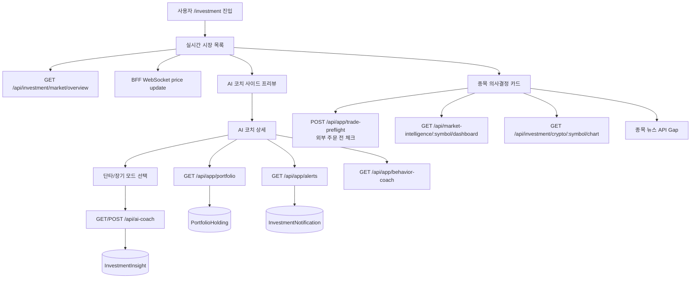

# FEATURE-DRAFT: SALT 수익 목표형 투자 코치 혁신 플랜

## TL;DR

현재 SALT 투자 영역은 시장 목록, 실시간 가격, 차트, 시장 심리, 스마트머니, 포트폴리오, 인사이트, 플레이북, 뉴스, 알림, 드로잉 등 백엔드 기능이 넓게 존재하지만 프론트 UX는 `/investment`의 실시간 마켓 테이블과 미리보기 중심으로 제한되어 있다. 사용자가 실제로 원하는 것은 “전략 설정 도구”가 아니라 지금 무엇을 봐야 하고, 왜 사거나 기다려야 하고, 언제 줄여야 하는지 쉽게 판단하는 의사결정 화면이다.

이번 기획의 방향은 현재 구현된 실시간 투자 화면을 유지하면서, 오른쪽 사이드 영역에 **AI 투자 코치 프리뷰**를 붙이고 클릭 시 **단타/장기 상세 코치 모드**로 들어가게 하는 것이다. 기존 서버 기능은 **AI 투자 코치 + 단타/장기 모드 + 수익 기회 레이더 + 외부 주문 전 체크리스트 + 매도/익절 판단 플랜 + 내 자산 리스크 가드 + 뉴스/고래/차트 근거 요약**으로 묶는다. 제품 목적은 사용자가 돈을 더 잘 벌 가능성을 높이는 것이다. 다만 SALT는 매수/매도 주문을 실행하지 않고, 사용자가 증권/거래소 앱에서 직접 주문하기 전에 “검증된 근거, 확률, 손익비, 리스크 한도”로 의사결정을 강하게 돕는다.

## 리서치 근거

| 근거 | 시사점 | 제품 반영 |
|---|---|---|
| Barber & Odean의 개인투자자 연구는 거래가 많은 가구의 성과가 시장 대비 크게 낮았고, 과잉확신이 높은 회전율과 낮은 성과를 설명한다고 본다. 출처: https://papers.ssrn.com/sol3/Delivery.cfm/000327306.pdf?abstractid=219228 | 사용자를 더 자주 거래하게 만들면 돈을 벌게 하기보다 잃게 할 가능성이 커진다. | 매수 신호보다 “거래하지 말아야 할 때”를 강하게 알려주는 FOMO 브레이크를 둔다. |
| 처분효과 연구는 투자자가 수익 종목을 너무 빨리 팔고 손실 종목을 너무 오래 보유하는 경향을 반복적으로 확인한다. 출처: https://papers.ssrn.com/sol3/papers.cfm?abstract_id=1709225, https://papers.ssrn.com/sol3/papers.cfm?abstract_id=1176422 | 잘 버는 사람은 진입보다 청산 규칙, 손절/익절 규칙, 기록 관리가 중요하다. | 외부 주문 앱을 열기 전에 “무효화 가격, 손절선, 익절 구간, 보유 기간”을 정하게 한다. |
| 2025년 처분효과 연구는 개인별 편향이 시간과 맥락을 넘어 지속되는 특성일 수 있다고 본다. 출처: https://papers.ssrn.com/sol3/papers.cfm?abstract_id=5243056 | 모든 사용자에게 같은 코치를 주면 안 된다. | 사용자별 편향 프로필을 만들고, 패닉셀형/물타기형/추격매수형 경고를 개인화한다. |
| 크립토 리테일 연구는 같은 투자자도 주식/금에서는 역추세, 크립토에서는 추세추종처럼 다르게 행동한다고 본다. 출처: https://papers.ssrn.com/sol3/Delivery.cfm/SSRN_ID4706806_code2148550.pdf?abstractid=4289513&mirid=1&type=2 | 비트코인/알트코인은 주식식 가치평가 UX만으로 부족하고, 추세/레짐/수급을 분리해야 한다. | 크립토는 추세 지속, 과열 추격, 급락 반전 가능성을 별도 스코어로 보여준다. |
| SEC 투자자문 마케팅 규칙은 이익만 강조하고 리스크/한계를 공정하게 제시하지 않는 커뮤니케이션을 문제로 본다. 출처: https://www.sec.gov/investment/investment-adviser-marketing | “수익 보장” 문구는 제품 신뢰와 규제 리스크를 동시에 해친다. | 수익 목표는 전면에 두되, 모든 추천은 근거/리스크/비용/실패 조건과 같이 표시한다. |
| Whale/on-chain 데이터와 sentiment/technical 지표를 결합한 비트코인 예측 연구들은 변동성 또는 방향 예측 가능성을 탐색하지만, 신호는 노이즈와 과최적화 위험이 크다. 출처: https://arxiv.org/abs/2211.08281, https://arxiv.org/abs/2410.14532 | 고래 매수만 보고 따라 사면 위험하다. | 고래 신호는 단독 매수 신호가 아니라 뉴스, 추세, 거래량, 포트폴리오 리스크와 합쳐 신뢰도를 계산한다. |

## 국내 주식 데이터 소스 리서치

국내 주식까지 확장할 수는 있지만, 비트코인/업비트처럼 무료 공개 WebSocket으로 바로 실시간 시세를 붙이는 구조는 어렵다. 국내 주식 실시간 시세는 거래소/정보사업자 라이선스와 증권사 계좌 인증의 영향을 받는다.

| 후보 | 가능 범위 | 사업자/계약 | 무료 가능성 | 판단 |
|---|---|---|---|---|
| 한국투자증권 KIS Developers | 국내주식, 해외주식, REST, WebSocket, 시세/계좌/주문 API | 개인 계좌/AppKey 기반 사용 가능. 제휴는 별도 | 개인 개발/조회 용도는 시작 가능성이 높음. 호출 제한 확인 필요 | 1순위 PoC 후보. SALT는 주문 API 비활성화, 시세 조회 전용으로 검토 |
| 키움증권 REST API/OpenAPI | 국내주식 시세 조회, 실시간 시세, 주문 등 | 개인 투자자 API 성격. 계좌/앱키 필요 | 개인 사용 가능성이 높음. 기존 OpenAPI는 환경 제약, REST는 최신 | 2순위 후보. Mac/Linux 서버 친화성은 REST API 확인 필요 |
| 토스증권 Open API | 국내외 주식 통합 API, REST/WebSocket 예정 | 2026-05-21 기준 계좌 보유 고객 사전 신청 단계, 정식 오픈일 미정 | 아직 정식 운영 전이라 제품 의존 불가 | 출시 후 재검토. 지금 MVP 의존 소스로 쓰면 일정 리스크 큼 |
| 코스콤 Open API/KRX 시세 | 공식 시장 데이터, 실시간/시장정보 API | 시세 라이선스 계약 및 이용계약 필요. 사업자 서류 가능성 높음 | 주식시세는 라이선스 과금. 일부 스타트업 기본료 면제 정책은 있으나 계약 필요 | 무사업자/무료 MVP에는 부적합. 향후 상용화/법인 단계 후보 |
| 금융위원회/공공데이터포털 | 금융공공데이터, 일부 시세정보/자본시장정보 | 공공데이터 키 필요 | 무료 가능 | 실시간 트레이딩용보다 일별/기초/공시 보강 데이터 후보 |
| KRX Data Marketplace | KRX OPEN API, 데이터상품, 주식/지수 등 | 인증키 및 상품 이용 조건 확인 필요 | 상품별 상이 | 실시간 코치 핵심보다는 보조/향후 계약 후보 |
| FinanceDataReader/Naver/Yahoo 기반 | 일별 OHLCV, 종목 목록 등 | 공식 실시간 API 아님 | 무료 라이브러리 가능 | 실시간 코치에는 부적합. 장기 모드 백필/리서치 보조 정도 |

### 결론

- MVP에서 국내 주식을 붙인다면 `한국투자증권 KIS Developers` 또는 `키움 REST API`를 **조회 전용 어댑터**로 검토한다.
- 토스증권 API는 매력적이지만 2026-05-21 기사 기준 사전 신청 단계이고 정식 오픈일 미정이라 지금 핵심 의존성으로 두지 않는다.
- 코스콤/KRX 공식 실시간 시세는 상용/법인/라이선스 단계에서 검토한다. “사업자등록 없이 완전 무료 실시간 API” 요구에는 맞지 않는다.
- 공공데이터/FinanceDataReader류는 실시간 판단이 아니라 장기 모드의 히스토리, 종목 검색, 공시/기초 데이터 보강으로만 사용한다.
- SALT 정책상 주문 API는 사용하지 않는다. 증권사 API를 붙이더라도 서버에서 주문/정정/취소 endpoint는 차단하고 가격/차트/종목 정보만 사용한다.

## 배경과 문제

- `salt-server/prisma/schema.prisma`에는 투자 관련 모델이 매우 많다: `MarketAsset`, `PriceHistory`, `TechnicalIndicator`, `MarketSentiment`, `WhaleTransaction`, `PortfolioHolding`, `PortfolioTransaction`, `InvestmentInsight`, `InvestmentPlaybook`, `InvestmentRule`, `PlaybookTrigger`, `InvestmentNotification`, `NewsArticle`, `ChartDrawing` 등.
- `bff/src/rest/routes/proxy.routes.ts`와 app routes에는 시장, AI 코치, 포트폴리오, 피드, 알림, 플레이북 aggregation 의도가 있다.
- `salt-microFe/apps/investments/src/pages/investment/index.tsx`는 현재 `RealtimeInvestment` 탭만 렌더링한다.
- `MarketIntelligencePreview`는 심리 온도계, 스마트머니, 뉴스 섹션을 보여주지만, 사용자가 “그래서 지금 어떻게 해야 하는지”를 한 문장으로 결론 내리지 않는다.
- `MyInvestments`는 과거 분석 UI 잔재로 보이며 현재 투자 포트폴리오 계약과 연결성이 약하다.
- 사용자가 직접 전략/룰/플레이북을 이해하고 설정해야 하는 구조는 초보 투자자에게 어렵다.

## 목표

- 사용자가 현재 실시간 화면을 보면서 오른쪽 AI 코치 프리뷰에서 “오늘 돈을 벌 기회와 잃을 위험이 큰 행동 1-3개”를 바로 알게 한다.
- 종목별로 진입 검토, 관망, 비중 축소 검토, 손절 검토를 명확히 구분하되 각 판단의 근거와 신뢰도를 함께 보여준다.
- 외부 증권/거래소 앱에서 주문하기 전에 손익비, 손절선, 익절 구간, 포지션 크기를 계산하게 해서 한 번의 실수로 계좌가 크게 훼손되지 않게 한다.
- 포트폴리오 손실 위험, 단일 자산 집중, 과열 추격매수, 패닉셀 위험을 먼저 막는다.
- 뉴스, 차트, 스마트머니, 고래 거래, 시장 심리를 하나의 “판단 근거”로 요약한다.
- 잘 버는 사람들의 공통 행동인 기록, 검증, 기다림, 리스크 한도, 매도 계획을 앱 기본 흐름으로 만든다.
- AI 투자 코치를 현재 실시간 화면의 사이드 프리뷰로 노출해 사용자가 매일 자연스럽게 쓰도록 만들고, 상세 진입 후 성향과 목적에 따라 `단타 모드`와 `장기 모드`를 분리한다.
- 기존 백엔드 기능 중 사용자에게 어려운 설정형 기능은 숨기거나 후순위로 내린다.

## Non-Goals

- SALT 내부 매수/매도, 자동 투자, 자동 주문, 매매 대행은 범위 밖이다.
- 증권사/거래소 주문 연동은 이번 단계에 포함하지 않는다. 사용자는 실제 주문을 외부 증권/거래소 앱에서 직접 실행한다.
- 복잡한 차트 드로잉, 전략 빌더, 고급 백테스트는 MVP 핵심이 아니다.
- 서버에 없는 해외 주식 실시간 체결/호가 기능은 확정 기능처럼 쓰지 않는다.

## 사용자 시나리오

1. 사용자는 투자 실시간 화면에 들어와 오른쪽 AI 코치 프리뷰에서 오늘의 코치 카드 3개를 본다: “BTC 비중 과다”, “ETH 진입 관망”, “SOL 거래량 급증 주의”.
2. 사용자는 BTC 카드를 열어 현재 가격, 24시간 변화, 심리 온도, 스마트머니 점수, 고래 매수/매도, 최근 뉴스 요약, 주요 차트 신호를 한 화면에서 본다.
3. 사용자는 “왜?” 버튼을 눌러 AI 코치가 만든 판단 근거를 쉬운 문장으로 확인한다.
4. 사용자는 보유 자산 기준으로 “외부 앱에서 지금 추가 진입하면 BTC 비중이 65%가 되어 위험”이라는 경고를 받는다.
5. 사용자는 SALT의 판단 플랜을 보고 외부 증권/거래소 앱에서 직접 주문한 뒤, SALT에 거래 내역을 입력해 포트폴리오와 코치 품질을 갱신한다.
6. 사용자는 실시간 화면 오른쪽의 AI 투자 코치 프리뷰를 보고, 더 깊게 확인하고 싶을 때 클릭해 상세 코치 모드로 이동한다.
7. 사용자는 상세 코치에서 오늘은 단기 기회를 보고 싶으면 `단타 모드`, 자산을 모아가고 싶으면 `장기 모드`를 선택한다. 같은 BTC라도 모드에 따라 코치의 문장, 알림, 손익 기준이 달라진다.
8. 사용자가 시장 목록에서 ETH를 클릭하면 사이드 프리뷰는 “단타: 지금은 거래량이 붙어 짧은 기회가 있지만 손절선 필요”, “장기: 가격이 과열이라 분할 대기 구간”처럼 단타/장기 판단을 동시에 비교한다.

## 기능 요구사항

### 1. 실시간 화면 + AI 코치 프리뷰

- `/investment` 첫 화면은 현재처럼 실시간 투자 화면을 유지한다.
- 왼쪽/메인 영역은 `RealtimeInvestment` 시장 테이블과 선택 종목 미리보기를 유지한다.
- 오른쪽 사이드 영역에는 `AI 투자 코치 프리뷰`를 배치한다.
- 프리뷰는 선택 종목 기준으로 “한 줄 판단”, “지금 피해야 할 행동”, “확인할 근거 2개”, “외부 주문 전 체크 필요 여부”를 보여준다.
- 프리뷰는 선택 종목 기준으로 `단타 판단`과 `장기 판단`을 나란히 보여준다.
- 단타 판단 문구 예: “단타 관점: 거래대금이 급증했고 단기 추세가 살아 있어 짧은 기회는 있습니다. 다만 손절선 없이 들어가면 위험합니다.”
- 장기 판단 문구 예: “장기 관점: 지금은 과열 구간이라 한 번에 들어가기보다 3회 분할로 모을 구간을 기다리는 편이 낫습니다.”
- 프리뷰에서 `자세히 보기` 또는 카드 클릭 시 AI 코치 상세 화면으로 이동한다.
- 프리뷰는 단타/장기 전체 요약을 압축해서 보여주되, 복잡한 모드 설정은 상세 화면에서 한다.
- 프리뷰는 실시간 테이블의 선택 종목 변경에 즉시 반응한다.

### 2. AI 투자 코치 상세

- 상세 코치 상단에는 `단타` / `장기` segmented control을 둔다.
- 사용자는 처음 진입 시 30초 온보딩으로 투자 목적, 보유 기간, 감당 가능한 손실, 관심 자산, 알림 강도를 설정한다.
- 코치는 매일 “오늘의 한 줄 판단”, “하지 말아야 할 행동”, “확인해야 할 종목”, “내 포트폴리오 위험”을 요약한다.
- 사용자는 모든 카드에서 `왜?`, `근거 보기`, `내 기록에 반영`, `외부 앱에서 확인 후 기록` 액션을 사용할 수 있다.
- 코치는 사용자가 무시한 경고, 실제 기록한 결과, 반복 손실 패턴을 다음 추천에 반영한다.
- 코치는 사용자가 이해하기 어려운 RSI/MACD/고래/심리 지표를 직접 설명하지 않고, 쉬운 문장으로 번역한다.
- 상세 코치는 선택 종목에 대해 `단타로 볼 때`, `장기로 볼 때`, `공통 위험`, `내 포트폴리오 기준` 네 블록으로 판단을 분해한다.

### 3. 선택 종목 듀얼 판단 카드

- 사용자가 실시간 시장 목록에서 종목을 클릭하면 AI 코치 프리뷰는 해당 종목의 단타/장기 판단을 즉시 갱신한다.
- 카드 상단에는 `단타 기회`, `장기 모아가기`, `지금은 피하기`, `보유만 점검`, `데이터 부족` 중 하나의 요약 배지를 표시한다.
- 단타 판단은 “지금 들어가면 짧게 이득 볼 가능성이 있는가?”를 평가하되, 반드시 손절선/기대 손익비/오늘 제한 횟수를 함께 보여준다.
- 장기 판단은 “지금부터 장기적으로 모아갈 수 있는가?”를 평가하되, 반드시 분할 구간/비중 한도/다음 점검일을 함께 보여준다.
- 단타와 장기가 서로 충돌할 수 있음을 명확히 보여준다. 예: “단타는 가능, 장기는 대기”, “단타는 위험, 장기는 분할 가능”.
- 카드 문구는 주문 실행처럼 보이지 않게 `검토`, `대기`, `피하기`, `모아가기 후보`, `짧은 기회 후보`로 제한한다.

| 판단 조합 | 프리뷰 문구 예시 | 사용자 다음 행동 |
|---|---|---|
| 단타 가능 / 장기 대기 | “짧은 기회는 있지만 장기 진입 가격은 아직 높습니다.” | 단타 체크리스트 또는 가격 알림 |
| 단타 위험 / 장기 분할 가능 | “오늘 변동성은 위험하지만 장기적으로는 분할 후보입니다.” | 분할 계획 만들기 |
| 단타 가능 / 장기 가능 | “단기 추세와 장기 구조가 같이 좋습니다. 그래도 비중 한도 안에서만 검토하세요.” | 외부 주문 전 체크 |
| 단타 위험 / 장기 위험 | “지금은 단타도 장기도 근거가 약합니다.” | 관망/알림 설정 |
| 데이터 부족 | “판단할 데이터가 부족합니다. 뉴스와 거래량 업데이트를 기다리세요.” | 관심 등록/알림 |

### 4. 단타 모드

- 목적은 짧은 시간 안의 변동성 기회를 찾되, 과열 추격과 손절 실패를 막는 것이다.
- 기본 시간축은 `5분`, `15분`, `1시간`, `24시간`으로 둔다.
- 핵심 신호는 실시간 가격 변화, 거래대금 급증, 단기 추세, 과열/침체, 고래 거래, 뉴스 급등, 시장 심리 급변이다.
- 코치 카드는 `지금 바로 외부 앱을 켜기 전 체크`, `기다릴 가격`, `손절 기준`, `익절 검토 구간`, `오늘 더 이상 하지 말아야 할 조건`을 보여준다.
- 단타 모드에서는 포지션 크기와 최대 손실을 더 작게 잡고, 알림은 빠르게 보내되 하루 알림 상한을 둔다.
- 같은 종목에서 연속 손실이 발생하면 해당 종목 단타 코치를 일시적으로 잠그고 복기 화면을 먼저 보여준다.
- 단타 모드는 “빠르게 돈 벌기”가 아니라 “짧은 기회에서 큰 실수를 피하기”로 UX를 설계한다.

### 5. 장기 모드

- 목적은 좋은 자산을 무리 없이 모으고, 고점 추격과 과도한 집중을 막는 것이다.
- 기본 시간축은 `1주`, `1개월`, `3개월`, `1년`으로 둔다.
- 핵심 신호는 장기 추세, 변동성 축소/확대, 분할 진입 구간, 포트폴리오 비중, 리밸런싱 필요성, 뉴스 구조 변화다.
- 코치 카드는 `모아갈 만한 구간`, `기다릴 구간`, `비중이 너무 커진 자산`, `분할 기록`, `다음 점검일`을 보여준다.
- 장기 모드에서는 잦은 알림을 줄이고 주간 리뷰, 월간 리밸런싱, 큰 뉴스/레짐 변화 알림을 우선한다.
- 손실 중인 장기 포지션은 “논리가 깨졌는지”와 “단순 가격 하락인지”를 구분해서 보여준다.
- 장기 모드는 단기 손익보다 계획 준수율, 비중 관리, 평균 단가, 최대 낙폭을 중심으로 평가한다.

### 6. 모드별 차이

| 항목 | 단타 모드 | 장기 모드 |
|---|---|---|
| 목표 | 짧은 변동성 기회와 손실 제한 | 장기 수익률과 자산 축적 |
| 시간축 | 5분-24시간 | 1주-1년 |
| 핵심 지표 | 가격 급변, 거래대금, 고래, 단기 추세, 과열 | 장기 추세, 비중, 평균단가, 리밸런싱, 구조적 뉴스 |
| 기본 행동 | 기다릴 가격, 손절 기준, 짧은 익절 판단 | 분할 진입, 비중 조절, 주간/월간 점검 |
| 알림 | 빠름, 상한 필요 | 적음, 중요 이벤트 중심 |
| 위험 방지 | 추격 진입, 손절 실패, 연속 손실 | 과집중, 고점 일괄 진입, 논리 없는 물타기 |
| 성공 지표 | 손익비, 손절 준수율, 연속 손실 차단 | 최대 낙폭, 계획 준수율, 장기 비중 안정성 |

### 7. 수익 기회 레이더

- 사용자는 AI 코치 프리뷰 또는 상세 화면에서 “오늘의 수익 기회 레이더”를 본다.
- 레이더는 최대 5개의 후보를 보여주되, 실제 액션 카드는 최대 3개만 강조한다.
- 액션 타입은 `분할 진입 검토`, `관망`, `익절 구간 접근`, `손절/축소 검토`, `추격 진입 금지`, `리밸런싱`, `뉴스 확인`으로 제한한다.
- 각 카드는 종목, 액션, 기대 시나리오, 실패 시나리오, 손익비, 위험도, 신뢰도, 기준 시각을 포함한다.
- “지금 사도 되는가?”보다 “이 가격에서 내가 감당할 손실 대비 기대 수익이 충분한가?”를 먼저 계산한다.
- 레이더는 선택된 모드에 따라 후보 정렬이 바뀐다. 단타 모드는 변동성과 단기 신호를 우선하고, 장기 모드는 비중/장기 추세/분할 구간을 우선한다.
- 더보기 영역에서 실시간 시장 목록과 검색/정렬을 제공한다.

### 8. 외부 주문 전 체크리스트

- 사용자는 종목을 선택하면 외부 증권/거래소 앱을 열기 전에 “주문 전 체크리스트”를 확인한다.
- 체크리스트는 진입가, 손절가, 1차/2차 익절가, 투자 예정 금액, 포트폴리오 내 예상 비중을 입력하거나 자동 제안한다.
- 손익비가 최소 기준 미만이면 “나쁜 거래 조건”으로 강하게 표시하고, 외부 주문 앱을 열기 전 재검토를 유도한다.
- 포지션 크기는 사용자 총자산과 최대 허용 손실률 기준으로 자동 계산한다.
- 과열 구간, 뉴스 급등, 고래 단독 신호처럼 실패 확률이 높은 조건에서는 “기다림이 더 유리” 상태를 표시한다.
- 사용자가 외부 앱에서 실제 주문하기 전 “내가 틀렸다는 증거는 무엇인가?”를 한 줄로 남기게 한다.
- 단타 모드에서는 손절선이 없으면 체크리스트 완료를 막는다.
- 장기 모드에서는 일괄 진입보다 분할 계획을 먼저 보여준다.

### 9. 종목 의사결정 카드

- 카드는 가격, 변동률, 심리 온도, 스마트머니, 고래 거래, 뉴스 감성, 차트 신호, 포트폴리오 적합도를 합쳐 하나의 권장 상태를 만든다.
- 권장 상태는 `좋은 조건`, `조건 부족`, `너무 늦음`, `위험 우선`, `보유 관리`, `익절 준비`로 표현한다.
- 사용자는 카드에서 근거를 펼쳐볼 수 있어야 한다.
- 근거는 사용자가 이해할 수 있는 문장으로 변환한다: 예) “가격은 하락했지만 거래량과 고래 매수가 동시에 증가했습니다.”
- 카드에는 “내가 돈을 벌려면 맞아야 하는 가정”과 “틀렸을 때 빠져나올 조건”을 항상 같이 보여준다.
- 같은 종목이라도 단타 모드에서는 “오늘의 가격 행동”, 장기 모드에서는 “보유/분할/비중 관점”을 먼저 보여준다.
- 종목 클릭 직후에는 단타/장기 듀얼 판단을 먼저 보여주고, 사용자가 하나를 선택하면 해당 모드 상세로 들어간다.

### 10. 매도/익절 판단 플랜

- 사용자는 보유 종목마다 익절 구간, 손절선, 추세 유지 조건, 비중 축소 조건을 본다.
- 수익 중인 종목은 너무 빨리 팔지 않도록 추세 유지 조건을 보여준다.
- 손실 중인 종목은 근거 없는 물타기를 막고, 최초 매수 논리가 깨졌는지 확인한다.
- 앱은 실제 매도 주문을 실행하지 않고, 외부 앱에서 참고할 `25% 익절 검토`, `원금 회수 검토`, `추세 이탈 시 축소 검토`, `리밸런싱 검토` 같은 단계형 판단을 제안한다.
- 사용자가 외부 앱에서 매도한 뒤에는 실행 기록을 남기고, 이후 결과를 추적해 사용자의 매도 습관을 학습한다.
- 단타 모드에서는 당일 손익, 손절 준수, 과매매 여부를 우선한다.
- 장기 모드에서는 세부 가격보다 비중, 투자 논리, 다음 점검일을 우선한다.

### 11. 내 자산 리스크 가드

- 사용자는 보유 자산의 총 평가금액, 수익률, 자산별 비중, 집중 위험을 본다.
- 단일 자산 비중이 `UserInvestmentProfile.maxSingleAssetWeight`를 넘으면 경고한다.
- 최근 급락 상황에서 매도 기록이 반복되면 패닉셀 위험을 알려준다.
- 외부 앱에서 추가 진입하기 전에는 “추가 진입 후 예상 비중”을 보여준다.
- 매도 검토 시에는 손실 확정 여부와 포트폴리오 리스크 감소 여부를 함께 보여준다.
- 사용자별 `하루 최대 손실`, `한 거래 최대 손실`, `한 종목 최대 비중`, `현금 비중 하한`을 설정한다.
- 단타 모드의 리스크 한도와 장기 모드의 리스크 한도를 따로 저장한다.

### 12. 뉴스/고래/차트 근거 통합

- 뉴스는 종목별 최근 뉴스 3개와 긍정/중립/부정 요약만 노출한다.
- 고래 거래는 대량 매수/매도 개수, 최근 큰 거래, 반복 주소/거래소 유입 여부를 노출한다.
- 고래 신호에는 `단독 신뢰 낮음`, `추세 동반`, `뉴스 동반`, `거래량 동반` 같은 신뢰도 배지를 붙인다.
- 차트 지표는 RSI, 이동평균, MACD를 사용하되 지표명을 전면에 내세우지 않고 “과열/침체/추세 전환 가능성”으로 번역한다.
- 사용자는 필요할 때만 원본 뉴스와 고급 차트를 열 수 있다.
- 단타 모드는 최근성과 속도를 우선하고, 장기 모드는 반복되는 구조적 뉴스와 추세 변화를 우선한다.

### 13. 개인 투자 습관 교정

- 사용자는 자신의 최근 거래에서 과잉거래, 추격매수, 물타기, 빠른 익절, 늦은 손절 패턴을 본다.
- 앱은 사용자를 `추격매수형`, `물타기형`, `패닉셀형`, `빠른익절형`, `무계획형`으로 태깅한다.
- 코치 문구는 사용자 편향에 따라 달라진다.
- 예: 추격매수형 사용자에게는 급등 종목의 외부 주문 유도 CTA를 숨기고 대기 가격 알림을 먼저 보여준다.
- 예: 빠른익절형 사용자에게는 추세가 유지되는 동안 단계형 익절 플랜을 보여준다.
- 사용자는 단타 습관과 장기 습관을 따로 점검한다.

### 14. 쉬운 알림

- 사용자는 관심 종목 또는 보유 종목에 대해 자동 알림을 받는다.
- 알림은 “가격 도달”보다 “판단 변화”와 “계획 이탈” 중심으로 보낸다.
- 예: “BTC가 공포 구간에 진입했지만 고래 매수는 아직 약합니다. 추격매수보다 분할 관찰이 적합합니다.”
- 예: “ETH가 1차 익절 검토 구간에 도달했습니다. 외부 앱에서 주문하기 전 25% 익절 또는 손절선 상향을 검토하세요.”
- 읽음/안읽음, 만료, 심각도 기준 정렬을 지원한다.
- 단타 모드는 푸시 알림을 허용하되 하루 최대 개수와 쿨다운을 둔다.
- 장기 모드는 주간 브리핑, 월간 리밸런싱, 중대 뉴스 알림을 기본으로 한다.

### 15. 숨겨진 수익 엔진

- 사용자는 복잡한 백테스트를 보지 않아도 “이 신호가 과거에 얼마나 자주 맞았는지”를 간단히 본다.
- 서버는 신호 조합별 결과를 추적한다: `심리 공포 + 고래 매수 + 거래량 증가`, `과열 + 뉴스 급증 + 개인 관심 급증` 등.
- 신호가 충분히 검증되지 않았으면 추천 강도를 낮춘다.
- 사용자는 실제 거래 후 결과를 기록하고, 앱은 사용자별 승률, 평균 손익비, 최대 낙폭, 가장 돈을 잃는 패턴을 요약한다.
- “돈 버는 사람들의 행동”을 기능으로 강제한다: 거래 전 계획, 작은 손실, 큰 수익 방치, 기록, 복기, 과열 회피.
- 신호 성과는 단타/장기 모드를 분리해서 집계한다.

## 제거/숨김/후순위 정리

| 기능 | 현재 상태 | 결정 | 이유 |
|---|---|---|---|
| 차트 드로잉 | 서버 route/model 있음, FE 확인 안 됨 | 숨김 | 초보자 의사결정 핵심이 아니며 복잡도만 높음 |
| 플레이북 고급 룰 빌더 | Backend/BFF 있음, FE 없음 | 후순위 | 전략 설정은 어렵다. 먼저 AI 코치가 자동 추천해야 함 |
| 수동 전략 상세 설정 | `InvestmentRule` 모델 있음 | 숨김 | 사용자가 룰을 직접 조합하는 UX는 MVP에 부적합 |
| 실시간 시장 테이블 단독 홈 | FE 구현됨 | 유지 + 사이드 코치 추가 | 현재 실시간 화면은 맞다. 다만 옆에서 AI 코치가 판단을 압축해줘야 함 |
| 기존 `MyInvestments` 분석 화면 | FE 잔재 | 교체 | 현재 포트폴리오 API와 제품 목표가 맞지 않음 |
| 뉴스 전체 탐색 | Backend Only | 종목 근거 요약으로 축소 | 뉴스 피드는 투자 판단 근거로만 사용 |
| 단독 고래 매수 알림 | 일부 데이터 모델 있음 | 제한 | 고래 신호만으로 매수 유도하면 노이즈가 큼 |
| 단순 급등률 랭킹 | FE 시장 목록 있음 | 보조 | 초보자가 고점 추격하기 쉬움 |
| 모드 없는 단일 코치 | AI 코치 Backend/BFF 있음 | 교체 | 단타와 장기는 지표, 알림, 리스크 기준이 달라야 함 |

## UX 상태

| 상태 | 요구사항 |
|---|---|
| Loading | 실시간 시장 목록은 row skeleton, AI 코치 프리뷰는 compact card skeleton을 표시 |
| Empty | 포트폴리오가 없으면 “첫 거래 입력” CTA와 관심 종목 추천을 표시 |
| Error | 코치 생성 실패 시 시장 목록과 기존 인텔리전스는 계속 표시하고 재시도 버튼 제공 |
| Unauthorized | 로그인 필요 화면으로 전환하고 공개 시장 목록만 제한 노출 |
| Success | 코치 카드, 리스크 가드, 시장 목록, 종목 상세가 한 흐름으로 연결 |
| Stale Data | `priceUpdatedAt`, `calculatedAt`, `createdAt`이 오래되면 “업데이트 지연” 배지 표시 |
| Optimistic Update | 관심 종목 추가/제거, 알림 읽음 처리는 optimistic update 가능 |
| Mode Switch | 단타/장기 전환 시 같은 종목이라도 카드 문장, 시간축, 알림 기준을 즉시 변경 |

## 정책과 제약

- “돈을 벌 수 있다”, “무조건 수익”, “안전한 매수” 같은 보장 문구를 금지한다.
- 제품 목표는 “사용자가 돈을 더 잘 벌도록 돕는 것”으로 명시한다. 단, 성과 문구는 확률/조건/리스크/비용과 같이 제시한다.
- “수익 보장”은 앱 내부 목표명이나 마케팅 문구로 사용하지 않는다. 대신 `수익 목표`, `손익비`, `승률`, `기대값`, `최대 손실`을 표시한다.
- 모든 코치 문구는 투자 자문이 아닌 정보 제공/판단 보조로 표기한다.
- 액션은 `검토`, `관망`, `주의`, `비중 점검`처럼 사용자의 최종 판단을 남기는 표현을 쓴다.
- AI 코치 결과에는 `confidence`, 근거 데이터 시각, 데이터 누락 여부를 반드시 표시한다.
- 기대 수익률을 보여줄 때는 반드시 예상 손실, 수수료/슬리피지, 실패 조건, 표본 수를 함께 보여준다.
- 주식(`AssetType.stock`)은 DB enum에는 있지만 현재 구현은 암호화폐 중심이다. 주식 실시간 분석은 별도 데이터 공급자 확정 전까지 Gap으로 둔다.
- 국내 주식 데이터 공급자는 `KIS Developers` 또는 `키움 REST API` 조회 전용 PoC를 우선 검토한다. 토스증권 Open API는 정식 오픈 후 재검토한다.
- 코스콤/KRX 실시간 시세는 시세 라이선스/계약이 필요한 영역으로 보고, 무사업자 무료 MVP 범위에서 제외한다.

## 구현 요구사항: 서버/BFF 1차 범위

이번 1차 구현은 **한국 주식 제외**, **주문 실행 제외**, **크립토/업비트 기반 투자 코치 서버-BFF 계약 완성**을 범위로 한다. 국내 주식 KIS/키움 연동은 별도 PoC 요구사항으로 분리하고, 이번 서버/BFF 작업에 포함하지 않는다.

상세 요구사항과 계약은 각 작업 범위의 문서로 분리한다.

- [Server requirements](/Users/sagong-gwang-yeol/Desktop/SALT/salt-server/docs/investment-coach-requirements.md)
- [Server spec](/Users/sagong-gwang-yeol/Desktop/SALT/salt-server/docs/investment-coach-spec.md)
- [BFF requirements](/Users/sagong-gwang-yeol/Desktop/SALT/bff/docs/investment-coach-requirements.md)
- [BFF spec](/Users/sagong-gwang-yeol/Desktop/SALT/bff/docs/investment-coach-spec.md)

### 서버 REQ

| ID | 요구사항 | 상세 | 수용 기준 |
|---|---|---|---|
| REQ-SRV-001 | AI 코치 조회 계약 확장 | `GET /api/ai-coach`가 `mode=scalp|long_term`, `symbol`, `preview=true` query를 받을 수 있어야 한다. | 쿼리가 없어도 기존 최신 코치 조회가 깨지지 않고, 쿼리가 있으면 모드/종목 기준 payload를 반환한다. |
| REQ-SRV-002 | AI 코치 생성 계약 확장 | `POST /api/ai-coach/generate`가 선택적으로 `mode`, `symbol`을 받아 모드별 코치 insight를 생성한다. | 생성 결과 payload에 `mode`, `symbol`, `decision`, `reasons`, `risks`, `missingData`, `generatedAt`이 포함된다. |
| REQ-SRV-003 | 단타/장기 듀얼 판단 | 선택 종목 기준으로 단타 판단과 장기 판단을 동시에 계산한다. | `dualDecision.scalp`과 `dualDecision.longTerm`이 각각 `label`, `action`, `confidence`, `riskLevel`, `timeframe`, `reasons`를 가진다. |
| REQ-SRV-004 | 외부 주문 전 체크 | SALT가 주문을 실행하지 않고, 진입가/손절가/익절가/금액 기준 손익비와 최대 손실을 계산한다. | `POST /api/trade-preflight`는 `riskRewardRatio`, `maxLossAmount`, `maxLossRate`, `warnings`, `checklist`를 반환한다. 주문 API 호출 또는 주문 상태 필드는 없다. |
| REQ-SRV-005 | 포트폴리오 비중 영향 | 외부 앱에서 추가 진입한다고 가정했을 때 예상 자산 비중을 계산한다. | 보유 수량이 없어도 계산 가능하고, 보유 종목이면 추가 진입 후 예상 비중/집중 경고를 반환한다. |
| REQ-SRV-006 | 행동 코치 | 사용자의 거래 기록에서 과잉거래, 추격매수, 물타기, 빠른익절/늦은손절 후보를 계산한다. | `GET /api/behavior-coach`가 `tags`, `warnings`, `recommendedRules`, `evidence`를 반환한다. 데이터 부족 시 `insufficient_data` 상태를 반환한다. |
| REQ-SRV-007 | 수익 보장 금지 | 서버에서 생성되는 코치/체크리스트 문구에 수익 보장 표현을 넣지 않는다. | 응답 액션은 `review`, `wait`, `avoid`, `manage_risk`, `take_profit_review`, `stop_loss_review` 같은 판단 보조 enum만 사용한다. |
| REQ-SRV-008 | 데이터 최신성 표시 | 코치 판단의 기준 시각과 누락 데이터를 payload에 포함한다. | `generatedAt`, `priceUpdatedAt`, `dataFreshness`, `missingData`가 응답에 포함된다. |

### BFF REQ

| ID | 요구사항 | 상세 | 수용 기준 |
|---|---|---|---|
| REQ-BFF-001 | 코치 프리뷰 API | 프론트 오른쪽 사이드 패널이 바로 쓸 수 있는 preview view model을 제공한다. | `GET /api/app/ai-coach/preview?symbol=BTC`가 한 줄 판단, 단타/장기 판단, 주요 근거, 위험 배지를 반환한다. |
| REQ-BFF-002 | 코치 상세 API | 단타/장기 상세 화면이 서버 raw insight를 직접 해석하지 않도록 BFF에서 화면 계약으로 변환한다. | `GET /api/app/ai-coach/detail?mode=scalp&symbol=BTC`가 `header`, `decisionCards`, `riskGuard`, `preflightDefaults`, `evidence`를 반환한다. |
| REQ-BFF-003 | 외부 주문 전 체크 BFF | 프론트 입력값을 서버 `trade-preflight`로 전달하고 화면용 checklist로 변환한다. | `POST /api/app/trade-preflight`가 서버 계산값과 UI용 severity/message/action을 반환한다. |
| REQ-BFF-004 | 행동 코치 BFF | 행동 분석 결과를 화면 카드/태그 구조로 변환한다. | `GET /api/app/behavior-coach`가 빈 상태, 데이터 부족 상태, 정상 상태를 모두 구분한다. |
| REQ-BFF-005 | 기존 API 호환 | 기존 `/api/ai-coach`, `/api/ai-coach/generate`, `/api/investment/market/overview` proxy와 market route를 깨지 않는다. | 기존 FE가 호출하는 path는 그대로 응답한다. |
| REQ-BFF-006 | 한국 주식 제외 | BFF에 `/api/stock/*` 신규 route를 만들지 않는다. | 1차 구현 diff에 stock provider, KIS, Kiwoom env가 추가되지 않는다. |

### 1차 구현 결과

| 요구사항 | 서버 구현 | BFF 구현 | 상태 |
|---|---|---|---|
| AI 코치 preview/detail | `GET /api/ai-coach?symbol=&mode=&preview=true`, `POST /api/ai-coach/generate` 확장 | `GET /api/app/ai-coach/preview`, `GET /api/app/ai-coach/detail` | 구현 |
| 단타/장기 듀얼 판단 | `dualDecision.scalp`, `dualDecision.longTerm` 계산 | preview/detail view model 변환 | 구현 |
| 외부 주문 전 체크 | `POST /api/trade-preflight` | `POST /api/app/trade-preflight` | 구현 |
| 행동 코치 | `GET /api/behavior-coach` | `GET /api/app/behavior-coach` | 구현 |
| 한국 주식 제외 | `/api/stock/*`, KIS/키움 env/provider 없음 | `/api/stock/*` route 없음 | 충족 |

### 1차 제외

- 국내 주식 실시간 시세, KIS/키움/Toss API 연동.
- SALT 내부 매수/매도/정정/취소 주문 기능.
- 자동매매, 외부 증권/거래소 앱 딥링크 주문 실행.
- 별도 `SignalPerformance` 신규 DB 모델. 1차는 기존 `InvestmentInsight`, `PortfolioTransaction`, `PlaybookTrigger` 기반 계산으로 제한한다.

## 화면/프론트엔드 영향

| 화면/컴포넌트 | 변경 |
|---|---|
| `salt-microFe/apps/investments/src/pages/investment/index.tsx` | 현재 실시간 화면 유지, 오른쪽 AI 코치 프리뷰 사이드 추가 |
| `RealtimeInvestment` | 메인 시장 목록으로 유지, 선택 종목을 AI 코치 프리뷰와 동기화 |
| `MarketIntelligencePreview` | 심리/스마트머니/뉴스를 “판단 근거” 섹션으로 재배치 |
| `MyInvestments` | 포트폴리오 리스크 가드 화면으로 교체 |
| `investmentsAPi` | 미완성 `marketSymbolNews` 구현, AI 코치/포트폴리오/알림 API 추가 |
| `END_POINTS.marketChartPreview` | `period=miniute` 오타를 서버 계약 `minute`로 수정 필요 |
| 신규 `TradePreflight` | 외부 주문 전 진입가/손절가/익절가/포지션 크기 계산 |
| 신규 `ProfitPlanCard` | 보유 종목별 단계형 익절/손절/추세 유지 판단 플랜 |
| 신규 `BehaviorCoach` | 사용자별 손실 습관과 편향 경고 |
| 신규 `CoachModeSwitch` | 단타/장기 모드 선택과 상태 유지 |
| 신규 `CoachDailyBrief` | 오늘의 한 줄 판단, 하지 말아야 할 행동, 체크할 종목 |
| 신규 `CoachOnboarding` | 투자 목적, 보유 기간, 손실 허용치, 알림 강도 설정 |
| 신규 `AICoachPreviewPanel` | 실시간 화면 오른쪽 사이드 프리뷰, 클릭 시 상세 코치 진입 |
| 신규 `DualModeDecisionCard` | 선택 종목의 단타/장기 판단을 동시에 비교 |

## BFF/API 영향

| 목적 | Method/Path | Request | Response | Auth | 상태 |
|---|---|---|---|---|---|
| 시장 목록 | `GET /api/investment/market/overview` | `page`, `limit`, `sort`, `order`, `period`, `search` | `{ items: MarketOverviewItem[] }` | Public/BFF local | 구현됨 |
| 차트 미리보기 | `GET /api/investment/crypto/:symbol/chart` | `period=minute`, `unit`, `count` | `{ data: candle[] }` | Public | 구현됨, FE 오타 Gap |
| 시장 인텔리전스 | `GET /api/market-intelligence/:symbol/dashboard` | path `symbol` | `{ data: sentiment, smartMoney }` | Public/BFF proxy | 구현됨 |
| AI 코치 생성 | `POST /api/ai-coach/generate` | 없음 또는 profile 기반 | `{ success, data: InvestmentInsight }` | Required | BFF proxy 있음 |
| 최신 AI 코치 | `GET /api/ai-coach` | 없음 | `{ success, data }` | Required | BFF proxy 있음 |
| 모드별 AI 코치 | `GET /api/ai-coach?mode=scalp|long_term` | mode query | 모드별 코치 카드/근거/알림 기준 | Required | 확장 필요 |
| 코치 온보딩 저장 | `PATCH /api/ai-coach/profile` 또는 `PATCH /api/users/investment-profile` | mode preference, risk limits, notification level | profile | Required | 신규/확장 필요 |
| 포트폴리오 요약 | `GET /api/app/portfolio` | 없음 | app portfolio aggregation | Required | BFF route 있음 |
| 포트폴리오 성과 | `GET /api/app/portfolio/performance` | 기간 query 가능 | performance aggregation | Required | BFF route 있음 |
| 외부 주문 전 체크 | `POST /api/app/trade-preflight` | `symbol`, `entryPrice`, `stopPrice`, `takeProfitPrices`, `amount` | 손익비, 예상 비중, 최대 손실, 경고 | Required | 신규 필요 |
| 개인 편향 분석 | `GET /api/app/behavior-coach` | 없음 | 거래 습관 태그, 경고, 개선 액션 | Required | 신규 필요 |
| 신호 성과 추적 | `GET /api/app/signal-performance` | `symbol`, `signalKey` | 표본 수, 승률, 평균 손익비, 최대 낙폭 | Required | 신규 필요 |
| 피드 | `GET /api/app/feed` | cursor/limit 필요 | feed items | Required | BFF route 있음 |
| 알림 | `GET /api/app/alerts` | unread/limit 필요 | alerts | Required | BFF route 있음 |
| 플레이북 | `GET /api/app/playbooks` | 없음 | playbooks | Required | 후순위 |
| 국내 주식 시세 조회 | `GET /api/stock/market/overview`, `GET /api/stock/:symbol/quote` | symbol/search/page/limit | 국내 주식 현재가/등락률/거래량 | 공급자별 인증 필요 | 1차 제외. KIS/키움 PoC 후 별도 기획 |
| 국내 주식 차트 | `GET /api/stock/:symbol/chart` | period/unit/count | candle[] | 공급자별 인증 필요 | 1차 제외. 일봉/분봉 가능 범위 확인 필요 |

## 서버/DB/Worker 영향

| 영역 | 기존 근거 | 필요 작업 |
|---|---|---|
| 시장 데이터 | `MarketAsset`, `PriceHistory`, `TechnicalIndicator`, `market-sync`, `market-price-updater` | 데이터 최신성 배지 기준 정의 |
| 국내 주식 데이터 | `MarketAsset.assetType=stock`, `PriceHistory.assetType=stock`, 신규 stock provider adapter | 1차 제외. KIS/키움 조회 전용 adapter는 별도 PoC에서 검증 |
| 인텔리전스 | `MarketSentiment`, `WhaleTransaction`, `market-intelligence.routes.ts` | 고래 거래를 코치 근거로 표준화 |
| 포트폴리오 | `PortfolioTransaction`, `PortfolioHolding`, `portfolio.routes.ts` | 외부 앱에서 추가 진입할 때의 예상 비중 계산 API 필요 여부 검토 |
| AI 코치 | `InvestmentInsight`, `UserInvestmentProfile`, `ai-coach.routes.ts` | coachMode, action enum, reason summary, missingData, expectedValue, riskRewardRatio 필드 표준화 필요 |
| 알림 | `InvestmentNotification`, `notification-cleanup.worker.ts` | 판단 변화 알림 생성 규칙 추가 |
| 플레이북 | `InvestmentPlaybook`, `InvestmentRule`, `PlaybookTrigger`, `playbook-engine.worker.ts` | 사용자 노출은 숨기고 코치 내부 판단 엔진으로 사용 |
| 뉴스 | `NewsArticle`, `NewsBookmark`, news routes/crawler | 종목별 3개 요약과 감성 근거만 노출 |
| 행동 분석 | `PortfolioTransaction`, `ExecutionLog`, `behavior-analysis.service.ts` | 단타/장기별 추격매수/물타기/빠른익절/늦은손절 탐지 규칙 추가 |
| 신호 성과 | `InvestmentInsight`, `PlaybookTrigger`, `ExecutionLog` | 단타/장기별 추천 이후 N일 수익률과 사용자 실행 결과 추적 모델 필요 여부 검토 |

## 이벤트/상태 흐름

## Trace Matrix

| 요구사항 | 화면/컴포넌트 | BFF/API | 서버/API | DB/Worker | 검증 |
|---|---|---|---|---|---|
| 실시간 화면 | `RealtimeInvestment` | `GET /api/investment/market/overview`, WS `4002` | `/api/investment/market/overview` | `MarketAsset`, price workers | 현재 화면 유지, 선택 종목 변경 확인 |
| AI 코치 프리뷰 | 신규 AICoachPreviewPanel | `GET /api/ai-coach?symbol=&preview=true` 또는 기존 `/api/ai-coach` 확장 | `/api/ai-coach/*` 확장 | `InvestmentInsight`, `MarketSentiment`, `WhaleTransaction` | 선택 종목에 따라 한 줄 판단 변경 |
| 선택 종목 듀얼 판단 | 신규 DualModeDecisionCard | `GET /api/ai-coach?symbol=&preview=true` | `/api/ai-coach/*` 확장 | `InvestmentInsight`, `TechnicalIndicator`, `MarketSentiment`, `WhaleTransaction` | 단타/장기 판단 조합별 문구 fixture |
| 수익 기회 레이더 | 코치 상세 | `GET /api/ai-coach`, `POST /api/ai-coach/generate` | `/api/ai-coach/*` | `InvestmentInsight`, `UserInvestmentProfile` | 상세 진입 후 최신 코치 조회/생성 |
| 단타/장기 모드 | 신규 CoachModeSwitch | `GET /api/ai-coach?mode=*` | `/api/ai-coach/*` 확장 | `UserInvestmentProfile`, `InvestmentInsight` | 모드 전환 시 카드/알림/시간축 변경 |
| 코치 온보딩 | 신규 CoachOnboarding | Gap: profile update API | Gap: user profile or ai coach profile | `UserInvestmentProfile` | 목적/손실한도/알림강도 저장 |
| 외부 주문 전 체크 | 신규 TradePreflight | `POST /api/app/trade-preflight` | Gap: 신규 aggregation 또는 portfolio service | `PortfolioHolding`, `UserInvestmentProfile` | 손익비/예상 비중/최대 손실 계산 테스트 |
| 시장 목록 메인 노출 | `RealtimeInvestment` | `GET /api/investment/market/overview` | `/api/investment/market/overview` | `MarketAsset` | 목록/정렬/검색 응답 확인 |
| 실시간 가격 반영 | `useMarketOverviewRealtime` | BFF WS `4002` | internal update APIs | BFF Upbit WS, server price worker | 가격 변경 시 row blink 확인 |
| 종목 판단 근거 | `MarketIntelligencePreview` 개편 | `GET /api/market-intelligence/:symbol/dashboard` | `/api/market-intelligence/:symbol/dashboard` | `MarketSentiment`, `WhaleTransaction` | sentiment/smartMoney 누락 상태 포함 |
| 차트 신호 요약 | 신규 SignalSummary | `GET /api/investment/crypto/:symbol/chart` | `/api/investment/crypto/:symbol/chart` | `PriceHistory`, `TechnicalIndicator` | `period=minute` 계약으로 응답 확인 |
| 포트폴리오 리스크 | 신규 RiskGuard | `GET /api/app/portfolio` | `/api/portfolio/holdings`, `/api/portfolio/stats` | `PortfolioHolding`, `PortfolioTransaction` | 집중 비중 경고 기준 테스트 |
| 단계형 익절/손절 판단 | 신규 ProfitPlanCard | Gap: `GET /api/app/profit-plan` | Gap: portfolio/ai-coach 조합 | `PortfolioHolding`, `InvestmentInsight`, `ExecutionLog` | 수익/손실 상태별 판단 플랜 생성 테스트 |
| 개인 편향 교정 | 신규 BehaviorCoach | `GET /api/app/behavior-coach` | `behavior-analysis.service.ts` 확장 | `PortfolioTransaction`, `ExecutionLog` | 추격매수/물타기/빠른익절 fixture 테스트 |
| 판단 변화 알림 | 신규 Alerts drawer | `GET /api/app/alerts` | `/api/investment-notifications*` | `InvestmentNotification`, cleanup worker | unread/read all 플로우 확인 |
| 뉴스 근거 | `MarketIntelligenceNewsPreview` | Gap: BFF proxy 미확정 | `/api/news*` 또는 feed | `NewsArticle` | 종목별 뉴스 3개 응답 계약 확정 필요 |

## 수용 기준

- `/investment` 첫 화면은 현재 실시간 시장 테이블을 유지하고, 오른쪽 사이드에서 AI 코치 프리뷰를 본다.
- 사용자는 AI 코치 프리뷰를 클릭해 상세 코치 화면으로 이동할 수 있다.
- 사용자는 종목 클릭 직후 사이드 프리뷰에서 단타 판단과 장기 판단을 동시에 비교할 수 있다.
- 사용자는 단타/장기 모드를 전환할 수 있고, 전환 즉시 카드 시간축/문장/알림 기준이 바뀐다.
- 신규 사용자는 30초 안에 AI 코치 온보딩을 완료할 수 있다.
- 코치 카드에는 액션, 이유, 기대 시나리오, 실패 시나리오, 손익비, 위험도, 신뢰도, 기준 시각이 표시된다.
- 사용자는 외부 주문 앱을 열기 전 진입가, 손절가, 익절가, 포지션 크기, 최대 손실을 확인한다.
- 포트폴리오가 있는 사용자는 단일 자산 비중과 집중 위험을 볼 수 있다.
- 종목 상세에는 가격, 심리, 스마트머니, 뉴스, 차트 근거가 한 화면에 연결된다.
- 보유 종목에는 단계형 익절/손절 판단 플랜이 표시된다.
- 사용자는 자신의 반복 손실 패턴을 최소 1개 이상 확인할 수 있다.
- 데이터가 없을 때 기능이 빈 화면이나 런타임 에러로 깨지지 않는다.
- 투자 권유/수익 보장 문구가 UI와 API message template에 포함되지 않고, 수익 목표 문구는 손실/비용/실패 조건과 함께 표시된다.
- `period=miniute` 오타가 제거되고 차트 API 계약과 일치한다.

## 검증 계획

- 프론트: `/investment` route에서 로그인/비로그인, 포트폴리오 있음/없음, 코치 있음/없음 상태를 Story/mock 또는 MSW로 검증한다.
- BFF: `/api/ai-coach`, `/api/app/portfolio`, `/api/app/alerts`, `/api/investment/market/overview` 응답 shape를 fixture로 고정한다.
- 서버: AI 코치 생성이 `InvestmentInsight`를 upsert하고 `confidence`, `severity`, `payload.recommendation.action`을 포함하는지 확인한다.
- 외부 주문 전 체크: 손익비 1 미만, 단일 자산 비중 초과, 손절가 미입력, 과열 추격 조건에서 경고가 나오는지 테스트한다.
- 행동 분석: 빠른익절형/늦은손절형/추격매수형 거래 fixture를 만들어 사용자 태그가 맞는지 테스트한다.
- 모드 검증: 같은 BTC fixture에 대해 단타 모드는 단기 변동/손절/알림을, 장기 모드는 비중/분할/점검일을 우선하는지 확인한다.
- 듀얼 판단 검증: 단타 가능/장기 대기, 단타 위험/장기 분할 가능, 둘 다 위험, 데이터 부족 fixture별 문구가 맞는지 확인한다.
- 신호 성과: 추천 이후 1일/7일/30일 수익률 추적 집계가 survivorship bias 없이 계산되는지 확인한다.
- Worker: 가격/인사이트/알림 worker가 같은 종목에 중복 알림을 과도하게 만들지 않는지 dedupe key를 확인한다.
- UX: 모바일에서 코치 카드, 리스크 경고, 시장 목록이 겹치지 않는지 확인한다.

## Open Questions

- 주식 투자를 실제로 지원하려면 어떤 데이터 공급자와 주문/시세 범위를 사용할 것인가?
- KIS/키움 API를 사용자 개인 AppKey로 연결할 것인가, SALT 서버 측 공용 조회 계정으로 연결할 것인가?
- 국내 주식 실시간 시세 라이선스상 재배포/다중 사용자 서비스가 허용되는지 확인해야 한다.
- AI 코치의 action enum을 서버 DTO로 고정할 것인가, FE에서 payload를 해석할 것인가?
- 종목별 뉴스는 BFF `/api/app/feed`에 통합할 것인가, 별도 `/api/market-intelligence/:symbol/news`로 만들 것인가?
- 외부 앱 추가 진입 전 예상 비중 계산은 클라이언트 계산으로 충분한가, 서버 API가 필요한가?
- 플레이북은 사용자가 직접 설정하지 못하게 숨길지, 고급 설정으로만 남길지?
- 신호별 과거 성과를 저장할 별도 모델(`SignalPerformance`)을 만들 것인가, `InvestmentInsight`/`ExecutionLog`로 충분한가?
- 수익 목표형 UX에서 국가별 투자자문/광고 규제 문구를 어떻게 분리할 것인가?
- 단타 모드의 기본 쿨다운과 하루 알림 상한을 몇 개로 둘 것인가?
- 장기 모드에서 DCA/분할 진입 계획을 서버 모델로 저장할 것인가, 클라이언트 플랜으로 충분한가?

## 변경 이력

- 2026-05-24: 사용자 메모를 실제 구현 근거 기반 신규 투자 코치 혁신 기획서로 정리. 제거/숨김 후보와 Trace Matrix 추가.
- 2026-05-24: 웹/논문 리서치 근거를 반영해 수익 목표형 레이더, 외부 주문 전 체크리스트, 단계형 익절/손절 판단 플랜, 개인 행동 편향 교정, 신호 성과 추적 기능을 추가.
- 2026-05-24: 현재 실시간 화면 오른쪽 사이드에 AI 투자 코치 프리뷰를 배치하고, 클릭 시 단타/장기 상세 코치 모드로 진입하는 흐름을 추가.
- 2026-05-24: 시장 목록 종목 클릭 시 단타/장기 판단을 동시에 비교하는 선택 종목 듀얼 판단 카드를 추가.
- 2026-05-24: 국내 주식 실시간 시세 API 리서치를 반영하고 KIS/키움 조회 전용 PoC, 토스증권 정식 오픈 후 재검토, 코스콤/KRX 라이선스 보류 방침을 추가.
- 2026-05-24: 구현 전 요구사항을 먼저 확정하기 위해 한국 주식 제외 서버/BFF 1차 REQ를 추가하고, `/api/stock/*` 구현을 별도 PoC로 분리.
- 2026-05-24: 한국 주식 제외 범위에서 AI 코치 preview/detail, 단타/장기 듀얼 판단, 외부 주문 전 체크, 행동 코치의 서버/BFF 1차 구현 결과를 반영.
- 2026-05-24: 사용자 노출 전략/플레이북 API, Playbook worker, 차트 드로잉 API를 서버/BFF 런타임에서 제거하고 AI 코치/알림 중심으로 정리.
