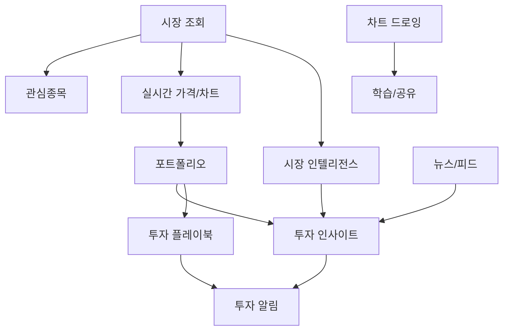
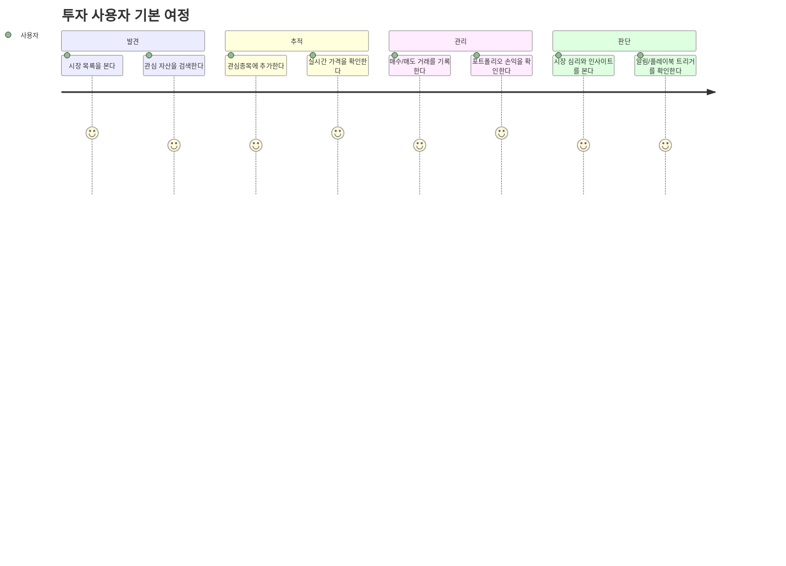

# 증권/투자 파트 기능 명세 보고서

작성일: 2026-05-24  
문서 목적: SALT 증권/투자 파트가 사용자에게 제공해야 하는 기능, 이점, 요구사항, UX 상태를 PM 관점에서 정리한다.  
주의: 이 문서는 코드 설명서가 아니라 제품 기능 명세다.

## TL;DR

- SALT의 증권/투자 파트는 “투자 현황을 보고, 시장을 이해하고, 위험을 감지하고, 다음 액션을 결정하도록 돕는 기능 묶음”이다.
- 핵심 사용자 가치는 실시간 시장 확인, 내 포트폴리오 수익률 파악, 투자 위험 알림, 뉴스/심리 기반 판단 보조, 자동 전략 알림이다.
- 현재 제품 방향은 단순 시세 앱이 아니라 “투자 초보도 자신의 투자 상태를 이해하고 행동할 수 있게 돕는 개인 투자 코치”에 가깝다.
- 우선순위는 `시장 조회 → 관심종목/실시간 가격 → 포트폴리오 → 인사이트/알림 → 플레이북/AI 코치 → 뉴스/드로잉 커뮤니티` 순서가 적합하다.

## 제품 컨셉

SALT 증권/투자 파트는 사용자가 자산을 단순히 “보유”하는 데서 끝나지 않고, 자신의 투자 상태를 계속 점검하고 개선할 수 있게 돕는다.

기능은 크게 네 가지 역할로 나뉜다.

| 역할 | 설명 |
|---|---|
| 시장 보기 | 현재 어떤 자산이 오르고 내리는지 빠르게 확인한다. |
| 내 투자 관리 | 내가 산 자산, 수익률, 손익, 비중을 확인한다. |
| 위험 감지 | 과도한 비중, 손실, 과열, 공포 구간 같은 리스크를 알려준다. |
| 행동 지원 | 매수/매도 검토, 리밸런싱, 전략 트리거 같은 다음 행동을 제안한다. |

## 대상 사용자

### 1. 투자 초보 사용자

- 시세는 보지만 어떤 의미인지 해석하기 어렵다.
- 수익률과 손익 계산을 직접 하기 어렵다.
- “지금 사도 되는지”, “너무 위험한지”를 알고 싶다.

### 2. 관심종목을 꾸준히 보는 사용자

- 여러 코인을 매번 거래소에서 검색하기 번거롭다.
- 가격 변화와 시장 분위기를 한 화면에서 보고 싶다.
- 급등락이나 관심 구간을 놓치고 싶지 않다.

### 3. 포트폴리오를 관리하려는 사용자

- 매수/매도 기록을 남기고 싶다.
- 평균 매수가, 실현 손익, 미실현 손익을 보고 싶다.
- 특정 자산에 너무 많이 몰려 있는지 알고 싶다.

### 4. 전략 기반 투자 사용자

- “RSI가 낮을 때”, “손실이 일정 수준 이상일 때”, “목표 수익률에 도달했을 때” 같은 조건을 자동으로 감지하고 싶다.
- 매번 차트를 보지 않아도 전략 조건이 맞으면 알림을 받고 싶다.

## 기능 전체 맵



## 1. 시장 조회

### 기능 설명

사용자가 전체 암호화폐 시장 목록을 확인하고, 가격/등락률/거래대금/이름 기준으로 정렬하거나 검색할 수 있는 기능이다.

### 사용자 이점

- 여러 자산을 한눈에 비교할 수 있다.
- 거래량이 많은 자산, 많이 오른 자산, 많이 떨어진 자산을 빠르게 찾을 수 있다.
- 투자 후보를 찾는 첫 진입점이 된다.

### 주요 요구사항

| ID | 요구사항 |
|---|---|
| MKT-1 | 사용자는 전체 마켓 목록을 볼 수 있어야 한다. |
| MKT-2 | 사용자는 자산명 또는 심볼로 검색할 수 있어야 한다. |
| MKT-3 | 사용자는 가격, 등락률, 거래대금, 이름 기준으로 정렬할 수 있어야 한다. |
| MKT-4 | 목록은 페이지네이션 또는 무한 스크롤로 과도한 렌더링을 피해야 한다. |
| MKT-5 | 각 자산은 현재가, 등락률, 거래대금, 로고, 이름을 보여줘야 한다. |

### UX 상태

- Loading: skeleton 또는 row placeholder
- Empty: “검색 결과가 없습니다”
- Error: “시장 데이터를 불러오지 못했습니다”
- Stale: 가격 업데이트 시간이 오래된 경우 업데이트 시각 표시

### 우선순위

Must. 투자 서비스의 기본 진입점이다.

## 2. 실시간 가격/차트

### 기능 설명

사용자가 선택하거나 구독한 자산의 현재 가격과 짧은 주기의 캔들 변화를 실시간으로 확인하는 기능이다.

### 사용자 이점

- 거래소 앱을 따로 열지 않고도 가격 변화를 볼 수 있다.
- 관심 있는 자산의 움직임을 즉시 감지할 수 있다.
- 차트 미리보기를 통해 상세 화면 진입 여부를 판단할 수 있다.

### 주요 요구사항

| ID | 요구사항 |
|---|---|
| RT-1 | 사용자는 관심 자산의 실시간 가격을 확인할 수 있어야 한다. |
| RT-2 | 가격 변화는 자동으로 화면에 반영되어야 한다. |
| RT-3 | 사용자는 자산별 미니 차트를 볼 수 있어야 한다. |
| RT-4 | 연결이 끊기면 재연결 상태를 사용자에게 과도하게 방해하지 않는 방식으로 처리해야 한다. |
| RT-5 | 가격 데이터가 지연될 경우 지연 상태를 구분할 수 있어야 한다. |

### UX 상태

- Connected: 실시간 업데이트 중
- Reconnecting: 조용한 상태 표시 또는 내부 재시도
- Disconnected: “실시간 연결이 끊겼습니다”
- Fallback: 마지막 수신 가격 유지

### 우선순위

Must. 시장 조회와 함께 투자 화면의 핵심 경험이다.

## 3. 관심종목

### 기능 설명

사용자가 자주 보는 자산을 관심목록에 추가하고, 해당 자산의 가격 변화를 빠르게 추적하는 기능이다.

### 사용자 이점

- 매번 검색하지 않아도 자주 보는 자산을 모아볼 수 있다.
- 투자 후보군을 관리할 수 있다.
- 이후 알림, 인사이트, 플레이북과 연결되는 개인화 기반이 된다.

### 주요 요구사항

| ID | 요구사항 |
|---|---|
| WL-1 | 사용자는 자산을 관심종목에 추가할 수 있어야 한다. |
| WL-2 | 사용자는 관심종목을 삭제할 수 있어야 한다. |
| WL-3 | 중복 추가는 막아야 한다. |
| WL-4 | 관심종목 목록은 현재가와 등락률을 포함해야 한다. |
| WL-5 | 관심종목은 사용자별로 분리되어야 한다. |

### UX 상태

- Empty: “관심종목을 추가해보세요”
- Duplicate: “이미 관심종목에 추가된 자산입니다”
- Unauthorized: 로그인 필요 안내

### 우선순위

Should. 실시간 알림과 개인화 기능의 기반이다.

## 4. 포트폴리오

### 기능 설명

사용자가 매수/매도 거래를 기록하고, 현재 보유 자산의 평가금액, 평균 매수가, 실현 손익, 미실현 손익, 수익률을 확인하는 기능이다.

### 사용자 이점

- 내가 실제로 얼마나 벌거나 잃고 있는지 알 수 있다.
- 평균 매수가와 현재가를 비교해 의사결정을 할 수 있다.
- 특정 자산에 과도하게 몰려 있는지 확인할 수 있다.
- 투자 습관과 성과를 장기적으로 기록할 수 있다.

### 주요 요구사항

| ID | 요구사항 |
|---|---|
| PF-1 | 사용자는 매수 거래를 등록할 수 있어야 한다. |
| PF-2 | 사용자는 매도 거래를 등록할 수 있어야 한다. |
| PF-3 | 보유 수량보다 많이 매도할 수 없어야 한다. |
| PF-4 | 거래 수정/삭제 시 보유 자산과 손익이 다시 계산되어야 한다. |
| PF-5 | 사용자는 총 투자금, 평가금액, 총 손익, 수익률을 볼 수 있어야 한다. |
| PF-6 | 사용자는 기간별 포트폴리오 가치 변화를 볼 수 있어야 한다. |

### UX 상태

- Empty: “아직 등록된 거래가 없습니다”
- Invalid sell: “보유 수량보다 많이 매도할 수 없습니다”
- Partial data: 현재가가 없는 자산은 평가금액 계산 상태를 분리 표시

### 우선순위

Must. 투자 관리 서비스로 확장하려면 시장 조회 다음으로 중요하다.

## 5. 시장 인텔리전스

### 기능 설명

가격만 보여주는 것이 아니라 시장 심리, 공포/탐욕, 변동성, 대량 거래, 매수/매도 압력 등을 해석해서 사용자가 시장 분위기를 이해하도록 돕는 기능이다.

### 사용자 이점

- “가격이 올랐다/내렸다”를 넘어 왜 그런지 해석할 단서를 얻는다.
- 공포 구간, 과열 구간, 대량 매수/매도 같은 신호를 빠르게 파악한다.
- 초보자도 시장 상태를 쉬운 언어로 이해할 수 있다.

### 주요 요구사항

| ID | 요구사항 |
|---|---|
| MI-1 | 사용자는 자산별 시장 심리 점수를 볼 수 있어야 한다. |
| MI-2 | 심리 점수는 쉬운 라벨과 설명을 포함해야 한다. |
| MI-3 | 사용자는 대량 거래와 매수/매도 우세 신호를 볼 수 있어야 한다. |
| MI-4 | 사용자는 과거 심리 변화를 확인할 수 있어야 한다. |
| MI-5 | 신호는 투자 조언이 아니라 참고 지표임을 명확히 해야 한다. |

### UX 상태

- Normal: 심리/스마트머니 지표 표시
- Not enough data: “분석 데이터가 충분하지 않습니다”
- External API failure: “일부 시장 지표를 불러오지 못했습니다”

### 우선순위

Should. 차별화 포인트지만, 시장/포트폴리오 기본 기능 이후가 적합하다.

## 6. 투자 인사이트

### 기능 설명

사용자의 포트폴리오와 시장 데이터를 분석해 “주의해야 할 점”과 “검토할 만한 기회”를 카드 형태로 제공하는 기능이다.

### 인사이트 유형

| 유형 | 설명 | 사용자 이점 |
|---|---|---|
| 위험 알림 | 특정 자산 비중이 높거나 손실 위험이 큰 경우 | 과도한 집중 투자를 인지 |
| Smart Buy Zone | 기술 지표와 시장 심리가 매수 검토 구간에 가까운 경우 | 무작정 매수 대신 조건 기반 검토 |
| Whale Signal | 대량 거래와 가격/거래량 변화 기반 신호 | 큰 자금 흐름 감지 |
| 리밸런싱 | 포트폴리오 비중 조정 필요성 제안 | 자산 비중 관리 |
| 행동 분석 | 사용자의 투자 패턴에서 반복되는 리스크 탐지 | 투자 습관 개선 |
| 뉴스 분석 | 뉴스 분위기와 자산 연관성 요약 | 정보 탐색 시간 절약 |

### 주요 요구사항

| ID | 요구사항 |
|---|---|
| INS-1 | 사용자는 최신 투자 인사이트를 목록으로 볼 수 있어야 한다. |
| INS-2 | 각 인사이트는 제목, 요약, 심각도, 신뢰도, 발생 시각을 포함해야 한다. |
| INS-3 | 만료된 인사이트는 사용자에게 기본 노출되지 않아야 한다. |
| INS-4 | 인사이트는 중복 생성되어 사용자를 피로하게 만들지 않아야 한다. |
| INS-5 | 인사이트는 바로 행동을 강요하지 않고 “검토” 관점으로 표현해야 한다. |

### UX 상태

- Empty: “아직 생성된 투자 인사이트가 없습니다”
- High severity: 강조 카드 또는 알림 연결
- Expired: 기본 숨김, 필요 시 기록에서 조회

### 우선순위

Should. SALT 증권 파트의 핵심 차별화 기능이다.

## 7. AI 투자 코치

### 기능 설명

사용자의 포트폴리오 상태, 시장 분위기, 기술 지표를 종합해 “지금 무엇을 점검하면 좋은지”를 하나의 코칭 메시지로 제공하는 기능이다.

### 사용자 이점

- 여러 지표를 직접 해석하지 않아도 요약된 조언을 볼 수 있다.
- 내 투자 상태 기준의 개인화된 안내를 받을 수 있다.
- 초보자가 다음 행동 후보를 정리하는 데 도움을 받는다.

### 주요 요구사항

| ID | 요구사항 |
|---|---|
| AI-1 | 사용자는 최신 투자 코치 메시지를 볼 수 있어야 한다. |
| AI-2 | 코치 메시지는 추천 행동, 이유, 관련 자산, 신뢰도를 포함해야 한다. |
| AI-3 | 코치 결과는 일정 시간 이후 갱신되어야 한다. |
| AI-4 | “투자 확정 조언”이 아니라 “판단 보조”임을 명확히 표시해야 한다. |
| AI-5 | 사용자가 데이터가 부족한 경우 무리한 추천을 하지 않아야 한다. |

### UX 상태

- No data: “포트폴리오를 등록하면 코치를 받을 수 있습니다”
- Generated: 코치 카드 표시
- Refreshing: “최신 데이터를 분석 중입니다”

### 우선순위

Could → Should. 제품 차별화에는 중요하지만, 포트폴리오와 인사이트가 먼저 안정되어야 한다.

## 8. 투자 알림

### 기능 설명

인사이트, 플레이북 트리거, 위험 신호 등 사용자가 놓치면 안 되는 투자 이벤트를 알림으로 제공하는 기능이다.

### 사용자 이점

- 계속 화면을 보고 있지 않아도 중요한 변화를 알 수 있다.
- 위험 신호나 전략 조건을 놓치지 않는다.
- 읽음/미읽음 상태로 할 일을 관리할 수 있다.

### 주요 요구사항

| ID | 요구사항 |
|---|---|
| NOTI-1 | 사용자는 투자 알림 목록을 볼 수 있어야 한다. |
| NOTI-2 | 사용자는 알림을 읽음 처리할 수 있어야 한다. |
| NOTI-3 | 사용자는 모든 알림을 한 번에 읽음 처리할 수 있어야 한다. |
| NOTI-4 | 미읽음 개수를 볼 수 있어야 한다. |
| NOTI-5 | 만료된 알림은 자동으로 정리되어야 한다. |

### UX 상태

- Empty: “새로운 투자 알림이 없습니다”
- Unread: 강조 표시
- Expired: 목록에서 제거 또는 기록으로 이동

### 우선순위

Should. 인사이트와 플레이북이 사용자 행동으로 이어지려면 필요하다.

## 9. 투자 플레이북

### 기능 설명

사용자가 자신만의 투자 전략 규칙을 만들고, 조건이 충족되면 트리거와 알림을 받는 기능이다.

### 사용자 이점

- 감정에 휘둘리지 않고 미리 정한 기준으로 투자 상황을 점검할 수 있다.
- 손절, 익절, 매수 검토, 리밸런싱 등 반복 판단을 자동화할 수 있다.
- 숙련 사용자는 자신만의 전략을 관리할 수 있다.

### 지원 전략 예시

| 전략 | 설명 |
|---|---|
| 손절 조건 | 손실률이 기준 이상이면 알림 |
| 익절 조건 | 수익률이 기준 이상이면 알림 |
| 매수 구간 진입 | Smart Buy Zone 발생 시 알림 |
| 심리 필터 | 공포/탐욕 수준에 따른 알림 |
| 고래 신호 | 대량 매수/매도 신호 발생 시 알림 |
| RSI 과매도/과매수 | 기술 지표 기준 알림 |
| 이동평균 교차 | 추세 전환 가능성 알림 |
| 거래량 급증 | 관심 자산의 거래량 이상 감지 |

### 주요 요구사항

| ID | 요구사항 |
|---|---|
| PB-1 | 사용자는 플레이북을 생성할 수 있어야 한다. |
| PB-2 | 사용자는 플레이북 목록을 볼 수 있어야 한다. |
| PB-3 | 사용자는 플레이북을 삭제할 수 있어야 한다. |
| PB-4 | 조건이 충족되면 트리거가 생성되어야 한다. |
| PB-5 | 같은 조건이 짧은 시간에 반복되어 알림 피로를 만들지 않아야 한다. |
| PB-6 | 사용자는 트리거를 해결 상태로 바꿀 수 있어야 한다. |

### UX 상태

- Empty: “첫 투자 플레이북을 만들어보세요”
- Triggered: 전략 조건 충족 카드 표시
- Resolved: 해결된 트리거는 별도 상태로 표시

### 우선순위

Could. 고급 기능이므로 기본 투자 관리 경험 이후 단계가 적합하다.

## 10. 투자 피드

### 기능 설명

인사이트, 플레이북 트리거, 투자 알림을 한 곳에 모아 시간순으로 보여주는 기능이다.

### 사용자 이점

- 투자와 관련된 중요한 이벤트를 한 화면에서 확인할 수 있다.
- 여러 기능을 따로 들어가지 않아도 오늘의 핵심 변화를 볼 수 있다.
- 홈 또는 투자 대시보드의 메인 컨텐츠로 활용할 수 있다.

### 주요 요구사항

| ID | 요구사항 |
|---|---|
| FEED-1 | 사용자는 최신 투자 이벤트를 시간순으로 볼 수 있어야 한다. |
| FEED-2 | 피드는 인사이트, 트리거, 알림을 구분해서 표시해야 한다. |
| FEED-3 | 심각도가 높은 항목은 더 눈에 띄게 표시해야 한다. |
| FEED-4 | 사용자는 피드에서 상세 기능으로 이동할 수 있어야 한다. |

### 우선순위

Should. 인사이트/알림을 연결하는 대시보드 역할이다.

## 11. 뉴스/북마크

### 기능 설명

암호화폐 관련 뉴스를 모아보고, 심볼/언어/출처/키워드로 필터링하며, 필요한 뉴스를 북마크하는 기능이다.

### 사용자 이점

- 투자 판단에 필요한 뉴스를 한 곳에서 확인할 수 있다.
- 관심 자산과 관련된 뉴스만 골라볼 수 있다.
- 나중에 다시 볼 뉴스를 저장할 수 있다.

### 주요 요구사항

| ID | 요구사항 |
|---|---|
| NEWS-1 | 사용자는 최신 뉴스를 볼 수 있어야 한다. |
| NEWS-2 | 사용자는 자산 심볼, 출처, 키워드로 뉴스를 필터링할 수 있어야 한다. |
| NEWS-3 | 사용자는 인기 뉴스를 볼 수 있어야 한다. |
| NEWS-4 | 사용자는 뉴스를 북마크할 수 있어야 한다. |
| NEWS-5 | 사용자는 북마크한 뉴스를 모아볼 수 있어야 한다. |

### UX 상태

- Empty: “관련 뉴스가 없습니다”
- Language filter: 한국어/영어/전체
- Bookmark duplicate: 이미 저장된 경우 중복 저장 방지

### 우선순위

Could. 시장 이해에는 좋지만, 핵심 투자 관리 기능 이후가 적합하다.

## 12. 차트 드로잉

### 기능 설명

사용자가 차트 위에 추세선, 수평선, 피보나치, 사각형, 메모 등을 남기고 저장하거나 공개할 수 있는 기능이다.

### 사용자 이점

- 자신의 차트 분석 기록을 남길 수 있다.
- 같은 자산을 나중에 다시 볼 때 판단 근거를 확인할 수 있다.
- 공개 드로잉을 통해 다른 사용자와 관점을 공유할 수 있다.

### 주요 요구사항

| ID | 요구사항 |
|---|---|
| DRAW-1 | 사용자는 차트 분석 드로잉을 저장할 수 있어야 한다. |
| DRAW-2 | 사용자는 내 드로잉 목록을 볼 수 있어야 한다. |
| DRAW-3 | 사용자는 드로잉을 공개/비공개로 설정할 수 있어야 한다. |
| DRAW-4 | 공개 드로잉은 다른 사용자가 볼 수 있어야 한다. |
| DRAW-5 | 사용자는 공개 드로잉에 좋아요를 남길 수 있어야 한다. |

### 우선순위

Could. 커뮤니티/학습 기능으로 확장할 때 가치가 크다.

## 13. 기술 지표/가격 히스토리

### 기능 설명

사용자에게 직접 보이는 화면 기능이라기보다, 인사이트와 플레이북을 만들기 위한 내부 분석 기반이다. 가격 히스토리와 RSI, 이동평균 같은 기술 지표를 주기적으로 계산한다.

### 사용자 이점

- 사용자가 직접 지표를 계산하지 않아도 분석 결과를 받을 수 있다.
- Smart Buy Zone, 과매수/과매도, 이동평균 교차 같은 전략 기능의 기반이 된다.
- 포트폴리오 성과 차트와 과거 흐름 분석이 가능해진다.

### 주요 요구사항

| ID | 요구사항 |
|---|---|
| IND-1 | 시스템은 주요 자산의 가격 히스토리를 주기적으로 저장해야 한다. |
| IND-2 | 시스템은 기술 지표를 주기적으로 계산해야 한다. |
| IND-3 | 오래된 고빈도 데이터는 보관 정책에 따라 정리해야 한다. |
| IND-4 | 지표 계산 실패가 전체 서비스 장애로 이어지면 안 된다. |

### 우선순위

Must for insight. 사용자가 직접 보는 기능은 아니지만 인사이트/플레이북의 기반이다.

## 사용자 여정



## 우선순위 제안

### 1차 MVP

1. 시장 목록
2. 실시간 가격/차트
3. 관심종목
4. 포트폴리오 거래 등록/보유 현황

### 2차 확장

1. 시장 인텔리전스
2. 투자 인사이트
3. 투자 알림
4. 투자 피드

### 3차 고도화

1. AI 투자 코치
2. 투자 플레이북
3. 뉴스/북마크
4. 차트 드로잉/커뮤니티

## 제품 리스크와 정책

| 리스크 | 설명 | 정책 |
|---|---|---|
| 투자 조언 오해 | 사용자가 신호를 확정 매수/매도로 받아들일 수 있음 | “판단 보조 정보” 고지 필요 |
| 데이터 지연 | 실시간 가격이 끊기거나 지연될 수 있음 | 마지막 업데이트 시각 표시 |
| 알림 피로 | 너무 많은 알림이 쌓일 수 있음 | 중복 방지, 심각도, 묶음 처리 |
| 초보자 과부하 | 지표가 많으면 이해하기 어려움 | 쉬운 라벨, 한 줄 요약, 자세히 보기 구조 |
| 전략 과신 | 플레이북 조건을 자동 매매처럼 오해할 수 있음 | “알림/검토” 기능임을 명확히 표시 |

## 핵심 성공 지표

| 지표 | 의미 |
|---|---|
| 관심종목 추가율 | 사용자가 투자 기능을 개인화했는지 |
| 포트폴리오 등록 완료율 | 실제 투자 관리 기능으로 전환됐는지 |
| 인사이트 클릭률 | 분석 기능이 사용자 판단에 도움이 되는지 |
| 알림 읽음률 | 알림 품질이 충분한지 |
| 플레이북 생성 수 | 고급 전략 기능 수요가 있는지 |
| 재방문율 | 시장/포트폴리오 확인 습관이 생기는지 |

## 현재 기능 정리

백엔드 기준으로는 증권/투자 파트 기능 기반이 충분히 만들어져 있다. 제품 관점에서 보면 이제 필요한 것은 기능을 더 만드는 것이 아니라, 기능을 사용자 여정에 맞게 묶고 우선순위를 정해서 화면에 노출하는 일이다.

가장 먼저 완성해야 할 흐름은 다음이다.

```text
시장 조회
→ 관심종목 추가
→ 실시간 가격 확인
→ 거래 기록
→ 포트폴리오 손익 확인
→ 위험/기회 인사이트 확인
→ 알림으로 재방문
```

이 흐름이 완성되면 SALT의 증권 파트는 단순 조회 화면이 아니라 “투자 관리 습관을 만드는 기능”으로 설명할 수 있다.
