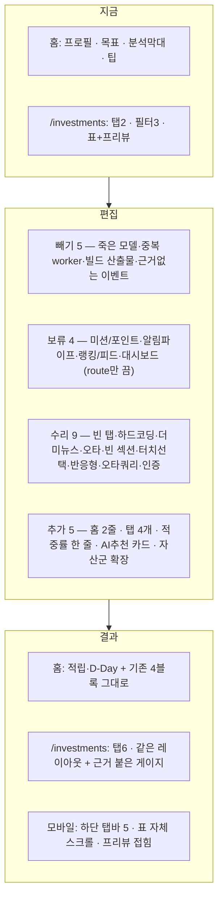

# FEATURE-000: 지금 화면 편집 (Edit In Place)

> 이전 제목: 범위 정리 (Scope Reset) — 2026-09-08 방향 전환으로 개정

## TL;DR

> **개정 2026-09-08 — 방향 전환.** 사용자 결정에 따라 이 스펙은 **"기능 제거"에서 "지금 화면 편집"으로 바뀌었다.**
> 근거 진술: *"지금 화면에서 뺄 건 빼고 하자"*, *"사실 지금 있는 거 다 필요해 보이긴 해"*, *"현재 홈 화면은 이뻐서 그건 냅두고 싶어, 의미도 있고"*.

- **새로 짜지 않는다.** 현재 `/` 홈과 `/investments` 투자 페이지의 레이아웃·컬럼·필터·색 규칙을 그대로 유지한다.
- 판정 축을 5개로 재정의한다: **유지 13 · 수리 9 · 추가 5 · 빼기 5 · 보류 4** (총 36건).
- **실제로 빼는 것은 화면 밖 죽은 코드뿐**이다 — 레거시 `AIAnalysis*` 모델, 서버 쪽 중복 `market-price-updater.worker`, 커밋된 빌드 산출물, 근거 없는 `ACCOUNT_SELECTED` 이벤트, 그리고 코드에 없는 기획상 항목(랭킹·저축왕·소셜·게임).
- **화면이 없는 백엔드는 삭제하지 않고 `보류(동면)`** 한다 — 미션/포인트/업적, 고래·스마트머니 알림 파이프라인, 인사이트 랭킹·피드, 대시보드. route만 비활성하고 모델은 남긴다.
- 신규 기능은 새 앱이 아니라 **지금 화면의 탭과 블록으로 들어간다**: 홈 최상단 2줄 추가, `/investments` 탭 4개 추가.

## 배경과 문제

- `pm/features/current-feature-map.md`(2026-05-25 감사) 기준 24개 기능 중 `Implemented` 3개, `Partial` 6개, 나머지 15개가 화면 없는 `Backend Only`다.
- 초기 판단은 "다 만들어놓고 안 쓰니 절반을 지우자"였다. **사용자가 이를 되돌렸다.**
  - *"지금 화면에서 뺄 건 빼고 하자"* → 전면 재설계가 아니라 **부분 편집**.
  - *"사실 지금 있는 거 다 필요해 보이긴 해"* → 기능 제거 목록을 최소화.
  - *"현재 홈 화면은 이뻐서 그건 냅두고 싶어, 의미도 있고"* → 홈 시각 구성은 **변경 금지**.
- 실제 코드를 읽어보니 이 판단이 타당하다.
  - `/investments`는 실시간 가격·5분봉·심리 온도계·스마트 머니가 **실제로 동작**하고, 변동률 blink 2초 같은 디테일까지 들어가 있다. 지울 이유가 없다.
  - 홈의 `AnalysisGraph`는 카테고리별 막대에 진입 애니메이션까지 구현되어 있다.
  - 문제는 **기능 과잉이 아니라 (a) 깨진 채 방치된 부분과 (b) "그래서 지금 뭘 해야 하나"에 답하는 블록의 부재**다.
- 그래서 이 스펙의 성격이 바뀐다: **삭제 계획 → 편집 계획.** 빼는 것은 화면 밖 죽은 코드로 한정하고, 나머지는 수리·추가·보류로 처리한다.

## 목표

1. 현재 화면의 구성과 시각 정체성을 **보존한다**(사용자가 명시적으로 요구한 제약).
2. 깨져 있거나 더미인 부분만 **고친다**(빈 탭, 하드코딩 문자열, 더미 뉴스, 오타, 반응형, 터치 선택).
3. 죽은 코드와 중복만 **뺀다**. 되돌릴 수 있게 브랜치 + FR 단위 커밋 + DB 스냅샷 선행.
4. 지금 안 쓰는 백엔드는 **지우지 않고 비활성**한다 — 나중에 사용자가 늘거나 필요해지면 다시 켠다.
5. 신규 기능이 올라갈 **깨끗한 거래 원장**과 `AssetType` 확장을 준비한다.

## 사용자 시나리오

1. 홈을 연다. **지금과 똑같이** 프로필 헤더 → 목표 카드 → 투자 분석 막대 → 금융 팁이 있다. 달라진 것은 맨 위에 `이번 주 적립 475,000원`과 `세금 마감 D-112`가 붙은 것뿐이다.
2. 비어 있던 "주식" 제목 아래에 보유 요약이 채워져 있다.
3. `/investments`로 간다. **레이아웃이 그대로다** — 필터 3그룹, 좌측 실시간 테이블, 우측 종목 프리뷰.
4. "관심 종목" 탭을 누른다. 이제 빈 화면이 아니라 관심 종목 목록이 나온다.
5. 우측 프리뷰를 본다. 심리 온도계와 스마트 머니 게이지가 그대로 있고, **그 아래 한 줄이 추가됐다** — "이 온도계가 70°C를 넘은 뒤 30일 수익률: 표본 24회 · 승률 46% · 평균 −1.2%".
6. 그 아래 뉴스가 이제 실제 기사다.
7. 탭 줄 뒤쪽에 새 탭 4개가 있다 — `AI 코치 · 내 청구서 · 세금 마감 · 포지션`.
8. 휴대폰으로 같은 화면을 연다. 표가 가로로 잘리지 않고 자체 스크롤되며, 우측 프리뷰가 아래로 접혀 있다. 행을 **탭하면** 상세가 바뀐다.

## 기능 요구사항

### A. 빼기 — 화면 밖 죽은 코드만

| ID | 요구사항 | 우선순위 | 상태 |
|---|---|---|---|
| FR-1 | **레거시 제거**: `AIAnalysisSession`, `AIAnalysis`, `AnalysisStatus`, `PredictionType` 삭제. **삭제 전 `grep -rn "AIAnalysis" src` 결과 0 확인 필수** | Must | Draft |
| FR-2 | **중복 worker 제거**: 서버 `market-price-updater.worker`. 가격 갱신은 BFF `price-updater.worker` 단일 경로로 통일 | Must | Draft |
| FR-3 | **커밋된 빌드 산출물 제거**: `market-price-updater.worker.js/.d.ts/.js.map` + `.gitignore` 반영 | Must | Draft |
| FR-4 | **근거 없는 이벤트 제거**: `@repo/message-event-bus`의 `ACCOUNT_SELECTED`. 은행/계좌 API가 없어 동작 근거가 없다 | Must | Draft |
| FR-5 | **기획 문서에서 내리기**: 랭킹·이달의 저축왕·소셜 저축·저축 게임. 코드에 없고 사용자 1~10명이면 성립하지 않는다. `README.md`를 v1/v2 2섹션 구조로 개편(삭제 아님) | Should | Draft |

### B. 보류(동면) — 지우지 않고 끈다

| ID | 요구사항 | 우선순위 | 상태 |
|---|---|---|---|
| FR-10 | **미션/포인트/업적 비활성**: `modules/mission` route를 앱에서 등록 해제하고 BFF proxy에서 제거. **Prisma model(`DailyMission`, `UserMissionProgress`, `UserAchievement`, `PointTransaction`)은 유지** | Must | Draft |
| FR-11 | **알림 파이프라인 축소**: `SentimentAlert`/`SmartMoneyAlert` 생성 worker를 끄고 `InvestmentNotification` 타입을 **세금 D-Day + 지표·추천 갱신 2종**으로 제한. `MarketSentiment`/`WhaleTransaction` model과 **프리뷰 화면은 유지**(FR-22) | Must | Draft |
| FR-12 | **인사이트 랭킹·피드 비활성**: `insight-ranking.controller`, `modules/feed`, BFF `app-feed.service` route 등록 해제. 코드/모델 유지 | Should | Draft |
| FR-13 | **대시보드 비활성**: 홈 aggregation이 BFF로 이동한 뒤 `/api/dashboard` 등록 해제. 삭제는 이후 결정 | Should | Draft |
| FR-14 | **비활성 route 응답**: 등록 해제된 경로는 404 대신 **410 Gone + 1회 로그**로 1주 유지해 프론트 잔여 호출을 탐지 | Should | Draft |

### C. 수리 — 지금 있는데 깨진 것

| ID | 요구사항 | 우선순위 | 상태 |
|---|---|---|---|
| FR-20 | **"관심 종목" 탭 채우기**: 현재 `{activeTab === "realtime" && <RealtimeInvestment/>}`뿐이라 탭을 누르면 빈 화면이다. 서버 watchlist CRUD에 연결한 목록 화면을 붙인다. **탭 자체를 없애지 않는다** | Must | Draft |
| FR-21 | **하드코딩 문자열 교체**: 테이블 헤더의 `"실시간 오늘 19:30 기준"`을 WebSocket 마지막 수신 시각으로 | Must | Draft |
| FR-22 | **뉴스 프리뷰 실데이터 연결**: `MarketIntelligenceNewsPreview`의 제목·요약·이미지·출처·조회수가 전부 상수이고 제목에 테스트 문자열(`faskdljfaksjf…`)이 남아 있다. 서버 `/api/news`에 연결한다. **블록을 없애지 않는다** | Must | Draft |
| FR-23 | **오타 수정**: `MyInvestments.tsx`의 `{difference}% 덜 썻어요` → `덜 썼어요` | Must | Draft |
| FR-24 | **비어 있는 "주식" 섹션 채우기**: `<Heading>주식</Heading>`만 있고 자식이 없다. 포트폴리오 API로 보유 요약(종목·평가금액·손익률·세금 배지)을 렌더 | Must | Draft |
| FR-25 | **터치 선택 추가**: 테이블 행 선택이 `onMouseEnter`만이라 터치 기기에서 우측 상세가 바뀌지 않는다. `onClick`을 **추가**한다(hover는 유지) | Must | Draft |
| FR-26 | **반응형 분기 추가**: 레이아웃을 바꾸지 않고 ① 표에 자체 `overflow-x` 컨테이너 ② 모바일에서 `MarketPreview`를 아래로 접기 ③ `maxHeight="800px"` 고정을 뷰포트 기준으로 | Must | Draft |
| FR-27 | **차트 기간 쿼리 오타**: `period=miniute` → `minute` (FE/BFF/서버 계약 동시) | Must | Draft |
| FR-28 | **인증 축소**: 회원가입/비밀번호 변경/계정 삭제 route 및 화면 제거. `POST /api/auth/login` + refresh 유지. **초대 코드 기반 계정 생성**(`InviteCode`, 최대 10명) | Must | Draft |
| FR-29 | **목표 저축 submit 연결 확인**: 목표 추가 폼이 실제로 `POST /api/goals`까지 연결되는지 검증하고 끊겨 있으면 잇는다. **UI는 유지** | Should | Draft |

### D. 추가 — 지금 화면의 탭과 블록으로

| ID | 요구사항 | 우선순위 | 상태 |
|---|---|---|---|
| FR-30 | **홈 최상단 2줄**: `이번 주 적립`(FEATURE-003)과 `세금 D-Day`(FEATURE-002). **기존 블록(목표 카드 · `AnalysisGraph` · `TipsApp`) 순서와 디자인은 그대로 유지** | Must | Draft |
| FR-31 | **`/investments` 탭 4개 추가**: `constants/investmentTabs.ts`에 `ai-coach`, `invoice`, `tax`, `position` 항목 추가 + 각 탭 본문. **실시간 차트 탭의 2컬럼 레이아웃은 유지** | Must | Draft |
| FR-32 | **게이지에 적중률 한 줄**: 심리 온도계·스마트 머니 게이지는 유지하고, 아래에 `signal-performance` 기반 "이 구간을 넘은 뒤 실제 수익률" 한 줄 추가 | Must | Draft |
| FR-33 | **우측 프리뷰에 AI 추천 카드**: `MarketPreview` 안에 action·점수·근거·적중률·실패사례 카드 1개. 3종 중 하나라도 없으면 렌더하지 않는다 | Must | Draft |
| FR-34 | **`AssetType` enum 확장**: `crypto`, `kr_stock`, `us_stock`. 기존 row는 `crypto`로 마이그레이션 | Must | Draft |
| FR-35 | **KIS 연동 자리 확보**: `external/kis/` 조회 전용 클라이언트 스켈레톤(국내·미국 주식 잔고/체결내역 GET). 실제 import는 FEATURE-001 | Must | Draft |
| FR-36 | **모바일 하단 탭바**: 같은 정보를 모바일에서 탭 5개(`홈/코치/청구서/세금/포지션`)로 접는다 | Should | Draft |

### E. 유지 — 손대지 않는 것 (변경 금지 목록)

| 대상 | 근거 |
|---|---|
| 홈 목표 진행 카드 · `AnalysisGraph` 카테고리 막대 · `TipsApp` 금융 팁 · 프로필 헤더 | 사용자 명시: "이뻐서 냅두고 싶어, 의미도 있고" |
| 실시간 테이블 5컬럼(현재가·변동률·최고가·최저가·거래대금) · 정렬 5 / 순서 2 / 기간 7 필터 · 별 아이콘 · 로고 · **변동률 blink 2초** · `limit=100` | 완성도가 가장 높은 화면 |
| `PreviewChart` 5분봉 + 실시간 캔들 수신 | 동작 확인됨 |
| 심리 온도계 · 스마트 머니 원형 게이지 (프리뷰 UI) | 시각·정보 모두 유효. 적중률 한 줄만 덧붙임 |
| 2컬럼 레이아웃 (좌측 테이블 + 우측 392px 프리뷰) | PC에서 그대로. 모바일에서만 접힘 |
| 색·토큰 — 상승 `#FF2E55` / 하락 `#1677EE` / 브랜드 `#007AFF` / 배경 `#F2F4F6` | 신규 화면도 이 규칙을 따른다 |
| `PortfolioTransaction` · `PortfolioHolding` · `PriceHistory` | 모든 신규 기능의 원장. row 수 보존이 수용 기준 |
| `ai-coach` score engine + Gemini explainer · `signal-performance` · `profit-plan` · `trade-preflight` · `behavior-coach` | 제품의 핵심 엔진 |
| `packages/ui` 33개 export · `message-event-bus` | 그대로 |

## 비기능 요구사항

| 구분 | 요구사항 |
|---|---|
| 성능 | 삭제 후 `pnpm build` 전체 시간이 기존 대비 감소해야 한다(측정값 기록). worker 4개 기준 DB 커넥션 상시 사용량 감소 |
| 접근성 | 남는 5개 화면은 키보드 탐색과 스크린리더 라벨을 재검수한다 |
| 보안 | FR-8로 인증 표면이 줄어드는 대신, 남은 단일 사용자 토큰의 만료/재발급 경로는 유지한다. Upbit API Key는 이 스펙 범위 밖(FEATURE-001) |
| 장애 처리 | migration은 `drop` 전에 `pg_dump` 스냅샷을 남긴다. 롤백은 스냅샷 복원 + 이전 커밋 체크아웃 |
| 관측성 | 삭제된 route에 대한 요청이 오면 410 Gone + 1회 로그. 프론트 잔여 호출 탐지용 |

## UX 상태

- Loading: 해당 없음(제거 작업)
- Empty: 추적 자산이 0건이면 "추적할 자산을 고르세요(최대 5개)" 선택 화면 1개만 노출
- Error: 삭제된 화면 URL 직접 진입 시 `/` 리다이렉트 + 토스트 "이 기능은 제거되었습니다"
- Unauthorized: 단일 사용자 토큰 없음 → 로그인 화면
- Success: 탭 5개짜리 shell이 뜨고 각 탭이 데이터를 렌더한다

## 정책과 제약

- **변경 금지 목록(E절)을 침범하지 않는다.** 리팩터링 편의를 이유로 홈 블록이나 테이블 컬럼을 바꾸지 않는다.
- **삭제는 되돌릴 수 있어야 한다.** 브랜치 `chore/edit-in-place`, FR 단위 커밋, 삭제 전 `pg_dump` 스냅샷 + 복원 테스트 1회.
- **보류는 삭제가 아니다.** route 등록 해제 + BFF proxy 제거까지만. Prisma model과 서비스 코드는 남긴다. 되살리는 비용이 커밋 하나여야 한다.
- 작업 순서는 **프론트 → BFF → 서버 → Prisma**. 역순이면 빌드가 계속 깨진다.
- `PortfolioTransaction` / `PortfolioHolding` / `PriceHistory`는 **어떤 경우에도 데이터 손실 없이** 보존한다.
- 신규 탭은 **새 remote app을 만들지 않는다.** 기존 `investments` remote 안의 탭으로 들어간다.
- 색·간격·타이포는 `apps/investments/src/styles/tokens.css.ts`를 따른다. 새 팔레트를 도입하지 않는다.

## 화면/프론트엔드 영향

| App | Route/Component | 판정 | 변경 내용 |
|---|---|---|---|
| shell | `pages/home/index.tsx` | 추가 | 최상단에 `WeeklyPlanRow` + `TaxDeadlineRow` 2줄. **기존 4블록 순서 유지** |
| shell | `components/Home/Header/**` | 유지 | 손대지 않음 |
| shell | `components/TipsApp/**` | 유지 | 손대지 않음 (사용자 결정) |
| shell | `components/Home/WeeklyPlanRow` · `TaxDeadlineRow` | 신규 | FEATURE-003 / FEATURE-002 요약 |
| shell | `components/Home/TabBar` | 신규 | 모바일 하단 탭바 5개 (FR-36) |
| shell | `components/Onboarding/*` | 신규 | 초대 코드 + 계좌 연결 + 적립액 3스텝 |
| shell | 회원가입/비밀번호/계정삭제 화면 | 수리 | 제거 후 초대 코드 화면으로 대체 |
| goals | `component/GoalsApp/**` | 유지 | 목표 카드 UI 그대로 |
| goals | `component/AddGoals/**` | 수리 | submit → `POST /api/goals` 연결 확인. `ACCOUNT_SELECTED` 의존 제거 |
| investments | `pages/investment/index.tsx` | 추가 | `Tabs`에 4개 추가 + 각 탭 본문 마운트 |
| investments | `constants/investmentTabs.ts` | 추가 | `ai-coach` `invoice` `tax` `position` |
| investments | `RealtimeInvestment.tsx` | 수리 | 헤더 시각 실데이터화 · `onClick` 추가 · 표 `overflow-x` · 관심종목 탭 본문 |
| investments | `TableHeaderCells.ts` · `FilterTabsOptions.ts` | 유지 | 손대지 않음 |
| investments | `ChangeRateCell` · `PriceCell` | 유지 | blink 포함 그대로 |
| investments | `MarketPreview.tsx` | 추가 | AI 추천 카드 1개 삽입 + 모바일에서 아래로 접힘 |
| investments | `MarketIntelligencePreview.tsx` | 유지 + 추가 | 게이지 유지, 아래 적중률 한 줄 |
| investments | `MarketIntelligenceNewsPreview.tsx` | 수리 | 상수 → `/api/news` 실데이터 |
| investments | `MarketPreviewChart.tsx` | 수리 | `period` 오타 정정 |
| investments | `component/Coach/*` · `Invoice/*` · `Tax/*` · `Position/*` | 신규 | 신규 탭 본문 (FEATURE-001~004) |
| investments | `component/InvestmentsApp/MyInvestments.tsx` | 수리 | 오타 + "주식" 섹션에 보유 요약 |
| investments | `component/InvestmentsApp/AnalysisGraph/**` | 유지 | 손대지 않음 (사용자 결정) |
| packages | `message-event-bus` | 빼기 | `ACCOUNT_SELECTED` 제거 |
| packages | `ui` | 유지 | 그대로. 필요 시 토큰만 보강 |

## BFF/API 영향

| Method | Path | 판정 | 변경 |
|---|---|---|---|
| ALL | `/api/missions*` | 보류 | proxy 등록 해제 (410 Gone 1주) |
| GET | `/api/users/points/*`, `/api/users/achievements` | 보류 | 동일 |
| GET | `/api/app/feed` | 보류 | 동일 |
| GET | `/api/dashboard` | 보류 | 동일 |
| POST | `/api/auth/register`, PATCH `/api/users/password`, DELETE `/api/users/account` | 수리 | 제거 → 초대 코드 검증 route로 대체 |
| ALL | `/api/goals*` | 유지 | 그대로 (단일 적립 목표는 이후 결정) |
| ALL | `/api/investment/watchlist*` | 유지 | 관심 종목 탭이 실제로 사용 (FR-20) |
| GET | `/api/investment/market/overview` | 유지 | `limit=100` 유지 |
| GET | `/api/investment/crypto/:symbol/chart` | 수리 | `period=minute` 계약 정정 |
| GET | `/api/market-intelligence/:symbol/dashboard` | 유지 | 프리뷰가 계속 사용 |
| ALL | `/api/news*` | 수리 | 뉴스 프리뷰가 실제로 사용 (FR-22) |
| GET | `/api/app/alerts` | 수리 | 소스를 2종으로 축소 |
| GET | `/api/app/home` | 추가 | 홈 상단 2줄 요약 필드 추가 |
| GET | `/api/app/ai-coach/*`, `/profit-plan`, `/signal-performance`, `/behavior-coach`, POST `/trade-preflight` | 유지 | 그대로. 신규 탭이 소비 |
| — | `/api/app/invoice*`, `/api/app/tax/*`, `/api/app/plan/*` | 추가 | FEATURE-001~003 |
| WS | `ws://localhost:4002` | 유지 | 구독 정책 그대로 |

## 서버/DB/Worker 영향

| Layer | 위치 | 판정 | 영향 |
|---|---|---|---|
| Server | `modules/mission` | 보류 | route 등록 해제. 코드 유지 |
| Server | `modules/feed`, `insight-ranking.controller`, `modules/dashboard` | 보류 | 동일 |
| Server | `modules/news` | 수리 | 유지 + 프리뷰 연결 |
| Server | `modules/market-intelligence` | 유지 | 프리뷰가 사용. 알림 생성만 중단 |
| Server | `modules/investment` (watchlist) | 유지 | 관심 종목 탭이 사용 |
| Server | `modules/auth` | 수리 | register/password/delete 제거, 초대 코드 검증 추가 |
| Server | `modules/investment-notification` | 수리 | 타입 2종으로 제한 |
| Server | `modules/{ai-coach, trade-preflight, behavior-coach, profit-plan, signal-performance, portfolio, technical-indicator}` | 유지 | 그대로 |
| Server | `external/kis/` | 추가 | 조회 전용 클라이언트 스켈레톤 (FR-35) |
| DB | `AIAnalysisSession`, `AIAnalysis` + `AnalysisStatus`, `PredictionType` | 빼기 | drop (grep 0 확인 후) |
| DB | `AssetType` enum | 추가 | `crypto` / `kr_stock` / `us_stock` (FR-34) |
| DB | `InviteCode` | 추가 | `id, code @unique, issuedBy, usedByUserId?, usedAt?, expiresAt` |
| DB | 미션/포인트/업적/알림/뉴스/센티먼트 model | 보류 | **drop하지 않음** |
| DB | migration | — | `20260908_edit_in_place` (drop 2 model + enum 2 + AssetType 확장 + InviteCode) |
| Worker | `market-price-updater.worker` (서버) | 빼기 | 삭제 |
| Worker | `news-crawler.worker` | 유지 | 뉴스 프리뷰가 실데이터를 쓰므로 필요 |
| Worker | `notification-cleanup.worker` | 유지 | 알림 2종에도 필요 |
| Worker | `market-sync.worker` | 유지 | `limit=100` 유지이므로 필요 |
| Worker | `price-history.worker`, `technical-indicator.worker`, `investment-insight.worker` | 유지 | 그대로 |
| Worker | `counterfactual`, `fx-rate`, `year-end-snapshot`, `tax-deadline-notify`, `indicator-sync`, `weekly-plan` | 추가 | FEATURE-001~003 |

## 이벤트/상태 흐름

## Trace Matrix

| 요구사항 | 화면/컴포넌트 | BFF/API | 서버 | DB/Worker | 검증 |
|---|---|---|---|---|---|
| FR-1 | — | — | — | model 2 + enum 2 drop | `grep -rn "AIAnalysis" salt-server/src` = 0 (삭제 전) |
| FR-2 | — | — | — | worker 1 삭제 | 기동 worker 목록에 없음 |
| FR-3 | — | — | — | — | `git ls-files "*worker.js"` = 0 |
| FR-4 | `message-event-bus` | — | — | — | `grep -rn ACCOUNT_SELECTED` = 0 |
| FR-10~13 | 해당 화면 없음 | proxy 등록 해제 | route 등록 해제 | **model 유지 확인** | 410 응답 + model 존재 쿼리 |
| FR-14 | — | 410 핸들러 | — | — | 1주 로그에 잔여 호출 0건 |
| FR-20 | 관심 종목 탭 본문 | `/api/investment/watchlist` | watchlist CRUD | `InvestmentWatchlist` | 탭 클릭 시 목록 렌더 |
| FR-21 | `RealtimeInvestment` 헤더 | — | — | — | 문자열이 수신 시각으로 변함 |
| FR-22 | `MarketIntelligenceNewsPreview` | `/api/news*` | `modules/news` | `NewsArticle` | 실제 기사 제목 렌더, 테스트 문자열 0건 |
| FR-23 | `MyInvestments` | — | — | — | "덜 썼어요" |
| FR-24 | `MyInvestments` "주식" | `/api/app/portfolio` | `modules/portfolio` | `PortfolioHolding` | 보유 요약 렌더 |
| FR-25 | `RealtimeInvestment` 행 | — | — | — | 터치로 상세 변경 확인 |
| FR-26 | 표 · `MarketPreview` | — | — | — | 375px에서 body 가로 스크롤 0 |
| FR-27 | `MarketPreviewChart` | chart proxy | chart endpoint | — | `minute` 요청 200 |
| FR-28 | 초대 코드 화면 | `/api/app/onboarding/invite` | `modules/auth` | `InviteCode` | 코드 없이 계정 생성 불가 |
| FR-29 | `AddGoals` submit | `POST /api/goals` | goals | `Goal` | 목표 1건 생성 E2E |
| FR-30 | `WeeklyPlanRow`, `TaxDeadlineRow` | `/api/app/home` | plan · tax | — | 홈 최상단 2줄 렌더, 기존 블록 순서 동일 |
| FR-31 | `investmentTabs.ts` + 탭 본문 | 각 신규 API | 각 신규 module | — | 탭 6개, 각 탭 200 |
| FR-32 | `MarketIntelligencePreview` | `signal-performance` | 동일 | — | 적중률 한 줄 렌더 |
| FR-33 | `MarketPreview` AI 카드 | `/api/app/ai-coach/preview` | ai-coach | — | 3종 중 1개 제거 시 미렌더 |
| FR-34 | — | — | — | `AssetType` 3값 | 기존 row 전부 `crypto` |
| FR-35 | — | — | `external/kis` | — | 조회 API 1건 호출 성공 |
| FR-36 | `TabBar` | — | — | — | 모바일 탭 5개 |
| E절 | 변경 금지 목록 | — | — | — | **before/after 스크린샷 비교로 홈 4블록·테이블 컬럼 동일 확인** |

## 수용 기준

- [ ] **홈의 목표 카드 · 분석 막대 · 금융 팁이 시각적으로 변하지 않았다**(before/after 스크린샷 비교).
- [ ] 홈 최상단에 `이번 주 적립`과 `세금 D-Day` 2줄이 추가되고, 기존 4블록 순서가 그대로다.
- [ ] `/investments`의 필터 3그룹·테이블 5컬럼·2컬럼 레이아웃·변동률 blink가 그대로다.
- [ ] "관심 종목" 탭을 눌러도 빈 화면이 아니다.
- [ ] 뉴스 프리뷰에 실제 기사가 나오고 `faskdljf` 같은 테스트 문자열이 0건이다.
- [ ] 테이블 헤더 시각이 하드코딩 문자열이 아니다.
- [ ] "덜 썻어요"가 코드에 0건이다.
- [ ] 홈 "주식" 섹션에 보유 요약이 렌더된다.
- [ ] 375px 폭에서 body가 가로로 스크롤되지 않고, 표만 자체 스크롤된다.
- [ ] 터치(클릭)로 테이블 행을 선택하면 우측/하단 상세가 바뀐다.
- [ ] `/investments` 탭이 6개이고 각 탭이 200으로 렌더된다.
- [ ] 심리 온도계·스마트 머니 아래에 적중률 한 줄이 있다.
- [ ] `grep -rn "AIAnalysis" salt-server/src` = 0, `git ls-files "*worker.js"` = 0.
- [ ] **미션/포인트/업적 Prisma model이 여전히 존재한다**(보류이므로 삭제되지 않았다).
- [ ] 보류 route가 410 Gone을 반환한다.
- [ ] `AssetType`이 `crypto`/`kr_stock`/`us_stock` 3값이고 기존 row가 모두 `crypto`다.
- [ ] `PortfolioTransaction` / `PortfolioHolding` / `PriceHistory` row 수가 migration 전후 동일하다.
- [ ] 초대 코드 없이 계정이 생성되지 않는다.
- [ ] `pnpm build`, `pnpm lint`, `pnpm typecheck` 전부 통과한다.

## 검증 계획

1. **변경 금지 검증(최우선)**: 작업 전 홈·투자 페이지 스크린샷을 남기고, 작업 후 동일 뷰포트에서 비교한다. E절 항목에 시각 변화가 있으면 되돌린다.
2. **삭제 전 grep 감사**: FR-1~4 각 심볼의 참조 수를 기록. 0이 아니면 참조부터 정리.
3. **DB 스냅샷**: `pg_dump -Fc` → `scratchpad/pre-edit-in-place.dump`. 복원 1회 검증. migration 전후 3개 테이블 `count(*)` 비교.
4. **보류 검증**: route 410 확인 + 해당 Prisma model이 `\dt`에 남아 있는지 확인. 되살리기 테스트 1회(route 재등록 → 200).
5. **수리 검증**: FR-20~29를 각각 수동 스모크. 뉴스는 실제 응답 캡처, 반응형은 375/390/1440 3뷰포트.
6. **추가 검증**: 탭 6개 순회, 홈 2줄 렌더, AI 카드 3종 게이트(1개씩 제거해 미렌더 확인).
7. **빌드 시간·번들**: 전/후 `pnpm build` 시간과 번들 크기 기록.

## 변경 이력

| 날짜 | 변경 |
|---|---|
| 2026-09-08 | 초안 작성 |
| 2026-09-08 | 서약/쿨다운 알림 참조 제거, 초대 코드 인증으로 전환, `AssetType` 3자산군 확장 |
| 2026-09-08 | **전면 개정 — "제거"에서 "편집"으로.** 사용자 결정(*"지금 화면에서 뺄 건 빼고 하자"*, *"지금 있는 거 다 필요해 보이긴 해"*, *"현재 홈 화면은 이뻐서 냅두고 싶어"*)에 따라 판정 축을 유지/수리/추가/빼기/보류 5개로 재정의. 실제 삭제는 화면 밖 죽은 코드 5건으로 한정, 화면 없는 백엔드는 보류(동면). 홈 시각 구성과 투자 페이지 레이아웃을 변경 금지 목록(E절)으로 명시. 신규 기능은 홈 상단 2줄 + `/investments` 탭 4개로 편입 |
