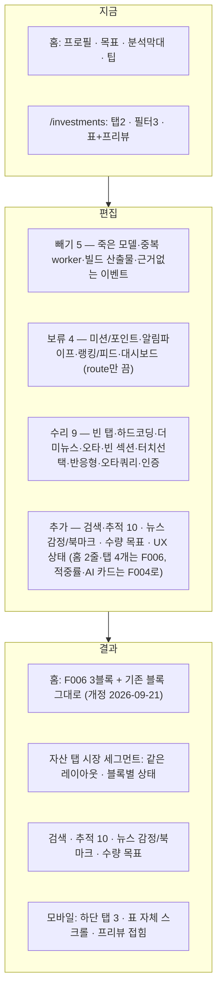

# FEATURE-000: 지금 화면 편집 (Edit In Place)

> 이전 제목: 범위 정리 (Scope Reset) — 2026-09-08 방향 전환으로 개정

## TL;DR

> **개정 2026-09-08 — 방향 전환.** 사용자 결정에 따라 이 스펙은 **"기능 제거"에서 "지금 화면 편집"으로 바뀌었다.**
> 근거 진술: *"지금 화면에서 뺄 건 빼고 하자"*, *"사실 지금 있는 거 다 필요해 보이긴 해"*, *"현재 홈 화면은 이뻐서 그건 냅두고 싶어, 의미도 있고"*.

- **새로 짜지 않는다.** 현재 `/` 홈과 `/investments` 투자 페이지의 레이아웃·컬럼·필터·색 규칙을 그대로 유지한다.
- 판정 축을 5개로 재정의한다: **유지 13 · 수리 9 · 추가 5 · 빼기 5 · 보류 4** (총 36건).
- **실제로 빼는 것은 화면 밖 죽은 코드뿐**이다 — 레거시 `AIAnalysis*` 모델, 서버 쪽 중복 `market-price-updater.worker`, 커밋된 빌드 산출물, 근거 없는 `ACCOUNT_SELECTED` 이벤트, 그리고 코드에 없는 기획상 항목(랭킹·저축왕·소셜·게임).
- **화면이 없는 백엔드는 삭제하지 않고 `보류(동면)`** 한다 — 미션/포인트/업적, 고래·스마트머니 알림 파이프라인, 인사이트 랭킹·피드, 대시보드. route만 비활성하고 모델은 남긴다.
- 신규 기능은 새 앱이 아니라 **지금 화면의 탭과 블록으로 들어간다**: 홈 최상단 2줄 추가, `/investments` 탭 4개 추가.

> **개정 2026-09-21 — 스토리보드 갭 감사 + ADR-002.** 근거: `pm/requirements/reports/feature-audits/2026-09-21-storyboard-gap.md`(이하 "감사 문서").
> - 원장 · 청구서 · 세금(F001 · F002)이 제품에서 빠졌다(`ADR-002`, D1). **홈 2줄 · `/investments` 탭 4개 · 모바일 5탭은 대체됐다** — 홈은 F006 3블록(D6), `/investments` 는 자산 탭의 `시장` 세그먼트(D7), 모바일은 F006 3탭.
> - 적중률 한 줄(FR-32)과 AI 추천 카드(FR-33)는 **F004 로 이관**했다. `AssetType` 3값 · KIS(FR-34/35)는 **열린 질문 Q2** 다.
> - F000 에 새로 들어온 것: **종목 검색 + 추적 자산 10**(D8) · **뉴스 감정 배지 · 종목 연결 · 북마크**(B11 · D5) · **목표 수량 입력**(B5) · **투자 화면 UX 상태**(B22). 관심 종목 **신호 컬럼은 두지 않는다**(D4).

## 배경과 문제

- `pm/features/current-feature-map.md`(2026-05-25 감사) 기준 24개 기능 중 `Implemented` 3개, `Partial` 6개, 나머지 15개가 화면 없는 `Backend Only`다.
- 초기 판단은 "다 만들어놓고 안 쓰니 절반을 지우자"였다. **사용자가 이를 되돌렸다.**
  - *"지금 화면에서 뺄 건 빼고 하자"* → 전면 재설계가 아니라 **부분 편집**.
  - *"사실 지금 있는 거 다 필요해 보이긴 해"* → 기능 제거 목록을 최소화.
  - *"현재 홈 화면은 이뻐서 그건 냅두고 싶어, 의미도 있고"* → 홈 시각 구성은 **변경 금지**.
- 실제 코드를 읽어보니 이 판단이 타당하다.
  - `/investments`는 실시간 가격·5분봉·심리 온도계·스마트 머니가 **실제로 동작**하고, 변동률 blink 2초 같은 디테일까지 들어가 있다. 지울 이유가 없다.
  - 홈의 `AnalysisGraph`는 카테고리별 막대에 진입 애니메이션까지 구현되어 있다.
  - 문제는 **기능 과잉이 아니라 (a) 깨진 채 방치된 부분과 (b) "그래서 지금 뭘 해야 하나"에 답하는 블록의 부재**다.
- 그래서 이 스펙의 성격이 바뀐다: **삭제 계획 → 편집 계획.** 빼는 것은 화면 밖 죽은 코드로 한정하고, 나머지는 수리·추가·보류로 처리한다.

## 목표

1. 현재 화면의 구성과 시각 정체성을 **보존한다**(사용자가 명시적으로 요구한 제약).
2. 깨져 있거나 더미인 부분만 **고친다**(빈 탭, 하드코딩 문자열, 더미 뉴스, 오타, 반응형, 터치 선택).
3. 죽은 코드와 중복만 **뺀다**. 되돌릴 수 있게 브랜치 + FR 단위 커밋 + DB 스냅샷 선행.
4. 지금 안 쓰는 백엔드는 **지우지 않고 비활성**한다 — 나중에 사용자가 늘거나 필요해지면 다시 켠다.
5. ~~신규 기능이 올라갈 **깨끗한 거래 원장**과 `AssetType` 확장을 준비한다.~~ **개정 2026-09-21** — 원장 확장은 하지 않는다(`ADR-002`). 보유 기록은 기존 `PortfolioTransaction` 그대로다. `AssetType` 확장 여부는 열린 질문 Q2.
6. **지켜볼 종목을 사용자가 고른다.** 종목 검색으로 추적 자산(최대 10)을 등록하고, 뉴스를 판단(종목 상세)과 북마크로 잇는다(개정 2026-09-21, D8 · B11 · D5).

## 사용자 시나리오

1. 홈을 연다. **지금과 똑같이** 프로필 헤더 → 목표 카드 → 투자 분석 막대 → 금융 팁이 있다. 달라진 것은 맨 위에 `이번 주 적립 475,000원`과 `세금 마감 D-112`가 붙은 것뿐이다.
2. 비어 있던 "주식" 제목 아래에 보유 요약이 채워져 있다.
3. `/investments`로 간다. **레이아웃이 그대로다** — 필터 3그룹, 좌측 실시간 테이블, 우측 종목 프리뷰.
4. "관심 종목" 탭을 누른다. 이제 빈 화면이 아니라 관심 종목 목록이 나온다.
5. 우측 프리뷰를 본다. 심리 온도계와 스마트 머니 게이지가 그대로 있고, **그 아래 한 줄이 추가됐다** — "이 온도계가 70°C를 넘은 뒤 30일 수익률: 표본 24회 · 승률 46% · 평균 −1.2%".
6. 그 아래 뉴스가 이제 실제 기사다.
7. 탭 줄 뒤쪽에 새 탭 4개가 있다 — `AI 코치 · 내 청구서 · 세금 마감 · 포지션`.
8. 휴대폰으로 같은 화면을 연다. 표가 가로로 잘리지 않고 자체 스크롤되며, 우측 프리뷰가 아래로 접혀 있다. 행을 **탭하면** 상세가 바뀐다.

> **개정 2026-09-21.** 1번의 `세금 마감 D-112` 줄과 7번의 탭 4개는 없다(ADR-002 · D6 · D7). 5번의 적중률 한 줄은 F004 가 만든다. 아래가 새 시나리오다.

9. 앱바의 🔍 를 누른다. "솔라나"를 치면 결과에 `보유` 배지 없는 행이 나온다. ★ 를 누르자 상단 카운터가 `추적 3 / 10` → `4 / 10` 이 된다. 10개가 차 있으면 "하나를 빼야 추가할 수 있어요"가 뜨고 등록되지 않는다. **보유 종목은 늘 추적되고 이 숫자에 세지 않는다.**
10. 우측 프리뷰의 뉴스 기사에 `부정` 배지와 `BTC` 종목 칩이 붙어 있다. 칩을 누르면 그 종목 상세로 간다. ☆ 를 누르면 북마크되고, `관심 종목` 탭 아래 **북마크한 뉴스** 목록에 모인다.
11. 목표를 추가할 때 `금액` / `수량` 중 `수량`을 고르고 "BTC 1개"를 입력한다. 목표 카드는 **지금과 같은 모양**이고 진행 바 옆 숫자만 `0.42 / 1 BTC` 다.
12. 시세 표를 불러오다 서버가 실패하면 빈 표가 아니라 "시세를 불러오지 못했어요 · 다시 시도"가 나온다. 프리뷰의 뉴스만 실패하면 차트 · 게이지는 그대로 있고 뉴스 칸만 실패를 말한다.

## 기능 요구사항

### A. 빼기 — 화면 밖 죽은 코드만

| ID | 요구사항 | 우선순위 | 상태 |
|---|---|---|---|
| FR-1 | **레거시 제거**: `AIAnalysisSession`, `AIAnalysis`, `AnalysisStatus`, `PredictionType` 삭제. **삭제 전 `grep -rn "AIAnalysis" src` 결과 0 확인 필수** | Must | Draft |
| FR-2 | **중복 worker 제거**: 서버 `market-price-updater.worker`. 가격 갱신은 BFF `price-updater.worker` 단일 경로로 통일 | Must | Draft |
| FR-3 | **커밋된 빌드 산출물 제거**: `market-price-updater.worker.js/.d.ts/.js.map` + `.gitignore` 반영 | Must | Draft |
| FR-4 | **근거 없는 이벤트 제거**: `@repo/message-event-bus`의 `ACCOUNT_SELECTED`. 은행/계좌 API가 없어 동작 근거가 없다 | Must | Draft |
| FR-5 | **기획 문서에서 내리기**: 랭킹·이달의 저축왕·소셜 저축·저축 게임. 코드에 없고 사용자 1~10명이면 성립하지 않는다. `README.md`를 v1/v2 2섹션 구조로 개편(삭제 아님) | Should | Draft |

### B. 보류(동면) — 지우지 않고 끈다

| ID | 요구사항 | 우선순위 | 상태 |
|---|---|---|---|
| FR-10 | **미션/포인트/업적 비활성**: `modules/mission` route를 앱에서 등록 해제하고 BFF proxy에서 제거. **Prisma model(`DailyMission`, `UserMissionProgress`, `UserAchievement`, `PointTransaction`)은 유지** | Must | Draft |
| FR-11 | **알림 파이프라인 축소**: `SentimentAlert`/`SmartMoneyAlert` 생성 worker를 끄고 `InvestmentNotification` 타입을 **지표·추천 갱신 1종**으로 제한. `MarketSentiment`/`WhaleTransaction` model과 **프리뷰 화면은 유지**(FR-22). **개정 2026-09-21** — 세금 D-Day 가 빠져 2종 → 1종(ADR-002 · D5). 알림 목록 · 읽음 · 안 읽은 수는 F006 이 소유한다. **뉴스 북마크는 알림이 아니다**(FR-43) | Must | Draft |
| FR-12 | **인사이트 랭킹·피드 비활성**: `insight-ranking.controller`, `modules/feed`, BFF `app-feed.service` route 등록 해제. 코드/모델 유지 | Should | Draft |
| FR-13 | **대시보드 비활성**: 홈 aggregation이 BFF로 이동한 뒤 `/api/dashboard` 등록 해제. 삭제는 이후 결정 | Should | Draft |
| FR-14 | **비활성 route 응답**: 등록 해제된 경로는 404 대신 **410 Gone + 1회 로그**로 1주 유지해 프론트 잔여 호출을 탐지 | Should | **In Progress** — BFF 2026-09-22(`BFF-REQ-036`) · 서버 `SRV-REQ-009` FR-7·8 남음 · 1주 확인 2026-09-29 |

### C. 수리 — 지금 있는데 깨진 것

| ID | 요구사항 | 우선순위 | 상태 |
|---|---|---|---|
| FR-20 | **"관심 종목" 탭 채우기**: 현재 `{activeTab === "realtime" && <RealtimeInvestment/>}`뿐이라 탭을 누르면 빈 화면이다. 서버 watchlist CRUD에 연결한 목록 화면을 붙인다. **탭 자체를 없애지 않는다** | Must | **Done** |
| FR-21 | **하드코딩 문자열 교체**: 테이블 헤더의 `"실시간 오늘 19:30 기준"`을 WebSocket 마지막 수신 시각으로 | Must | **Done** |
| FR-22 | **뉴스 프리뷰 실데이터 연결**: `MarketIntelligenceNewsPreview`의 제목·요약·이미지·출처·조회수가 전부 상수이고 제목에 테스트 문자열(`faskdljfaksjf…`)이 남아 있다. 서버 `/api/news`에 연결한다. **블록을 없애지 않는다** | Must | **Done** |
| FR-23 | **오타 수정**: `MyInvestments.tsx`의 `{difference}% 덜 썻어요` → `덜 썼어요` | Must | **Done** |
| FR-24 | **비어 있는 "주식" 섹션 채우기**: `<Heading>주식</Heading>`만 있고 자식이 없다. 포트폴리오 API로 보유 요약(종목·평가금액·손익률·세금 배지)을 렌더 | Must | **Done** |
| FR-25 | **터치 선택 추가**: 테이블 행 선택이 `onMouseEnter`만이라 터치 기기에서 우측 상세가 바뀌지 않는다. `onClick`을 **추가**한다(hover는 유지) | Must | **Done** |
| FR-26 | **반응형 분기 추가**: 레이아웃을 바꾸지 않고 ① 표에 자체 `overflow-x` 컨테이너 ② 모바일에서 `MarketPreview`를 아래로 접기 ③ `maxHeight="800px"` 고정을 뷰포트 기준으로 | Must | **Done** |
| FR-27 | **차트 기간 쿼리 오타**: `period=miniute` → `minute` (FE/BFF/서버 계약 동시) | Must | **Done** |
| FR-28 | **인증 축소**: 회원가입/비밀번호 변경/계정 삭제 route 및 화면 제거. `POST /api/auth/login` + refresh 유지. **초대 코드 기반 계정 생성**(`InviteCode`, 최대 10명) | Must | **Done** |
| FR-29 | **목표 저축 submit 연결 확인**: 목표 추가 폼이 실제로 `POST /api/goals`까지 연결되는지 검증하고 끊겨 있으면 잇는다. **UI는 유지** | Should | **Done** |

### D. 추가 — 지금 화면의 탭과 블록으로

| ID | 요구사항 | 우선순위 | 상태 |
|---|---|---|---|
| FR-30 | **개정 2026-09-21 — 대체됨(D6 → F006).** ~~홈 최상단 2줄: `이번 주 적립`과 `세금 D-Day`~~. 홈은 **3블록(총자산 → 이번 주 적립 → AI 추천) + 그 아래 기존 목표 카드 · `AnalysisGraph` · `TipsApp`** 이고 `FEATURE-006` 이 소유한다. 세금 D-Day 는 ADR-002 로 소멸. **E절(기존 블록 순서 · 디자인 유지)은 그대로 걸린다** | — | Superseded |
| FR-31 | **개정 2026-09-21 — 대체됨(D7 + ADR-002).** ~~`/investments` 탭 4개(`ai-coach` · `invoice` · `tax` · `position`) 추가~~. `/investments` 는 **자산 탭의 `시장` 세그먼트**다. 자산 탭 = `포지션` / `시장` / `관심 종목`(F006). 청구서 · 세금 탭은 없다. 종목 → **상세 분석 페이지 push**(F004). **PC 2컬럼은 지금 그대로** | — | Superseded |
| FR-32 | **개정 2026-09-21 — F004 로 이관.** 게이지 아래 적중률 한 줄은 서버 신규 집계(감사 문서 B9)가 필요해 `FEATURE-004` 가 소유한다. F000 은 **게이지 시각을 바꾸지 않는 것**(E절)만 책임진다 | — | Moved |
| FR-33 | **개정 2026-09-21 — F004 로 이관.** 우측 패널은 "카드 1개"가 아니라 **AI 코치 패널**(모드 · 판단 · 바이존/관찰 구간 · 게이지 · 뉴스 · 상세 이동)이다. `FEATURE-004` 가 소유한다. 3종 게이트(근거 · 적중률 · 실패사례)는 그대로 | — | Moved |
| FR-34 | **`AssetType` enum 확장**: `crypto`, `kr_stock`, `us_stock`. 기존 row는 `crypto`로 마이그레이션. **개정 2026-09-21 — 열린 질문 Q2.** 주된 근거가 세금 차이(F002)였고 ADR-002 로 빠졌다. **Q2 결정 전 마이그레이션(`DB-REQ-003` M1 · M2 · M5)을 실행하지 않는다** | Must | Blocked (Q2) |
| FR-35 | **KIS 연동 자리 확보**: `external/kis/` 조회 전용 클라이언트 스켈레톤. **개정 2026-09-21 — 열린 질문 Q2.** "실제 import 는 FEATURE-001" 의 F001 이 삭제됐다. 국내 · 미국 주식을 다룰지(Q2)가 정해지기 전 스켈레톤을 만들지 않는다 | Must | Blocked (Q2) |
| FR-36 | **개정 2026-09-21 — 대체됨(F006 3탭).** ~~모바일 하단 탭 5개(`홈/코치/청구서/세금/포지션`)~~. 하단 탭은 **`홈` / `코치` / `자산` 3개**이고 `FEATURE-006` 이 소유한다 | — | Superseded |

### D-2. 추가 — 2026-09-21 스토리보드 갭 감사

근거: 감사 문서 §1 · §2 · §4(F000 행). 결정(D#)은 그대로, 기본안(B#)은 태그를 단다.

| ID | 요구사항 | 우선순위 | 상태 |
|---|---|---|---|
| FR-40 | **종목 검색**(D8): 앱바 🔍 → 검색 화면. 종목명 · 심볼로 찾는다. 결과 행 = 로고 · 종목명 · 심볼 · 자산군 · 현재가 · 변동률 · `보유` 배지 · ★. 행 → 종목 상세, ★ → 추적 등록/해제. **전체 시장 목록을 대신하는 화면이 아니다** — 시장 목록은 `시장` 세그먼트가 한다 | Must | Draft |
| FR-41 | **추적 자산 상한 10**(D8): 추적 자산 = **관심 종목(★) ∪ 보유 종목**. 상한은 **보유가 아닌 관심 종목**에만 걸린다. 보유 종목은 늘 추적되고 세지 않는다. 11번째 ★ 는 서버가 거부하고 화면은 "하나를 빼야 추가할 수 있어요". 상한은 **설정값**이다. 새 테이블을 만들지 않는다(`InvestmentWatchlist` 재사용) | Must | Draft |
| FR-42 | **뉴스 감정 배지 + 종목 연결**(기본안 — 감사 문서 B11): 기사마다 `긍정` · `중립` · `부정` 배지(서버 `NewsArticle.sentiment`, 없으면 배지 없음)와 종목 칩(`symbols`). 칩 → 그 종목 **상세 분석 페이지**(F004 소유 · 그 전까지는 `시장` 세그먼트에서 그 종목 선택). **BFF 뷰모델이 `sentiment` · `symbols` 를 버리지 않는다**. 감정은 **표시만** 한다 — 코치 점수에 더하지 않고 알림을 만들지 않는다 | Must | Draft |
| FR-43 | **뉴스 북마크**(D5): 기사마다 ☆ 토글. 서버에 이미 있는 `POST /api/news/bookmark` · `GET /api/news/bookmarks` · `DELETE /api/news/bookmark/:newsId` 를 BFF 가 연다. **북마크 목록은 `관심 종목` 세그먼트(웹 `/investments` 관심 종목 탭) 아래 `북마크한 뉴스` 블록**에 모은다(기본안 — 이 문서에서 정함. 스토리보드 `news` n2 의 "알림 탭"은 D5 "알림이 아니다"로 대체). 별도 북마크 화면을 만들지 않는다 | Must | Draft |
| FR-44 | **목표 수량 입력**(기본안 — 감사 문서 B5): 목표 추가 폼에 `금액` / `수량` 선택. 수량 목표 = 종목(검색 재사용) + 목표 수량. 진행률은 **서버가** 보유 수량 ÷ 목표 수량으로 계산한다. **목표 카드 시각은 바꾸지 않는다**(E절) — 진행 바 옆 숫자만 금액 대신 수량 | Should | Draft |
| FR-45 | **투자 화면 UX 상태**(기본안 — 감사 문서 B22): 시세 표 · 프리뷰 · 관심 종목 · 검색 · 뉴스 각각에 loading · error · partial · empty 를 정의한다(`FE-REQ-010` · `RN-REQ-004`). 부분 실패는 **블록 단위로 격리**한다. **웹 오프라인은 별도 화면 없이 WS "연결 끊김" 표시로 갈음한다**(`FE-REQ-011` FR-12) | Must | Draft |
| FR-46 | **관심 종목 신호 컬럼을 두지 않는다**(D4): 관심 종목 표 · 카드에 action · 점수를 넣지 않는다. 판단은 우측 패널 · 상세에서만(F004). 스토리보드 `watchlist` n2 는 폐기 | Must | Draft |

### E. 유지 — 손대지 않는 것 (변경 금지 목록)

| 대상 | 근거 |
|---|---|
| 홈 목표 진행 카드 · `AnalysisGraph` 카테고리 막대 · `TipsApp` 금융 팁 · 프로필 헤더 | 사용자 명시: "이뻐서 냅두고 싶어, 의미도 있고" |
| 실시간 테이블 5컬럼(현재가·변동률·최고가·최저가·거래대금) · 정렬 5 / 순서 2 / 기간 7 필터 · 별 아이콘 · 로고 · **변동률 blink 2초** · `limit=100` | 완성도가 가장 높은 화면 |
| `PreviewChart` 5분봉 + 실시간 캔들 수신 | 동작 확인됨 |
| 심리 온도계 · 스마트 머니 원형 게이지 (프리뷰 UI) | 시각·정보 모두 유효. 적중률 한 줄은 F004 가 덧붙인다(개정 2026-09-21) |
| 2컬럼 레이아웃 (좌측 테이블 + 우측 392px 프리뷰) | PC에서 그대로. 모바일에서만 접힘 |
| 색·토큰 — 상승 `#FF2E55` / 하락 `#1677EE` / 브랜드 `#007AFF` / 배경 `#F2F4F6` | 신규 화면도 이 규칙을 따른다 |
| `PortfolioTransaction` · `PortfolioHolding` · `PriceHistory` | 보유 기록 · 가격 이력. row 수 보존이 수용 기준. **원장 확장은 하지 않는다**(ADR-002) |
| 목표 카드 시각(아이콘 · 이름 · 카테고리 · 목표일 · 진행률 % · 진행 바 · 현재/목표 값) | 수량 목표(FR-44)가 들어와도 **모양은 그대로**. 값 자리의 단위만 바뀐다 |
| `ai-coach` score engine + Gemini explainer · `signal-performance` · `profit-plan` · `trade-preflight` · `behavior-coach` | 제품의 핵심 엔진 |
| `packages/ui` 33개 export · `message-event-bus` | 그대로 |

## 비기능 요구사항

| 구분 | 요구사항 |
|---|---|
| 성능 | 삭제 후 `pnpm build` 전체 시간이 기존 대비 감소해야 한다(측정값 기록). worker 4개 기준 DB 커넥션 상시 사용량 감소 |
| 접근성 | 남는 5개 화면은 키보드 탐색과 스크린리더 라벨을 재검수한다 |
| 보안 | FR-8로 인증 표면이 줄어드는 대신, 남은 단일 사용자 토큰의 만료/재발급 경로는 유지한다. ~~Upbit API Key는 이 스펙 범위 밖(FEATURE-001)~~ **개정 2026-09-21** — 계좌 연동은 영구 Non-Goal(ADR-002 · 감사 문서 B12). 최근 검색은 **기기 로컬**에만 두고 서버로 보내지 않는다 |
| 장애 처리 | migration은 `drop` 전에 `pg_dump` 스냅샷을 남긴다. 롤백은 스냅샷 복원 + 이전 커밋 체크아웃 |
| 관측성 | 삭제된 route에 대한 요청이 오면 410 Gone + 1회 로그. 프론트 잔여 호출 탐지용 |

## UX 상태

- Loading: 제거 작업은 해당 없음. 투자 화면은 **블록별 스켈레톤**(FR-45) — 시세 표는 행 스켈레톤, 프리뷰는 차트 · 게이지 · 뉴스 각각
- Empty (추적 자산): 관심 종목 0건이고 보유도 0건이면 `관심 종목` 세그먼트에 "추적할 종목을 고르세요(최대 10개) · 🔍 종목 검색" 1개만 노출. **개정 2026-09-21** — ~~최대 5개~~ → **10개, 보유 종목은 세지 않는다**(D8)
- Empty (검색): 결과 0건이면 "'{검색어}' 와 맞는 종목이 없어요". 검색어 없으면 최근 검색 + 추적 자산 목록
- Empty (뉴스 · 북마크): "관련 뉴스가 없습니다" / "북마크한 뉴스가 없어요 · 기사의 ☆ 를 눌러 모으세요". 더미 0건
- Error: 삭제된 화면 URL 직접 진입 시 `/` 리다이렉트 + 토스트 "이 기능은 제거되었습니다". 시세 표 실패는 **빈 표가 아니라** 오류 + 다시 시도(FR-45)
- Partial: 프리뷰 3블록(차트 · 게이지 · 뉴스) 중 하나가 실패해도 나머지는 렌더한다
- Offline (웹): 별도 화면 없음. WS "연결 끊김" + 마지막 값 유지로 갈음(FR-45). 모바일은 캐시 + "오프라인 · {시각} 기준"
- Limit (추적 상한): 11번째 ★ → 등록되지 않고 "하나를 빼야 추가할 수 있어요". 카운터 `10 / 10`
- Unauthorized: 단일 사용자 토큰 없음 → 로그인 화면
- Success: ~~탭 5개짜리 shell~~ **개정 2026-09-21** — 3탭 shell(F006)이 뜨고 각 탭이 데이터를 렌더한다
- Optimistic update: ★(추적) · ☆(북마크)만 허용. 금액이 아니다. 실패 시 되돌리고 토스트

## 정책과 제약

- **변경 금지 목록(E절)을 침범하지 않는다.** 리팩터링 편의를 이유로 홈 블록이나 테이블 컬럼을 바꾸지 않는다.
- **삭제는 되돌릴 수 있어야 한다.** 브랜치 `chore/edit-in-place`, FR 단위 커밋, 삭제 전 `pg_dump` 스냅샷 + 복원 테스트 1회.
- **보류는 삭제가 아니다.** route 등록 해제 + BFF proxy 제거까지만. Prisma model과 서비스 코드는 남긴다. 되살리는 비용이 커밋 하나여야 한다.
- 작업 순서는 **프론트 → BFF → 서버 → Prisma**. 역순이면 빌드가 계속 깨진다.
- `PortfolioTransaction` / `PortfolioHolding` / `PriceHistory`는 **어떤 경우에도 데이터 손실 없이** 보존한다.
- 신규 탭은 **새 remote app을 만들지 않는다.** 기존 `investments` remote 안의 탭으로 들어간다.
- **추적 상한은 서버가 판정한다.** 프론트는 세지 않는다. 상한 10 은 설정값이다(D8).
- **뉴스 감정은 표시만 한다.** 코치 점수 입력 · 알림 트리거로 쓰지 않는다(스토리보드 `news` "뉴스가 하지 않는 것").
- **수량 목표의 진행률은 서버가 계산한다.** 프론트는 표시만 한다(공통 기준 ③).
- 레거시 모델 · 중복 worker · 동면 410 · `AssetType` 정리는 **`SRV-REQ-007` · `SRV-REQ-010` 에 이미 있다**(감사 문서 §4 `scope` 행). 이 스펙은 다시 쓰지 않고 그 REQ 를 가리킨다.
- 색·간격·타이포는 `apps/investments/src/styles/tokens.css.ts`를 따른다. 새 팔레트를 도입하지 않는다.

## 화면/프론트엔드 영향

| App | Route/Component | 판정 | 변경 내용 |
|---|---|---|---|
| shell | `pages/home/index.tsx` | 추가 | 최상단에 `WeeklyPlanRow` + `TaxDeadlineRow` 2줄. **기존 4블록 순서 유지** |
| shell | `components/Home/Header/**` | 유지 | 손대지 않음 |
| shell | `components/TipsApp/**` | 유지 | 손대지 않음 (사용자 결정) |
| shell | `components/Home/WeeklyPlanRow` · `TaxDeadlineRow` | 신규 | FEATURE-003 / FEATURE-002 요약 |
| shell | `components/Home/TabBar` | 신규 | 모바일 하단 탭바 5개 (FR-36) |
| web | `pages/onboarding` + `widgets/onboarding-flow` + `features/accept-invite` | **완료** | 초대 코드 + 계좌 연결 + 적립액 3스텝. 뒤 두 단계는 **안내만** 한다 — 연결 화면은 F001, 적립 설정은 F003 |
| web | 회원가입/비밀번호/계정삭제 화면 | **완료** | **셋 다 구현된 적이 없었다.** `/signup` 은 `PUBLIC_PATHS` 에 경로만 있었고 그 자리를 초대 코드 화면이 가져갔다 |
| goals | `component/GoalsApp/**` | 유지 | 목표 카드 UI 그대로 |
| goals | `component/AddGoals/**` | 수리 | submit → `POST /api/goals` 연결 확인. `ACCOUNT_SELECTED` 의존 제거 |
| investments | `pages/investment/index.tsx` | 추가 | `Tabs`에 4개 추가 + 각 탭 본문 마운트 |
| investments | `constants/investmentTabs.ts` | 추가 | `ai-coach` `invoice` `tax` `position` |
| investments | `RealtimeInvestment.tsx` | 수리 | 헤더 시각 실데이터화 · `onClick` 추가 · 표 `overflow-x` · 관심종목 탭 본문 |
| investments | `TableHeaderCells.ts` · `FilterTabsOptions.ts` | 유지 | 손대지 않음 |
| investments | `ChangeRateCell` · `PriceCell` | 유지 | blink 포함 그대로 |
| investments | `MarketPreview.tsx` | 추가 | AI 추천 카드 1개 삽입 + 모바일에서 아래로 접힘 |
| investments | `MarketIntelligencePreview.tsx` | 유지 + 추가 | 게이지 유지, 아래 적중률 한 줄 |
| investments | `MarketIntelligenceNewsPreview.tsx` | 수리 | 상수 → `/api/news` 실데이터 |
| investments | `MarketPreviewChart.tsx` | 수리 | `period` 오타 정정 |
| investments | `component/Coach/*` · `Invoice/*` · `Tax/*` · `Position/*` | 신규 | 신규 탭 본문 (FEATURE-001~004) |
| investments | `component/InvestmentsApp/MyInvestments.tsx` | 수리 | 오타 + "주식" 섹션에 보유 요약 |
| investments | `component/InvestmentsApp/AnalysisGraph/**` | 유지 | 손대지 않음 (사용자 결정) |

> **개정 2026-09-21.** 위 표의 `WeeklyPlanRow` · `TaxDeadlineRow` · `TabBar` 5개 · `investmentTabs.ts` 4항목 · `Coach/Invoice/Tax/Position` 탭 본문 · `MarketPreview` AI 카드 · 게이지 적중률 한 줄 행은 **이 스펙에서 만들지 않는다**(FR-30~33 · 36 대체/이관). 온보딩 2단계 "계좌 연결"은 **"첫 보유 기록 입력"**(기본안 — 감사 문서 B12, F006 소유)으로 바뀐다. 아래가 추가분이다(웹 경로는 FSD — `salt-microFe/apps/web`).

| 레이어 | 슬라이스 | 판정 | 변경 내용 |
|---|---|---|---|
| pages | `search` | 신규 | 종목 검색 화면(FR-40). 앱바 🔍 진입 |
| features | `search-asset` | 신규 | 검색어 입력 · 디바운스 · 최근 검색(기기 로컬) |
| features | `toggle-watchlist` | 수리 | 추적 상한 `409` 처리 · 카운터 갱신(FR-41) |
| features | `toggle-news-bookmark` | 신규 | ☆ 토글(FR-43) |
| entities | `news` | 수리 | 감정 배지 · 종목 칩 · 북마크 상태(FR-42 · 43) |
| widgets | 관심 종목 탭 | 추가 | 표 아래 `북마크한 뉴스` 블록(FR-43). **신호 컬럼 없음**(FR-46) |
| goals | `component/AddGoals/**` | 추가 | `금액` / `수량` 선택 + 종목 · 수량 입력(FR-44). **카드는 그대로** |
| investments | 시세 표 · 프리뷰 | 추가 | 블록별 loading · error · partial · empty(FR-45) |
| packages | `message-event-bus` | 빼기 | `ACCOUNT_SELECTED` 제거 |
| packages | `ui` | 유지 | 그대로. 필요 시 토큰만 보강 |

## BFF/API 영향

| Method | Path | 판정 | 변경 |
|---|---|---|---|
| ALL | `/api/missions*` | 보류 | proxy 등록 해제 (410 Gone 1주) |
| GET | `/api/users/points/*`, `/api/users/achievements` | 보류 | 동일 |
| GET | `/api/app/feed` | 보류 | 동일 |
| GET | `/api/dashboard` | 보류 | 동일 |
| POST | `/api/auth/register`, PATCH `/api/users/password`, DELETE `/api/users/account` | **완료** | 제거됨(404). 대체 경로는 `POST /api/app/onboarding/invite` |
| GET·POST | `/api/app/onboarding/{invite,invite/check,status}` | **신규·완료** | 무인증 2 + 인증 1. 실패는 `403 { reasonCode }` |
| ALL | `/api/goals*` | 유지 | 그대로 (단일 적립 목표는 이후 결정) |
| ALL | `/api/investment/watchlist*` | 유지 | 관심 종목 탭이 실제로 사용 (FR-20) |
| GET | `/api/investment/market/overview` | 유지 | `limit=100` 유지 |
| GET | `/api/investment/crypto/:symbol/chart` | 수리 | `period=minute` 계약 정정 |
| GET | `/api/market-intelligence/:symbol/dashboard` | 유지 | 프리뷰가 계속 사용 |
| ALL | `/api/news*` | 수리 | 뉴스 프리뷰가 실제로 사용 (FR-22) |
| GET | `/api/app/alerts` | 수리 | 소스를 **1종**으로 축소(개정 2026-09-21 — ADR-002 · D5) |
| GET | `/api/app/home` | ~~추가~~ | ~~홈 상단 2줄~~ — **개정 2026-09-21**: F006 이 3블록으로 소유 |
| GET | `/api/app/ai-coach/*`, `/profit-plan`, `/signal-performance`, `/behavior-coach`, POST `/trade-preflight` | 유지 | 그대로. 신규 탭이 소비 |
| — | ~~`/api/app/invoice*`, `/api/app/tax/*`~~, `/api/app/plan/*` | 추가 | **개정 2026-09-21** — invoice · tax 는 ADR-002 로 삭제. `plan` 만 FEATURE-003 |
| GET | `/api/app/search?q=&assetType=&limit=` | **신규** | 종목 검색 + `isTracked` · `isHeld` + `tracked{count,limit}`(FR-40 · 41). Auth Y |
| POST | `/api/app/watchlist` | 수리 | 추적 상한 초과 시 서버 `409 TRACKED_ASSET_LIMIT` 를 그대로 전달(FR-41) |
| GET | `/api/app/news` | 수리 | 뷰모델에 `sentiment` · `symbols` · `isBookmarked?` 추가(FR-42) |
| GET | `/api/app/news/bookmarks` | **신규** | 북마크 목록(FR-43). Auth Y |
| POST · DELETE | `/api/app/news/:id/bookmark` | **신규** | 북마크 추가 · 해제(FR-43). 서버 기존 route 를 연다. Auth Y |
| POST · PATCH | `/api/goals*` (proxy) | 유지 | 본문에 `targetQuantity` · `symbol` 이 그대로 지나간다(FR-44) |
| WS | `ws://localhost:4002` | 유지 | 구독 정책 그대로 |

## 서버/DB/Worker 영향

| Layer | 위치 | 판정 | 영향 |
|---|---|---|---|
| Server | `modules/mission` | 보류 | route 등록 해제. 코드 유지 |
| Server | `modules/feed`, `insight-ranking.controller`, `modules/dashboard` | 보류 | 동일 |
| Server | `modules/news` | 수리 | 유지 + 프리뷰 연결 |
| Server | `modules/market-intelligence` | 유지 | 프리뷰가 사용. 알림 생성만 중단 |
| Server | `modules/investment` (watchlist) | 유지 | 관심 종목 탭이 사용 |
| Server | ~~`modules/auth`~~ → `src/auth/**` | **완료** | DDD 컨텍스트로 신설. register/password/delete **제거됨**(404), 초대 코드 검증 추가. 계정은 `InviteCodeStore.redeem` 으로만 생긴다 |
| Server | `modules/investment-notification` | 수리 | 타입 **1종**으로 제한(개정 2026-09-21) |
| Server | `src/market/**` | 추가 | `SearchAssets` 유스케이스 · 추적 상한 판정 · `HoldingProbe`(portfolio 공개 API) — FR-40 · 41 |
| Server | `src/news/**` | 수리 | 목록에 `sentiment` · `symbols` 유지 · 인증 시 `isBookmarked`. 북마크 route 는 이미 있다 — FR-42 · 43 |
| Server | `modules/goals` | 추가 | 수량 목표 생성 · 진행률(보유 수량 ÷ 목표 수량) — FR-44 |
| Server | `modules/{ai-coach, trade-preflight, behavior-coach, profit-plan, signal-performance, portfolio, technical-indicator}` | 유지 | 그대로 |
| Server | `src/onboarding/**` | **완료** | 조합 컨텍스트 신설. 3스텝 판정(`GET /api/onboarding/status`) |
| Server | `external/kis/` | **보류 (Q2)** | 조회 전용 클라이언트 스켈레톤 (FR-35). 개정 2026-09-21 |
| DB | `AIAnalysisSession`, `AIAnalysis` + `AnalysisStatus`, `PredictionType` | 빼기 | drop (grep 0 확인 후) |
| DB | `AssetType` enum | **보류 (Q2)** | `crypto` / `kr_stock` / `us_stock` (FR-34). 개정 2026-09-21 |
| DB | `Goal` | 추가 | `targetQuantity Decimal?` · `symbol String?` · `targetAmount` nullable + 둘 중 하나 CHECK (FR-44, `DB-REQ-001` FR-40~43) |
| DB | `InvestmentWatchlist` · `NewsBookmark` · `NewsArticle` | 유지 | 스키마 변경 없음. 추적 자산 · 북마크 · 감정이 기존 컬럼을 쓴다 |
| DB | `InviteCode` | 추가 | `id, code @unique, issuedBy, usedByUserId?, usedAt?, expiresAt` |
| DB | 미션/포인트/업적/알림/뉴스/센티먼트 model | 보류 | **drop하지 않음** |
| DB | migration | — | `20260908_edit_in_place` (drop 2 model + enum 2 + AssetType 확장 + InviteCode) |
| Worker | `market-price-updater.worker` (서버) | 빼기 | 삭제 |
| Worker | `news-crawler.worker` | 유지 | 뉴스 프리뷰가 실데이터를 쓰므로 필요 |
| Worker | `notification-cleanup.worker` | 유지 | 알림 1종에도 필요 |
| Worker | `market-sync.worker` | 유지 | `limit=100` 유지이므로 필요 |
| Worker | `price-history.worker`, `technical-indicator.worker`, `investment-insight.worker` | 유지 | 그대로 |
| Worker | ~~`counterfactual`, `fx-rate`, `year-end-snapshot`, `tax-deadline-notify`~~, `indicator-sync`, `weekly-plan` | 추가 | **개정 2026-09-21** — 앞 넷은 ADR-002 로 삭제. `indicator-sync` · `weekly-plan` 만 FEATURE-003 |

## 이벤트/상태 흐름

## Trace Matrix

| 요구사항 | 화면/컴포넌트 | BFF/API | 서버 | DB/Worker | 검증 |
|---|---|---|---|---|---|
| FR-1 | — | — | — | model 2 + enum 2 drop | `grep -rn "AIAnalysis" salt-server/src` = 0 (삭제 전) |
| FR-2 | — | — | — | worker 1 삭제 | 기동 worker 목록에 없음 |
| FR-3 | — | — | — | — | `git ls-files "*worker.js"` = 0 |
| FR-4 | `message-event-bus` | — | — | — | `grep -rn ACCOUNT_SELECTED` = 0 |
| FR-10~13 | 해당 화면 없음 | proxy 등록 해제 | route 등록 해제 | **model 유지 확인** | 410 응답 + model 존재 쿼리 |
| FR-14 | — | 410 핸들러 | — | — | 1주 로그에 잔여 호출 0건 |
| FR-20 | 관심 종목 탭 본문 | `/api/investment/watchlist` | watchlist CRUD | `InvestmentWatchlist` | 탭 클릭 시 목록 렌더 |
| FR-21 | `RealtimeInvestment` 헤더 | — | — | — | 문자열이 수신 시각으로 변함 |
| FR-22 | `MarketIntelligenceNewsPreview` | `/api/news*` | `modules/news` | `NewsArticle` | 실제 기사 제목 렌더, 테스트 문자열 0건 |
| FR-23 | `MyInvestments` | — | — | — | "덜 썼어요" |
| FR-24 | `MyInvestments` "주식" | `/api/app/portfolio` | `modules/portfolio` | `PortfolioHolding` | 보유 요약 렌더 |
| FR-25 | `RealtimeInvestment` 행 | — | — | — | 터치로 상세 변경 확인 |
| FR-26 | 표 · `MarketPreview` | — | — | — | 375px에서 body 가로 스크롤 0 |
| FR-27 | `MarketPreviewChart` | chart proxy | chart endpoint | — | `minute` 요청 200 |
| FR-28 | 초대 코드 화면 | `/api/app/onboarding/invite` | `modules/auth` | `InviteCode` | 코드 없이 계정 생성 불가 |
| FR-29 | `AddGoals` submit | `POST /api/goals` | goals | `Goal` | 목표 1건 생성 E2E |
| FR-30 · 31 · 36 | — | — | — | — | **대체됨** — `FEATURE-006` Trace 로 |
| FR-32 · 33 | — | — | — | — | **이관됨** — `FEATURE-004` Trace 로 |
| FR-34 | — | — | — | `AssetType` 3값 | **Q2 결정 전 실행 안 함** |
| FR-35 | — | — | `external/kis` | — | **Q2 결정 전 만들지 않음** |
| FR-40 | `pages/search` · `features/search-asset` | `GET /api/app/search` | `GET /api/investment/search` (`market` `SearchAssets`) | `MarketAsset` · `InvestmentWatchlist` · `PortfolioHolding` | 검색 → 결과 행 → 상세 / ★ 등록 E2E 1건 |
| FR-41 | ★ · 카운터 `n / 10` | `POST /api/app/watchlist` → `409` 전달 | `AddToWatchlist` 상한 판정 · `HoldingProbe` | `InvestmentWatchlist` | 관심 10개에서 11번째 `409`, 보유 종목 ★ 는 상한 무관 |
| FR-42 | `entities/news` 배지 · 칩 | `GET /api/app/news` 뷰모델 | `ListNews` 응답 | `NewsArticle.sentiment` · `symbols` | BFF 응답에 두 필드가 있다(뷰모델 테스트) · 칩 → 상세 |
| FR-43 | `features/toggle-news-bookmark` · 관심 종목 탭 `북마크한 뉴스` | `POST·DELETE /api/app/news/:id/bookmark` · `GET /api/app/news/bookmarks` | `/api/news/bookmark` · `/bookmarks` · `/bookmark/:id` (기존) | `NewsBookmark` | ☆ → 목록에 나타남 → 해제 → 사라짐 E2E |
| FR-44 | `AddGoals` `금액/수량` | `/api/goals` proxy | `modules/goals` 수량 진행률 | `Goal.targetQuantity` · `symbol` | 수량 목표 1건 생성 · 카드 before/after 스크린샷 동일 |
| FR-45 | 시세 표 · 프리뷰 · 관심 종목 · 검색 · 뉴스 | — | — | — | 서버 중단 · 뉴스만 실패 · WS 끊김 3시나리오 수동 스모크 |
| FR-46 | 관심 종목 표 · 카드 | `WatchlistItemVM`(신호 필드 없음) | — | — | 관심 종목 컬럼에 action · 점수 0건 |
| E절 | 변경 금지 목록 | — | — | — | **before/after 스크린샷 비교로 홈 4블록·테이블 컬럼 동일 확인** |

## 수용 기준

- [ ] **홈의 목표 카드 · 분석 막대 · 금융 팁이 시각적으로 변하지 않았다**(before/after 스크린샷 비교).
- [ ] ~~홈 최상단에 `이번 주 적립`과 `세금 D-Day` 2줄이 추가되고~~ **개정 2026-09-21** — 홈 블록 추가는 F006 수용 기준이다. 이 스펙은 **기존 4블록 순서가 그대로다**만 본다.
- [ ] `/investments`의 필터 3그룹·테이블 5컬럼·2컬럼 레이아웃·변동률 blink가 그대로다.
- [ ] "관심 종목" 탭을 눌러도 빈 화면이 아니다.
- [ ] 뉴스 프리뷰에 실제 기사가 나오고 `faskdljf` 같은 테스트 문자열이 0건이다.
- [ ] 테이블 헤더 시각이 하드코딩 문자열이 아니다.
- [ ] "덜 썻어요"가 코드에 0건이다.
- [ ] 홈 "주식" 섹션에 보유 요약이 렌더된다.
- [ ] 375px 폭에서 body가 가로로 스크롤되지 않고, 표만 자체 스크롤된다.
- [ ] 터치(클릭)로 테이블 행을 선택하면 우측/하단 상세가 바뀐다.
- [ ] ~~`/investments` 탭이 6개~~ · ~~적중률 한 줄~~ — **개정 2026-09-21**: 대체(F006) · 이관(F004). 이 스펙에서 확인하지 않는다.
- [ ] `grep -rn "AIAnalysis" salt-server/src` = 0, `git ls-files "*worker.js"` = 0.
- [ ] **미션/포인트/업적 Prisma model이 여전히 존재한다**(보류이므로 삭제되지 않았다).
- [ ] 보류 route가 410 Gone을 반환한다.
- [ ] `AssetType`이 `crypto`/`kr_stock`/`us_stock` 3값이고 기존 row가 모두 `crypto`다. **개정 2026-09-21 — Q2 결정 전까지 보류.**
- [ ] `PortfolioTransaction` / `PortfolioHolding` / `PriceHistory` row 수가 migration 전후 동일하다.
- [x] 초대 코드 없이 계정이 생성되지 않는다. — `register` 404 실측. 계정을 만드는 함수가 `InviteCodeStore.redeem` 하나이고 그것은 코드 점유 없이 성공하지 않는다
- [ ] `pnpm build`, `pnpm lint`, `pnpm typecheck` 전부 통과한다.

**추가 2026-09-21 (감사 문서)**

- [ ] 🔍 → 검색 → 결과 행에 `보유` 배지 · ★ 가 있고, 행을 누르면 종목 상세로 간다.
- [ ] 관심 종목(보유 제외)이 10개면 11번째 ★ 가 **서버에서** 거부되고 화면에 "하나를 빼야 추가할 수 있어요"가 뜬다. 보유 종목은 이 숫자에 세지 않는다.
- [ ] 추적 상한 숫자가 코드 상수가 아니라 설정값이다.
- [ ] 뉴스 기사에 감정 배지(값이 있을 때만)와 종목 칩이 있고, 칩이 상세로 이어진다. BFF 뉴스 뷰모델에 `sentiment` · `symbols` 가 있다.
- [ ] ☆ 로 북마크한 기사가 `관심 종목` 탭의 `북마크한 뉴스` 에 나오고, 해제하면 사라진다. **알림 목록에는 나오지 않는다.**
- [ ] 수량 목표를 만들 수 있고, **목표 카드가 before/after 스크린샷에서 모양이 같다.** 진행률이 서버 응답 값이다.
- [ ] 관심 종목 표 · 카드에 신호(action · 점수) 컬럼이 0건이다.
- [ ] 서버 중단 시 시세 표가 빈 표가 아니라 오류 + 다시 시도다. 뉴스만 실패하면 차트 · 게이지가 남는다. WS 가 끊기면 "연결 끊김"이다.
- [ ] 추천 · 뉴스 감정 어디에도 확신 표현 · 목표주가 · 수익률 예측이 0건이다(공통 기준 ④).

## 검증 계획

1. **변경 금지 검증(최우선)**: 작업 전 홈·투자 페이지 스크린샷을 남기고, 작업 후 동일 뷰포트에서 비교한다. E절 항목에 시각 변화가 있으면 되돌린다.
2. **삭제 전 grep 감사**: FR-1~4 각 심볼의 참조 수를 기록. 0이 아니면 참조부터 정리.
3. **DB 스냅샷**: `pg_dump -Fc` → `scratchpad/pre-edit-in-place.dump`. 복원 1회 검증. migration 전후 3개 테이블 `count(*)` 비교.
4. **보류 검증**: route 410 확인 + 해당 Prisma model이 `\dt`에 남아 있는지 확인. 되살리기 테스트 1회(route 재등록 → 200).
5. **수리 검증**: FR-20~29를 각각 수동 스모크. 뉴스는 실제 응답 캡처, 반응형은 375/390/1440 3뷰포트.
6. **추가 검증**: ~~탭 6개 순회, 홈 2줄 렌더, AI 카드 3종 게이트~~ **개정 2026-09-21** — 각각 F006 · F004 검증 계획으로. 이 스펙은 검색 → ★ → 상한 11번째 거부 · 뉴스 칩 → 상세 · ☆ → 북마크 목록 · 수량 목표 생성 · 상태 3시나리오(서버 중단 · 뉴스만 실패 · WS 끊김)를 수동 스모크한다.
7. **빌드 시간·번들**: 전/후 `pnpm build` 시간과 번들 크기 기록.

## Open Questions

> 2026-09-21 신설. 감사 문서 §3 의 열린 질문 중 이 스펙에 걸린 것과, 이 개정에서 정한 기본안.

| # | 질문 | 막는 것 | 기본안 |
|---|---|---|---|
| Q2 | 자산군 3종(`AssetType` · KIS)을 유지할지 — 주된 근거가 세금 차이였다 | FR-34 · FR-35 · `DB-REQ-003` M1/M2/M5 · `SRV-REQ-008` FR-32 · 검색 자산군 필터 | 결정 전까지 **크립토만** 검색 · 추적한다. 자산군 필터 칩은 존재하는 값만 보여준다 |
| Q1 | `apps/web-tax` zone 을 걷을지 | 이 스펙은 막지 않는다. `FE-REQ-007` 후속 | — |
| OQ-1 | 북마크 목록 위치 — `관심 종목` 세그먼트 아래 블록(FR-43)이 맞는지. 스토리보드는 알림 탭이었다 | FR-43 화면 배치 | 이 문서의 기본안. 감사 문서 §2 에 B 번호로 올릴지 PM 확인 |
| OQ-2 | 보유를 팔아 관심 종목만 남으면 상한을 넘을 수 있다(예: 관심 10 + 보유 1 매도 → 11) | FR-41 | **자동으로 빼지 않는다.** 새 등록만 막는다 |
| OQ-3 | 수량 목표의 현재 수량을 보유(`PortfolioHolding`)에서 읽을지, 목표별 적립 기록에서 쌓을지 | FR-44 | 보유 수량. 같은 종목 목표가 둘이면 둘 다 같은 보유를 본다 |
| OQ-4 | 추적 자산에만 지표 · 코치 계산을 돌린다(스토리보드 `search` extra) — 계산 범위 축소를 어느 REQ 가 가지는가 | 서버 비용 | F004 가 소비한다. F000 은 `isTracked` 판정만 제공 |

## 변경 이력

| 날짜 | 변경 |
|---|---|
| 2026-09-08 | 초안 작성 |
| 2026-09-08 | 서약/쿨다운 알림 참조 제거, 초대 코드 인증으로 전환, `AssetType` 3자산군 확장 |
| 2026-09-08 | **전면 개정 — "제거"에서 "편집"으로.** 사용자 결정(*"지금 화면에서 뺄 건 빼고 하자"*, *"지금 있는 거 다 필요해 보이긴 해"*, *"현재 홈 화면은 이뻐서 냅두고 싶어"*)에 따라 판정 축을 유지/수리/추가/빼기/보류 5개로 재정의. 실제 삭제는 화면 밖 죽은 코드 5건으로 한정, 화면 없는 백엔드는 보류(동면). 홈 시각 구성과 투자 페이지 레이아웃을 변경 금지 목록(E절)으로 명시. 신규 기능은 홈 상단 2줄 + `/investments` 탭 4개로 편입 |
| 2026-09-18 | **관심 종목 탭 + 수리 9건 구현**(PR #41). C절 FR-20~27·29 를 `Done` 으로. 근거: `requirements/reports/checklists/F000-watchlist-tab.md` |
| 2026-09-18 | **초대 코드 · 온보딩 3스텝 구현.** FR-28 을 `Done` 으로 — 서버 `auth`·`onboarding` 컨텍스트 신설, BFF 온보딩 3계약, 프론트 온보딩 화면. `POST /api/auth/register` · `PATCH /api/users/password` · `DELETE /api/users/account` 가 404 다. 근거: `requirements/reports/checklists/F000-invite-onboarding.md`. **온보딩 2·3 단계는 판정만 하고 화면은 F001·F003 이 만든다** |
| 2026-09-21 | **실시간 시세 신뢰성 슬라이스.** 사용자 결정(*"Investment 쪽부터 계속"*)으로 동면 410·알림 2종보다 먼저 했다. 기능 요구사항 번호를 새로 닫지는 않는다 — FR-21(WebSocket 기준 시각)이 **멈춘 시세에도 기준 시각을 보여주던 것**을 고쳤고, 투자 화면 시세가 조용히 멈추는 경로 넷(BFF)과 기동 시 거래소 429(서버)를 닫았다. 변경 금지 목록(E절) 항목은 건드리지 않았다. 근거: `requirements/reports/checklists/F000-realtime-reliability.md` |
| 2026-09-21 | **시세 표 필터 · 기간 변동률 · 레이아웃.** 변경 금지 목록(E절)의 "정렬 5 / 순서 2 / 기간 7"이 **동작하지 않고 있었다** — 기간 7개가 같은 목록, 오름차순이 내림차순과 같았다. 목록 · 컬럼 · 색은 그대로 두고 동작만 살렸다. 1280px 가로 스크롤 · 프리뷰 넘침도 닫았다. 근거: `requirements/reports/checklists/F000-market-table.md` |
| 2026-09-21 | **스토리보드 갭 감사 반영 + ADR-002.** D절 FR-30 · 31 · 36 을 **대체됨**(D6 · D7 · F006 3탭), FR-32 · 33 을 **F004 로 이관**, FR-34 · 35 를 **열린 질문 Q2** 로. FR-11 알림 2종 → 1종. 신규 D-2절 FR-40~46: 종목 검색 · 추적 자산 10(D8) · 뉴스 감정 배지 · 종목 연결(B11) · 북마크(D5, 목록 위치는 이 문서 기본안) · 목표 수량(B5) · 투자 화면 UX 상태(B22) · 신호 컬럼 없음(D4). UX 상태 "최대 5개" → 10개. Open Questions 절 신설. 근거: `pm/requirements/reports/feature-audits/2026-09-21-storyboard-gap.md` · `requirements/decisions/ADR-002-drop-ledger-invoice-tax.md` |
| 2026-09-22 | **BFF 부채 정리 슬라이스.** FR-14 를 BFF 쪽에서 구현 — `/api/app/feed` · `/api/missions*` · `/api/users/points/*` · `/api/users/achievements` · `/api/dashboard*` · `/api/users/dashboard`(미션 · 포인트 요약, 스펙 목록 밖) 가 `410 ENDPOINT_DORMANT`(프론트 호출 0건). 같은 PR 에서 BFF 가 서버 4xx 를 500 으로 뭉개던 5경로를 고쳐 **토큰 만료가 401 로 보인다.** 서버 동면(`SRV-REQ-009` FR-7·8)은 남음. 근거: `requirements/reports/checklists/F000-bff-cleanup.md` |
| 2026-09-23 | 구현 진행 기록 — **세션 슬라이스 (FE)**: 로그인이 목이었다. `POST /api/v1/auth/login` MSW 목이 `mock-jwt-token` 을 주고 화면이 그것을 세션으로 저장해, 초대제 계정(FR-20~23)으로 들어와도 `/api/app/*` 가 전부 401 이었다 — 사용자에게는 "로그인은 됐는데 코치 · 관심 목록 · 자산이 비어 있는" 상태로 보였다. 실제 계약(`POST /api/auth/login`, BFF 프록시)에 붙이고 목을 지웠으며, 액세스 토큰 15분에 맞춰 갱신을 넣었다(`FE-REQ-011` FR-62). 로그인 화면에 초대 안내를 넣어 **계정이 없는 사람의 경로가 화면에서 이어진다**(FR-63). 남은 것: 비공개 경로 가드(FR-61)와 토큰 쿠키 이관은 `FE-REQ-013`. 근거 `requirements/reports/checklists/F000-web-session.md` |
