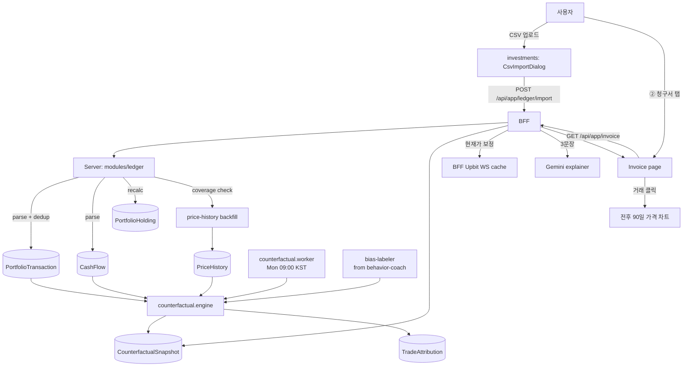

# FEATURE-001: 개입 청구서 (Intervention Invoice / My Alpha)

## TL;DR

> **개정 2026-09-08 — 계좌 연동 제외.** 사용자 결정: 거래소·증권사 계좌를 연동하지 않고 **얼마에 얼마나 투자했는지 직접 입력**한다.
> CSV import · Upbit API 키 · KIS 연동이 전부 빠지고, 원장은 100% 수기 입력이다. 그래서 **병목이 파서에서 입력 UX로 옮겨간다** — 입력이 번거로우면 사용자가 안 넣고, 안 넣으면 청구서·세금·코치가 전부 동작하지 않는다.


- 내 실제 계좌를 **① 아무것도 안 했을 때(Do-Nothing)**, **② 기계적으로 적립만 했을 때(Mechanical DCA)** 와 나란히 놓고, 차액을 **원화 청구서**로 발급한다.
- 핵심은 총액이 아니라 **귀속**이다. 모든 개별 거래에 원화 가격표를 붙이고, 그 합이 총 차액과 **정확히 일치**한다(잔차 없음, 수학적 항등식 — 4절).
- 거래를 행동 편향 라벨(패닉셀 / 추격매수 / 과잉거래)로 묶어서 보여준다. 결과 화면 한 줄: *"지난 180일 내 개입은 −1,240,000원. 그중 −890,000원이 패닉셀 3건에서 나왔습니다."*
- 리서치 확인 결과 **개인 계좌 단위로 반사실 손익을 거래별 원화로 귀속하는 리테일 앱은 존재하지 않는다.** 반사실 논의는 기관 문헌에만, 리테일 앱은 "수익률 표시"에서 멈춘다.

## 배경과 문제

- 리테일 트레이더는 1998~2025년 측정된 **모든 기간에 74~89%가 손실**을 봤다. 크립토 신규 진입자는 첫 1년 84%가 손실. 정보가 부족했던 시기가 아니다.
- Morningstar *Mind the Gap 2025*: 펀드 수익률 연 8.2% vs 투자자 실현 수익률 연 7.0%. **연 1.2%p가 타이밍으로 소실**되고, 변동성이 큰 자산군에서 갭이 커진다(변동성 상위 1.8%p). 비트코인은 그 스펙트럼의 극단이다.
- 그런데 이 수치들은 **전부 남의 평균**이다. 방법론 논쟁도 있다(FAJ 2026, "Bad Timing Does Not Cost Investors 15%"). 평균은 행동을 바꾸지 못한다.
- 내 계좌에서 내 거래에 원화 금액이 붙어야 행동이 바뀐다. 그리고 그 계산에 필요한 데이터는 **이미 SALT에 있다**: `PortfolioTransaction`(거래 원장) + `PriceHistory`(가격 원장).
- 기존 `behavior-coach`는 편향을 **지적**한다("패닉셀 경향이 보입니다"). 하지만 **가격표가 없다**. 가격표 없는 지적은 잔소리다.

## 목표

1. "내가 개입해서 얼마 벌었/잃었는가"를 원화 단일 숫자로 답한다.
2. 그 숫자를 개별 거래로 쪼개고, 합이 총액과 정확히 일치하게 한다.
3. 행동 편향별 손익 순위를 만들어 **가장 비싼 습관 1개**를 특정한다.
4. 잘한 개입도 같은 크기로 보여준다. 자책 도구가 되면 안 쓰게 되고, 안 쓰면 0원이다.
5. FEATURE-002(세금)·FEATURE-003(적립)·FEATURE-004(코치)가 올라갈 정확한 거래 원장을 확보한다.

## 사용자 시나리오

1. 업비트에서 매수한 뒤 SALT에서 `+ 거래 기록 추가`를 누른다. 자산군·종목이 최근 입력 기준으로 이미 선택돼 있고, 거래일은 오늘, 단가는 현재가가 채워져 있다. **수량만 넣고 저장**한다. 저장 전에 평단이 88,000,000 → 87,412,000으로 바뀌는 것이 보인다.
2. 한 달치를 몰아서 넣을 때는 거래소 화면에서 텍스트를 복사해 붙여넣는다. 행 단위로 파싱된 표가 나오고 틀린 칸만 고친다.
3. ② 청구서 탭을 연다. 3선 그래프가 뜬다 — 실제 나(굵은 선), 아무것도 안 함(점선), 기계적 적립(얇은 선).
3. 그래프 아래 청구서: `개입 손익 −1,240,000원 (아무것도 안 한 경우 대비)`, `규율 손익 −430,000원 (기계적 적립 대비)`.
4. 청구서 항목을 펼친다. 편향별 집계: `패닉셀 3건 −890,000 / 추격매수 5건 −310,000 / 수수료 42건 −86,000 / 잘한 익절 2건 +46,000`.
5. `패닉셀 3건`을 누른다. 거래 3건이 날짜·수량·단가·현재가·귀속손익으로 나온다. *"2026-06-12 0.05 BTC를 130,000,000원에 매도. 현재 150,000,000원. 이 결정의 값 −1,000,000원."*
6. 각 항목을 누르면 그 거래 전후 90일 가격 차트와 당시 지표값이 나온다. 판단 근거를 되짚을 수 있게만 하고, 규칙을 강제하지 않는다.
7. 매주 월요일, 이번 주 청구서 변동분이 ① 오늘 탭 상단에 한 줄로 뜬다.

## 기능 요구사항

### Phase 1 — 원장 입력 (S1, 전체 기능의 병목)

계좌를 연동하지 않으므로 정확도는 **입력 편의성**에 달려 있다. 목표는 **거래 1건 30초**다.

| ID | 요구사항 | 우선순위 | 상태 |
|---|---|---|---|
| FR-1 | **거래 입력 폼**: 자산군 → 종목 → 구분(매수/매도) → 수량 → 체결 단가 → 거래일. 이 6개가 필수이고 나머지는 전부 선택 또는 자동 | Must | Draft |
| FR-1a | **선택/자동 필드**: 수수료(비우면 0), 결제일(크립토·국내주식은 거래일과 동일 자동, 미국주식만 T+1 자동 계산 후 수정 가능), 메모 | Must | Draft |
| FR-1b | **입력 부담 축소**: 거래일 기본값 오늘, 체결 단가 기본값 현재가(있으면), 자산군·종목은 최근 입력 순 정렬. 같은 종목 연속 입력 시 자산군·종목 유지 | Must | Draft |
| FR-2 | **반영 결과 미리보기**: 저장 전에 총 취득금액 · **이동평균 평단 변화**(변경 전 → 후) · 보유 수량 변화를 보여준다. 잘못 입력하면 평단이 튀는 것이 즉시 보인다 | Must | Draft |
| FR-2a | **이상값 경고**: 현재가 대비 단가 편차 ±50% 초과, 수량 0 또는 음수, 보유 수량 초과 매도, 미래 날짜, 중복 의심(같은 날·종목·수량·단가) 시 경고. **저장을 막지 않고 경고만** 한다 | Must | Draft |
| FR-3 | **잔고 대조(사용자 신고)**: 사용자가 거래소에서 본 실제 보유 수량을 입력하면 계산된 홀딩과 비교해 오차율을 표시. 오차 > 0.5%면 청구서·세금 화면에 신뢰도 경고 배너 | Must | Draft |
| FR-3a | **일괄 입력(붙여넣기)**: 거래소 화면에서 복사한 텍스트를 붙여넣으면 행 단위로 파싱해 편집 가능한 표로 만든다. **파일 업로드·API 연동은 없다.** 파싱 실패 행은 사용자가 표에서 직접 고친다 | Should | Draft |
| FR-3b | **환율 원장**: 미국주식 거래는 결제일 기준환율을 함께 저장. 환율은 자동 조회하되 없으면 **사용자 입력 폴백**. 반사실 계산은 원화 기준으로 통일 | Must | Draft |
| FR-4 | **가격 원장**: 반사실 계산에 필요한 구간의 일봉을 확보. 크립토는 업비트 **공개** candles API(인증 불필요)로 백필. **주식 시세 소스는 미정**(글로벌 플랜 8-1) — 확정 전까지 주식은 사용자가 입력한 현재가를 쓰고, 일봉이 없는 구간은 `interpolatedDays[]`로 노출 | Must | Draft |
| FR-4a | **현재가 수기 갱신 경로**: 시세 자동 조회가 없는 자산군은 사용자가 현재가를 갱신할 수 있어야 한다. 마지막 갱신 시각을 표시하고 7일 이상 지나면 화면에 `시세 낡음` 배지 | Must | Draft |

### Phase 2 — 반사실 엔진 (S2)

| ID | 요구사항 | 우선순위 | 상태 |
|---|---|---|---|
| FR-5 | **3트랙 시계열 계산**: 기간 `[t0,t1]`에 대해 Actual / Do-Nothing / Mechanical-DCA 세 트랙의 일별 평가액을 계산. 세 트랙은 **동일한 KRW 입출금 스케줄**을 입력으로 받는다(4절 정의) | Must | Draft |
| FR-6 | **거래별 귀속 손익**: 각 거래 k에 `attributedPnl = Δq_k × (p_t1 − p_k) − fee_k`를 부여. Δq는 부호 있는 수량 변화(매수 +, 매도 −). 매도가 이익이면 양수로 표시되고 잘한 개입으로 분류 | Must | Draft |
| FR-7 | **항등식 검증**: `Σ attributedPnl − Σ doNothingPnl == interventionPnl`을 응답에 `reconciliation` 필드로 포함. 오차 절대값이 100원 초과면 500이 아니라 `degraded: true`와 함께 반환하고 경고 노출 | Must | Draft |
| FR-8 | **편향 라벨 조인**: `behavior-coach`의 편향 판정을 거래 단위로 재사용해 각 거래에 `biasLabels[]` 부여. 라벨: `panic_sell`, `fomo_buy`, `overtrade`, `revenge_buy`, `disciplined_exit`, `none`. **라벨은 인격 평가가 아니라 사실 서술로만 렌더한다**(글로벌 플랜 1-3절) | Must | Draft |
| FR-9 | **편향별 집계 + 최고가 습관**: 라벨별 `count`, `sumPnl`, `avgPnl`. `sumPnl`이 가장 음수인 라벨을 `mostExpensiveHabit`으로 반환 | Must | Draft |
| FR-10 | **수수료 라인 분리**: 수수료 총액을 별도 청구 항목으로. 거래 횟수 × 평균 수수료로 "과잉거래 비용"을 명시 | Must | Draft |
| FR-11 | **잘한 개입 대칭 표시**: 양수 귀속손익 상위 3건을 손실 상위 3건과 **동일한 시각적 비중**으로 렌더 | Must | Draft |
| FR-12 | **기간 선택**: 30 / 90 / 180 / 365 / 전체. 기본 180일 | Should | Draft |
| FR-13 | **주간 스냅샷 worker**: 매주 월요일 09:00 KST에 전 기간 스냅샷을 `CounterfactualSnapshot`에 적재. 청구서 화면은 스냅샷을 먼저 그리고 현재가만 실시간 보정 | Should | Draft |
| FR-14 | **Do-Nothing 기준자산 설정**: 기본 `KRW-BTC`. `UserInvestmentProfile.benchmarkSymbol`로 변경 가능 | Should | Draft |
| FR-15 | **AI 코치 해설**: 기존 Gemini explainer로 청구서 요약 3문장 생성. **금액은 LLM이 계산하지 않는다** — 계산된 숫자를 프롬프트에 주입하고 문장만 생성 | Should | Draft |

## 비기능 요구사항

| 구분 | 요구사항 |
|---|---|
| 성능 | 거래 5,000건 / 일봉 3,000개 기준 반사실 전체 계산 p95 < 1.5s. 화면은 스냅샷 캐시로 첫 페인트 < 300ms. **입력 미리보기 p95 < 200ms**(타이핑 중 갱신되므로) |
| 정확성 | 금액 계산은 부동소수점 누적 오차를 피하기 위해 서버에서 `Decimal`(prisma Decimal / decimal.js)로 처리하고, 응답 직전에만 number 직렬화. 수량은 8자리, 원화는 정수 원 단위 반올림 |
| 접근성 | 3선 그래프는 색만으로 구분하지 않는다(실선/점선/파선 + 직접 라벨). 손익 부호는 색 + 부호문자(+/−) 동시 표기. 청구서 표는 스크린리더용 caption 제공 |
| 보안 | **저장하는 자격증명이 없다.** 거래소·증권사 API 키를 받지 않고 계좌에 접속하지 않는다. 이것이 이 설계의 가장 큰 보안 이점이다. 붙여넣기 텍스트는 파싱 후 보관하지 않는다 |
| 장애 처리 | 일봉 결측 시 해당 날짜를 선형보간하지 않고 **직전 종가 carry-forward**하고 `interpolatedDays[]`로 노출. 결측이 전체의 5% 초과면 `degraded: true` |
| 관측성 | import 건수/중복/실패 카운터, 반사실 계산 시간, `reconciliation` 오차 히스토그램, 잔고 대조 오차율을 로그 |

## UX 상태

- **Loading**: 3선 그래프 영역 스켈레톤 + "거래 N건 / 일봉 M개 계산 중". 스냅샷이 있으면 스냅샷을 먼저 렌더하고 상단에 "현재가 반영 중" 인라인 스피너.
- **Empty (거래 0건)**: 청구서 대신 **첫 거래 입력 유도** — "첫 거래를 기록하면 청구서가 계산됩니다". 가짜 샘플 청구서를 미리보기로 제공(워터마크 `예시`).
- **Empty (기간 내 거래 0건)**: "이 기간에는 아무것도 하지 않았습니다. 개입 손익 0원 — 이것도 좋은 결과입니다." (자책 프레이밍 금지)
- **Error (붙여넣기 파싱 실패)**: 파싱된 행은 표로 보여주고 **실패한 행은 빈 칸으로 표에 남겨** 사용자가 직접 채우게 한다. 실패를 버리지 않는다.
- **Error (계산 실패)**: 마지막 성공 스냅샷 + "최신 계산 실패 (2026-09-08 09:00 기준 데이터)" 배너 + 재시도 버튼.
- **Degraded (원장 불일치)**: 상단 고정 경고 — "계산된 잔고가 신고한 잔고와 1.2% 차이납니다. 누락된 거래가 있을 수 있습니다." + [거래 확인] CTA.
- **Stale (시세 낡음)**: 시세 자동 조회가 없는 자산군의 마지막 갱신이 7일 이상이면 `시세 7일 전` 배지 + [갱신] CTA.
- **Unauthorized**: 로그인 화면.
- **Success**: 3선 그래프 + 청구서 + 편향별 집계 + `mostExpensiveHabit` 카드. 상단에 계산 기준 시각.
- **Optimistic update**: 없음. 금액 화면에서 낙관적 갱신은 금지한다.

## 정책과 제약

- **SALT는 주문을 실행하지 않고, 계좌에 접속하지도 않는다.** API 키를 받지 않으므로 저장할 자격증명이 없다.
- **원장은 사용자 입력이 유일한 진실이다.** 그래서 입력을 막지 않고(FR-2a) 경고만 하며, 대신 이상값을 눈에 보이게 만든다.
- 이 기능은 사후 회계다.
- **금액은 반드시 서버 계산.** 프론트는 표시만. LLM은 문장만.
- **잔차를 숨기지 않는다.** `reconciliation` 필드는 항상 응답에 포함하고, 오차가 있으면 UI에 표시.
- **지표/추정 없음.** 청구서에 미래 예측을 섞지 않는다. 전부 확정된 과거 가격 기반.
- **자책 방지 정책**: 손실 항목만 있고 이익 항목이 0건인 화면에는 "이 기간 개입은 전부 마이너스였습니다"에서 멈추지 않고, 같은 기간 기계적 적립 트랙의 결과를 나란히 표시한다. 점수/등급/벌점 표현 금지, 2인칭 인격 평가 금지.
- **Do-Nothing은 비난 장치가 아니다.** 툴팁으로 정의를 항상 노출: "입금 시점에 전액 BTC로 바꾼 뒤 한 번도 매매하지 않은 가정".
- Upbit API 조회 전용 키는 IP 등록이 필수는 아니지만, 계정당 키 10개 / 키당 허용 IP 10개 제한을 UI에 안내한다.

## 화면/프론트엔드 영향

| App | Route/Component | 변경 내용 |
|---|---|---|
| shell | `/invoice` (② 청구서 탭) | 신규 route, investments remote 마운트 |
| investments | `src/pages/invoice/index.tsx` | 신규 페이지 |
| investments | `component/Invoice/CounterfactualChart` | 신규. 3선 시계열. `lightweight-charts` 재사용 |
| investments | `component/Invoice/InvoiceSummary` | 신규. 개입 손익 / 규율 손익 / 수수료 3카드 |
| investments | `component/Invoice/BiasBreakdown` | 신규. 편향별 아코디언, 펼치면 거래 리스트 |
| investments | `component/Invoice/TradeAttributionRow` | 신규. 날짜/수량/단가/현재가/귀속손익 + 전후 90일 차트 링크 |
| investments | `component/Invoice/MostExpensiveHabitCard` | 신규. 가장 비싼 습관 1개 강조 |
| investments | `component/Invoice/LedgerHealthBanner` | 신규. 대조 오차/결측 경고 |
| investments | `component/Ledger/TradeInputSheet` | 신규. 거래 입력 폼 + 반영 결과 미리보기 + 이상값 경고 |
| investments | `component/Ledger/PasteImportTable` | 신규. 붙여넣기 파싱 → 편집 가능한 표 |
| investments | `component/Ledger/ReportedBalanceForm` | 신규. 사용자 신고 잔고 입력 → 오차율 |
| investments | `component/Ledger/PriceRefreshRow` | 신규. 시세 수기 갱신 + 마지막 갱신 시각 |
| investments | `hooks/api/invoice/useInterventionInvoice.ts` | 신규 |
| investments | `hooks/api/ledger/useTradeEntry.ts` | 신규 |
| investments | `component/InvestmentsApp/MyInvestments` | 청구서 요약 1줄 링크 추가 |
| shell | `components/Home` (① 오늘) | 주간 청구서 변동분 1줄 배치 (FEATURE-005와 조율) |

## BFF/API 영향

| Method | Path | Auth | Request | Response | Status |
|---|---|---|---|---|---|
| GET | `/api/app/invoice` | Y | `?window=30\|90\|180\|365\|all` (기본 180) | `InvoiceViewModel` (아래) | Draft |
| GET | `/api/app/invoice/trades` | Y | `?window&bias=panic_sell&sort=pnl_asc&limit=50&cursor=` | `{ items: TradeAttribution[], nextCursor }` | Draft |
| POST | `/api/app/ledger/trade` | Y | `{ assetType, symbol, side, quantity, price, tradeDate, settlementDate?, fee?, fxRate?, note? }` | `{ id, holdingAfter: {quantity, avgPrice}, warnings[] }` | Draft |
| POST | `/api/app/ledger/trade/preview` | Y | 동일 | `{ totalCost, avgPriceBefore, avgPriceAfter, quantityAfter, warnings[] }` | Draft |
| POST | `/api/app/ledger/trades/bulk` | Y | `{ rows: TradeInput[] }` | `{ inserted, failed, failures[] }` | Draft |
| POST | `/api/app/ledger/parse-paste` | Y | `{ text, assetTypeHint? }` | `{ rows: TradeInput[], unparsed[] }` | Draft |
| PATCH | `/api/app/ledger/trade/:id` · DELETE | Y | 수정/삭제 (수기 입력이므로 필수) | `204` | Draft |
| POST | `/api/app/ledger/price` | Y | `{ assetType, symbol, price }` | `{ updatedAt }` — 시세 수기 갱신 | Draft |
| GET | `/api/app/ledger/health` | Y | — | `{ computedHoldings[], reportedHoldings[], maxDiffRate, missingCandleDays, degraded }` | Draft |
| POST | `/api/app/ledger/reported-balance` | Y | `{ symbol, quantity }[]` | `{ maxDiffRate }` | Draft |


### 서버 raw API

| Method | Path | Auth | 설명 |
|---|---|---|---|
| GET | `/api/counterfactual/invoice` | Y | 3트랙 시계열 + 귀속 손익 + 편향 집계 원본 |
| GET | `/api/counterfactual/snapshot/latest` | Y | 최신 스냅샷 |
| POST | `/api/counterfactual/recompute` | Y | 강제 재계산 |
| POST | `/api/ledger/trade` · `/preview` · `/bulk` · `/parse-paste` | Y | 거래 입력·미리보기·일괄·붙여넣기 파싱 |
| PATCH · DELETE | `/api/ledger/trade/:id` | Y | 수정·삭제 |
| POST | `/api/ledger/price` | Y | 시세 수기 갱신 |
| GET | `/api/ledger/health` | Y | 사용자 신고 잔고 대조 |
| GET | `/api/price-history/coverage` | Y | 일봉 결측 조회 |
| POST | `/api/price-history/backfill` | Y | 일봉 백필 |

### InvoiceViewModel (BFF 응답 계약)

```ts
type InvoiceViewModel = {
  window: "30" | "90" | "180" | "365" | "all";
  range: { from: string; to: string };          // ISO date
  computedAt: string;                            // ISO datetime
  degraded: boolean;
  degradedReasons: string[];                     // ["ledger_mismatch", "missing_candles"]

  summary: {
    actualValue: number;                         // KRW, t1 기준 코인+원화
    doNothingValue: number;
    mechanicalDcaValue: number;
    interventionPnl: number;                     // actual - doNothing
    disciplinePnl: number;                       // actual - mechanicalDca
    totalFee: number;
    tradeCount: number;
    netDeposit: number;
  };

  series: Array<{
    date: string;
    actual: number;
    doNothing: number;
    mechanicalDca: number;
  }>;

  biasBreakdown: Array<{
    label: "panic_sell" | "fomo_buy" | "overtrade" | "revenge_buy"
         | "disciplined_exit" | "none";
    displayName: string;                         // "패닉셀"
    count: number;
    sumPnl: number;
    avgPnl: number;
  }>;

  mostExpensiveHabit: {
    label: string;
    displayName: string;
    sumPnl: number;
    count: number;
    message: string;                             // 사람이 읽는 한 문장
  } | null;

  topLosses: TradeAttribution[];                 // 최대 3건
  topGains: TradeAttribution[];                  // 최대 3건

  feeLine: { count: number; total: number; perTradeAvg: number };

  reconciliation: {
    sumAttributedPnl: number;
    sumDoNothingPnl: number;
    interventionPnl: number;
    residual: number;                            // 항등식 잔차, 목표 0
    withinTolerance: boolean;                    // |residual| <= 100
  };

  narrative: string[] | null;                    // AI 코치 3문장, 실패 시 null
};

type TradeAttribution = {
  transactionId: string;
  symbol: string;
  transactionType: "buy" | "sell";
  transactionDate: string;
  quantity: number;
  price: number;                                 // 체결 단가
  currentPrice: number;                          // t1 가격
  fee: number;
  attributedPnl: number;                         // Δq × (p_t1 − p_k) − fee
  biasLabels: string[];
  note: string | null;
};
```

## 서버/DB/Worker 영향

| Layer | 위치 | 영향 |
|---|---|---|
| Server | `modules/counterfactual/` | **신규**. `counterfactual.routes/controller/service`, `counterfactual.engine.ts`(3트랙 + 귀속), `bias-labeler.service.ts`(behavior-coach 재사용) |
| Server | `modules/ledger/` | **신규**. `trade-entry.service.ts`(입력·미리보기·검증), `paste-parser.ts`(붙여넣기 텍스트 → 행), `ledger-health.service.ts`(신고 잔고 대조), `manual-price.service.ts` |
| Server | `modules/behavior-coach` | 편향 판정 로직을 **거래 단위 라벨러로 추출**해 counterfactual에서 재사용. 기존 응답 계약 유지 |
| Server | `modules/portfolio` | import 후 `PortfolioHolding` 재계산 로직 노출 (`recalculateHoldings(userId)`) |
| Server | `external/upbit` | **공개 candles API만** 추가(인증 불필요). accounts·orders는 사용하지 않는다 |
| DB | `PortfolioTransaction` | `settlementDate DateTime?`, `currency String @default("KRW")`, `priceCurrency Float?`, `fxRate Float?`, `note String?` 추가. **`source`/`sourceRef`는 불필요** — 입력 경로가 하나뿐이므로 중복 제거 유니크 키가 필요 없다. 중복은 FR-2a 경고로 처리 |
| DB | `CashFlow` | **신규 model** — `id, userId, direction("in"\|"out"), currency, amount, occurredAt, note?` + `@@index([userId, occurredAt])`. **수기 입력.** 반사실 계산의 입금 스케줄 소스 |
| DB | `CounterfactualSnapshot` | **신규 model** — `id, userId, window, rangeFrom, rangeTo, computedAt, actualValue, doNothingValue, mechanicalDcaValue, interventionPnl, disciplinePnl, totalFee, tradeCount, netDeposit, seriesJson Json, biasBreakdownJson Json, residual, degraded Boolean, degradedReasons String[]` + `@@unique([userId, window, computedAt])`, `@@index([userId, window, computedAt])` |
| DB | `TradeAttribution` | **신규 model** — `id, userId, transactionId @unique, symbol, attributedPnl, currentPriceAt, biasLabels String[], computedAt` + `@@index([userId, attributedPnl])` (편향/손익 정렬 쿼리용) |
| DB | `ReportedBalance` | **신규 model** — `id, userId, assetType, symbol, quantity, reportedAt` + `@@unique([userId, assetType, symbol])`. 사용자가 거래소에서 본 실제 잔고 |
| DB | `ManualPrice` | **신규 model** — `id, userId, assetType, symbol, price, updatedAt` + `@@unique([userId, assetType, symbol])`. 시세 자동 조회가 없는 자산군용 |
| DB | `UserInvestmentProfile` | `benchmarkSymbol String @default("KRW-BTC")` 추가 |
| DB | migration | `20260908_counterfactual_ledger` |
| Worker | `counterfactual.worker.ts` | **신규**. 주 1회 월 09:00 KST 전 window 스냅샷 생성. 분산 락(userId 단위) + 멱등(같은 `computedAt` 시간 버킷은 upsert). 실패 시 지수 백오프 3회, 최종 실패는 마지막 스냅샷 유지 |
| Worker | `price-history.worker.ts` | 일봉 결측 감지 시 백필 트리거 추가 |

## 이벤트/상태 흐름



## 계산 정의 (4절 — 구현 계약)

기간 `[t0, t1]`, 최종가 `p_T = price(t1)`.

**입력**
- 거래 집합 `K`: 각 거래 `k`에 부호 수량 `Δq_k`(매수 `+`, 매도 `−`), 체결가 `p_k`, 수수료 `fee_k`. **외화 거래는 `p_k`를 결제일 환율로 환산한 원화 단가로 통일한다**(자산군 혼합 계산의 전제).
- 입출금 집합 `J`: 각 입금 `j`에 금액 `d_j`(입금 `+`, 출금 `−`), 일자 `t_j`, 그날 종가 `p_j`.

**Track Actual**
```
V_actual(t1) = Σ_j d_j + Σ_k [ Δq_k × (p_T − p_k) ] − Σ_k fee_k
```
(코인 평가액 + 잔여 원화. 시작 잔고 0 가정, 아니면 `t0` 잔고를 `d_0`로 편입)

**Track Do-Nothing** — 입금 시점에 전액 기준자산 매수, 이후 무매매
```
V_donothing(t1) = Σ_j d_j + Σ_j [ d_j × (p_T / p_j − 1) ]
```

**Track Mechanical DCA** — 총 입금액을 `[t0,t1]`의 주 단위 `N`회로 균등 분할, 매주 종가 매수. 해당 주까지 누적 입금액이 누적 계획 집행액보다 작으면 그 회차는 이연(원화 보유)
```
V_dca(t1) = Σ_j d_j + Σ_{w=1..N} [ a_w × (p_T / p_w − 1) ],  a_w = 실제 집행된 주간 금액
```

**청구서**
```
interventionPnl = V_actual − V_donothing
disciplinePnl   = V_actual − V_dca
attributedPnl_k = Δq_k × (p_T − p_k) − fee_k
```

**항등식 (FR-7이 검증하는 것)**
```
Σ_k attributedPnl_k − Σ_j [ d_j × (p_T/p_j − 1) ] ≡ interventionPnl
```
좌변 각 항이 모두 확정 과거값이므로 **잔차는 0이어야 한다.** 0이 아니면 원장/가격 결측 문제이며, 그 사실을 숨기지 않고 `residual`로 노출한다.

**멀티 자산·멀티 자산군**: 트랙 Actual은 심볼별 합(3자산군 모두 원화 환산 후 합산). Do-Nothing/DCA는 `benchmarkSymbol` 단일 자산 기준(기본 BTC) — "다 BTC에 넣고 가만히 있었다면"이 1인 사용자에게 가장 의미 있는 반사실이므로. 심볼별 Do-Nothing은 `?benchmark=perSymbol`로 별도 제공(Should).

## Trace Matrix

| 요구사항 | 화면/컴포넌트 | BFF/API | 서버/API | DB/Worker | 검증 |
|---|---|---|---|---|---|
| FR-1 | `CsvImportDialog` | `POST /api/app/ledger/import` | `POST /api/ledger/import` | `PortfolioTransaction`, `CashFlow` | 실제 업비트 CSV 1년치 import, 행 수 일치 |
| FR-2 | `LedgerHealthBanner` | `GET /api/app/ledger/health` | `GET /api/ledger/health` | `@@unique(userId,source,sourceRef)` | 동일 CSV 2회 업로드 → `inserted=0, duplicated=N` |
| FR-3 | `UpbitKeyForm` | `POST /api/app/ledger/upbit-key` | `POST /api/ledger/upbit-key` | `UpbitApiKey` | 주문권한 키 등록 시 403 |
| FR-4 | — | `GET /api/app/ledger/health` | `POST /api/price-history/backfill` | `PriceHistory`, `price-history.worker` | 결측 0 확인 쿼리 |
| FR-5 | `CounterfactualChart` | `GET /api/app/invoice` | `GET /api/counterfactual/invoice` | `counterfactual.engine` | 합성 데이터 3케이스 단위테스트 |
| FR-6 | `TradeAttributionRow` | `GET /api/app/invoice/trades` | 동일 | `TradeAttribution` | 손계산 대조 |
| FR-7 | `LedgerHealthBanner` | `reconciliation` 필드 | 동일 | — | 무작위 300케이스 property test, residual=0 |
| FR-8 | `BiasBreakdown` | `biasBreakdown` | `bias-labeler.service` | `TradeAttribution.biasLabels` | 라벨 골든 케이스 |
| FR-9 | `MostExpensiveHabitCard` | `mostExpensiveHabit` | 동일 | — | 라벨별 합계 정렬 검증 |
| FR-10 | `InvoiceSummary` 수수료 카드 | `feeLine` | 동일 | `PortfolioTransaction.fee` | 수수료 총합 대조 |
| FR-11 | `topGains` 렌더 | `topGains` | 동일 | — | 시각 비중 동일 여부 리뷰 |
| FR-12 | 기간 탭 | `?window=` | 동일 | 인덱스 사용 확인 | 5개 값 200 |
| FR-13 | 스냅샷 우선 렌더 | 캐시 히트 | `GET /api/counterfactual/snapshot/latest` | `counterfactual.worker` | 2회 실행 멱등성 |
| FR-14 | 설정 | `PATCH /api/app/ai-coach/profile` | 동일 | `UserInvestmentProfile.benchmarkSymbol` | 변경 후 do-nothing 값 변화 |
| FR-15 | `InvoiceSummary` narrative | `narrative` | Gemini explainer | — | LLM 실패 시 null + 화면 정상 |

## 수용 기준

- [ ] **거래 1건을 30초 이내에 입력할 수 있다**(자산군·종목·수량만 바꿔 연속 입력 시).
- [ ] 저장 전 미리보기에 평단 변화(전 → 후)와 보유 수량 변화가 표시된다.
- [ ] 이상값 5종(단가 편차·수량 0·초과 매도·미래 날짜·중복 의심)에 경고가 뜨고, **저장은 막히지 않는다**.
- [ ] 거래 수정·삭제가 동작하고 홀딩이 즉시 재계산된다.
- [ ] 붙여넣기 파싱에서 실패한 행이 버려지지 않고 빈 칸으로 표에 남는다.
- [ ] 사용자 신고 잔고와 계산된 홀딩의 오차율이 표시되고, 0.5% 초과 시 청구서·세금에 경고 배너가 뜬다.
- [ ] 무작위 생성 거래/입출금 300케이스에 대해 `reconciliation.residual` 절대값 ≤ 100원(전 케이스).
- [ ] 청구서 화면에 `interventionPnl`, `disciplinePnl`, `totalFee`가 원화 정수로 표시된다.
- [ ] 편향별 집계 합계가 `Σ attributedPnl`과 일치한다(라벨 `none` 포함).
- [ ] `mostExpensiveHabit` 카드에 해당 거래 목록과 전후 90일 가격 추이가 연결된다.
- [ ] 이익 항목이 있으면 손실 항목과 동일한 크기/위치 비중으로 렌더된다(디자인 리뷰 승인).
- [ ] 일봉 결측 5% 초과 시 `degraded: true` + 화면 경고.
- [ ] **`grep -rn "accessKey\|secretKey\|apiKey" salt-server/src bff/src` 결과가 0건이다** — 저장하는 자격증명이 없다.
- [ ] 거래소·증권사 인증 API를 호출하는 코드가 0건이다.
- [ ] 거래 5,000건 기준 `GET /api/app/invoice` p95 < 1.5s (스냅샷 미스 시).
- [ ] 거래 0건 상태에서 온보딩 화면이 뜨고 크래시하지 않는다.

## 검증 계획

1. **단위**: `counterfactual.engine`에 합성 시나리오 — (a) 매수 후 무매매(개입손익 0), (b) 고점 매도 후 저점 재매수(양수), (c) 저점 매도 후 고점 재매수(음수), (d) 입금만 하고 매수 안 함, (e) 전량 매도 후 종료.
2. **Property test**: 무작위 거래/입출금/가격 시퀀스 300개에 대해 항등식 잔차 = 0 검증. `fast-check` 사용.
3. **실데이터**: 본인 실제 보유 내역을 수기로 입력해 end-to-end. 계산된 현재 평가액을 거래소 앱 화면과 육안 대조(오차 0.5% 이내). **입력에 걸린 시간을 측정해 30초 목표를 검증**한다.
4. **붙여넣기 파서**: 거래소 화면에서 실제로 복사한 텍스트 3종(업비트·증권사 2곳)으로 파싱률 측정. 파싱 못한 행이 표에 남는지 확인.
5. **편향 라벨**: 골든 케이스 20건(수동 라벨링) 대비 정확도 리뷰. 오분류는 라벨을 늘리기보다 `none`으로 보수적 처리.
6. **성능**: 5,000건 거래 시딩 후 p95 측정.
7. **보안**: 자격증명 관련 심볼 grep 0건 확인. 외부 인증 API 호출 0건 확인.
8. **회귀**: `behavior-coach` 기존 응답 계약이 라벨러 추출 후에도 동일한지 스냅샷 테스트.

## Open Questions

- **주식 시세 소스**(글로벌 플랜 8-1). 확정 전까지 주식은 현재가 수기 입력(FR-4a)으로 동작하지만, 갱신을 안 하면 청구서·세금이 낡는다. **가장 중요한 남은 결정.**
- **붙여넣기 파서를 어디까지 만들지.** 거래소마다 화면 텍스트 형식이 달라 완벽한 파싱은 불가능하다. "절반만 맞춰도 수기보다 빠르면 이득"이라는 기준으로 갈지, 아니면 아예 만들지 않고 폼만 둘지.
- 시작 시점(`t0`) 이전 보유분 처리: `t0` 잔고를 `d_0` 입금으로 편입하면 do-nothing이 왜곡될 수 있다. 기본안: window의 `t0`를 **최초 거래일로 고정**하고 기간 선택은 표시 구간만 잘라내는 방식으로 하는 것이 더 정확할 수 있음. 두 방식 비교 후 결정.
- Mechanical DCA의 주기(주/월)와 시작 정렬. 기본안 주 단위 월요일.
- 편향 라벨 판정을 `behavior-coach`에서 거래 단위로 재사용할 때, 기존 판정이 집계 기반이면 거래 단위로 분해되지 않을 수 있다. `behavior-coach.service` 실제 구현 확인 필요.
- 스테이킹/에어드랍/코인 간 스왑 거래는 이 모델에 안 맞는다. 1차 범위에서는 **제외**하고 `unsupportedTransactions[]`로 노출할지.
- **입금(CashFlow)도 수기 입력**이어야 반사실 계산이 성립한다(계산 정의 4절의 `d_j`). 거래만 넣고 입금을 안 넣으면 "아무것도 안 함" 트랙을 만들 수 없다. 입금을 별도로 묻지 않고 **매수 금액의 합을 입금으로 간주**하는 근사를 쓸지 결정 필요.
- `narrative` 생성에 LLM 호출 비용/지연. 스냅샷 생성 시 1회만 만들고 캐시하는 방향.

## 변경 이력

| 날짜 | 변경 |
|---|---|
| 2026-09-08 | 초안 작성. 3트랙 반사실, 거래별 귀속 항등식, 편향 집계, 원장 import 정의 |
| 2026-09-08 | 서약 연동 제거(사용자 결정). 국내·미국 주식 확장 — 결제일 환율 원장(FR-3b), 원화 통일 계산 전제 |
| 2026-09-08 | **계좌 연동 전면 제외 (사용자 결정).** CSV import · Upbit API 키 · KIS 연동 제거. Phase 1을 "원장 신뢰"에서 **"원장 입력"** 으로 재정의 — 거래 입력 폼(FR-1) · 미리보기(FR-2) · 이상값 경고(FR-2a) · 신고 잔고 대조(FR-3) · 붙여넣기(FR-3a) · 시세 수기 갱신(FR-4a). `UpbitApiKey` 모델 삭제, `ReportedBalance`·`ManualPrice` 신설. 보안 요구사항이 "키 암호화"에서 "저장할 키가 없음"으로 |
