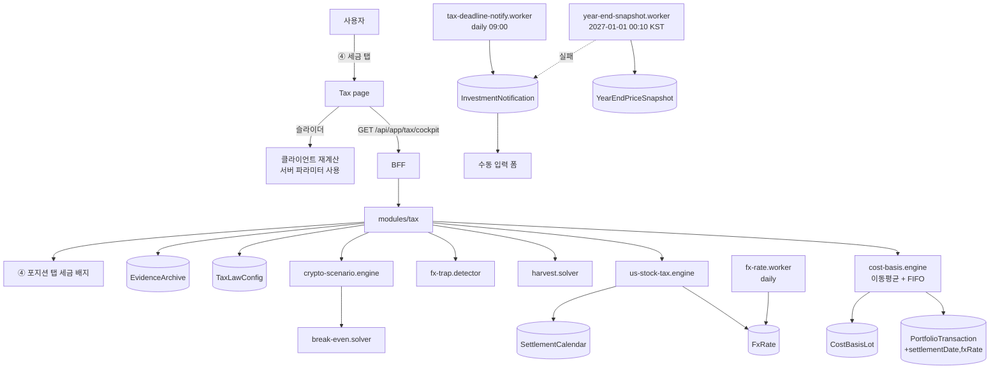

# FEATURE-002: 연말 세금 마감 콕핏 (Tax Deadline Cockpit)

## TL;DR

- **자산군 3개의 세금 규칙이 완전히 다르고, 그 차이 때문에 매년 연말에 실제로 돈이 샌다.** 이 기능은 그 구멍을 계산해서 막는다.
- **미국주식**: 연 250만원 기본공제 + 22%, 해외주식 전체 **손익통산(실현손실만)**. 귀속연도는 **결제일 기준(T+1)** → 2026년 귀속 마지막 매도는 **12/30(수) 매도 → 12/31 결제**, 실무 권고 **12/29까지**. **손실 수확 솔버**가 "250만원 공제에 정확히 맞추는 매도 조합"을 계산한다.
- **환율 함정**: 해외주식 원화 환산은 매수·매도 **각 결제일 기준환율**로 한다. **달러로는 손실인데 원화로 이익이 나서 세금이 나오는 경우가 실제로 있다.** 이걸 미리 계산해서 경고한다.
- **크립토**: 2027-01-01 시행(현행법). **2026-12-31까지 매도 차익은 비과세**, 안 팔면 취득가액이 `max(실제 취득가액, 2026-12-31 시가)`로 스텝업. 어느 쪽이 유리한지 **손익분기점**을 계산한다.
- **국내주식**: 소액주주 양도차익 **비과세** → 세금 계산 대상 아님. 대신 증권거래세(2026년 0.15%→0.20% 인상 예정)와 배당 15.4%, 금융소득 2,000만원 경계만 표시.
- 2026-09-08 기준 **미국주식 D-112(12/29) / 크립토 D-114(12/31)**.
- ⚠️ 세무 조언이 아니라 계산기다. 세율·공제·시행일·기준일·환율 소스가 전부 화면에 설정값으로 노출된다.

## 배경과 문제

### 미국주식 — 매년 반복되는, 그런데 매년 놓치는 것
- 연간 순이익 250만원까지 비과세, 초과분 22%(20% + 지방소득세 2%).
- 2019년 개정으로 **손익통산**이 허용됐다. 단 **통산에 들어가는 손실은 실현한 손실만**이다. 계좌에 평가손실로 앉아 있는 종목은 12/31까지 팔지 않으면 그해 계산에 안 들어온다.
- 예: 올해 실현차익 500만원 → 세금 55만원. 평가손실 300만원 종목을 연내 실현하면 통산 후 200만원 → 250만원 공제 안 → **세금 0원.**
- **그런데 귀속연도는 매도일이 아니라 결제일이다.** 미국주식은 2024-05부터 T+1. 2025년 사례로 보면 12/30(화) 매도 → 12/31(수) 결제가 마지막 기회였고, 12/31 매도는 결제가 다음 해로 넘어가 **다음 연도 귀속**이 됐다. 증권사별 처리 차이 때문에 실무 권고는 **12/29까지 마무리**.
- 신고는 다음 해 5/1~5/31(공휴일 시 6/1).
- **즉 1년에 딱 하루~이틀의 창이 있고, 놓치면 250만원 공제 한 해분과 손익통산 기회가 그대로 사라진다.**

### 미국주식 — 환율 함정
- 원화 환산은 매수·매도 **각 결제일 기준환율**을 쓴다. 실제 환전 여부·환전일과 무관하다.
- 그래서 **달러 기준 손실이어도 원화 기준 이익이면 과세된다.** 매수 시 환율이 낮고 매도 시 환율이 높으면 발생한다.
- 사용자가 이걸 알 방법이 지금 없다. 계산은 가능하다.

### 크립토 — 시한부 1회성 이벤트
- 세 차례 유예 끝에 **2027-01-01 시행**이 현행 소득세법. 22%, 연 250만원 공제, 분리과세.
- **2026-08-03 정부 확정 세제개편안에 유예안이 없었다.** 국회에서 재유예(1~3년 안 제출)·폐지 가능성은 남아 있다 → **법령 상태를 감시해야 하는 기능**이다.
- 취득가액은 이동평균법 또는 선입선출법.
- **의제취득가액**: 2027-01-01 전 보유분은 `max(실제 취득가액, 2026-12-31 시가)`(소득세법 시행령 §88②). 2026-12-31 시가는 원화마켓 취급 자산이면 2027-01-01 공시가 평균으로 산정.
- 결론 두 개: ① **2026-12-31까지 매도 차익은 비과세** ② **평가익 상태로 연말을 넘기면 취득가액이 스텝업된다.** 어느 쪽이 유리한지는 수량·평단·현재가·향후 매도시점·공제 배분의 함수 → 사람이 머리로 못 푸는데 코드는 푼다.
- 2027년 이후 취득가액 입증 책임은 납세자에게 온다. 실무 권고는 **2026년 안에 거래내역 CSV 확보·보관**.

### 국내주식 — 대상 아님을 명확히 하는 것도 기능
- 소액주주 상장주식 양도차익은 **비과세**(대주주는 종목당 50억 기준). 그래서 세금 콕핏의 계산 대상이 아니다.
- 대신 표시할 것: 증권거래세(2025-07-31 세제개편안에 따라 2026년 코스피/코스닥 0.15% → **0.20%** 인상 예정, 농특세 포함), 배당 15.4% 원천징수, **금융소득(이자+배당) 연 2,000만원 초과 시 종합과세** 경계.
- "국내주식은 세금 걱정 안 해도 된다"를 명시해주는 것만으로도 인지 부하가 줄어든다.

## 목표

1. 자산군별 마감 D-Day를 상시 노출한다. 특히 **결제일 기준**이라는 사실을 놓치지 않게 한다.
2. 미국주식에 대해 "250만원 공제를 정확히 다 쓰는 매도 조합"을 계산해 제시한다.
3. 환율 때문에 세금이 발생하는 종목을 미리 찾아 경고한다.
4. 크립토의 연내 매도 / 연말 스텝업 손익분기점을 계산한다.
5. 국내주식이 비과세임을 명확히 표시하고 거래세·배당·금융소득 경계만 알린다.
6. 2027년 이후 신고를 위한 증빙을 자동 보관한다.
7. 법령·세율·기준일·환율 소스를 전부 설정값으로 두어 개정에 대응한다.

## 사용자 시나리오

1. ④ 세금 탭. 상단에 자산군 3개의 D-Day 칩: `미국주식 D-112 (12/29 권고)` / `크립토 D-114 (12/31)` / `국내주식 비과세`.
2. **미국주식 카드**를 펼친다.
   - `2026년 실현차익 5,120,000원 / 기본공제 2,500,000원 / 과세표준 2,620,000원 / 예상 세금 576,400원`
   - **손실 수확 제안**: "평가손실 종목 3개를 연내 결제까지 실현하면 과세표준이 0이 됩니다."
     `NVDA −1,820,000 · TSLA −640,000 · PLTR −180,000 → 통산 후 2,480,000원 → 공제 내 → 세금 0원` **절세 576,400원**
   - 제안은 **조합 후보 3개**로 나온다(최소 매도 수량 / 최소 종목 수 / 공제를 정확히 채우는 조합). 어느 것도 "추천" 배지를 달지 않는다.
3. **환율 경고**: "AAPL은 달러 기준 −$420(−3.1%)이지만, 결제일 기준환율 환산 시 원화로 +180,000원 이익입니다. 손실 수확 대상이 아닙니다."
4. **크립토 카드**: `BTC 0.42개 / 평단 88,000,000 / 현재가 150,000,000 / 평가익 +26,040,000원`
   - 3열: `연내 매도 → 세금 0원` / `연말 보유(스텝업) → 미래 과세 기준 26,040,000원 감소 = 절세 5,728,800원` / `내년 매도(스텝업 후) → 연말시가 대비 차익만 과세`
   - **연말 시가 가정 슬라이더** (−40%~+80%) → 3열 실시간 재계산 + **손익분기 연말시가** 자동 표시.
5. **국내주식 카드**: "소액주주 양도차익 비과세. 계산 대상 아님." + 거래세 0.20% / 배당 15.4% / 금융소득 2,000만원 중 현재 1,240만원.
6. **증빙**: `업비트 2020–2026 ✅ / 한국투자증권 2022–2026 ✅ / 2026-12-31 크립토 시가 스냅샷 ⏳ 2027-01-01 00:10 예약` [ZIP 내려받기]
7. ① 홈 상단에 가장 임박한 D-Day 1줄이 항상 보인다.
8. 국회에서 2년 유예가 통과되면 설정에서 크립토 시행일을 2029-01-01로 바꾼다 → D-Day와 계산 전부 재산정.

## 기능 요구사항

### 공통
| ID | 요구사항 | 우선순위 | 상태 |
|---|---|---|---|
| FR-1 | **자산군별 D-Day**: 크립토(양도일 기준 `taxFreeDeadline`), 미국주식(**결제일 기준 마지막 매도 영업일** + 권고일), 국내주식(비과세 표시). 전부 설정값에서 계산, 하드코딩 금지 | Must | Draft |
| FR-2 | **영업일 캘린더**: 미국 시장 휴장일 + 국내 결제 처리일을 반영해 "연내 결제 가능한 마지막 매도일"을 계산. 캘린더는 설정 테이블로 관리(연 1회 갱신) | Must | Draft |
| FR-3 | **법령 상태 배지**: `lawStatus` — `enforced` / `under_review` / `deferred` / `repealed`. 상태 + 근거 일자 + 출처 링크. **자동 크롤링 금지, 사용자가 수동 갱신** | Must | Draft |
| FR-4 | **면책 문구**: 전 화면 하단 고정. 세율·공제·시행일·기준일·환율 소스를 화면에 노출 | Must | Draft |
| FR-5 | **증빙 아카이브**: import한 CSV 원본 암호화 보관, 연도별 거래 요약 생성, ZIP 다운로드. **2027-01-01 00:10 KST 크립토 시가 스냅샷 자동 수집** | Must | Draft |
| FR-6 | **D-Day 알림**: 자산군별 D-30/14/7/3/1에 각 1회 | Should | Draft |

### 미국주식
| ID | 요구사항 | 우선순위 | 상태 |
|---|---|---|---|
| FR-10 | **연간 실현손익 집계**: 결제일 기준으로 해당 과세연도 실현손익을 원화로 집계. 해외주식 전체 합산(미국 외 포함) | Must | Draft |
| FR-11 | **결제일 기준환율 환산**: 매수·매도 각 결제일 기준환율로 원화 환산. 환율은 `FxRate` 원장에서 조회, 결측 시 `degraded` | Must | Draft |
| FR-12 | **환율 함정 탐지**: 종목별로 `달러 손익 부호 ≠ 원화 손익 부호`인 경우를 찾아 경고. "달러 손실 / 원화 이익" 및 그 역 모두 | Must | Draft |
| FR-13 | **손실 수확 솔버**: 평가손실 보유 종목 집합에서 "과세표준을 0(또는 목표값)으로 만드는 매도 조합"을 계산. 후보 3개 — ① 최소 매도금액 ② 최소 종목 수 ③ 공제를 정확히 채우는 조합. **부분 매도 수량까지 산출** | Must | Draft |
| FR-14 | **솔버 제약 반영**: 각 종목의 매도 가능 수량, 결제 가능 마지막일, 그리고 **환율 환산 후 원화 손익**을 기준으로 계산(달러 손익 아님) | Must | Draft |
| FR-15 | **재매수 안내**: 손실 수확 후 동일 종목 재매수는 국내 세법상 wash sale 규정이 없다는 점을 **사실로만** 표시. 재매수 권유 문구 금지. 재매수 시 취득가액이 낮아져 미래 과세가 늘어난다는 점도 함께 표시 | Should | Draft |
| FR-16 | **분산 매도 시뮬레이션**: 큰 평가익을 여러 해에 걸쳐 250만원씩 실현하는 안. 연도별 세금 0원 유지 가능 수량 | Should | Draft |
| FR-17 | **신고 준비**: 홈택스 업로드용 양식에 맞춘 CSV 내보내기 (증권사 자료 변환) | Could | Draft |

### 크립토
| ID | 요구사항 | 우선순위 | 상태 |
|---|---|---|---|
| FR-20 | **취득가액 2방식 병기**: 이동평균법 / 선입선출법 각각의 취득가액·차익. **어느 쪽을 쓸지 SALT는 권고하지 않는다** | Must | Draft |
| FR-21 | **시나리오 3열**: ① 연내 매도(세금 0) ② 연말 보유 후 스텝업 ③ 내년 매도. 각 실현차익·과세표준·세금·세후금액 | Must | Draft |
| FR-22 | **연말 시가 가정 슬라이더**: −40%~+80%. 서버가 내려준 파라미터로 클라이언트 재계산(서버 왕복 없음) | Must | Draft |
| FR-23 | **손익분기 연말시가**: "연말 시가가 X원 이하면 연내 매도가 세후 유리" 임계값을 해석적으로 계산 | Must | Draft |
| FR-24 | **스텝업 절세액**: `max(0, 연말시가 − 실제취득가액) × 수량 × 22%`. 연말시가 < 취득가액이면 **0원**임을 명시 | Must | Draft |
| FR-25 | **250만원 공제 트래커**: 시행 후 연도별 예상 실현차익 대비 공제 소진 + 분산 매도 시뮬 | Should | Draft |

### 국내주식
| ID | 요구사항 | 우선순위 | 상태 |
|---|---|---|---|
| FR-30 | **비과세 명시**: 소액주주 양도차익 비과세. 대주주 기준(종목당 50억) 초과 여부를 보유금액으로 자체 점검해 경고 | Must | Draft |
| FR-31 | **증권거래세 표시**: 매도 시 거래세율(설정값, 2026년 0.20% 예정)로 예상 거래세 계산 | Should | Draft |
| FR-32 | **배당·금융소득 경계**: 연간 배당 합계 × 15.4% 원천징수액, 금융소득(이자+배당) 2,000만원 경계까지 남은 금액. 초과 시 종합과세 대상임을 표시 | Should | Draft |

## 비기능 요구사항

| 구분 | 요구사항 |
|---|---|
| 성능 | 콕핏 전체 조회 p95 < 600ms. 손실 수확 솔버(종목 50개 기준) < 500ms. 슬라이더는 클라이언트에서 60fps |
| 정확성 | 금액은 서버에서 `Decimal` 처리, 원 단위 정수로 응답. 절사 규칙을 설정값으로 명시(Open Question). 환율은 소수 4자리 |
| 접근성 | D-Day는 `aria-label`로 "미국주식 2026년 12월 29일까지 112일 남음". 슬라이더는 키보드 + 숫자 직접 입력 대체 수단. 3열 비교표는 모바일 세로 스택. 손익 부호는 색 + `+/−` 문자 |
| 보안 | 증빙은 애플리케이션 레벨 암호화. 다운로드는 5분 만료 서명 URL. **세금 금액을 애플리케이션 로그에 남기지 않는다** |
| 장애 처리 | 2026-12-31 크립토 시가 스냅샷 수집 실패는 치명적 — 10분 간격 6회 재시도, 전부 실패 시 즉시 알림 + 수동 입력 폼. 수집값은 수정 불가(감사 로그). 환율 결측은 해당 종목만 `degraded` 처리하고 나머지는 계산 |
| 관측성 | 스냅샷 수집 성공/실패, 솔버 실행 시간·후보 수, 환율 결측률, D-Day 알림 발송 |

## UX 상태

- **Loading**: D-Day는 클라이언트에서 즉시 계산해 먼저 렌더. 자산군 카드만 스켈레톤.
- **Empty (계좌 미연결)**: "거래내역을 연결하면 세금을 계산할 수 있습니다." → FEATURE-001 온보딩. D-Day는 그래도 보여준다.
- **Empty (보유 0건)**: D-Day + 증빙 아카이브만.
- **Warning (원장 불일치)**: FEATURE-001 `degraded` 연동 — "취득가액이 정확하지 않아 세금 계산도 부정확할 수 있습니다."
- **Warning (환율 결측)**: 해당 종목 행에 `환율 없음` 배지 + 계산 제외 표시.
- **Warning (D-14 이내)**: D-Day 카드 강조. **압박 문구 금지** — "서둘러 파세요" ❌ / "연내 결제 기준 마감일: 12/29" ⭕.
- **Warning (법령 `under_review`)**: "국회 논의 중입니다. 계산은 현행법 기준입니다."
- **Info (법령 `deferred`/`repealed`)**: 계산기를 끄지 않고 "시행일이 변경되어 D-Day를 재설정했습니다."
- **Error (스냅샷 실패)**: 최상단 적색 배너 + 수동 입력 폼 + 재시도.
- **Success**: D-Day 칩 3개 + 자산군 카드 3개 + 솔버 결과 + 증빙 상태.
- **Optimistic update**: 없음.

## 정책과 제약

- **세무 조언 아님.** 계산기 + 체크리스트. "절세 전략", "이렇게 하세요" 같은 지시형 문구 금지.
- **매도를 유도하지 않는다.** 솔버 후보와 3열 시나리오는 대칭 렌더, 추천 배지 없음.
- **법령 파라미터 전부 설정값**: 시행일, 세율, 지방소득세율, 기본공제, 의제취득가액 기준일, 결제 주기(T+N), 권고 마감일 버퍼, 거래세율, 배당 원천징수율, 금융소득 종합과세 기준액, 취득가액 산출법, 환율 소스.
- **법령 상태는 자동 판정하지 않는다.** 잘못된 "폐지됐습니다" 표시가 계산 오류보다 위험하다.
- **2026-12-31 시가 스냅샷은 1회성이고 되돌릴 수 없다.** 12월 중 드라이런으로 검증한다.
- 스테이킹/렌딩 소득, NFT, 해외 배당의 외국납부세액공제, 파생상품은 1차 범위 밖 → `unsupported[]`로 노출.

## 화면/프론트엔드 영향

| App | Route/Component | 변경 내용 |
|---|---|---|
| shell | `/tax` (④ 세금 탭) | 신규 route |
| shell | `components/Home` | 가장 임박한 D-Day 1줄 (FEATURE-005) |
| investments | `src/pages/tax/index.tsx` | 신규 |
| investments | `component/Tax/DeadlineChips` | 신규. 자산군 3개 D-Day 칩 |
| investments | `component/Tax/LawStatusBadge` | 신규 |
| investments | `component/Tax/UsStockTaxCard` | 신규. 실현손익·공제·과세표준·예상세금 |
| investments | `component/Tax/HarvestSolverPanel` | 신규. 후보 3개 + 종목별 매도 수량 |
| investments | `component/Tax/FxTrapWarning` | 신규. 달러/원화 손익 부호 불일치 경고 |
| investments | `component/Tax/CryptoTaxCard` | 신규. 취득가액 2방식 + 평가익 |
| investments | `component/Tax/ScenarioCompareTable` | 신규. 3열, 모바일 세로 스택 |
| investments | `component/Tax/YearEndPriceSlider` | 신규 |
| investments | `component/Tax/BreakEvenCallout` | 신규 |
| investments | `component/Tax/StepUpSavingCard` | 신규 |
| investments | `component/Tax/KrStockTaxCard` | 신규. 비과세 명시 + 거래세/배당/금융소득 경계 |
| investments | `component/Tax/DeductionTracker` | 신규 |
| investments | `component/Tax/EvidenceArchivePanel` | 신규 |
| investments | `component/Tax/DisclaimerFooter` | 신규 |
| investments | `hooks/api/tax/*` | 신규 |
| investments | `component/Position/HoldingRow` | 세금 배지 1줄 추가 (FR-30/FR-21) |

## BFF/API 영향

| Method | Path | Auth | Request | Response | Status |
|---|---|---|---|---|---|
| GET | `/api/app/tax/cockpit` | Y | `?taxYear=2026` | `TaxCockpitViewModel` | Draft |
| POST | `/api/app/tax/harvest-solve` | Y | `{ taxYear, targetTaxableBase?, maxSymbols?, lastSettlementDate }` | `{ candidates: HarvestCandidate[] }` | Draft |
| POST | `/api/app/tax/crypto-scenario` | Y | `{ symbol, quantity, yearEndPriceAssumption, costBasisMethod }` | `CryptoScenarioResult` | Draft |
| GET | `/api/app/tax/fx-trap` | Y | `?taxYear` | `{ items: FxTrapItem[] }` | Draft |
| GET | `/api/app/tax/archive` | Y | — | `{ files[], snapshotStatus, snapshotScheduledAt }` | Draft |
| POST | `/api/app/tax/archive/download` | Y | `{ years[], sources[] }` | `{ signedUrl, expiresAt }` | Draft |
| POST | `/api/app/tax/snapshot/manual` | Y | `{ prices: {symbol, price}[] }` | `{ accepted }` | Draft |
| GET/PATCH | `/api/app/tax/law-config` | Y | 자산군별 파라미터 | `{ recalculated: true }` | Draft |

### 서버 raw API

| Method | Path | 설명 |
|---|---|---|
| GET | `/api/tax/cockpit` | 자산군별 집계 + D-Day |
| POST | `/api/tax/harvest-solve` | 손실 수확 솔버 |
| POST | `/api/tax/crypto-scenario` | 크립토 3열 + 손익분기 |
| GET | `/api/tax/fx-trap` | 환율 부호 불일치 탐지 |
| GET | `/api/tax/cost-basis/:assetType/:symbol` | lot 단위 취득가액(이동평균/FIFO) |
| GET/PATCH | `/api/tax/law-config` | 법령 파라미터 |
| GET | `/api/tax/settlement-calendar` | 영업일/결제 캘린더 |
| POST | `/api/tax/snapshot/collect` | 시가 스냅샷 수집 |
| GET | `/api/tax/archive` · `POST /api/tax/archive/download` | 증빙 |

### 응답 계약

```ts
type TaxCockpitViewModel = {
  taxYear: number;
  computedAt: string;
  degraded: boolean;
  degradedReasons: string[];          // ["fx_missing", "ledger_mismatch"]
  unsupported: string[];              // ["staking_income", "nft"]

  deadlines: Array<{
    assetClass: "crypto" | "us_stock" | "kr_stock";
    label: string;                    // "미국주식 손실 수확"
    taxable: boolean;                 // kr_stock = false
    lastTradeDate: string | null;     // "2026-12-30"
    recommendedDate: string | null;   // "2026-12-29"
    settlementBasis: string | null;   // "결제일 기준 T+1"
    daysRemaining: number | null;
    note: string;
  }>;

  usStock: {
    realizedGainKrw: number;          // 결제일 기준 집계
    basicDeduction: number;           // 2500000
    taxableBase: number;
    estimatedTax: number;
    combinedRate: number;             // 0.22
    unrealizedLossKrw: number;        // 평가손실 총합(원화 환산)
    harvestPotentialTax: number;      // 최대 절세 가능액
    fxMissingSymbols: string[];
  } | null;

  crypto: {
    lawStatus: "enforced" | "under_review" | "deferred" | "repealed";
    effectiveFrom: string;            // "2027-01-01"
    taxFreeDeadline: string;          // "2026-12-31T23:59:59+09:00"
    deemedCostBasisDate: string;      // "2026-12-31"
    basisNote: string;                // "2026-08-03 세제개편안에 유예 미포함"
    sourceUrl: string;
    holdings: Array<{
      symbol: string;
      quantity: number;
      currentPrice: number;
      costBasis: {
        movingAverage: { unitCost: number; total: number; gain: number };
        fifo:          { unitCost: number; total: number; gain: number };
        selectedMethod: "movingAverage" | "fifo";
      };
      scenarios: {
        sellNow: ScenarioResult;              // taxFree: true
        holdThroughYearEnd: StepUpResult;
        sellNextYear: ScenarioResult;
      };
      breakEvenYearEndPrice: number | null;
      stepUpSaving: number;
    }>;
  } | null;

  krStock: {
    capitalGainTaxable: false;
    majorShareholderThreshold: number;   // 5000000000
    largestPositionValue: number;
    exceedsThreshold: boolean;
    transactionTaxRate: number;          // 0.0020 (설정값)
    estimatedTransactionTaxOnFullExit: number;
    dividendYtd: number;
    dividendWithholdingRate: number;     // 0.154
    financialIncomeYtd: number;
    financialIncomeThreshold: number;    // 20000000
    remainingToThreshold: number;
  } | null;

  archive: {
    files: Array<{ id: string; source: string; year: number; sizeBytes: number; storedAt: string }>;
    snapshotStatus: "scheduled" | "collected" | "failed" | "manual";
    snapshotScheduledAt: string;         // "2027-01-01T00:10:00+09:00"
  };

  lawConfigShown: Record<string, string | number>;   // 화면에 노출할 전제값
  disclaimer: string;
};

type HarvestCandidate = {
  strategy: "min_amount" | "min_symbols" | "exact_deduction";
  label: string;
  sells: Array<{
    symbol: string;
    quantity: number;                  // 부분 매도 수량
    priceUsd: number;
    realizedLossKrw: number;           // 결제일 환율 가정 환산
    fxAssumedRate: number;
  }>;
  taxableBaseAfter: number;
  estimatedTaxAfter: number;
  taxSaved: number;
  mustSellBy: string;                  // "2026-12-29"
  caveats: string[];                   // ["재매수 시 취득가액이 낮아져 미래 과세가 늘어납니다"]
};

type FxTrapItem = {
  symbol: string;
  pnlUsd: number;
  pnlKrw: number;
  signMismatch: true;
  buySettlementRate: number;
  assumedSellSettlementRate: number;
  message: string;
};

type ScenarioResult = {
  realizedGain: number; taxableBase: number; tax: number;
  netProceeds: number; taxFree: boolean; assumptions: string[];
};

type StepUpResult = {
  yearEndPriceAssumption: number; deemedCostBasis: number;
  stepUpAmount: number; futureTaxSaved: number; note: string;
};
```

## 서버/DB/Worker 영향

| Layer | 위치 | 영향 |
|---|---|---|
| Server | `modules/tax/` | **신규**. `tax.routes/controller/service`, `cost-basis.engine.ts`(이동평균 + FIFO lot), `us-stock-tax.engine.ts`(결제일 집계 + 환율 환산), `harvest.solver.ts`, `fx-trap.detector.ts`, `crypto-scenario.engine.ts`, `break-even.solver.ts`, `settlement-calendar.service.ts`, `law-config.service.ts`, `evidence-archive.service.ts` |
| Server | `modules/ledger` (FEATURE-001) | CSV 원본 보관을 아카이브로 위임. 결제일(`settlementDate`) 파싱 필수 |
| Server | `external/upbit` · `external/kis` | 일별 종가, 해외주식 시세 |
| Server | `external/fx` | **신규**. 결제일 기준환율 소스 |
| DB | `PortfolioTransaction` | `settlementDate DateTime?`, `currency String @default("KRW")`, `priceCurrency Float?`, `fxRate Float?` 추가. 기존 크립토 row는 `settlementDate = transactionDate` |
| DB | `AssetType` enum | `crypto`, `kr_stock`, `us_stock` 값 확정 (FEATURE-000에서 확장) |
| DB | `FxRate` | **신규** — `id, base("USD"), quote("KRW"), rateDate, rate, source, kind("settlement_base")` + `@@unique([base, quote, rateDate, kind])` |
| DB | `TaxLawConfig` | **신규** — `id, userId, assetClass, status, effectiveFrom, taxRate, localTaxRate, basicDeduction, deemedCostBasisDate, taxFreeDeadline, settlementLagDays, recommendedBufferDays, transactionTaxRate, dividendWithholdingRate, financialIncomeThreshold, basisNote, sourceUrl, updatedAt` + `@@unique([userId, assetClass])` |
| DB | `SettlementCalendar` | **신규** — `id, market("US"\|"KR"), date, isTradingDay, isSettlementDay` + `@@unique([market, date])` |
| DB | `CostBasisLot` | **신규** — `id, userId, assetType, symbol, acquiredAt, settlementDate, quantity, remainingQuantity, unitCost, unitCostKrw, fxRate, sourceTransactionId` + `@@index([userId, assetType, symbol, acquiredAt])` |
| DB | `YearEndPriceSnapshot` | **신규** — `id, assetType, symbol, snapshotDate, price, source, collectedAt, isManual` + `@@unique([symbol, snapshotDate])`. **수정 불가** |
| DB | `EvidenceArchive` | **신규** — `id, userId, source, kind, year, storagePath, cipherMeta Json, sizeBytes, storedAt` + `@@index([userId, year])` |
| DB | migration | `20260908_tax_cockpit` |
| Worker | `fx-rate.worker.ts` | **신규**. 일 1회 결제일 기준환율 수집·백필 |
| Worker | `year-end-snapshot.worker.ts` | **신규**. 2027-01-01 00:10 KST 단발. 10분 간격 6회 재시도. **12월 중 드라이런 검증** |
| Worker | `tax-deadline-notify.worker.ts` | **신규**. 일 1회 09:00 KST. 자산군별 D-30/14/7/3/1 각 1회(발송 기록으로 중복 방지) |

## 이벤트/상태 흐름



## Trace Matrix

| 요구사항 | 화면/컴포넌트 | BFF/API | 서버 | DB/Worker | 검증 |
|---|---|---|---|---|---|
| FR-1 | `DeadlineChips` | `deadlines[]` | `GET /api/tax/cockpit` | `TaxLawConfig` | 시행일 변경 시 재계산 |
| FR-2 | `DeadlineChips` 권고일 | `recommendedDate` | `settlement-calendar.service` | `SettlementCalendar` | 12/30 매도→12/31 결제 확인 |
| FR-3 | `LawStatusBadge` | `GET/PATCH law-config` | `law-config.service` | `TaxLawConfig` | 상태 4종 전환 |
| FR-4 | `DisclaimerFooter`, `lawConfigShown` | 동일 | 동일 | — | 전 화면 노출 |
| FR-5 | `EvidenceArchivePanel` | `archive*` | `evidence-archive.service` | `EvidenceArchive`, `YearEndPriceSnapshot` | 드라이런 성공 + ZIP 열림 |
| FR-6 | 알림 | `/api/app/alerts` | — | `tax-deadline-notify.worker` | D-30 정확히 1회 |
| FR-10 | `UsStockTaxCard` | `usStock` | `us-stock-tax.engine` | `settlementDate` | 12/31 매도가 다음 연도로 집계 |
| FR-11 | 동일 | `fxAssumedRate` | 동일 | `FxRate`, `fx-rate.worker` | 결제일 환율 적용 확인 |
| FR-12 | `FxTrapWarning` | `GET /api/app/tax/fx-trap` | `fx-trap.detector` | — | 달러손실/원화이익 케이스 검출 |
| FR-13 | `HarvestSolverPanel` | `POST harvest-solve` | `harvest.solver` | — | 후보 3개, 과세표준 0 달성 |
| FR-14 | 동일 | `mustSellBy` | 동일 | `SettlementCalendar` | 마감 이후 종목 제외 |
| FR-15 | `caveats` | 동일 | 동일 | — | 재매수 권유 문구 0건 |
| FR-16 | `DeductionTracker` | `usStock` | 동일 | — | 연도별 세금 0 유지 수량 |
| FR-20 | `CryptoTaxCard` | `costBasis` | `cost-basis.engine` | `CostBasisLot` | 두 방식 값이 다른 케이스 |
| FR-21 | `ScenarioCompareTable` | `POST crypto-scenario` | `crypto-scenario.engine` | — | 연내 매도 세금 0 |
| FR-22 | `YearEndPriceSlider` | 파라미터 | — | — | 클라 == 서버 원 단위 일치 |
| FR-23 | `BreakEvenCallout` | `breakEvenYearEndPrice` | `break-even.solver` | — | 임계값 ±1원 역전 |
| FR-24 | `StepUpSavingCard` | `stepUpSaving` | 동일 | — | 연말시가<취득가액 → 0원 |
| FR-25 | `DeductionTracker` | `crypto` | 동일 | — | 분산 매도 세금 감소 |
| FR-30 | `KrStockTaxCard` | `krStock` | 동일 | — | 비과세 문구 + 50억 초과 경고 |
| FR-31 | 동일 | `transactionTaxRate` | 동일 | `TaxLawConfig` | 0.20% 설정 반영 |
| FR-32 | 동일 | `financialIncomeYtd` | 동일 | — | 2,000만원 경계 계산 |

## 수용 기준

- [ ] 자산군 3개의 D-Day가 각각 정확히 계산된다. 미국주식은 **결제일 기준 마지막 매도 영업일(12/30)** 과 권고일(12/29)이 함께 표시된다.
- [ ] 12/31 매도 시뮬레이션이 **다음 과세연도**로 집계된다.
- [ ] 크립토 시행일을 2029-01-01로 바꾸면 D-Day와 3열 시나리오가 모두 재계산된다(하드코딩 0건).
- [ ] 미국주식 실현손익이 결제일 기준환율로 원화 환산되고, 환율 결측 종목은 `degraded`로 분리된다.
- [ ] **달러 손실 / 원화 이익** 케이스가 `FxTrapWarning`에 검출된다(합성 케이스 포함).
- [ ] 손실 수확 솔버가 후보 3개를 반환하고, `exact_deduction` 후보가 과세표준을 목표값 ±1원으로 맞춘다.
- [ ] 솔버 결과의 각 종목 매도 수량이 보유 수량을 초과하지 않는다.
- [ ] 솔버 `caveats`에 재매수 시 취득가액 하락 효과가 포함되고, 재매수 권유 문구가 없다.
- [ ] 크립토 연내 매도 시나리오의 세금이 **0원**이다.
- [ ] 이동평균법/선입선출법 취득가액이 각각 표시되고, 서로 다른 값이 나오는 케이스가 검증된다.
- [ ] 슬라이더 조작 시 서버 왕복 없이 3열이 갱신되고, 그 값이 서버 계산과 원 단위까지 일치한다.
- [ ] 연말시가 < 실제취득가액이면 `stepUpSaving = 0`이다.
- [ ] `breakEvenYearEndPrice` 전후 1원 차이로 유불리가 역전된다.
- [ ] 국내주식 카드가 "소액주주 비과세, 계산 대상 아님"을 명시하고, 최대 보유 종목이 50억을 넘으면 경고한다.
- [ ] 2026-12-31 크립토 시가 스냅샷 수집이 **12월 중 드라이런에서 성공**한다.
- [ ] `YearEndPriceSnapshot`은 한 번 수집되면 덮어쓰이지 않는다.
- [ ] 증빙 ZIP을 내려받아 열 수 있고, 소스·연도별 요약이 들어 있다.
- [ ] 모든 화면 하단에 면책 문구와 `lawConfigShown` 전제값이 보인다.
- [ ] "서둘러 파세요", "절세 전략", "추천" 배지가 없다(카피 리뷰 통과).
- [ ] 세금 금액이 애플리케이션 로그에 남지 않는다.

## 검증 계획

1. **취득가액 엔진**: 이동평균/FIFO 각각 — 단순 매수 / 부분 매도 후 재매수 / 전량 청산 후 재진입 / 동일일 다건 / **외화 매수 + 환율 변동**. 두 방식이 다른 값을 내는 케이스 필수.
2. **결제일 귀속**: 12/29·12/30·12/31 매도 3케이스에 대해 귀속 연도 분기 검증. 시스템 시간 고정.
3. **환율 함정**: 달러손실/원화이익, 달러이익/원화손실 양방향 합성 케이스.
4. **솔버**: 종목 5·20·50개 규모, 목표 과세표준 0 / 250만원 / 임의값. 보유 수량 초과 여부, 마감 이후 종목 제외, 실행 시간 측정.
5. **손익분기 solver**: 해석해 대비, 경계 ±1원.
6. **슬라이더 일치성**: 무작위 50개 가정치에서 클라 == 서버.
7. **스냅샷 드라이런**: 2026-12-01~12-20에 `--dry-run`으로 "전날 종가 수집"을 실제 실행. 결과를 `pm/requirements/reports/checklists/`에 기록.
8. **법령 시나리오**: `status` 4종 × 자산군 3종 조합에서 화면·계산 무결성.
9. **아카이브 보안**: 서명 URL 5분 만료, 만료 후 403, 암호화 저장 확인.
10. **카피 리뷰**: 세무 조언/매도 유도로 읽히는 문구 전수 검수.

## Open Questions

- **세액 절사 규칙** (과세표준·산출세액의 원/십원 단위). 국세청 기준 확인 필요. **FR-10/FR-21 착수 전 선결.**
- **결제일 기준환율의 정확한 소스**: 예규는 "결제일의 기준환율"이라 하는데, 실무상 어느 기관 고시 환율(서울외국환중개 매매기준율 등)을 쓰는지 확정 필요. 1차는 매매기준율로 하고 `source`에 명시. **정확도의 핵심 리스크.**
- **미국주식 결제 주기**: 미국 현지 T+1이지만 국내 증권사 처리·환전 반영 시점이 증권사마다 다르다. `settlementLagDays`를 증권사별 설정으로 둘지.
- **2026-12-31 크립토 시가 산정 방식**: "원화마켓 취급 자산은 2027-01-01 공시가 평균"을 어느 거래소 몇 곳, 어느 시점으로 구현할지. 1차는 업비트 2026-12-31 일봉 종가 + `source` 명시, 고시 확인 후 교체.
- **이동평균법/선입선출법 선택 변경 가능 여부** (세법상 제약).
- **250만원 기본공제가 가상자산 단독 공제인지, 다른 기타소득과 합산인지.**
- **해외주식 손익통산 범위**: 미국 외 해외주식·해외 ETF·해외 파생 포함 범위 확정.
- **국내주식 증권거래세 0.20%**가 최종 확정인지(세제개편안 → 국회 통과 여부).
- 대여(스테이킹/렌딩) 소득, 해외 배당 외국납부세액공제는 범위 밖. 언제 포함할지.
- 크립토 과세가 재유예/폐지되면 이 화면의 크립토 파트를 **"평생 취득가액 원장"** 으로 용도 변경할지.

## 변경 이력

| 날짜 | 변경 |
|---|---|
| 2026-09-08 | 초안 작성 (크립토 단독, D-114, 스텝업, 증빙) |
| 2026-09-08 | **국내주식/미국주식 추가.** 미국주식 손실 수확 솔버, 결제일 기준 귀속, 결제일 기준환율 환산 + 환율 함정 탐지, 국내주식 비과세 명시. 자산군별 D-Day/법령 파라미터 분리. FEATURE-003 → FEATURE-002 재번호 |
