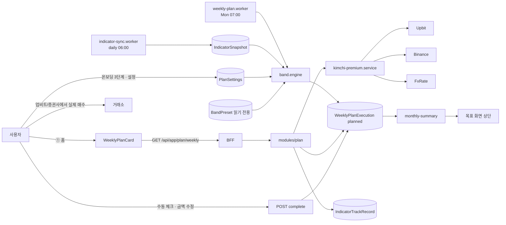

# FEATURE-003: 밸류에이션 밴드 적립 (이번 주 얼마)

> **2026-09-21 개정.** `ADR-002`(원장 · 청구서 · 세금 제거)와 스토리보드 갭 감사
> (`pm/requirements/reports/feature-audits/2026-09-21-storyboard-gap.md`)의 결정 D9와 기본안 B12 · B20을 반영했다.
> 실행 기록은 **수동 체크만**(원장 자동 매칭 삭제), 설정은 **월 적립액만 편집 · 밴드 임계값 읽기 전용**,
> 목표 화면 상단에 **이번 달 적립 합계**, 온보딩 3단계 적립액은 **실제로 저장**된다.

## TL;DR

- 화면에 숫자 하나. **"이번 주 BTC에 375,000원 / S&P500 ETF에 100,000원."** 그게 끝이다.
- 기본 적립액에 **밸류에이션 밴드 배수(0x ~ 3x)** 를 곱해서 나온다. BTC는 **MVRV Z-Score**, 미국주식은 **CAPE 백분위**.
- 김치 프리미엄은 **매수 비용**으로 차감해서 보여준다. "지금 원화로 사면 글로벌 대비 +1.2% 비싸게 사는 것."
- 지표의 **과거 실패 이력을 같은 화면에** 표시한다. 2025-10 사이클 톱에서 온체인 톱 지표들이 전부 실패했다는 사실을 숨기지 않는다.
- 근거: 파워로 1.25x 미만에서는 일시납이 DCA를 압도(저평가 구간 200%+ 초과), 초과 구간은 DCA 우위. 공포 구간에만 매수한 DCA가 2018~2025 1,145% vs buy&hold 1,046%. MVRV Z<0은 2011·2015·2018말·2022말 **모든 사이클 바닥**에서 진입. CAPE는 향후 장기 수익률과 강한 역상관이고 2026-09 현재 **40.6~41.0(1881년 이후 98.8 퍼센타일)**.

## 배경과 문제

- 1인 투자자가 매주 실제로 하는 결정은 "얼마 넣을까" 하나다. 그런데 기존 SALT에는 20,000종 코인 목록과 지표 차트가 있고 **이번 주 얼마를 넣으라는 숫자는 없다.**
- 지표 자체는 시장에 많다(LookIntoBitcoin MVRV, CryptoQuant, Shiller CAPE 데이터). 없는 건 **"그래서 내 통장에서 얼마"** 라는 환산이다.
- 기계적 정액 DCA는 안전하지만 저평가 구간에서 기회를 버린다. 일시납은 고평가 구간에서 위험하다. 리서치는 **레짐에 따라 최적 전략이 갈린다**고 말한다 — 파워로 1.25x가 교차점, 2010~2018 학습 / 2019~2026 검증에서 구조가 재현.
- 공포 구간 집중 매수의 초과 성과도 확인된다(fear-only DCA 1,145% vs 1,046%).
- **그러나 지표를 신뢰의 대상으로 만들면 안 된다.** 2025-10 톱($126,198)에서 주요 온체인 톱 지표 중 어느 것도 52% 조정 전에 깨끗한 매도 신호를 내지 못했다. 확신이 아니라 확률과 실패 이력으로 표현해야 한다.
- 김프는 한국 사용자만 쓸 수 있는 순수 비용 정보다. 2026-09-01 기준 업비트 BTC가 바이낸스 대비 약 1% 프리미엄으로 5월 초 이후 최장 연속. 프리미엄은 아시아 리테일 심리(=FOMO) 배로미터로 읽히고, 지속적 마이너스는 시장 바닥과 겹쳤다(2022-06 약 −4%).

## 목표

1. 매주 실행할 금액을 자산별로 **단일 숫자**로 제시한다.
2. 그 숫자가 왜 그렇게 나왔는지 한 줄로 설명한다(밴드 + 배수 + 기본액).
3. 김프를 원화 매수 비용으로 환산해 보여준다.
4. 지표를 신앙으로 만들지 않는다 — 밴드 표와 과거 실패 이력을 같은 화면에 둔다.
5. 실행 여부를 **사용자의 수동 체크로** 기록하고, 목표 화면 상단에 **이번 달 적립 합계**로 쌓는다. *(개정 2026-09-21 — FEATURE-001 청구서 대조는 ADR-002로 소멸)*

## 사용자 시나리오

0. 온보딩 3단계에서 `월 1,300,000원`을 입력하고 저장한다. 서버가 주간 기본액 합 300,000원으로 환산하고 **이번 주 계획이 바로 생긴다**(FR-18).
1. 월요일 아침. 홈 ② 블록(총자산 아래 — FEATURE-006 FR-10): **`이번 주 적립 475,000원`** / `BTC 375,000 · S&P500 ETF 100,000`.
2. 탭하면 근거가 펼쳐진다.
   - `BTC — 기본 125,000원 × 3.0배 = 375,000원`
   - `근거: MVRV Z −0.3 → 극단 저평가 밴드(Z < 0). 과거 4개 사이클 바닥이 이 구간에서 나왔습니다.`
   - `S&P500 — 기본 200,000원 × 0.5배 = 100,000원`
   - `근거: CAPE 40.6 → 98.8 퍼센타일. 1881년 이후 이보다 높았던 달은 20개월(1999–2000, 2026)뿐입니다.`
3. **김프 게이지**: `업비트 BTC vs 바이낸스 +1.2%` / `375,000원 중 약 4,500원이 프리미엄 비용입니다.`
4. **밴드 표**: 5개 밴드와 각 배수, 현재 위치가 표시된다.
5. **실패 이력** 아코디언: `2025-10 사이클 톱에서 이 지표는 매도 신호를 내지 못했습니다 (이후 −52%)` / `MVRV Z 바닥 신호: 2011·2015·2018·2022 4/4 적중`.
6. 업비트에서 실제로 매수한 뒤, 적립 상세에서 [이번 주 적립 완료] 를 누른다. 실제 금액이 다르면 고친다. *(개정 2026-09-21 — 원장 sync 자동 매칭 삭제, ADR-002)*
7. 다음 주 홈에는 `12주 연속 적립 중 · 누적 4,120,000원`이 표시된다.
8. 목표 화면을 열면 맨 위에 `이번 달 적립 1,900,000원 · 계획 2,000,000원 중 95% · 4일 남음`이 보이고, 그 아래 목표 카드는 그대로다(FR-19).
9. 설정 화면에서 월 적립액을 1,500,000원으로 바꾼다. 밴드 표는 보이지만 잠겨 있다 — "과거 적중률이 이 기본 밴드로 계산되어 바꾸지 않습니다"(FR-16).

## 기능 요구사항

| ID | 요구사항 | 우선순위 | 상태 |
|---|---|---|---|
| FR-1 | **기본 적립액 설정**: 사용자가 바꾸는 값은 **월 적립액 하나**다. 서버가 자산별 몫(기본 배분)과 주간 기본액으로 환산한다. 밴드 배수는 사용자가 설정하지 않는다. **개정 2026-09-21** — D9 | Must | Draft |
| FR-2 | **BTC 밴드 엔진 (MVRV Z)**: 5밴드 — `Z<0` 극단저평가 3.0x / `0≤Z<2` 저평가 2.0x / `2≤Z<5` 중립 1.0x / `5≤Z<7` 과열 0.5x / `Z≥7` 극단과열 0.0x + 부분 익절 안내. 임계값은 **코드 상수가 아닌 전역 프리셋(시드)** 이고 **사용자에게는 읽기 전용**이다. **개정 2026-09-21** — D9: 과거 적중률 · 실패 이력이 이 기본 밴드로 집계되므로 사용자별 임계값은 그 숫자를 거짓으로 만든다 | Must | Draft |
| FR-3 | **보조 지표 병기 (Puell Multiple)**: `Puell > 1`은 강세장 후반 신호로 병기. 배수 결정에는 쓰지 않고 표시만(단일 지표 과신 방지) | Should | Draft |
| FR-4 | **미국주식 밴드 엔진 (CAPE 백분위)**: 1881년 이후 백분위 기준 5밴드 — `<20p` 3.0x / `20~50p` 2.0x / `50~80p` 1.0x / `80~95p` 0.5x / `≥95p` 0.25x. **0x로 만들지 않는다** (지수 적립 중단은 장기 기회비용이 크므로 하한 유지) | Must | Draft |
| FR-5 | **주간 지시 숫자**: 자산별 `기본액 × 배수` 를 원 단위로 반올림(1,000원 단위). 총합 표시 | Must | Draft |
| FR-6 | **근거 한 줄**: 지표값 + 밴드명 + 과거 맥락 1문장. **LLM이 숫자를 만들지 않는다** — 계산값 주입, 문장만 생성 | Must | Draft |
| FR-7 | **김프 게이지**: 업비트 KRW-BTC vs 바이낸스 BTC-USDT(환율 환산) 프리미엄 %. 이번 주 적립액 중 프리미엄 비용 원화 환산 | Must | Draft |
| FR-8 | **김프 임계 표시**: `≥ +3%` 고비용 경고, `≤ −2%` 저비용 표시. 리테일 심리 배로미터라는 맥락 문장 병기 | Should | Draft |
| FR-9 | **밴드 표 노출**: 5밴드 × 배수 × 현재 위치를 항상 볼 수 있게 | Must | Draft |
| FR-10 | **실패 이력 필수 노출**: 지표별 `hits`/`misses` 기록을 하드코딩이 아닌 **데이터 테이블**로 관리하고, 배수 카드에 항상 링크. 최소 항목: MVRV Z 바닥 4/4, 2025-10 톱 실패 | Must | Draft |
| FR-11 | **적립 실행 기록**: [이번 주 적립 완료] **수동 체크만**. 자산별 실제 금액을 고칠 수 있고 기본값은 계획액. 연속 주차·누적액 표시. **개정 2026-09-21** — 원장 sync 자동 매칭 삭제(ADR-002 · **기본안 — 감사 문서 B20**). 보유 기록(`PortfolioTransaction`)을 보고 실행을 추정하지 않는다 | Must | Draft |
| FR-12 | **미실행 안내**: 실행하지 않은 주는 `skipped`로 기록. **비난 문구 없이** 사실만 — "3주 중 1주 미실행" | Must | Draft |
| FR-13 | ~~**FEATURE-001 연동**: 기계적 적립 트랙(Track B)의 스케줄을 이 기능의 실제 지시 이력으로 대체 가능하게(`?dcaSource=plan`)~~ **삭제 2026-09-21** — F001이 제품에서 빠졌다(ADR-002) | — | Removed |
| FR-14 | **지표 갱신 worker**: MVRV Z / Puell / CAPE / 김프를 일 1회 수집. 결측 시 마지막 값 carry-forward + `staleDays` 표시 | Must | Draft |
| FR-15 | **국내주식 제외 명시**: 국내주식은 밴드 적립 대상이 아님을 표시(적절한 공개 밸류에이션 지표 부재). Open Question으로 유지 | Should | Draft |

### 2026-09-21 추가 — 설정(D9) · 온보딩(B12) · 이번 달 적립 합계(B20)

설정 **화면**과 온보딩 **화면**은 FEATURE-006(FR-44 · FR-80~82)이 소유한다. 여기서는 데이터 · API · 검증을 정한다.

| ID | 요구사항 | 우선순위 | 상태 |
|---|---|---|---|
| FR-16 | **밴드 임계값 읽기 전용**: MVRV Z `0/2/5/7` · CAPE 백분위 `20/50/80/95`와 배수를 설정 화면에 **표로 보여 주되 편집하지 않는다.** 응답에 `editable: false` + 사유 코드. 밴드 키가 담긴 저장 요청은 422 `PLAN_BAND_READ_ONLY`로 거부한다(조용히 무시하지 않는다). 이유: **과거 적중률 · 실패 이력이 기본 밴드 기준** (D9) | Must | Draft |
| FR-17 | **월 → 주 환산**: 주간 기본액 = 자산별 월 몫 × 12 ÷ 52, 1,000원 단위 반올림. **서버 한 곳**에서만 환산한다. 검증: 정수 · 1,000원 단위 · 하한 10,000원 · 상한 100,000,000원(설정값) — 위반은 422 `PLAN_BASE_AMOUNT_INVALID` + `min`·`max` (D9) | Must | Draft |
| FR-18 | **온보딩 3단계 저장**: "월 얼마씩?"의 답을 `PATCH /api/app/plan/settings`로 **실제로 저장**한다(설정 화면과 같은 API). 첫 저장이면 **그 주 계획을 즉시 생성**한다 — 월요일 워커를 기다리면 온보딩 직후 홈 적립 블록이 빈다. 설정이 없으면 `GET /settings`는 200 `configured: false` (**기본안 — 감사 문서 B12**) | Must | Draft |
| FR-19 | **이번 달 적립 합계**: 목표 화면 상단에 `이번 달 적립 N원 · 계획 M원 중 P% · D일 남음`. 출처는 `WeeklyPlanExecution`의 `executed` 행, 귀속 달은 `weekOf`(KST 월요일)의 달. 금액 · 진행률 · 남은 일수 전부 **서버 집계**. 목표 카드 UI는 바꾸지 않고, 합계 실패가 목표 카드를 막지 않는다 (**기본안 — 감사 문서 B20** · 스토리보드 `goals` n1) | Must | Draft |

## 비기능 요구사항

| 구분 | 요구사항 |
|---|---|
| 성능 | 홈 위젯 응답 p95 < 250ms(지표는 일 1회 갱신이므로 전부 캐시 히트). 김프만 실시간(30초 캐시) |
| 접근성 | 배수 게이지는 색 + 밴드명 텍스트 동시 표기. 큰 금액은 `aria-label`로 "이번 주 적립 사십칠만 오천원". 밴드 표는 실제 `<table>` |
| 보안 | 외부 지표 소스 API 키는 서버 환경변수. 응답에 포함하지 않음 |
| 장애 처리 | 지표 결측 시 배수를 **1.0x(중립)로 폴백**하고 `staleDays`와 폴백 사실을 화면에 표시. 김프 실패 시 게이지만 숨김(적립 숫자는 유지) |
| 관측성 | 지표 수집 성공/실패, `staleDays` 분포, 주차별 실행/미실행 카운터 |

## UX 상태

- **Loading**: 금액 자리에 스켈레톤. 밴드 표는 정적이므로 즉시 렌더.
- **Empty (설정 없음)**: 온보딩 3단계 — "월 얼마씩 넣을 계획인가요?" 하나만 물어보고 **저장한다**. 주간 기본액은 저장 응답의 서버 값(FR-18).
- **Empty (이번 달 적립 0)**: 목표 화면 상단 `이번 달 적립 0원` — 비난 없이 사실만(FR-19).
- **Stale (지표 3일 이상 결측)**: 배수 배지에 `지표 3일 지연` + 중립 폴백 안내.
- **Warning (김프 ≥ +3%)**: 게이지 강조 + "원화 매수 비용이 평소보다 높습니다" (사실 서술, 지시 아님).
- **Warning (극단과열 0x)**: "이번 주 신규 적립 지시 없음" + 왜 그런지 밴드 설명. **매도 지시는 하지 않는다** — 부분 익절은 FEATURE-004 추천 카드에서 근거 3종과 함께.
- **Error (지표 소스 전체 실패)**: 기본액을 그대로 제시하고 "밴드 조정 없음(지표 조회 실패)" 표기.
- **Success**: 큰 금액 + 자산별 분해 + 근거 한 줄 + 김프 + 밴드 표 + 실패 이력 링크 + [적립 완료] 버튼.
- **Unauthorized**: 로그인.
- **Optimistic update**: [적립 완료] 체크만 낙관적 갱신 허용(금액 계산은 아님).

## 정책과 제약

- **적립 배수는 지시가 아니라 계획값이다.** 자동 매수하지 않는다.
- **지표 임계값·배수·기본액 전부 설정값.** 코드 상수 금지. 단 **사용자가 바꾸는 것은 기본액(월 적립액)뿐**이다 — 임계값 · 배수는 전역 프리셋이고 읽기 전용이다(D9). 프리셋을 운영자가 바꾸면 버전이 올라가고 적중률 재집계 대상이 된다.
- **실행 기록은 사용자의 수동 체크뿐이다.** 원장 · 거래 sync로 추정하지 않는다(ADR-002).
- **단일 지표로 0x를 만들지 않는다** — BTC의 `Z≥7` 0x는 유일한 예외이며, 이때도 매도 지시는 하지 않는다.
- **실패 이력 노출은 렌더 조건이다.** 실패 이력 데이터가 없으면 배수 카드를 렌더하지 않는다.
- 미국주식 밴드는 **지수/ETF 단위**만 적용한다. 개별 종목에 CAPE 밴드를 적용하지 않는다.
- 김프는 비용 정보로만 쓴다. "김프 차익거래" 안내는 하지 않는다(해외 송금·규제 이슈).

## 화면/프론트엔드 영향

| App | Route/Component | 변경 내용 |
|---|---|---|
| shell | `components/Home/WeeklyPlanCard` | 신규. 홈 ② 블록 큰 금액 카드 (FEATURE-006 FR-10 — 개정 2026-09-21) |
| investments | `component/Plan/WeeklyPlanDetail` | 신규. 자산별 분해 + 근거 |
| investments | `component/Plan/BandGauge` | 신규. 5밴드 + 현재 위치 |
| investments | `component/Plan/BandTable` | 신규 |
| investments | `component/Plan/KimchiPremiumGauge` | 신규 |
| investments | `component/Plan/IndicatorTrackRecord` | 신규. hits/misses 아코디언 |
| investments | `component/Plan/AccumulationStreak` | 신규. 연속 주차·누적액 |
| investments | `component/Plan/PlanSettingsForm` | 신규. **월 적립액 1필드 + 밴드 표 읽기 전용** (개정 2026-09-21 — D9). 설정 화면 · 온보딩 3단계(F006)가 조립 |
| goals | `entities/plan` `MonthlyAccumulationSummary` | **신규 2026-09-21** — 목표 화면 상단 이번 달 적립 합계 (B20) |
| investments | `hooks/api/plan/*` | 신규 |

## BFF/API 영향

| Method | Path | Auth | Request | Response | Status |
|---|---|---|---|---|---|
| GET | `/api/app/plan/weekly` | Y | — | `WeeklyPlanViewModel` | Draft |
| POST | `/api/app/plan/weekly/complete` | Y | `{ weekOf, executions: {symbol, amountKrw?}[] }` — 수동 체크만 | `{ streakWeeks, cumulativeKrw }` | Draft |
| GET | `/api/app/plan/settings` | Y | — | `PlanSettingsViewModel` (`configured` · `monthlyBaseKrw` · 자산별 주간 기본액 · 읽기 전용 밴드) | Draft |
| PATCH | `/api/app/plan/settings` | Y | `{ monthlyBaseKrw }` — **밴드 키 금지**. 온보딩 3단계와 공용 | `PlanSettingsViewModel` · 422 `PLAN_BASE_AMOUNT_INVALID` · 422 `PLAN_BAND_READ_ONLY` | Draft |
| GET | `/api/app/plan/monthly-summary` | Y | `?month=YYYY-MM` | `{ month, executedKrw, plannedKrw, monthlyBaseKrw, progressPct, executedWeeks, totalWeeks, daysLeft }` | Draft (2026-09-21) |
| GET | `/api/app/plan/indicators` | Y | — | `{ items: IndicatorState[], trackRecords[] }` | Draft |
| GET | `/api/app/plan/kimchi-premium` | Y | — | `{ premiumPct, upbitPrice, binancePriceKrw, fxRate, asOf }` | Draft |

### 서버 raw API
`GET /api/plan/weekly` · `POST /api/plan/weekly/complete` · `GET/PATCH /api/plan/settings` · `GET /api/plan/monthly-summary`(2026-09-21) · `GET /api/plan/indicators` · `GET /api/plan/kimchi-premium` · `GET /api/plan/track-record/:indicator`

```ts
type WeeklyPlanViewModel = {
  weekOf: string;                       // "2026-09-07" (월요일)
  totalKrw: number;
  items: Array<{
    symbol: string;                     // "KRW-BTC" | "US-VOO"
    assetType: "crypto" | "us_stock";
    weeklyBaseKrw: number;
    multiplier: number;                 // 0 ~ 3
    amountKrw: number;                  // 1,000원 단위 반올림
    band: { key: string; label: string; range: string };
    indicator: { name: string; value: number; percentile?: number; asOf: string; staleDays: number; fallback: boolean };
    secondaryIndicators: Array<{ name: string; value: number; note: string }>;
    reason: string;                     // 근거 한 줄
    trackRecordId: string;              // 실패 이력 참조 (필수)
  }>;
  kimchiPremium: { premiumPct: number; costKrwOnPlan: number; level: "low" | "normal" | "high"; note: string; asOf: string } | null;
  streak: { weeks: number; cumulativeKrw: number; skippedLast12: number };
  excluded: Array<{ assetType: "kr_stock"; reason: string }>;
  degraded: boolean;
  degradedReasons: string[];
};

type IndicatorState = { name: string; value: number; percentile?: number; asOf: string; staleDays: number; source: string };
type TrackRecord = {
  id: string; indicator: string;
  hits: Array<{ date: string; event: string }>;      // 2011/2015/2018/2022 바닥
  misses: Array<{ date: string; event: string; outcome: string }>; // 2025-10 톱 실패, 이후 −52%
  summary: string;
};
```

## 서버/DB/Worker 영향

| Layer | 위치 | 영향 |
|---|---|---|
| Server | `modules/plan/` | **신규**. `plan.routes/controller/service`, `band.engine.ts`, `kimchi-premium.service.ts` |
| Server | `external/onchain` | **신규**. MVRV Z / Puell 소스 |
| Server | `external/valuation` | **신규**. CAPE(Shiller 데이터) 소스 |
| Server | `external/binance` | **신규**. BTC-USDT 가격 (김프 계산) |
| Server | `external/fx` | 재사용 (USD/KRW) |
| DB | `PlanSettings` | **신규** — `id, userId, symbol, assetType, monthlyBaseKrw, weeklyBaseKrw, bandPresetKey, enabled` + `@@unique([userId, symbol])`. *(개정 2026-09-21 — 사용자별 `bandConfigJson` 제거, D9)* |
| DB | `BandPreset` | **신규 2026-09-21** — `id, indicator @unique, version, rowsJson`. 전역 시드, 사용자 쓰기 경로 없음 (D9) |
| DB | `IndicatorSnapshot` | **신규** — `id, indicator, value, percentile?, asOf, source, collectedAt` + `@@unique([indicator, asOf])`, `@@index([indicator, asOf])` |
| DB | `IndicatorTrackRecord` | **신규** — `id, indicator, hitsJson Json, missesJson Json, summary, updatedAt`. **시드로 관리**(MVRV 4/4 바닥, 2025-10 톱 실패) |
| DB | `WeeklyPlanExecution` | **신규** — `id, userId, weekOf, symbol, plannedKrw, executedKrw?, status("planned"\|"executed"\|"skipped"), bandPresetVersion, recordedAt` + `@@unique([userId, weekOf, symbol])`. *(개정 2026-09-21 — `matchedTransactionId` 제거, ADR-002 · B20)* |
| DB | migration | `20260908_plan_band` |
| Worker | `indicator-sync.worker.ts` | **신규**. 일 1회 06:00 KST. MVRV Z / Puell / CAPE 수집. 멱등(`@@unique(indicator, asOf)` upsert). 실패 시 3회 백오프 |
| Worker | `weekly-plan.worker.ts` | **신규**. 매주 월 07:00 KST. 그 주 `WeeklyPlanExecution` `planned` 생성. 이전 주 미실행분을 `skipped`로 마감 |

## 이벤트/상태 흐름



## Trace Matrix

| 요구사항 | 화면 | BFF/API | 서버 | DB/Worker | 검증 |
|---|---|---|---|---|---|
| FR-1 | `PlanSettingsForm` | `GET/PATCH /api/app/plan/settings` | `plan.service` | `PlanSettings` | 월 적립액 변경 → 다음 주 금액 변화 |
| FR-2 | `BandGauge` | `items[].multiplier` | `band.engine` | `IndicatorSnapshot` | Z 5구간 경계값 테스트 |
| FR-3 | `secondaryIndicators` | 동일 | 동일 | 동일 | Puell 표시만, 배수 미반영 |
| FR-4 | `BandGauge` | 동일 | 동일 | 동일 | CAPE 백분위 5구간, 하한 0.25x |
| FR-5 | `WeeklyPlanCard` | `totalKrw` | 동일 | — | 1,000원 단위 반올림 |
| FR-6 | 근거 텍스트 | `reason` | Gemini explainer | — | LLM 실패 시 규칙 기반 문장 폴백 |
| FR-7 | `KimchiPremiumGauge` | `kimchiPremium` | `kimchi-premium.service` | — | 프리미엄 손검산 |
| FR-8 | 동일 | `level` | 동일 | — | ±3% / −2% 경계 |
| FR-9 | `BandTable` | `band` | 동일 | `bandConfigJson` | 현재 위치 강조 |
| FR-10 | `IndicatorTrackRecord` | `trackRecordId` | 동일 | `IndicatorTrackRecord` | 이력 없으면 카드 렌더 안 됨 |
| FR-11 | `AccumulationStreak` | `POST complete` | 동일 | `WeeklyPlanExecution` | 수동 체크만 · 거래 기반 추정 0건 |
| FR-12 | 동일 | `skippedLast12` | `weekly-plan.worker` | 동일 | 비난 문구 0건 |
| FR-13 | — | — | — | — | 삭제 (ADR-002) |
| FR-14 | `staleDays` 배지 | `indicator` | `indicator-sync.worker` | `IndicatorSnapshot` | 3일 결측 → 중립 폴백 |
| FR-15 | `excluded` | 동일 | 동일 | — | 국내주식 제외 문구 |
| FR-16 | 설정 밴드 표 (F006 화면) | `GET/PATCH /settings` | `policy/band` · `BandPresetStore` | `BandPreset` | 입력 칸 0개 · 밴드 키 422 |
| FR-17 | `PlanSettingsForm` | `PATCH /settings` | `policy/baseAmount` | `PlanSettings` | 1,300,000 → 300,000 · 범위 422 |
| FR-18 | 온보딩 3단계 (F006 화면) | `PATCH /settings` | `UpdatePlanSettings` | `PlanSettings` · `WeeklyPlanExecution` | 저장 직후 `GET /weekly` 200 |
| FR-19 | `MonthlyAccumulationSummary` | `GET /monthly-summary` | `policy/monthlySummary` | `WeeklyPlanExecution` | `executed`만 합산 · 목표 카드 격리 |

## 수용 기준

- [ ] 홈에 이번 주 총 적립액과 자산별 금액이 1,000원 단위로 표시된다.
- [ ] MVRV Z 5구간 경계값(0 / 2 / 5 / 7)에서 배수가 정확히 전환된다.
- [ ] CAPE 백분위 5구간이 전환되고, 최저 배수가 0.25x 이상이다(0x 없음).
- [ ] 임계값·배수·기본액이 코드 상수가 아니다(하드코딩 0건). **월 적립액을 바꾸면 다음 주 계획부터 반영된다.** *(개정 2026-09-21)*
- [ ] **설정 화면에 밴드 임계값·배수 입력 칸이 0개이고, 밴드 키를 담은 저장 요청이 422 `PLAN_BAND_READ_ONLY`다** (D9)
- [ ] 월 1,300,000원 → 주간 기본액 합 300,000원 (×12÷52, 1,000원 반올림). 1,000원 단위·범위 위반은 422 (D9)
- [ ] **온보딩 3단계 저장 직후 홈 ② 블록에 이번 주 적립이 나온다** (B12)
- [ ] 목표 화면 상단에 이번 달 적립 합계가 서버 값으로 나오고, 합계 실패가 목표 카드를 막지 않는다 (B20)
- [ ] **실패 이력 데이터가 없으면 배수 카드가 렌더되지 않는다.**
- [ ] 실패 이력에 `2025-10 톱 미검출(이후 −52%)`과 `MVRV Z 바닥 4/4`가 포함된다.
- [ ] 김프 게이지가 프리미엄 %와 이번 주 적립액 중 프리미엄 비용을 원화로 표시한다.
- [ ] 지표 3일 이상 결측 시 배수가 1.0x로 폴백되고 화면에 지연·폴백이 표시된다.
- [ ] 지표 소스 전체 실패 시에도 기본액이 제시된다(화면이 비지 않는다).
- [ ] ~~원장 sync 후 이번 주 매수가 자동 매칭된다~~ → **실행 기록이 수동 체크로만 바뀌고, 거래 · 원장 기반 자동 매칭 경로가 0건이다.** *(개정 2026-09-21 — ADR-002 · B20)*
- [ ] 미실행 주가 `skipped`로 기록되고, 비난 문구 없이 사실만 표시된다.
- [ ] `indicator-sync.worker`를 같은 날 3회 실행해도 스냅샷이 1건이다.
- [ ] 국내주식이 밴드 적립 대상에서 제외됨이 명시된다.
- [ ] 극단과열(0x) 상태에서 **매도 지시 문구가 없다.**

## 검증 계획

1. **밴드 엔진 단위테스트**: MVRV Z / CAPE 백분위 경계값 각 5개 + 경계 ±0.01.
2. **폴백**: 지표 결측 0/1/3/7일 케이스, 소스 전체 실패.
3. **김프**: 업비트/바이낸스/환율 목업으로 프리미엄 계산 검증. 환율 결측 시 게이지만 숨김.
4. **멱등성**: `indicator-sync.worker`, `weekly-plan.worker` 각 3회 실행.
5. ~~매칭~~ **주차 · 월 귀속**: 주간 윈도우 경계(일요일 23:59 / 월요일 00:01)의 귀속 주차, 월 경계 주(예: 8/31 월요일)의 이번 달 합계 귀속. *(개정 2026-09-21)*
6. **실패 이력 게이트**: `IndicatorTrackRecord` 삭제 후 카드가 렌더되지 않는지.
7. **백테스트 참고 계산**(구현 검증 아님, 문서용): MVRV 밴드 적립 vs 정액 DCA를 보유 `PriceHistory`로 재현해 `pm/requirements/reports/`에 기록. **UI에 "이 전략이 우월하다"로 표시하지 않는다.**
8. **카피 리뷰**: 지시형·확신 표현 검수.

## Open Questions

- **MVRV Z / Puell / CAPE 데이터 소스**를 무엇으로 할지(무료 API 가용성, 라이선스, 갱신 지연). 유료가 필요하면 대체 지표(200일선 편차, 파워로 배수)로 갈지.
- **파워로 1.25x 레짐**을 배수 결정에 넣을지, MVRV Z만 쓸지. 리서치는 파워로 교차점을 제시하지만 파워로 모델 자체가 논쟁적이다.
- 김프 계산의 바이낸스 가격을 USDT 기준으로 할 때 **USDT/USD 디페그**를 어떻게 처리할지.
- 국내주식용 밸류에이션 지표(코스피 PBR? 배당수익률 스프레드?)를 정할지, 계속 제외할지.
- 주간이 아니라 격주/월간 적립을 원하는 경우의 주기 설정.
- **이번 달 합계 귀속 기준**: `weekOf` 기준(기본안)이면 월 경계 주 전체가 앞 달로 간다. `recordedAt` 기준이면 늦은 체크가 다음 달로 간다. — 2026-09-21
- **기본 배분(BTC : S&P500 ETF)** 을 몇으로 둘지, 사용자가 배분을 바꿀 수 있게 할지. D9는 "기본액만 편집"이라 배분 편집은 범위 밖으로 둔다. — 2026-09-21
- **환산식 불일치**: 스토리보드(`settings` · `onboarding`)는 월 1,300,000원 → 주간 325,000원(÷4)이다. 이 기획서는 ×12÷52(300,000원) — ÷4는 연간 적립이 월 계획보다 약 8% 많아진다. 스토리보드 숫자를 고칠지 확인 필요. — 2026-09-21
- **주간 적립 전용 푸시가 없다**(D5 · B21 — 알림 1종). 밴드가 바뀐 주만 `signal_update`로 알림이 가고, 그 외 월요일에는 사용자가 앱을 열어야 한다. — 2026-09-21
- 기본액 하한 · 상한(10,000원 · 100,000,000원)은 제안값이다. — 2026-09-21
- `Z≥7` 0x 상태가 장기간 이어질 때 적립 자체가 멈추는데, 그때 현금을 어디에 둘지 안내할지(예금/MMF 언급은 금융상품 추천 여지 → 하지 않는 방향).

## 변경 이력

| 날짜 | 변경 |
|---|---|
| 2026-09-08 | 초안 작성. MVRV Z / CAPE 5밴드, 김프 비용 환산, 실패 이력 렌더 게이트, 주간 실행 기록 |
| 2026-09-21 | **스토리보드 갭 감사 + ADR-002 반영.** 근거: `pm/requirements/reports/feature-audits/2026-09-21-storyboard-gap.md`. 개정: FR-1 · FR-2(월 적립액만 편집 · 밴드 읽기 전용, D9) · FR-11(수동 체크만, ADR-002 · B20) · 목표 5 · 시나리오 · 정책 · BFF/DB 표 · 흐름도. 삭제: FR-13(F001 연동). 추가: FR-16(밴드 읽기 전용) · FR-17(월→주 환산 · 검증) · FR-18(온보딩 3단계 저장, B12) · FR-19(이번 달 적립 합계, B20). 영역 REQ `DB-013`~`016` · `SRV-020`~`023` · `BFF-019`~`022` · `FE-022`~`025` · `RN-016`~`019` 동기화 |
