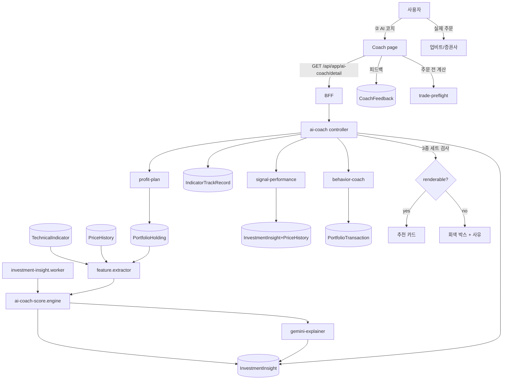

# FEATURE-004: AI 코치 추천 화면 (매수·매도 타이밍)

## TL;DR

- **서버에는 이미 다 있는데 화면이 없어서 0원인 기능들을 화면으로 만든다.** `ai-coach`(점수 엔진 468줄 + Gemini explainer), `signal-performance`, `profit-plan`, `trade-preflight`, `behavior-coach` 전부 `Backend Only` 상태다.
- 핵심 화면은 **추천 카드 1개**: `KRW-BTC 매수 · 점수 72` + **근거** + **이 유형 신호의 과거 적중률** + **틀렸던 사례**.
- 글로벌 플랜 1-3절에 따라 **이 3종이 없으면 카드를 렌더하지 않는다.** 컴포넌트 레벨 강제.
- 매도 쪽은 `profit-plan`의 손절/1차 익절/추세유지 3단계를 보유 종목별로 가격으로 보여준다. 목표주가·수익률 예측은 하지 않는다.
- 신호 성적표(`signal-performance`)를 별도 섹션으로 노출한다 — **코치가 자기 점수를 공개하는 것이 신뢰의 유일한 근거**다.

## 배경과 문제

- `pm/features/current-feature-map.md`: AI 투자 코치 = `Backend/BFF Only`, "PM prototype 있음, 실제 투자 앱 UI 미연결". 외부 주문 전 체크·행동 코치·익절 플랜·신호 성과도 전부 동일.
- 즉 **제품의 핵심이 구현돼 있는데 사용자가 볼 수 없다.** 사용자 요구는 "쉽게 투자 잘하는 추천 조언 플랫폼"이고, 그 엔진은 이미 있다.
- 서버 계약(`ai-coach.types.ts`)이 이미 화면에 필요한 것을 다 담고 있다: `recommendation{action,symbol,score}`, `candidates[]`, `market.regime`, `portfolio`, `reasons[]`, `risks[]`, `actions[]`, `debug.topCandidateFactors[]`.
- 리테일 신호 서비스의 문제는 **자기 성적을 공개하지 않는 것**이다. SALT는 `signal-performance`(sample/winRate/avgReturn/maxDrawdown)를 이미 계산한다. 이걸 카드에 붙이면 다른 서비스가 못 하는 걸 한다.
- 리서치 맥락: 리테일 손실의 원인은 정보 부족이 아니라 행동이다(74~89% 손실, FOMO 44%). 그래서 추천에 **표본 수와 실패 이력**을 붙이는 것이 추천의 정확도를 높이는 것보다 중요하다.

## 목표

1. 홈과 코치 탭에서 **"지금 뭘 해야 하는지"** 를 카드 1개로 보여준다.
2. 모든 추천에 근거·적중률·실패사례를 강제로 붙인다.
3. 보유 종목별 손절/익절 가격을 한눈에 보여준다.
4. 코치의 성적표를 숨기지 않는다.
5. 추천에 대한 피드백을 받아(`/api/ai-coach/feedback`) 개선 루프를 만든다.

## 사용자 시나리오

1. ② AI 코치 탭. 최상단 **추천 카드**:
   - `매수 · KRW-BTC · 점수 72 / 100`
   - `왜: MVRV Z −0.3(과거 4개 사이클 바닥 구간) · RSI 28(과매도) · 현재 비중 34%(상한 60% 이내) · 시장 레짐 accumulation`
   - `이 유형 신호 성적: 최근 42회 · 승률 57% · 평균 +3.1% · 최대낙폭 −11%`
   - `틀렸던 때: 2025-10 사이클 톱에서 이 지표군은 매도 신호를 내지 못했습니다(이후 −52%)`
   - `[근거 자세히]` `[도움 안 됨]`
2. **리스크 섹션**: `risks[]`를 심각도 순으로. "BTC 비중이 62%로 상한 초과", "24시간 내 거래 4건".
3. **후보 목록**: `candidates[]`를 점수 순으로 3개까지. 각각 접힌 근거.
4. **매도 쪽**: 보유 종목별 3단계 가격 카드 — `손실 제한 132,000,000 / 1차 익절 168,000,000 / 추세 유지 조건`. 현재가 대비 거리 %.
5. **주문 전 계산**(기존 `trade-preflight`): 금액을 넣으면 진입 후 비중·최대손실·손익비를 보여준다. **게이트·차단 없음.** 계산 표시만.
6. **신호 성적표**: 신호 유형별 표 — 표본/승률/평균수익/최대낙폭. 표본 20건 미만은 `표본 부족` 배지.
7. **행동 기록**: `behavior-coach` 결과를 사실 서술로. "최근 30일 매도 3건 후 90일 내 가격 회복 → 합계 −890,000원" → FEATURE-001 청구서로 이동.
8. 코치 성향 설정: `riskTolerance`, `maxSingleAssetWeight`, `rebalanceBand`, `panicSellWindowHours` (기존 `UserInvestmentProfile`).

## 기능 요구사항

| ID | 요구사항 | 우선순위 | 상태 |
|---|---|---|---|
| FR-1 | **추천 카드**: `recommendation`을 action/symbol/score로 렌더. action 4종(`buy`/`sell`/`hold`/`rebalance`) 시각 구분 | Must | Draft |
| FR-2 | **3종 세트 강제**: 근거(`reasons` + `debug.topCandidateFactors`), 적중률(`signal-performance`), 실패사례(`IndicatorTrackRecord`) 중 **하나라도 없으면 카드를 렌더하지 않고** 대체 문구 표시 | Must | Draft |
| FR-3 | **리스크 섹션**: `risks[]`를 `severity` 내림차순. 자산별 필터 | Must | Draft |
| FR-4 | **후보 목록**: `candidates[]` 상위 3개, 각 접힌 근거 | Must | Draft |
| FR-5 | **점수 해석 안내**: 점수가 확률이 아님을 명시. "72점은 72% 확률이 아닙니다" | Must | Draft |
| FR-6 | **매도 3단계 카드**: `profit-plan`의 손실제한/1차익절/추세유지를 보유 종목별 가격 + 현재가 대비 거리 | Must | Draft |
| FR-7 | **주문 전 계산**: `trade-preflight` 결과 표시(진입 후 비중, 상한 초과 여부, 최대손실, 손익비, 잔여 현금). **게이트 없음** | Must | Draft |
| FR-8 | **신호 성적표**: `signal-performance`를 신호 유형별 표로. `sample < 20`이면 `표본 부족` 배지 + 승률 회색 처리 | Must | Draft |
| FR-9 | **행동 기록 요약**: `behavior-coach` 결과를 사실 서술 문장으로 변환. 인격 평가·라벨 노출 금지 | Must | Draft |
| FR-10 | **LLM 해설**: 기존 `ai-coach-gemini-explainer`로 카드 해설 생성. **숫자는 주입, 문장만 생성.** 실패 시 규칙 기반 문장 폴백(`ai-coach-explainer.ts` 재사용) | Must | Draft |
| FR-11 | **피드백**: `[도움 안 됨]` / `[도움 됐음]` → `POST /api/ai-coach/feedback`. 사유 선택(근거 부족 / 이미 알고 있음 / 틀린 것 같음 / 실행 불가) | Should | Draft |
| FR-12 | **성향 설정**: `UserInvestmentProfile` 편집 화면. `defaultMode`/`notificationLevel`은 현재 Prisma 영속 필드가 없어 `unsupportedPersistedFields`로 응답되므로 **UI에서 숨긴다**(또는 FEATURE-000에서 컬럼 추가) | Must | Draft |
| FR-13 | **자산군 확장**: 크립토 외 미국주식 추천을 지원. **개별 미국 주식 신규 매수 추천은 하지 않고**, 보유 종목의 비중·손절·세금과 지수/ETF 단위 적립만(1-3절) | Must | Draft |
| FR-14 | **국내주식 범위**: 추천 대상에서 제외(실시간 데이터·지표 부재). 보유 표시와 비중 경고만 | Should | Draft |
| FR-15 | **생성 트리거**: 기존 `POST /api/ai-coach/generate` + `investment-insight.worker`. 화면에서는 최신 결과를 읽고, 수동 새로고침 시 재생성(쿨다운 5분) | Must | Draft |
| FR-16 | **면책 배너**: 카드 하단 고정 — "투자 판단과 손실 책임은 본인에게 있습니다" | Must | Draft |

## 비기능 요구사항

| 구분 | 요구사항 |
|---|---|
| 성능 | 코치 탭 첫 페인트 < 400ms(최신 insight 읽기). 수동 재생성은 비동기 + 진행 표시, p95 < 6s(LLM 포함). LLM 해설은 생성 시 1회 캐시 |
| 접근성 | action은 색 + 텍스트 + 아이콘 3중 표기. 점수는 `aria-label`로 "100점 중 72점". 3단계 가격 카드는 `<table>` 또는 `<dl>`. 접힌 근거는 `<details>` |
| 보안 | LLM 프롬프트에 계좌 식별자·API 키를 넣지 않는다. 금액은 필요한 범위만. 프롬프트/응답을 원문 로깅하지 않는다 |
| 장애 처리 | LLM 실패 → 규칙 기반 문장. `signal-performance` 실패 → **카드 렌더 중단**(FR-2). insight 결측 → "아직 생성된 추천이 없습니다" + [생성] 버튼 |
| 관측성 | 카드 렌더/미렌더(사유별) 카운터, LLM 성공률·지연, 피드백 분포, 재생성 호출 수 |

## UX 상태

- **Loading**: 카드 스켈레톤. 최신 insight가 있으면 먼저 렌더하고 `생성 시각` 표시.
- **Empty (insight 없음)**: "아직 추천이 없습니다. 거래내역을 연결하면 코치가 판단할 수 있습니다." + [생성] / FEATURE-001 온보딩 링크.
- **Empty (보유 0건)**: 매도 3단계 카드 대신 "보유 종목이 없습니다".
- **Blocked (FR-2 미충족)**: 카드 대신 회색 박스 — "이 신호의 과거 성적 데이터가 아직 없어 추천을 표시하지 않습니다(표본 N건)". **이게 정상 동작임을 명시.**
- **Stale**: 생성 후 24시간 경과 시 `생성 후 27시간 경과` 배지 + [새로 생성].
- **Cooldown**: 재생성 5분 쿨다운 중이면 버튼 비활성 + 남은 시간.
- **Degraded (LLM 실패)**: 규칙 기반 문장 + `해설 생성 실패, 규칙 기반 설명` 배지.
- **Error**: 마지막 성공 insight + 재시도.
- **Unauthorized**: 로그인.
- **Optimistic update**: 피드백 버튼만.

## 정책과 제약

- **1-3절 3종 세트는 렌더 조건이다.** 우회 플래그를 만들지 않는다.
- **확신 표현 금지**: "확실", "무조건", "보장", "100%". 점수·표본·승률로만.
- **목표주가·수익률 예측 금지.** 가격은 내 규칙 기반(손절/익절)만.
- **점수는 확률이 아니다**를 화면에 명시(FR-5).
- **개별 미국 주식 신규 매수 추천 금지**(1-3절). 지수/ETF 단위 + 보유 종목 관리만.
- **주문 실행·자동매매 없음.** `trade-preflight`는 계산 표시 전용.
- 면책 배너 상시 노출.

## 화면/프론트엔드 영향

| App | Route/Component | 변경 내용 |
|---|---|---|
| shell | `/coach` (② AI 코치 탭) | 신규 route |
| shell | `components/Home/CoachHighlightCard` | 신규. 홈에 추천 1개 요약 (FEATURE-005) |
| investments | `src/pages/coach/index.tsx` | 신규 |
| investments | `component/Coach/RecommendationCard` | 신규. action/symbol/score + 3종 세트. **3종 미충족 시 렌더 중단 로직 포함** |
| investments | `component/Coach/ReasonList` | 신규. `reasons` + `topCandidateFactors` |
| investments | `component/Coach/SignalTrackRecordBadge` | 신규. 표본/승률/평균/MDD |
| investments | `component/Coach/FailureCaseAccordion` | 신규. 지표 실패 이력 |
| investments | `component/Coach/RiskList` | 신규 |
| investments | `component/Coach/CandidateList` | 신규 |
| investments | `component/Coach/ExitPlanCard` | 신규. 손절/1차익절/추세유지 3단계 |
| investments | `component/Coach/PreflightCalculator` | 신규. 게이트 없는 계산기 |
| investments | `component/Coach/SignalScoreboard` | 신규. 신호 성적표 표 |
| investments | `component/Coach/BehaviorFactRow` | 신규. 사실 서술 + 청구서 링크 |
| investments | `component/Coach/CoachProfileForm` | 신규. `UserInvestmentProfile` |
| investments | `component/Coach/FeedbackButtons` | 신규 |
| investments | `component/Coach/DisclaimerBanner` | 신규 |
| investments | `hooks/api/coach/*` | 신규 |
| pm | `pm/prototype/src/App.jsx` | 기존 프로토타입을 이 화면 계약으로 정리(참조 구현) |

## BFF/API 영향

기존 BFF 라우트가 이미 존재한다. **신규 없이 화면 계약만 확정**하는 것이 원칙이고, 부족한 것만 추가한다.

| Method | Path | Auth | 상태 |
|---|---|---|---|
| GET | `/api/app/ai-coach/preview` | Y | **기존** — 홈 요약용 |
| GET | `/api/app/ai-coach/detail` | Y | **기존** — 코치 탭 전체. `signalTrackRecord`, `failureCases` 필드 **추가 필요** |
| GET/PATCH | `/api/app/ai-coach/profile` | Y | **기존** |
| POST | `/api/app/ai-coach/feedback` | Y | **기존** — `reasonCode` 추가 |
| POST | `/api/app/ai-coach/explain` | Y | **기존** |
| POST | `/api/app/ai-coach/generate` (proxy) | Y | **기존** — 쿨다운 5분 추가 |
| GET | `/api/app/profit-plan` | Y | **기존** — `distanceFromCurrentPct` 추가 |
| GET | `/api/app/signal-performance` | Y | **기존** — 신호 유형별 그룹 추가 |
| POST | `/api/app/trade-preflight` | Y | **기존** |
| GET | `/api/app/behavior-coach` | Y | **기존** — 사실 서술 문장 필드 추가 |

### 추가 필드 계약

```ts
// GET /api/app/ai-coach/detail 확장
type CoachDetailViewModel = {
  generatedAt: string;
  staleHours: number;
  regime: string;                        // market.regime
  recommendation: {
    action: "buy" | "sell" | "hold" | "rebalance";
    symbol: string;
    assetType: "crypto" | "us_stock";
    score: number;                       // 0~100
    scoreNote: string;                   // "점수는 확률이 아닙니다"
    renderable: boolean;                 // FR-2 게이트 결과
    blockedReason: string | null;        // "signal_track_record_missing"
    reasons: Array<{ type: string; message: string; value?: number | string | null }>;
    topFactors: Array<{ key: string; score: number; message: string }>;
    signalTrackRecord: {
      signalType: string; sample: number; winRate: number;
      avgReturn: number; maxDrawdown: number; lowSample: boolean;
    } | null;
    failureCases: Array<{ date: string; event: string; outcome: string }>;
    explanation: { text: string; source: "llm" | "rule" };
  } | null;
  risks: Array<{ type: string; symbol?: string; message: string; severity: number }>;
  candidates: Array<{ action: string; symbol: string; score: number; reasons: string[] }>;
  exitPlans: Array<{
    symbol: string; currentPrice: number;
    stopLoss: { price: number; distancePct: number };
    firstTakeProfit: { price: number; distancePct: number };
    trendHold: { condition: string };
  }>;
  behaviorFacts: Array<{ message: string; amountKrw: number | null; invoiceLink: string | null }>;
  excluded: Array<{ assetType: "kr_stock"; reason: string }>;
  disclaimer: string;
};
```

## 서버/DB/Worker 영향

| Layer | 위치 | 영향 |
|---|---|---|
| Server | `modules/investment-insight/ai-coach` | **유지.** `ai-coach.types.ts`의 `CoachPayload`에 `assetType` 추가. `signalTrackRecord`/`failureCases` 조립을 controller에서 수행 |
| Server | `modules/signal-performance` | 신호 유형별 그룹 응답 추가(`groupBy=signalType`) |
| Server | `modules/profit-plan` | `distanceFromCurrentPct` 추가 |
| Server | `modules/behavior-coach` | 사실 서술 문장 생성(`factMessage`) 추가. 인격 평가 문구 제거 |
| Server | `modules/trade-preflight` | 유지. 게이트 관련 필드 없음 |
| Server | `ai-coach-gemini-explainer.service.ts` | 프롬프트에 3종 세트 숫자 주입, 문장만 생성하도록 프롬프트 재작성 |
| DB | `UserInvestmentProfile` | `defaultMode String?`, `notificationLevel String?` 컬럼 추가로 `unsupportedPersistedFields` 해소(또는 UI 숨김 유지) |
| DB | `InvestmentInsight` | `assetType` 추가. `InsightType`은 `ai_coach`/`behavior_analysis`/`risk_alert` 3종 유지 |
| DB | `IndicatorTrackRecord` | FEATURE-003과 공유(실패 사례 소스) |
| DB | `CoachFeedback` | **신규** — `id, userId, insightId, helpful Boolean, reasonCode?, createdAt` + `@@index([userId, createdAt])` |
| DB | migration | `20260908_coach_screen` |
| Worker | `investment-insight.worker.ts` | **유지.** 생성 주기와 `assetType` 확장. 멱등 유지 |

## 이벤트/상태 흐름



## Trace Matrix

| 요구사항 | 화면 | BFF/API | 서버 | DB/Worker | 검증 |
|---|---|---|---|---|---|
| FR-1 | `RecommendationCard` | `/ai-coach/detail` | `ai-coach.controller` | `InvestmentInsight` | action 4종 렌더 |
| FR-2 | 동일 (게이트) | `renderable`, `blockedReason` | 조립 로직 | `IndicatorTrackRecord`, signal-performance | 3종 중 1개 제거 시 미렌더 |
| FR-3 | `RiskList` | `risks[]` | 기존 | — | severity 정렬 |
| FR-4 | `CandidateList` | `candidates[]` | 기존 | — | 상위 3개 |
| FR-5 | `scoreNote` | 동일 | 동일 | — | 문구 노출 |
| FR-6 | `ExitPlanCard` | `exitPlans[]` | `profit-plan` | `PortfolioHolding` | 거리 % 손검산 |
| FR-7 | `PreflightCalculator` | `POST trade-preflight` | 기존 | — | 게이트 필드 0건 |
| FR-8 | `SignalScoreboard` | `signal-performance?groupBy` | 동일 | — | 표본<20 배지 |
| FR-9 | `BehaviorFactRow` | `behaviorFacts[]` | `behavior-coach` | `PortfolioTransaction` | 인격 평가 문구 0건 |
| FR-10 | `explanation` | 동일 | gemini explainer | — | LLM 실패 → rule 폴백 |
| FR-11 | `FeedbackButtons` | `POST feedback` | 기존 | `CoachFeedback` | 사유 4종 저장 |
| FR-12 | `CoachProfileForm` | `GET/PATCH profile` | 기존 | `UserInvestmentProfile` | 미지원 필드 숨김 또는 컬럼 추가 |
| FR-13 | 자산군 필터 | `assetType` | `CoachPayload` | `InvestmentInsight.assetType` | 개별 미국주식 신규매수 추천 0건 |
| FR-14 | `excluded` | 동일 | 동일 | — | 국내주식 제외 문구 |
| FR-15 | [새로 생성] | `POST generate` | 기존 + 쿨다운 | — | 5분 내 2회 → 429 |
| FR-16 | `DisclaimerBanner` | `disclaimer` | 동일 | — | 상시 노출 |

## 수용 기준

- [ ] ② AI 코치 탭에서 추천 카드가 action/symbol/score와 함께 렌더된다.
- [ ] **`signalTrackRecord`를 null로 만들면 카드가 렌더되지 않고 사유가 표시된다.**
- [ ] **`failureCases`를 빈 배열로 만들면 카드가 렌더되지 않는다.**
- [ ] 카드에 근거·적중률·실패사례가 동시에 보인다.
- [ ] "점수는 확률이 아닙니다" 문구가 보인다.
- [ ] 표본 20건 미만 신호는 `표본 부족` 배지가 붙고 승률이 회색 처리된다.
- [ ] 보유 종목별 손절/1차익절/추세유지 가격과 현재가 대비 거리 %가 표시된다.
- [ ] `trade-preflight` 계산기에 차단·게이트 동작이 없다(입력 후 항상 결과 표시).
- [ ] LLM 실패 시 규칙 기반 문장으로 폴백되고 배지가 표시된다.
- [ ] 재생성이 5분 쿨다운으로 제한된다(초과 시 429).
- [ ] 행동 기록이 사실 서술로만 표시되고 인격 평가 문구가 없다.
- [ ] 개별 미국 주식의 **신규 매수** 추천이 생성되지 않는다(지수/ETF 또는 보유 종목 관리만).
- [ ] 국내주식이 추천 대상에서 제외됨이 명시된다.
- [ ] 확신 표현("확실", "무조건", "보장", "100%")이 0건이다.
- [ ] 면책 배너가 상시 노출된다.
- [ ] LLM 프롬프트/응답이 원문 로깅되지 않는다.

## 검증 계획

1. **렌더 게이트**: 3종 각각을 제거한 3케이스 + 전부 있는 1케이스. 미렌더 시 사유 코드 확인.
2. **action 4종** 각각의 카드 렌더 스냅샷.
3. **표본 경계**: sample 19 / 20 / 21에서 배지·색 처리.
4. **폴백**: LLM 타임아웃·에러·빈 응답 3케이스에서 규칙 문장 표시.
5. **쿨다운**: 5분 내 2회 생성 요청 → 429.
6. **profit-plan 거리 계산** 손검산.
7. **카피 전수 검수**: 확신 표현, 목표주가, 인격 평가, 개별 미국주식 신규매수 추천 유무.
8. **보안**: 프롬프트에 API 키·계좌 식별자 포함 여부, 로그 grep.
9. **회귀**: 기존 BFF 5개 라우트의 응답 계약이 필드 추가 후에도 하위 호환인지 스냅샷 테스트.

## Open Questions

- `ai-coach-score.engine.ts`(468줄)의 점수 스케일과 `signal-performance`의 `signalType` 매핑이 1:1인지. 아니면 카드가 어떤 성적표를 붙일지 결정할 수 없다. **FR-2 착수 전 선결.**
- `signal-performance`의 표본이 실제로 몇 건 쌓여 있는지. 표본이 거의 없으면 초기에는 **모든 카드가 미렌더**될 수 있다. 그 경우 초기 정책(표본 부족 상태에서도 근거+실패사례만으로 렌더 허용할지)을 결정해야 한다.
- 미국주식 추천에 필요한 `TechnicalIndicator` 계산이 현재 크립토 전용인지.
- `behavior-coach`의 기존 응답이 인격 평가 문구를 포함하는지(문구 재작성 범위).
- `UserInvestmentProfile`의 `defaultMode`/`notificationLevel` 컬럼을 추가할지, UI에서 숨길지.
- 추천 생성 주기(현재 `investment-insight.worker` 주기 확인 필요)와 화면 stale 임계(24h)의 정합성.
- 피드백을 점수 엔진에 실제로 반영할지(반영하면 개인화, 안 하면 기록용).

## 변경 이력

| 날짜 | 변경 |
|---|---|
| 2026-09-08 | 초안 작성. 기존 백엔드 5모듈 화면화, 3종 세트 렌더 게이트, 신호 성적표, 게이트 없는 preflight |
