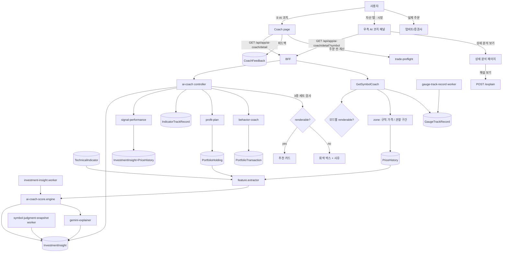

# FEATURE-004: AI 코치 추천 화면 (매수·매도 타이밍)

## TL;DR

- **서버에는 이미 다 있는데 화면이 없어서 0원인 기능들을 화면으로 만든다.** `ai-coach`(점수 엔진 468줄 + Gemini explainer), `signal-performance`, `profit-plan`, `trade-preflight`, `behavior-coach` 전부 `Backend Only` 상태다.
- 핵심 화면은 **추천 카드 1개**: `KRW-BTC 매수 · 점수 72` + **근거** + **이 유형 신호의 과거 적중률** + **틀렸던 사례**.
- 글로벌 플랜 1-3절에 따라 **이 3종이 없으면 카드를 렌더하지 않는다.** 컴포넌트 레벨 강제.
- 매도 쪽은 `profit-plan`의 손절/1차 익절/추세유지 3단계를 보유 종목별로 가격으로 보여준다. 목표주가·수익률 예측은 하지 않는다.
- 신호 성적표(`signal-performance`)를 별도 섹션으로 노출한다 — **코치가 자기 점수를 공개하는 것이 신뢰의 유일한 근거**다.
- **(2026-09-21)** 투자 화면(자산 탭 `시장` 세그먼트) **우측 패널이 곧 AI 코치 패널**이다 — 단타/장기 모드 · 지금의 판단 · 스마트 바이존 · 게이지 + 적중률 한 줄 · 뉴스 · [상세 분석]. 종목 → **상세 분석 페이지**. `FEATURE-000` FR-33 을 이관받음. 신뢰도 % 는 없다. 근거: `pm/requirements/reports/feature-audits/2026-09-21-storyboard-gap.md`.

## 배경과 문제

- `pm/features/current-feature-map.md`: AI 투자 코치 = `Backend/BFF Only`, "PM prototype 있음, 실제 투자 앱 UI 미연결". 외부 주문 전 체크·행동 코치·익절 플랜·신호 성과도 전부 동일.
- 즉 **제품의 핵심이 구현돼 있는데 사용자가 볼 수 없다.** 사용자 요구는 "쉽게 투자 잘하는 추천 조언 플랫폼"이고, 그 엔진은 이미 있다.
- 서버 계약(`ai-coach.types.ts`)이 이미 화면에 필요한 것을 다 담고 있다: `recommendation{action,symbol,score}`, `candidates[]`, `market.regime`, `portfolio`, `reasons[]`, `risks[]`, `actions[]`, `debug.topCandidateFactors[]`.
- 리테일 신호 서비스의 문제는 **자기 성적을 공개하지 않는 것**이다. SALT는 `signal-performance`(sample/winRate/avgReturn/maxDrawdown)를 이미 계산한다. 이걸 카드에 붙이면 다른 서비스가 못 하는 걸 한다.
- 리서치 맥락: 리테일 손실의 원인은 정보 부족이 아니라 행동이다(74~89% 손실, FOMO 44%). 그래서 추천에 **표본 수와 실패 이력**을 붙이는 것이 추천의 정확도를 높이는 것보다 중요하다.

## 목표

1. 홈과 코치 탭에서 **"지금 뭘 해야 하는지"** 를 카드 1개로 보여준다.
2. 모든 추천에 근거·적중률·실패사례를 강제로 붙인다.
3. 보유 종목별 손절/익절 가격을 한눈에 보여준다.
4. 코치의 성적표를 숨기지 않는다.
5. 추천에 대한 피드백을 받아(`/api/ai-coach/feedback`) 개선 루프를 만든다.

## 사용자 시나리오

1. ② AI 코치 탭. 최상단 **추천 카드**:
   - `매수 · KRW-BTC · 점수 72 / 100`
   - `왜: MVRV Z −0.3(과거 4개 사이클 바닥 구간) · RSI 28(과매도) · 현재 비중 34%(상한 60% 이내) · 시장 레짐 accumulation`
   - `이 유형 신호 성적: 최근 42회 · 승률 57% · 평균 +3.1% · 최대낙폭 −11%`
   - `틀렸던 때: 2025-10 사이클 톱에서 이 지표군은 매도 신호를 내지 못했습니다(이후 −52%)`
   - `[근거 자세히]` `[도움 안 됨]`
2. **리스크 섹션**: `risks[]`를 심각도 순으로. "BTC 비중이 62%로 상한 초과", "24시간 내 거래 4건".
3. **후보 목록**: `candidates[]`를 점수 순으로 3개까지. 각각 접힌 근거.
4. **매도 쪽**: 보유 종목별 3단계 가격 카드 — `손실 제한 132,000,000 / 1차 익절 168,000,000 / 추세 유지 조건`. 현재가와의 가격 차이(D13 — % 아님).
5. **주문 전 계산**(기존 `trade-preflight`): 금액을 넣으면 진입 후 비중·최대손실·손익비를 보여준다. **게이트·차단 없음.** 계산 표시만.
6. **신호 성적표**: 신호 유형별 표 — 표본/승률/평균수익/최대낙폭. 표본 20건 미만은 `표본 부족` 배지.
7. **행동 기록**: `behavior-coach` 결과를 사실 서술로. "최근 30일 매도 3건 후 90일 내 가격 회복 → 합계 −890,000원". ~~→ FEATURE-001 청구서로 이동~~ (ADR-002 — 청구서 삭제, 링크 없음)
8. 코치 성향 설정: `riskTolerance`, `maxSingleAssetWeight`, `rebalanceBand`, `panicSellWindowHours`, `defaultMode`, `notificationLevel` (기존 `UserInvestmentProfile` — 뒤 둘은 2026-09-21 노출 확정, B16).

**투자 화면 · 상세 분석 (2026-09-21 추가)**

9. 자산 탭 `시장` 세그먼트(`/investments`)에서 시세 표의 행을 고른다. 우측 패널(모바일 폭은 표 아래):
   - `[단타 | 장기]` — 장기를 누르면 아래가 전부 장기 기준으로 바뀐다. 새로 불러오지 않는다.
   - `장기 모아가기 후보 · 장기 · 유효 1주~1년 · 64점 / 100 (점수는 확률이 아닙니다)`
   - `왜: 공포 구간 · RSI 32 · 대형 매수 우세` / `이 판단 성적: 최근 23회 · 승률 52%` / `틀렸던 때: 2025-10 …`
   - 보유 중이면 `내 규칙 가격 — 손실 제한 88,300,000 (−12.4%) · 1차 익절 검토 112,000,000 · 추세 유지 125,000,000 [예측 아님]`, 미보유면 `관찰 구간 — 최근 1년 종가 하위 20% ~ 상위 20% · 하단 … 중앙 … 상단 … [예측 아님]`
   - 심리 온도계 72 아래: `이 구간(60~80) 과거 31회 · 30일 뒤 중앙값 −2.1% (−9.4% ~ +4.0%) · 예측 아님`
   - 관련 뉴스 3건 · `[상세 분석 보기 →]`
10. 상세 분석 페이지: Hero(`♡ 관심 추가` · `🛡 주문 전 체크`) → 차트 + 가격선 3개 → 코치 카드 → `[해설 보기]`(이유 · 근거 · 주의점 · 뉴스 5줄 · 면책 + 적중률 · 실패사례) → 수익 플랜(보유) → 주문 전 체크(PC 상주 카드).
11. 코치 탭은 대화 + 추천 카드. `[코치 리포트 →]` 에 위 1~8 의 섹션이 있고, 성적표 행을 누르면 **추천 근거 상세**(30일 수익률 분포 · 맞았던 때 · 틀렸던 때 나란히).

## 기능 요구사항

| ID | 요구사항 | 우선순위 | 상태 |
|---|---|---|---|
| FR-1 | **추천 카드**: `recommendation`을 action/symbol/score로 렌더. action 4종(`buy`/`sell`/`hold`/`rebalance`) 시각 구분 | Must | Draft |
| FR-2 | **3종 세트 강제**: 근거(`reasons` + `debug.topCandidateFactors`), 적중률(`signal-performance`), 실패사례(`IndicatorTrackRecord`) 중 **하나라도 없으면 카드를 렌더하지 않고** 대체 문구 표시 | Must | Draft |
| FR-3 | **리스크 섹션**: `risks[]`를 `severity` 내림차순. 자산별 필터 | Must | Draft |
| FR-4 | **후보 목록**: `candidates[]` 상위 3개, 각 접힌 근거 | Must | Draft |
| FR-5 | **점수 해석 안내**: 점수가 확률이 아님을 명시. "72점은 72% 확률이 아닙니다" | Must | Draft |
| FR-6 | **매도 3단계 카드**: `profit-plan`의 손실제한/1차익절/추세유지를 보유 종목별 가격 + 현재가와의 **가격 차이**. (2026-09-21) 같은 가격이 투자 화면 스마트 바이존의 "내 규칙 가격"이다(FR-21). **거리 % 는 싣지도 그리지도 않는다** — 수익률로 읽힌다(D13) | Must | Draft |
| FR-7 | **주문 전 계산**: `trade-preflight` 결과 표시(진입 후 비중, 상한 초과 여부, 최대손실, 손익비). **게이트 없음**. **개정 2026-09-21 (B1)**: "잔여 현금" 제거(입금 · 현금 기록 없음), "총자산 대비 최대손실" 추가. 상세 규칙 FR-30 | Must | Draft |
| FR-8 | **신호 성적표**: `signal-performance`를 신호 유형별 표로. `sample < 20`이면 `표본 부족` 배지 + 승률 회색 처리 | Must | Draft |
| FR-9 | **행동 기록 요약**: `behavior-coach` 결과를 사실 서술 문장으로 변환. 인격 평가·라벨 노출 금지 | Must | Draft |
| FR-10 | **LLM 해설**: 기존 `ai-coach-gemini-explainer`로 카드 해설 생성. **숫자는 주입, 문장만 생성.** 실패 시 규칙 기반 문장 폴백(`ai-coach-explainer.ts` 재사용) | Must | Draft |
| FR-11 | **피드백**: `[도움 안 됨]` / `[도움 됐음]` → `POST /api/ai-coach/feedback`. 사유 선택(근거 부족 / 이미 알고 있음 / 틀린 것 같음 / 실행 불가) | Should | Draft |
| FR-12 | **성향 설정**: `UserInvestmentProfile` 편집 화면. **개정 2026-09-21 (D3 · B16)**: `defaultMode`/`notificationLevel`을 **노출한다** — 두 모드를 노출하기로 했으므로(D3) 숨길 이유가 없다. 컬럼을 추가해 `unsupportedPersistedFields`를 없앤다(`DB-REQ-017` FR-20). `defaultMode` = 모드 스위치 초기값, `notificationLevel` = 알림 1종(지표 · 추천 갱신, D5)의 빈도. `FE-REQ-026` FR-81 과의 충돌을 이 개정으로 닫는다. 원래 문장: "UI에서 숨긴다(또는 FEATURE-000에서 컬럼 추가)" | Must | Draft |
| FR-13 | **자산군 확장**: 크립토 외 미국주식 추천을 지원. **개별 미국 주식 신규 매수 추천은 하지 않고**, 보유 종목의 비중·손절과 지수/ETF 단위 적립만(1-3절). (2026-09-21 "세금" 삭제 — ADR-002. 자산군 3종 유지 여부는 감사 문서 Q2) | Must | Draft |
| FR-14 | **국내주식 범위**: 추천 대상에서 제외(실시간 데이터·지표 부재). 보유 표시와 비중 경고만 | Should | Draft |
| FR-15 | **생성 트리거**: 기존 `POST /api/ai-coach/generate` + `investment-insight.worker`. 화면에서는 최신 결과를 읽고, 수동 새로고침 시 재생성(쿨다운 5분) | Must | Draft |
| FR-16 | **면책 배너**: 카드 하단 고정 — "투자 판단과 손실 책임은 본인에게 있습니다" | Must | Draft |

### 투자 화면 우측 AI 코치 패널 · 상세 분석 페이지 (2026-09-21)

근거: `pm/requirements/reports/feature-audits/2026-09-21-storyboard-gap.md` D2 · D3 · D4 · D7 · B1 · B3 · B9 · B10 · B19 · B23 · D11 · D12 · D13.
**`FEATURE-000` FR-33("우측 프리뷰에 AI 추천 카드") 을 이관받음** — 카드 1개가 아니라 패널 전체로 키운다.
스토리보드 `asIsInvestment` n6~n9 · `detail` · `asset` · `sheetPreflight`, 프로토타입 `AICoachPanel`(App.jsx ~656) · `DetailView`(~1055) · `BuyZoneSummary`(~871).
현재 구현(`salt-microFe/apps/web/src/entities/market/ui/MarketPreview/**`)은 차트 · 게이지 · 뉴스뿐이다.

| ID | 요구사항 | 우선순위 | 상태 |
|---|---|---|---|
| FR-17 | **우측 AI 코치 패널**: 자산 탭 `시장` 세그먼트(`/investments`, D7)의 우측 패널을 ① 모드 스위치 ② 지금의 판단 ③ 스마트 바이존 ④ 심리 온도계 ⑤ 스마트 머니(④⑤ 아래 적중률 한 줄) ⑥ 관련 뉴스 ⑦ [상세 분석 보기] 순서로 만든다. 기존 차트 · ④⑤⑥ 은 그대로 둔다. **PC 는 지금 2컬럼 그대로, 모바일 폭은 표 아래로 접는다.** F000 FR-33 을 이관받음 | Must | Draft |
| FR-18 | **단타 / 장기 모드 스위치** (D3): 판단 · 유효시간 · 바이존 · 해설이 모드에 따라 바뀐다. 패널과 상세 분석 페이지가 **같은 상태를 공유**하고 웹은 URL `?mode=`, RN 은 navigation param 에 남는다. 없으면 `defaultMode`(FR-12). 서버가 두 모드를 한 번에 주므로 전환에 요청이 없다 | Must | Draft |
| FR-19 | **지금의 판단** (D3): 서버 **중립 라벨**(단타 기회 후보 · 장기 모아가기 후보 · 관망 · 지금은 피하기) + 모드 + 유효시간 + 점수 · "점수는 확률이 아닙니다" + 근거 · 적중률 · 실패사례. **"매수"·"매도" 명령형 라벨 금지. 신뢰도 % 는 화면에서도 응답에서도 뺀다.** 유효시간은 서버가 정한 하나의 표기(`validity`)만 — 프로토타입의 "25분 / 30일" 같은 화면 자체 값 금지 | Must | Draft |
| FR-20 | **종목 경로 3종 게이트** (B10 · D11): `GET /api/ai-coach?symbol&mode` 응답이 모드별로 `renderable` · `blockedReason` · 적중률 · 실패사례를 싣는다. 적중률 · 실패사례는 **`symbol_judgment` 스냅샷의 사후 결과**에서 오고, 표본 < 20 이면 `insufficient_sample` 로 막는다(표본 N건은 보인다). 미충족이면 ② 대신 회색 박스(FR-2 · UX Blocked 와 같은 규칙). 게이트는 ② 에만 걸고 ③~⑥ 은 막지 않는다 | Must | Draft |
| FR-21 | **스마트 바이존** (D2): **보유 종목 = 서버 `profit-plan` 이 계산한 내 규칙 가격**(손실 제한 · 1차 익절 검토 · 추세 유지 — 스토리보드의 손절 · 1차 · 2차). **미보유 종목 = 관찰 구간** — 가격 목표가 아니라 과거 가격 분포 기반 하단 · 중앙 · 상단 + 규칙 설명. 둘 다 서버 계산 · `예측 아님` 라벨 · **수익률 % 표기 없음**(현재가와의 거리만). 화면 이름은 "내 규칙 가격" / "관찰 구간" — "매수존 · 매수 적정가 · 목표가" 문구 금지. 모드별 값 | Must | Draft |
| FR-22 | **미보유 관찰 구간은 ETF · 지수 · 코인만 (D12).** 미보유 개별 주식은 사유 한 줄 — 글로벌 플랜 §1-3 | Must | Draft |
| FR-23 | **게이지 아래 적중률 한 줄** (B9): 심리 온도계가 지금 구간에 있던 과거 시점들의 **30일 뒤 수익률 분포**(중앙값 · 하위 25% ~ 상위 25% · 표본 수) + `예측 아님`. 표본 < 20 이면 `표본 부족` 배지. 서버 신규 집계(`MarketSentiment` 이력 + `PriceHistory`). 스마트 머니 게이지는 같은 방식 Should | Must | Draft |
| FR-24 | **[상세 분석 보기]** → 상세 분석 페이지 push. 모드를 들고 간다 | Must | Draft |
| FR-25 | **상세 분석 페이지**: 웹 `/investments/[symbol]`(자산 탭 안 push, D7), RN `AssetDetailScreen`. Hero → 차트 + 가격선 → 코치 카드 → Gemini 해설 → 수익 플랜 → 주문 전 체크. PC 2컬럼(좌: 차트 · 코치, 우: 해설 · 수익 플랜 · 주문 전 체크 상주 카드), 모바일 세로 스택 | Must | Draft |
| FR-26 | **Hero** (B23): 종목 · 현재가 · 변동률 + **[관심 추가]** + **[주문 전 체크]**. **[알림 만들기] 없음**(B19) | Must | Draft |
| FR-27 | **차트 오버레이** (D2): 보유 = 규칙 가격 3선, 미보유 = 관찰 구간 3선, 범례에 `예측 아님`. 기간 탭 6개(1분~1주). 선 가격은 서버 값 | Must | Draft |
| FR-28 | **Gemini 해설** (B3): [해설 보기]를 눌러야 부른다. ① 이 모드인 이유 ② 핵심 근거 ③ 주의점 ④ **관련 뉴스 5줄 요약** ⑤ 면책 + 같은 카드에 적중률 · 실패사례. **예상 수익 범위 없음**(서버에서 이미 제거 — `GeminiCoachExplainer`). 판단이 미렌더면 버튼도 없고 LLM 도 부르지 않는다 | Must | Draft |
| FR-29 | **수익 플랜** (보유만): `profit-plan` 3단계 가격 + 비중(25 · 25 · 50%) + 상태 + 현재가와의 거리. 미보유면 거래 기록 추가(F006) 진입 | Must | Draft |
| FR-30 | **주문 전 체크** (B1): **외부 주문 링크 · 버튼 없음.** 진입가 기본 = 현재가, **목표가는 빈칸**(시스템이 채우지 않는다 — 스토리보드의 "2차 익절 기본값" 폐기). 금액 칩(10만 · 30만 · 50만 · 100만 + 직접 입력, "전액" 없음) · 손절 칩(−1.5 · −3 · −5 · −8 · −12%). 결과: 진입 후 비중(상한 대비) · 최대 손실 · 목표 도달 시(목표가 입력 시만) · 손익비 · **총자산 대비 최대손실**. PC = 상세 페이지 상주 카드, 모바일 = 바텀시트 | Must | Draft |
| FR-31 | **관심 종목 표에 신호 컬럼을 두지 않는다** (D4). 판단은 우측 패널 · 상세 분석 페이지에서만 | Won't | 범위 밖 |

### 코치 탭 · 코치 리포트 (2026-09-21)

근거: 감사 문서 B2 · B15 · B17 · B18. 스토리보드 `coach` · `coachDetail`.

| ID | 요구사항 | 우선순위 | 상태 |
|---|---|---|---|
| FR-32 | **코치 탭 = 대화 + 추천 카드** (B15). 대화는 `FEATURE-006`. FR-3 · FR-4 · FR-6 · FR-7 · FR-8 · FR-9 섹션은 **코치 리포트**(push: 웹 `/coach/report`, RN `CoachReportScreen`)로 옮긴다 | Must | Draft |
| FR-33 | **추천 근거 상세** (B17): 신호 유형별 표본 · 승률 · 평균 · 최대낙폭 + **신호 후 30일 수익률 분포**. 웹 `/coach/signals/[signalType]`, RN push | Must | Draft |
| FR-34 | **실패 이력의 비중** (B2): 카드에서는 요약 1건, 추천 근거 상세에서는 맞았던 때와 **같은 크기로 나란히**. 아코디언 · 더보기에 숨기지 않는다 | Must | Draft |
| FR-35 | **`signalType` ↔ 성적표 ↔ 실패 이력 매핑 표**를 서버 REQ(`SRV-REQ-024` D절)에 둔다 (B18). 저장 추천 `coach.<action>` 4종 + 종목 판단 `<mode>.<action>` 8종 | Must | Draft |
| FR-36 | **표본이 없어 전부 미렌더인 초기 상태를 정상 UX 로** (B18): 빈 화면 · 오류가 아니라 "아직 표본이 쌓이는 중입니다 — 과거 성적이 없는 추천은 보여드리지 않습니다" + 성적표(표본 N건). FR-2 의 우회 금지는 그대로 | Must | Draft |

## 비기능 요구사항

| 구분 | 요구사항 |
|---|---|
| 성능 | 코치 탭 첫 페인트 < 400ms(최신 insight 읽기). 수동 재생성은 비동기 + 진행 표시, p95 < 6s(LLM 포함). LLM 해설은 생성 시 1회 캐시 |
| 접근성 | action은 색 + 텍스트 + 아이콘 3중 표기. 점수는 `aria-label`로 "100점 중 72점". 3단계 가격 카드는 `<table>` 또는 `<dl>`. 접힌 근거는 `<details>` |
| 보안 | LLM 프롬프트에 계좌 식별자·API 키를 넣지 않는다. 금액은 필요한 범위만. 프롬프트/응답을 원문 로깅하지 않는다 |
| 장애 처리 | LLM 실패 → 규칙 기반 문장. `signal-performance` 실패 → **카드 렌더 중단**(FR-2). insight 결측 → "아직 생성된 추천이 없습니다" + [생성] 버튼 |
| 관측성 | 카드 렌더/미렌더(사유별) 카운터, LLM 성공률·지연, 피드백 분포, 재생성 호출 수. (2026-09-21) **경로(저장 추천 / 종목 판단) × 모드별** 미렌더율, 구간 `unavailable` 사유 비율, 게이지 `표본 부족` 비율 |
| 성능 (2026-09-21) | 패널: 행 선택 → 판단 페인트 < 300ms, **모드 전환 요청 0건**. 서버 종목 판단 p95 < 150ms. 게이지 적중률은 요청 시 집계하지 않는다(일 1회 사전 집계) |

## UX 상태

- **Loading**: 카드 스켈레톤. 최신 insight가 있으면 먼저 렌더하고 `생성 시각` 표시.
- **Empty (insight 없음)**: "아직 추천이 없습니다. 보유 기록을 입력하면 코치가 판단할 수 있습니다." + [생성] / 거래 기록 추가 진입. (개정 2026-09-21 — 계좌 연동은 영구 Non-Goal, FEATURE-001 은 ADR-002 로 삭제. B12 문구)
- **Blocked (전부, 초기)**: FR-36 — "표본이 쌓이는 중". 정상 상태.
- **패널 — 판단 미렌더**: ② 자리에 회색 박스. ③~⑥ 은 그대로.
- **패널 — 구간 없음**: 사유 한 줄(가격 이력 부족 · 개별 주식 미보유(D12) · 제외 자산).
- **패널 — 판단 조회 실패**: ②③ 자리만 "지금 불러올 수 없습니다", 차트 · 게이지 · 뉴스는 정상(부분 실패 격리).
- **Empty (보유 0건)**: 매도 3단계 카드 대신 "보유 종목이 없습니다".
- **Blocked (FR-2 미충족)**: 카드 대신 회색 박스 — "이 신호의 과거 성적 데이터가 아직 없어 추천을 표시하지 않습니다(표본 N건)". **이게 정상 동작임을 명시.**
- **Stale**: 생성 후 24시간 경과 시 `생성 후 27시간 경과` 배지 + [새로 생성].
- **Cooldown**: 재생성 5분 쿨다운 중이면 버튼 비활성 + 남은 시간.
- **Degraded (LLM 실패)**: 규칙 기반 문장 + `해설 생성 실패, 규칙 기반 설명` 배지.
- **Error**: 마지막 성공 insight + 재시도.
- **Unauthorized**: 로그인.
- **Optimistic update**: 피드백 버튼만.

## 정책과 제약

- **1-3절 3종 세트는 렌더 조건이다.** 우회 플래그를 만들지 않는다.
- **확신 표현 금지**: "확실", "무조건", "보장", "100%". 점수·표본·승률로만.
- **목표주가·수익률 예측 금지.** 가격은 내 규칙 기반(손절/익절)만.
- **점수는 확률이 아니다**를 화면에 명시(FR-5).
- **개별 미국 주식 신규 매수 추천 금지**(1-3절). 지수/ETF 단위 + 보유 종목 관리만.
- **주문 실행·자동매매 없음.** `trade-preflight`는 계산 표시 전용. 외부 주문 링크 · 거래소 딥링크도 없다(B1).
- **신뢰도 % 를 표시하지 않는다**(D3). 점수 + 3종이 대체한다.
- **스마트 바이존은 예측이 아니다**(D2). 보유 = 내 규칙 가격, 미보유 = 관찰 구간. 수익률 % · 목표가 · "매수존" 표기 금지, `예측 아님` 라벨 상시.
- **게이지 적중률은 과거 분포다.** "앞으로 +x%"로 읽히는 문구 금지.
- **관심 종목 목록에 판단 · 신호를 붙이지 않는다**(D4).
- 면책 배너 상시 노출.

## 화면/프론트엔드 영향

| App | Route/Component | 변경 내용 |
|---|---|---|
| shell | `/coach` (② AI 코치 탭) | 신규 route |
| shell | `components/Home/CoachHighlightCard` | 신규. 홈에 추천 1개 요약 (FEATURE-005) |
| investments | `src/pages/coach/index.tsx` | 신규 |
| investments | `component/Coach/RecommendationCard` | 신규. action/symbol/score + 3종 세트. **3종 미충족 시 렌더 중단 로직 포함** |
| investments | `component/Coach/ReasonList` | 신규. `reasons` + `topCandidateFactors` |
| investments | `component/Coach/SignalTrackRecordBadge` | 신규. 표본/승률/평균/MDD |
| investments | `component/Coach/FailureCaseAccordion` | 신규. 지표 실패 이력 |
| investments | `component/Coach/RiskList` | 신규 |
| investments | `component/Coach/CandidateList` | 신규 |
| investments | `component/Coach/ExitPlanCard` | 신규. 손절/1차익절/추세유지 3단계 |
| investments | `component/Coach/PreflightCalculator` | 신규. 게이트 없는 계산기 |
| investments | `component/Coach/SignalScoreboard` | 신규. 신호 성적표 표 |
| investments | `component/Coach/BehaviorFactRow` | 신규. 사실 서술 (~~+ 청구서 링크~~ ADR-002) |
| investments | `component/Coach/CoachProfileForm` | 신규. `UserInvestmentProfile` |
| investments | `component/Coach/FeedbackButtons` | 신규 |
| investments | `component/Coach/DisclaimerBanner` | 신규 |
| investments | `hooks/api/coach/*` | 신규 |
| pm | `pm/prototype/src/App.jsx` | 기존 프로토타입을 이 화면 계약으로 정리(참조 구현) |
| web (2026-09-21) | `/investments` · `widgets/coach-panel` | 우측 AI 코치 패널(FR-17~24). `entities/market/ui/MarketPreview/**` 를 감싼다 — `FE-REQ-026` K |
| web (2026-09-21) | `/investments/[symbol]` · `pages/investment-detail` · `widgets/symbol-analysis` | 상세 분석 페이지(FR-25~30) — `FE-REQ-026` L |
| web (2026-09-21) | `features/switch-coach-mode` · `features/explain-symbol` | 모드 스위치(URL) · 해설 버튼 |
| web (2026-09-21) | `/coach/report` · `/coach/signals/[signalType]` | 코치 리포트 · 추천 근거 상세(FR-32~36) — `FE-REQ-026` M |
| mobile (2026-09-21) | `AssetDetailScreen` · `CoachReportScreen` · `SignalEvidenceScreen` | 패널 내용 + 상세 본문을 한 화면에 — `RN-REQ-020` J~L |

## BFF/API 영향

기존 BFF 라우트가 이미 존재한다. **신규 없이 화면 계약만 확정**하는 것이 원칙이고, 부족한 것만 추가한다.

| Method | Path | Auth | 상태 |
|---|---|---|---|
| GET | `/api/app/ai-coach/preview` | Y | **기존** — 홈 요약용 |
| GET | `/api/app/ai-coach/detail` | Y | **기존** — ~~코치 탭 전체~~ **개정 2026-09-21**: 코드상 **종목 판단**(`?symbol&mode` + 뉴스 3건)이다. 우측 패널 · 상세 분석 페이지 뷰모델로 확정 — 모드별 게이트 · `zone` · `gaugeTrackRecords` · `validity`, **`confidence` 제거**(`BFF-REQ-024` `SymbolCoachViewModel`) |
| GET | `/api/app/coach/report` | Y | **신규 2026-09-21** — 코치 리포트(아래 `CoachDetailViewModel`). 서버 `/api/coach/detail` |
| GET/PATCH | `/api/app/ai-coach/profile` | Y | **기존** |
| POST | `/api/app/ai-coach/feedback` | Y | **기존** — `reasonCode` 추가 |
| POST | `/api/app/ai-coach/explain` | Y | **기존** — 인증 추가, 2026-09-21 3종 동봉 · 뉴스 5줄 · 판단 미렌더면 생성 안 함(B3) |
| POST | `/api/app/ai-coach/generate` (proxy) | Y | **기존** — 쿨다운 5분 추가 |
| GET | `/api/app/profit-plan` | Y | **기존** — `gapFromCurrent` 추가 |
| GET | `/api/app/signal-performance` | Y | **기존** — 신호 유형별 그룹 추가 |
| POST | `/api/app/trade-preflight` | Y | **기존** — 2026-09-21 `stopLossRate` 입력 · `maxLossOfTotalRate` 출력(B1) |
| GET | `/api/app/behavior-coach` | Y | **기존** — 사실 서술 문장 필드 추가 |

### 추가 필드 계약

```ts
// GET /api/app/coach/report (개정 2026-09-21 — 원래 /api/app/ai-coach/detail 확장)
type CoachDetailViewModel = {
  generatedAt: string;
  staleHours: number;
  regime: string;                        // market.regime
  recommendation: {
    action: "buy" | "sell" | "hold" | "rebalance";
    symbol: string;
    assetType: "crypto" | "us_stock";
    score: number;                       // 0~100
    scoreNote: string;                   // "점수는 확률이 아닙니다"
    renderable: boolean;                 // FR-2 게이트 결과
    blockedReason: string | null;        // "signal_track_record_missing"
    reasons: Array<{ type: string; message: string; value?: number | string | null }>;
    topFactors: Array<{ key: string; score: number; message: string }>;
    signalTrackRecord: {
      signalType: string; sample: number; winRate: number;
      avgReturn: number; maxDrawdown: number; lowSample: boolean;
    } | null;
    failureCases: Array<{ date: string; event: string; outcome: string }>;
    explanation: { text: string; source: "llm" | "rule" };
  } | null;
  risks: Array<{ type: string; symbol?: string; message: string; severity: number }>;
  candidates: Array<{ action: string; symbol: string; score: number; reasons: string[] }>;
  exitPlans: Array<{
    symbol: string; currentPrice: number;
    stopLoss: { price: number; priceGap: number };
    firstTakeProfit: { price: number; priceGap: number };
    trendHold: { condition: string };
  }>;
  behaviorFacts: Array<{ message: string; amountKrw: number | null }>;   // invoiceLink 제거 (ADR-002)
  excluded: Array<{ assetType: "kr_stock"; reason: string }>;
  disclaimer: string;
};
```

### 종목 판단 계약 요약 (2026-09-21)

전체 타입은 `SRV-REQ-025`(서버) · `BFF-REQ-024`(뷰모델). 여기에는 판단에 필요한 모양만 둔다.

```ts
// GET /api/app/ai-coach/detail?symbol&mode
type SymbolCoachViewModel = {
  symbol: string; mode: 'scalp' | 'long_term';           // 초기 선택 — defaultMode 반영
  modes: { scalp: ModeCoach; longTerm: ModeCoach };       // 두 모드를 늘 함께
  gaugeTrackRecords: Array<{ gauge: 'sentiment' | 'smart_money'; bucketCode: string; horizonDays: 30;
                             sample: number; p25: number | null; median: number | null; p75: number | null; lowSample: boolean }>;
  evidence: { /* 시세 · 심리 · 지표 · 대량 체결 · 뉴스 3건 */ };
  preflightDefaults: { symbol: string; entryPrice: number | null; mode: string };   // 목표가 없음
  disclaimer: string;
  // confidence 없음 (D3)
};
type ModeCoach =
  | { renderable: true; judgment: { action: 'review_short_opportunity' | 'review_accumulation' | 'wait' | 'avoid';
        label: string; score: number; scoreNote: string; validity: { code: string }; reasons: string[]; risks: string[] };
      trackRecord: {...}; failureCases: [...]; zone: Zone }
  | { renderable: false; blockedReason: string; trackSample: number | null; zone: Zone };
type Zone =
  | { kind: 'held_rule'; notPrediction: true; stages: Array<{ key: 'protect_loss' | 'first_profit' | 'trend_hold'; price: number; priceGap: number; ratio: number }> }
  | { kind: 'observation'; notPrediction: true; lower: number; mid: number; upper: number; ruleCode: string }
  | { kind: 'unavailable'; reasonCode: 'out_of_scope' | 'excluded_asset' | 'insufficient_price_history' };
```

## 서버/DB/Worker 영향

| Layer | 위치 | 영향 |
|---|---|---|
| Server | `modules/investment-insight/ai-coach` | **유지.** `ai-coach.types.ts`의 `CoachPayload`에 `assetType` 추가. `signalTrackRecord`/`failureCases` 조립을 controller에서 수행 |
| Server | `modules/signal-performance` | 신호 유형별 그룹 응답 추가(`groupBy=signalType`) |
| Server | `modules/profit-plan` | `gapFromCurrent` 추가 |
| Server | `modules/behavior-coach` | 사실 서술 문장 생성(`factMessage`) 추가. 인격 평가 문구 제거 |
| Server | `modules/trade-preflight` | 유지. 게이트 관련 필드 없음 |
| Server | `ai-coach-gemini-explainer.service.ts` | 프롬프트에 3종 세트 숫자 주입, 문장만 생성하도록 프롬프트 재작성 |
| DB | `UserInvestmentProfile` | `defaultMode String?`, `notificationLevel String?` 컬럼 추가로 `unsupportedPersistedFields` 해소(또는 UI 숨김 유지) |
| DB | `InvestmentInsight` | `assetType` 추가. `InsightType`은 `ai_coach`/`behavior_analysis`/`risk_alert` 3종 유지 |
| DB | `IndicatorTrackRecord` | FEATURE-003과 공유(실패 사례 소스) |
| DB | `CoachFeedback` | **신규** — `id, userId, insightId, helpful Boolean, reasonCode?, createdAt` + `@@index([userId, createdAt])` |
| DB | migration | `20260908_coach_screen` |
| Server (2026-09-21) | `coach/application/GetSymbolCoach.ts` | 모드별 3종 게이트 · `zone` · `gaugeTrackRecords` · `validity` 추가, **`confidence` 제거**(`modeDecision.ts` · `CoachExplanationInput`) — `SRV-REQ-024` FR-100~133 |
| Server (2026-09-21) | `coach/domain/policy/observationZone.ts` · `gaugeTrackRecord.ts` | 신규 순수 정책. 백분위수는 DB(`percentile_cont`) |
| DB (2026-09-21) | `InvestmentInsight` | `kind = symbol_judgment` · `mode` 컬럼 — 종목 판단 스냅샷(없으면 종목 경로 표본이 영원히 0). `confidence` 컬럼은 남기되 미사용 |
| DB (2026-09-21) | `GaugeTrackRecord` | **신규** — `symbol, gauge, bucket, horizonDays, sampleCount, p25/median/p75Return, positiveRate` · `@@unique([symbol, gauge, bucket, horizonDays])` |
| DB (2026-09-21) | `InsightType.smart_buy_zone` | 생성 중단 **철회**(D2) — 새 규칙의 구간 스냅샷 |
| Worker (2026-09-21) | `symbol-judgment-snapshot` | 1시간(기본값). 추적 자산(D8, ≤10 + 보유) × 2모드. 멱등 `dedupeKey` |
| Worker (2026-09-21) | `gauge-track-record` | 일 1회. 종목별 게이지 구간 × 30일 수익률 분포 재집계. 멱등 upsert |
| 보유 데이터 | `PortfolioTransaction` → `PortfolioHolding` | 원장 확장 없음(ADR-002) |
| Worker | `investment-insight.worker.ts` | **유지.** 생성 주기와 `assetType` 확장. 멱등 유지 |

## 이벤트/상태 흐름



## Trace Matrix

| 요구사항 | 화면 | BFF/API | 서버 | DB/Worker | 검증 |
|---|---|---|---|---|---|
| FR-1 | `RecommendationCard` | `/ai-coach/detail` | `ai-coach.controller` | `InvestmentInsight` | action 4종 렌더 |
| FR-2 | 동일 (게이트) | `renderable`, `blockedReason` | 조립 로직 | `IndicatorTrackRecord`, signal-performance | 3종 중 1개 제거 시 미렌더 |
| FR-3 | `RiskList` | `risks[]` | 기존 | — | severity 정렬 |
| FR-4 | `CandidateList` | `candidates[]` | 기존 | — | 상위 3개 |
| FR-5 | `scoreNote` | 동일 | 동일 | — | 문구 노출 |
| FR-6 | `ExitPlanCard` | `exitPlans[]` | `profit-plan` | `PortfolioHolding` | 가격 차이 손검산 |
| FR-7 | `PreflightCalculator` | `POST trade-preflight` | 기존 | — | 게이트 필드 0건 |
| FR-8 | `SignalScoreboard` | `signal-performance?groupBy` | 동일 | — | 표본<20 배지 |
| FR-9 | `BehaviorFactRow` | `behaviorFacts[]` | `behavior-coach` | `PortfolioTransaction` | 인격 평가 문구 0건 |
| FR-10 | `explanation` | 동일 | gemini explainer | — | LLM 실패 → rule 폴백 |
| FR-11 | `FeedbackButtons` | `POST feedback` | 기존 | `CoachFeedback` | 사유 4종 저장 |
| FR-12 | `CoachProfileForm` | `GET/PATCH profile` | 기존 | `UserInvestmentProfile` | 미지원 필드 숨김 또는 컬럼 추가 |
| FR-13 | 자산군 필터 | `assetType` | `CoachPayload` | `InvestmentInsight.assetType` | 개별 미국주식 신규매수 추천 0건 |
| FR-14 | `excluded` | 동일 | 동일 | — | 국내주식 제외 문구 |
| FR-15 | [새로 생성] | `POST generate` | 기존 + 쿨다운 | — | 5분 내 2회 → 429 |
| FR-16 | `DisclaimerBanner` | `disclaimer` | 동일 | — | 상시 노출 |
| FR-17~19 | `widgets/coach-panel` | `/ai-coach/detail?symbol` `modes` | `GetSymbolCoach` | — | 순서 ①~⑦ · 모드 전환 요청 0 · 신뢰도 0건 |
| FR-20 | `BlockedNotice`(패널) | 모드별 `renderable` | `renderGate` | `symbol_judgment` 스냅샷 | 성적표 제거 시 ② 미렌더, ③~⑥ 유지 |
| FR-21~22 | `ZoneSummary` | `zone` | `profitPlan` · `observationZone` | `PortfolioHolding` · `PriceHistory` | 보유/미보유 분기 · 수익률 필드 0 · 미보유 개별주식 `unavailable` |
| FR-23 | `GaugeTrackRecordLine` | `gaugeTrackRecords` | 사전 집계 조회 | `GaugeTrackRecord` · `gauge-track-record` worker | 표본 19/20 경계 |
| FR-24~27 | `/investments/[symbol]` | 동일 뷰모델 | 동일 | — | Hero 알림 버튼 0 · 오버레이 3선 = 서버 가격 |
| FR-28 | 해설 카드 | `POST /explain` | `ExplainCoachDecision` | — | 뉴스 ≤ 5 · 예상 수익 0 · 미렌더 시 LLM 0 |
| FR-29 | 수익 플랜 | `zone.stages` | `profitPlan` | `PortfolioHolding` | 가격 손검산 |
| FR-30 | 주문 전 체크 | `POST trade-preflight` | `preflight` + `maxLossOfTotalRate` | — | 목표가 기본값 0 · 외부 링크 0 |
| FR-31 | — | watchlist 뷰모델 | — | — | 신호 컬럼 0 (범위 밖) |
| FR-32~34 | `/coach/report` · `/coach/signals/[signalType]` | `/coach/report` · `scoreboard` | `signalPerformance` + 분포 | `InvestmentInsight` · `PriceHistory` | 분포 표시 · 적중/실패 같은 크기 |
| FR-35~36 | 성적표 · 초기 상태 | `signalType` | 매핑 시드 | `IndicatorTrackRecord.signalTypes` | 12행 시드 · 전부 미렌더 시 정상 문구 |

## 수용 기준

- [ ] ② AI 코치 탭에서 추천 카드가 action/symbol/score와 함께 렌더된다.
- [ ] **`signalTrackRecord`를 null로 만들면 카드가 렌더되지 않고 사유가 표시된다.**
- [ ] **`failureCases`를 빈 배열로 만들면 카드가 렌더되지 않는다.**
- [ ] 카드에 근거·적중률·실패사례가 동시에 보인다.
- [ ] "점수는 확률이 아닙니다" 문구가 보인다.
- [ ] 표본 20건 미만 신호는 `표본 부족` 배지가 붙고 승률이 회색 처리된다.
- [ ] 보유 종목별 손절/1차익절/추세유지 가격과 현재가와의 가격 차이가 표시되고, 거리 % 는 0건이다.
- [ ] `trade-preflight` 계산기에 차단·게이트 동작이 없다(입력 후 항상 결과 표시).
- [ ] LLM 실패 시 규칙 기반 문장으로 폴백되고 배지가 표시된다.
- [ ] 재생성이 5분 쿨다운으로 제한된다(초과 시 429).
- [ ] 행동 기록이 사실 서술로만 표시되고 인격 평가 문구가 없다.
- [ ] 개별 미국 주식의 **신규 매수** 추천이 생성되지 않는다(지수/ETF 또는 보유 종목 관리만).
- [ ] 국내주식이 추천 대상에서 제외됨이 명시된다.
- [ ] 확신 표현("확실", "무조건", "보장", "100%")이 0건이다.
- [ ] 면책 배너가 상시 노출된다.
- [ ] LLM 프롬프트/응답이 원문 로깅되지 않는다.
- [ ] (2026-09-21) `/investments` 우측 패널에 ①~⑦ 이 순서대로 있고 PC 2컬럼이 유지된다. 모바일 폭에서 표 아래로 접힌다.
- [ ] **모드 전환이 판단 · 유효시간 · 바이존을 함께 바꾸고 네트워크 요청이 0건이다.** 상세 페이지로 가도 모드가 유지된다.
- [ ] **신뢰도 % 가 화면 · BFF 뷰모델 · 서버 종목 판단 응답 어디에도 없다.**
- [ ] 판단 라벨이 중립 4종이고 "매수"·"매도" 라벨이 0건이다. 유효시간 표기가 서버 값 하나다.
- [ ] **종목 판단에서 적중률 또는 실패사례를 없애면 ② 가 미렌더되고 ③~⑥ 은 보인다.**
- [ ] 보유 종목은 "내 규칙 가격"(서버 `profit-plan` 과 같은 값), 미보유는 "관찰 구간" + 규칙 설명이고 둘 다 `예측 아님` 이 붙는다.
- [ ] 바이존 · 관찰 구간에 수익률 % · 목표가 · "매수존" 문구가 0건이다.
- [ ] 미보유 개별 미국 주식에는 관찰 구간 대신 사유 한 줄이 보인다(D12).
- [ ] 게이지 아래 적중률 한 줄이 30일 뒤 분포 + `예측 아님` 이고, 표본 < 20 에서 `표본 부족` 배지가 붙는다.
- [ ] 상세 분석 페이지에 Hero(관심 추가 · 주문 전 체크) · 차트 가격선 3개 · 코치 카드 · 해설 · 수익 플랜 · 주문 전 체크가 있고 [알림 만들기] 가 없다.
- [ ] 해설이 버튼으로만 불리고 뉴스 5줄 요약 · 적중률 · 실패사례가 있으며 예상 수익이 0건이다. 판단 미렌더면 해설 버튼이 없다.
- [ ] 주문 전 체크의 목표가가 빈칸으로 열리고, 금액 · 손절 칩 · 총자산 대비 최대손실이 있으며 외부 주문 링크가 0건이다. PC 에서는 상주 카드다.
- [ ] 코치 탭은 대화 + 추천 카드이고 리스크 · 후보 · 익절 · 성적표 · 주문 전 계산 · 행동 기록은 코치 리포트에 있다.
- [ ] 추천 근거 상세에 30일 수익률 분포가 있고 맞았던 때 · 틀렸던 때가 같은 크기로 나란히 있다.
- [ ] 표본이 없어 전부 미렌더일 때 "표본이 쌓이는 중" 상태가 보이고 오류 · 빈 화면이 아니다.
- [ ] `defaultMode` · `notificationLevel` 이 성향 설정에 노출되고 저장된다.
- [ ] 관심 종목 표에 신호 컬럼이 없다(D4).
- [ ] 청구서 · 세금 링크와 문구가 0건이다(ADR-002).

## 검증 계획

1. **렌더 게이트**: 3종 각각을 제거한 3케이스 + 전부 있는 1케이스. 미렌더 시 사유 코드 확인.
2. **action 4종** 각각의 카드 렌더 스냅샷.
3. **표본 경계**: sample 19 / 20 / 21에서 배지·색 처리.
4. **폴백**: LLM 타임아웃·에러·빈 응답 3케이스에서 규칙 문장 표시.
5. **쿨다운**: 5분 내 2회 생성 요청 → 429.
6. **profit-plan 거리 계산** 손검산.
7. **카피 전수 검수**: 확신 표현, 목표주가, 인격 평가, 개별 미국주식 신규매수 추천 유무.
8. **보안**: 프롬프트에 API 키·계좌 식별자 포함 여부, 로그 grep.
9. **회귀**: 기존 BFF 5개 라우트의 응답 계약이 필드 추가 후에도 하위 호환인지 스냅샷 테스트.

## Open Questions

- ~~`ai-coach-score.engine.ts`(468줄)의 점수 스케일과 `signal-performance`의 `signalType` 매핑이 1:1인지.~~ **2026-09-21 (B18)**: 매핑 표를 `SRV-REQ-024` D절에 둔다(FR-35). 남은 것은 시드 데이터 — 어느 `signalType` 이 실제 실패 이력과 이어지는지.
- ~~`signal-performance`의 표본이 실제로 몇 건 쌓여 있는지 … 초기 정책을 결정해야 한다.~~ **2026-09-21 (B18)**: 전부 미렌더인 초기 상태를 정상 UX 로 한다(FR-36). 우회 렌더는 하지 않는다. 표본 실측은 여전히 첫 작업이다.
- ~~**Q3 — 미보유 주식 종목의 관찰 구간.**~~ **2026-09-21 D12**: ETF · 지수 · 코인만(FR-22).
- ~~**종목 판단의 실패 이력은 어디서 오는가.**~~ **2026-09-21 D11**: `symbol_judgment` 스냅샷의 사후 결과로 쌓는다. `IndicatorTrackRecord` 를 쓰지 않는다. 표본 < 20 이면 ② 는 `표본 부족`. 적중 판정 세부는 기본안 B39.
- 관찰 구간 규칙(기본값: 단타 = 최근 24시간 5분봉, 장기 = 최근 1년 일봉, 20 · 50 · 80 백분위)의 확정과 카피 검수 — "관찰 구간"이 매수 권유로 읽히지 않는지.
- 모드를 URL · navigation param 에만 두면 화면을 새로 열 때마다 `defaultMode` 로 돌아간다. 마지막 모드를 기억할지.
- 자산군 3종 유지 여부(감사 문서 Q2) — FR-13 · FR-14 의 전제.
- 미국주식 추천에 필요한 `TechnicalIndicator` 계산이 현재 크립토 전용인지.
- `behavior-coach`의 기존 응답이 인격 평가 문구를 포함하는지(문구 재작성 범위).
- ~~`UserInvestmentProfile`의 `defaultMode`/`notificationLevel` 컬럼을 추가할지, UI에서 숨길지.~~ **닫힘 2026-09-21** — 노출 + 컬럼 추가(FR-12 개정, B16).
- 추천 생성 주기(현재 `investment-insight.worker` 주기 확인 필요)와 화면 stale 임계(24h)의 정합성.
- 피드백을 점수 엔진에 실제로 반영할지(반영하면 개인화, 안 하면 기록용).

## 변경 이력

| 날짜 | 변경 |
|---|---|
| 2026-09-08 | 초안 작성. 기존 백엔드 5모듈 화면화, 3종 세트 렌더 게이트, 신호 성적표, 게이트 없는 preflight |
| 2026-09-21 | `pm/requirements/reports/feature-audits/2026-09-21-storyboard-gap.md` 반영. **F000 FR-33 을 이관받아** 투자 화면 우측 AI 코치 패널 · 상세 분석 페이지 FR-17~31 추가(D2 스마트 바이존 = 내 규칙 가격/관찰 구간 · D3 두 모드 + 신뢰도 제거 · D4 관심 종목 신호 범위 밖 · D7 자산 탭 시장 세그먼트 · B1 주문 전 체크 · B3 해설 · B9 게이지 적중률 · B10 종목 경로 게이트 · B23 Hero), 코치 탭/리포트 FR-32~36(B2 · B15 · B17 · B18). 개정: FR-7(B1) · FR-12(B16 노출 — `FE-REQ-026` FR-81 충돌 해소) · FR-13(세금 삭제). ADR-002 에 따라 청구서 · 세금 · 계좌 연결 연결고리 제거. `/api/app/ai-coach/detail` 을 종목 판단으로, 코치 리포트를 `/api/app/coach/report` 로 |
| 2026-09-21 | `pm/requirements/reports/feature-audits/2026-09-21-storyboard-gap.md` D11 ~ D13 반영. FR-6 · FR-20 · FR-22 개정 — 거리 % → 가격 차이(D13), 종목 경로 실패 이력 = 스냅샷(D11), 미보유 관찰 구간 = ETF · 지수 · 코인(D12). Open Question 2건 닫음 |
| 2026-09-22 | 구현 진행 기록 — 슬라이스 1~3(서버 판단 스냅샷 · `zone` · 게이지 적중률 · BFF `SymbolCoachViewModel`)에 이어 **슬라이스 4: 투자 우측 AI 코치 패널**(FR-17~ 패널 부분). 모드는 URL `?mode=` 를 `history.replaceState` 로 바꾼다(전환 요청 0건). 상세 분석 페이지 · 주문 전 체크 · 코치 리포트 · ⑦ 버튼 미착수. 근거 `requirements/reports/checklists/F004-fe-coach-panel.md` |
| 2026-09-22 | 구현 진행 기록 — **슬라이스 5 (BFF)**: 서버 4xx 를 화면까지 원 status 로 전달(만료 토큰이 "서버 오류"로 보이던 것), 즉석 해설 `explain` 인증 필수 · 동시 2. 코치 리포트 · 성적표 · 재생성 쿨다운은 서버 엔드포인트가 없어 서버 후속. 근거 `requirements/reports/checklists/F004-bff-upstream-errors.md` |
| 2026-09-22 | 구현 진행 기록 — **슬라이스 6 (FE)**: 상세 분석 페이지(FR-17~ 상세 부분 · B23 Hero · B3 해설) · 패널 ⑦. 해설은 버튼으로만 · 판단이 막힌 모드엔 해설 카드 자체가 없다. **주문 전 체크(B1)는 서버가 손절 % · 총자산 대비 최대손실을 주지 않아 미착수** · 차트 1주 탭 없음(서버). 해설 뉴스 요약이 뉴스 개수와 무관하게 5줄로 오는 것을 발견 — PM 확인 필요. 근거 `requirements/reports/checklists/F004-fe-detail-page.md` |
| 2026-09-22 | 구현 진행 기록 — **상세 분석 차트 교체(`FE-REQ-034`)**: 투자 화면 패널은 프리뷰 차트 그대로, 상세 페이지는 자체 구현 트레이딩 차트(캔들 · 이동평균 5/20/60/120 · 거래량 · 십자선 · 이동/확대 · 실시간). 최고/최저 표시에 현재가 대비 % 를 그리지 않는다(D13 과 같은 이유). **이동평균을 프론트가 계산한다 — 공통 수용 기준 3("금액 계산은 서버")의 대상이 아닌 표시용 변환으로 봤다. PM 확인 필요.** 근거 `salt-microFe/requirements/reports/checklists/FE-REQ-034.md` |
| 2026-09-22 | 구현 진행 기록 — **슬라이스 8 (FE) 부채 정리(`FE-REQ-035`)**: 화면 동작 변화 없음. 시세 · 관심 종목 호출에서 axios 를 걷어 번들 회귀 원인을 lint 로 막고, 실시간 봉 병합을 `@repo/core` 로 옮겨 단위 테스트를 붙였다(RN 도 같은 병합을 쓸 자리). 근거 `requirements/reports/checklists/F004-fe-cleanup.md` |
| 2026-09-22 | 구현 진행 기록 — **슬라이스 9 (FE) 관찰 구간 차트 띠(`FE-REQ-036`)**: 사용자가 참고 화면의 "스마트 바이 존" 띠 표현을 요청. 모양(옅은 띠 + 이름표)은 따르고 이름은 FR-21 대로 "관찰 구간 · 예측 아님". **내 규칙 가격은 띠로 칠하지 않는다**(뜻이 다른 세 가격). 투자 화면 패널 차트에도 구간이 처음 들어갔다. 근거 `requirements/reports/checklists/F004-fe-zone-band.md` |
| 2026-09-22 | 구현 진행 기록 — **슬라이스 10 (서버 · FE) explain · preflight(`SRV-REQ-025`)**: 즉석 해설이 인증 뒤로 갔고 판단이 막히면 LLM 을 부르지 않는다(비용 · 공통 수용 기준 1). 화면을 떠나면 LLM 호출을 끊는다. 주문 전 체크(FR-30)가 손절 칩(%)을 서버에서 가격으로 환산하고 `maxLossOfTotalRate` 를 준다 — 화면 작업이 풀렸다. **열린 질문: explain 인증으로 공개 프로토타입이 막힌다.** 근거 `requirements/reports/checklists/F004-server-explain-preflight.md` |
| 2026-09-23 | 구현 진행 기록 — **슬라이스 11 (서버) 판단 성적표(`SRV-REQ-025` FR-15 · 53 · `SRV-REQ-024` FR-160 · 161)**: 신호 유형별 성적과 수익률 분포(구간 6 + 사분위수), 맞았던 때 · 틀렸던 때를 같은 모양 · 같은 상한으로(B2). 코치 리포트 FR-32~36 중 **성적표 · 추천 근거 상세의 서버 쪽이 열렸다** — 리포트 조립(`/api/coach/detail`)과 재생성 쿨다운은 다음 슬라이스. **분포 기간을 30일 고정에서 그룹의 관찰 기간으로 고쳤다**(단타는 24시간 — B17 의 "30일"은 장기 표본에만 참이다). 로컬 표본 시드로 판단 게이트가 처음 열려 해설 렌더 경로를 실측했고, **뉴스 1건이면 요약도 1줄**임을 확인했다(슬라이스 6 의 PM 확인 항목이 닫힌다). 근거 `requirements/reports/checklists/F004-server-scoreboard.md` |
| 2026-09-23 | 구현 진행 기록 — **상세 분석 화면 마감 (FE)**: 사용자가 참고 화면을 주고 "배열은 맞는데 디자인이 구리다" 고 해 세 번 반복해 맞췄다. 이름과 가격이 같은 크기로 경쟁하던 헤더를 **가격 중심**으로 바꾸고 요약 지표 넷을 넣었다(전에는 0개). 카드에 제목 줄 · 표의 금액 오른쪽 정렬 · 자리폭 고정. **면책을 하단 고정 띠로** 올렸다 — 카드 안에 있으면 스크롤 위치에 따라 안 보이는데 항상 붙어야 하는 계약이다. **관찰 구간 띠**(`FE-REQ-036`)가 캔들 뒤에서 보이지 않던 것을 채움 · 경계선 · 이름표로 고쳤고 상세 · 패널을 같은 값으로 맞췄다. **섹션 탭은 따르지 않았다** — 판단과 근거 3종이 다른 탭으로 갈라지면 공통 수용 기준 1 을 어긴다. 근거 `salt-microFe/requirements/reports/checklists/FE-REQ-026.md`|
| 2026-09-23 | 구현 진행 — **슬라이스 12 (서버) 코치 상세**: `GET /api/coach/detail` 이 코치 리포트(추천 · 성적 · 위험 · 후보 · 익절 계획 · 행동 기록)를 한 응답으로 준다. 추천 블록은 **실패사례 출처가 생길 때까지(F003 `IndicatorTrackRecord`) 늘 막힌다** — 3종 세트 원칙 그대로. **PM 확인 필요**: 저장 추천의 적중 규칙 — 지금은 행동과 무관하게 "가격이 오르면 적중"이라 매도 추천이 상승장에서 적중으로 센다. 근거 `requirements/reports/checklists/F004-server-coach-detail.md` |
