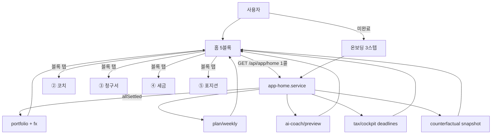

# FEATURE-005: 홈 브리핑 & 5탭 IA

## TL;DR

- 화면 24개 → **탭 5개**. 하단 탭바 기준 **토스 증권 수준의 단순함**을 목표로 한다.
- 홈은 "오늘 볼 것"만 있다: **총자산 → 이번 주 적립 금액 → AI 추천 1개 → 세금 D-Day → 청구서 한 줄.** 5블록, 그 이상 없음.
- 각 블록은 탭 1개로 이어진다. 홈은 허브이고, 계산은 전부 각 기능 스펙이 담당한다. **이 스펙은 조립과 삭제만 한다.**
- 스크롤 없이 첫 화면에서 "지금 뭘 해야 하는지"가 보이는 것이 수용 기준이다.

## 배경과 문제

- 현재 shell 홈은 저축 현황·오늘의 미션·지출 분석·이달의 저축왕·금융 팁·게임 위젯 구조다(README). 그중 1인/소수 사용자에게 성립하는 게 없다.
- 기능 인벤토리 24행 중 15행이 화면 없는 백엔드다. 화면을 다 만들면 24개 화면이 되는데, 그건 지금 사용자가 "너무 어렵다"고 말한 상태를 더 악화시킨다.
- 토스 증권류 앱의 핵심은 기능 수가 적은 게 아니라 **첫 화면에서 결정 1개까지의 거리가 짧은 것**이다. SALT의 결정은 4개뿐이다: 얼마 넣을까 / 지금 뭘 할까 / 언제까지 팔아야 하나 / 내가 뭘 잘못했나.
- 그래서 홈은 그 4개 + 총자산 = 5블록이면 끝난다.

## 목표

1. 탭을 5개로 고정하고, 그 밖의 화면은 탭 안 push로만 존재하게 한다.
2. 홈 첫 화면(스크롤 전)에서 총자산·이번 주 적립·AI 추천이 보이게 한다.
3. 홈은 계산하지 않는다 — 각 기능의 요약 필드만 조립한다(BFF 1콜).
4. 제거 대상 화면·컴포넌트를 실제로 삭제한다(FEATURE-000과 짝).
5. 3자산군 자산을 원화로 합산해 하나의 숫자로 보여준다.

## 사용자 시나리오

1. 앱을 연다. 첫 화면:
   - `총자산 187,420,000원` `+2,140,000 (+1.16%) 오늘`
   - `이번 주 적립 475,000원` — BTC 375,000 · VOO 100,000 [자세히]
   - `AI 코치 — 매수 · KRW-BTC · 점수 72` [근거 보기]
   - `세금 마감 — 미국주식 D-112 · 크립토 D-114`
   - `개입 청구서 — 지난 180일 −1,240,000원` [보기]
2. 아래로 스크롤하면 `보유 5종` 요약과 `알림 2건`.
3. 하단 탭바: `홈 · 코치 · 청구서 · 세금 · 포지션`.
4. 어떤 블록을 눌러도 해당 탭으로 이동한다. 홈에서 끝나는 액션은 없다(홈은 읽기 전용).

## 기능 요구사항

| ID | 요구사항 | 우선순위 | 상태 |
|---|---|---|---|
| FR-1 | **5탭 고정**: `홈 / 코치 / 청구서 / 세금 / 포지션`. 하단 탭바. 그 외 화면은 탭 내부 push | Must | Draft |
| FR-2 | **홈 5블록 순서 고정**: ① 총자산 ② 이번 주 적립 ③ AI 추천 ④ 세금 D-Day ⑤ 청구서 한 줄. 순서 변경 불가(설정 없음) | Must | Draft |
| FR-3 | **총자산 3자산군 합산**: 크립토 + 국내주식 + 미국주식을 원화로 합산. 미국주식은 현재 환율 환산(세금용 결제일 환율과 구분해 표기) | Must | Draft |
| FR-4 | **BFF 단일 호출**: 홈은 `GET /api/app/home` 1콜로 렌더. 5블록 요약을 aggregation. 개별 기능 API를 홈에서 병렬 호출하지 않는다 | Must | Draft |
| FR-5 | **부분 실패 허용**: 5블록 중 일부 소스가 실패하면 해당 블록만 `unavailable` 상태로 렌더하고 나머지는 정상 표시 | Must | Draft |
| FR-6 | **첫 화면 가시성**: 375×667(iPhone SE) 기준 스크롤 전 ①②③이 보인다 | Must | Draft |
| FR-7 | **홈은 읽기 전용**: 홈에서 상태를 바꾸는 액션(적립 완료 체크, 피드백 등)을 두지 않는다 | Must | Draft |
| FR-8 | **알림 축소**: 알림 타입을 **세금 D-Day**와 **지표/추천 갱신** 2종으로 제한. 기존 고래/스마트머니/센티먼트 알림 제거(FEATURE-000 FR-4) | Must | Draft |
| FR-9 | **온보딩 3스텝**: ① 초대 코드 ② 계좌 연결(업비트 CSV / KIS) ③ 월 적립액. 그 외 질문 없음 | Must | Draft |
| FR-10 | **삭제 실행**: `TipsApp`, `Goals` 위젯, 미션/포인트/랭킹/게임 위젯, `MarketIntelligencePreview`, `InvestmentFilterTabs` 컴포넌트 삭제 | Must | Draft |
| FR-11 | **디자인 토큰 정리**: `packages/ui`에 토스류 톤(넓은 여백, 큰 숫자, 라운드 16~20px, 단일 파랑 액센트) 토큰 추가. `docs/design-system/style-tokens.md` 갱신 | Should | Draft |
| FR-12 | **빈 상태 통일**: 계좌 미연결 시 5블록 전부 동일한 온보딩 CTA를 가리키게 한다(중복 안내 금지) | Should | Draft |
| FR-13 | **MFE 2앱**: shell + investments. `apps/goals` 빌드 제외(FEATURE-000 FR-9) | Should | Draft |

## 비기능 요구사항

| 구분 | 요구사항 |
|---|---|
| 성능 | 홈 첫 페인트 p95 < 500ms. `GET /api/app/home` p95 < 400ms(각 소스는 스냅샷/캐시 우선). 홈 JS 번들 증가분 < 40KB gzip |
| 접근성 | 탭바는 `role="tablist"` + 현재 탭 `aria-current`. 총자산 큰 숫자에 `aria-label`. 손익 색 + 부호 문자. 최소 터치 타깃 44×44 |
| 보안 | 홈 응답에 계좌번호·API 키·거래 상세를 포함하지 않는다(요약 금액만) |
| 장애 처리 | 블록별 독립 실패(FR-5). 전체 실패 시 마지막 성공 응답 + `데이터 갱신 실패` 배너 |
| 관측성 | 블록별 `unavailable` 발생률, 홈 → 각 탭 이동률, 첫 페인트 시간 |

## UX 상태

- **Loading**: 블록별 스켈레톤. 총자산만 마지막 캐시값을 회색으로 먼저 표시.
- **Empty (온보딩 미완료)**: 5블록 대신 온보딩 카드 1개. "계좌를 연결하면 시작합니다."
- **Partial (일부 실패)**: 해당 블록만 "지금 불러올 수 없습니다" + 재시도. 나머지 정상.
- **Error (전체 실패)**: 마지막 성공 스냅샷 + 갱신 실패 배너.
- **Unauthorized**: 로그인(초대 코드 안내 포함).
- **Success**: 5블록.
- **Optimistic update**: 없음(FR-7).

## 정책과 제약

- **홈에 블록을 추가하지 않는다.** 새 기능이 생기면 기존 5블록 중 하나를 대체하거나 탭 내부로 들어간다.
- **탭 6개를 만들지 않는다.**
- 홈은 계산하지 않는다. 계산은 FEATURE-001~004.
- 홈에서 추천을 렌더할 때도 FEATURE-004 FR-2의 3종 세트 게이트가 적용된다. 게이트 미충족이면 ③ 블록은 "표시할 추천이 없습니다".
- 총자산의 환율 환산 기준(현재 환율)과 세금 계산 기준(결제일 환율)이 다르다는 점을 툴팁으로 명시.

## 화면/프론트엔드 영향

| App | Route/Component | 변경 내용 |
|---|---|---|
| shell | `src/pages/home/index.tsx` | 5블록으로 재작성 |
| shell | `components/Home/TabBar` | 신규. 5탭 하단 탭바 |
| shell | `components/Home/TotalAssetBlock` | 신규 |
| shell | `components/Home/WeeklyPlanCard` | 신규 (FEATURE-003) |
| shell | `components/Home/CoachHighlightCard` | 신규 (FEATURE-004) |
| shell | `components/Home/TaxDeadlineRow` | 신규 (FEATURE-002) |
| shell | `components/Home/InvoiceSummaryRow` | 신규 (FEATURE-001) |
| shell | `components/Home/HoldingsPreview` | 신규. 스크롤 아래 |
| shell | `components/Onboarding/*` | 신규. 3스텝 |
| shell | `components/Home/Header/**` | 프로필/포인트 요소 제거, 최소 헤더 |
| shell | `components/TipsApp/**` | **삭제** |
| shell | `components/Goals/**` | **삭제** |
| shell | `pages/goals/**` | **삭제** |
| investments | `component/Investment/MarketPreview/MarketIntelligencePreview/**` | **삭제** |
| investments | `component/Investment/InvestmentFilterTabs/**` | **삭제** |
| investments | `component/Position/*` | 신규. ⑤ 포지션 탭(3자산군 보유) |
| packages/ui | 토큰 추가 | 여백·라운드·타이포·액센트 |
| packages/message-event-bus | `ACCOUNT_SELECTED` 등 goals 이벤트 제거 | 2앱 구조 최소 이벤트 |

## BFF/API 영향

| Method | Path | Auth | Request | Response | Status |
|---|---|---|---|---|---|
| GET | `/api/app/home` | Y | — | `HomeViewModel` | **기존 route, 계약 재정의** |
| GET | `/api/app/alerts` | Y | `?limit` | 2종으로 축소 | 기존 |
| POST | `/api/app/onboarding/invite` | Y/N | `{ code }` | `{ accepted }` | Draft |
| GET | `/api/app/onboarding/status` | Y | — | `{ steps: {key, done}[] }` | Draft |

```ts
type HomeViewModel = {
  asOf: string;
  onboarding: { complete: boolean; nextStep: "invite" | "link_account" | "set_plan" | null };

  totalAsset: {
    totalKrw: number;
    changeKrw: number; changePct: number; changeWindow: "1d";
    byAssetClass: Array<{ assetClass: "crypto" | "kr_stock" | "us_stock"; valueKrw: number; weight: number }>;
    fxRateUsed: number; fxNote: string;      // "현재 환율 기준(세금 계산은 결제일 환율)"
    status: "ok" | "unavailable";
  };

  weeklyPlan: {
    weekOf: string; totalKrw: number;
    items: Array<{ symbol: string; amountKrw: number; multiplier: number; bandLabel: string }>;
    status: "ok" | "unavailable";
  };

  coach: {
    action: "buy" | "sell" | "hold" | "rebalance" | null;
    symbol: string | null; score: number | null;
    renderable: boolean; blockedReason: string | null;   // FEATURE-004 FR-2
    oneLiner: string | null;
    status: "ok" | "unavailable";
  };

  taxDeadline: {
    items: Array<{ assetClass: string; label: string; daysRemaining: number | null; taxable: boolean }>;
    status: "ok" | "unavailable";
  };

  invoice: {
    window: "180";
    interventionPnl: number | null;
    status: "ok" | "unavailable";
  };

  holdingsPreview: Array<{ symbol: string; assetClass: string; valueKrw: number; pnlPct: number }>;
  alerts: Array<{ id: string; kind: "tax_deadline" | "signal_update"; message: string; createdAt: string }>;
  degradedBlocks: string[];
};
```

## 서버/DB/Worker 영향

| Layer | 위치 | 영향 |
|---|---|---|
| BFF | `services/app-home.service.ts` | **재작성.** 5블록 aggregation. 각 소스 실패를 블록 단위로 격리(`Promise.allSettled`) |
| BFF | `services/app-feed.service.ts` | **삭제** (FEATURE-000 FR-3) |
| BFF | `services/app-alerts.service.ts` | 2종으로 축소 |
| Server | `modules/dashboard` | 홈 aggregation이 BFF로 이동하므로 **삭제 검토**(FEATURE-000 Open Question) |
| Server | `modules/user` | points/achievements/dashboard 핸들러 삭제 |
| Server | `modules/auth` | 초대 코드 검증 추가, register 삭제 |
| DB | `InviteCode` | **신규** — `id, code @unique, issuedBy, usedByUserId?, usedAt?, expiresAt` |
| DB | `User` | 게이미피케이션 컬럼 drop (FEATURE-000) |
| DB | migration | `20260908_home_invite` |
| Worker | — | 신규 worker 없음 |

## 이벤트/상태 흐름



## Trace Matrix

| 요구사항 | 화면 | BFF/API | 서버 | DB | 검증 |
|---|---|---|---|---|---|
| FR-1 | `TabBar` | — | — | — | 탭 5개, 6번째 없음 |
| FR-2 | 홈 5블록 | `HomeViewModel` | — | — | 순서 스냅샷 |
| FR-3 | `TotalAssetBlock` | `totalAsset` | `portfolio` + `FxRate` | — | 3자산군 합산 손검산 |
| FR-4 | 홈 | `GET /api/app/home` | — | — | 네트워크 탭에 홈 API 1개 |
| FR-5 | 블록별 상태 | `status`, `degradedBlocks` | `allSettled` | — | 소스 1개 강제 실패 |
| FR-6 | — | — | — | — | 375×667 스크린샷 검수 |
| FR-7 | — | — | — | — | 홈에 mutation 호출 0건 |
| FR-8 | `alerts` | `/api/app/alerts` | notification 축소 | enum 2종 | 알림 타입 2개 |
| FR-9 | `Onboarding/*` | `onboarding/*` | `modules/auth` | `InviteCode` | 3스텝 완주 |
| FR-10 | 삭제 확인 | — | — | — | 컴포넌트 grep 0건 |
| FR-11 | `packages/ui` | — | — | — | 토큰 문서 갱신 |
| FR-12 | 빈 상태 | `onboarding.nextStep` | — | — | CTA 1개 |
| FR-13 | — | — | — | — | `pnpm build` 2앱 |

## 수용 기준

- [ ] 하단 탭이 정확히 5개다.
- [ ] 375×667 화면에서 스크롤 전에 총자산·이번 주 적립·AI 추천이 보인다.
- [ ] 홈 렌더에 사용되는 API 호출이 `GET /api/app/home` **1개**다.
- [ ] 소스 1개를 강제 실패시키면 해당 블록만 `unavailable`이고 나머지 4블록이 정상 렌더된다.
- [ ] 총자산이 3자산군 합산 원화로 표시되고, 환율 기준 툴팁이 있다.
- [ ] AI 추천 블록이 FEATURE-004 3종 세트 게이트를 따른다(미충족 시 "표시할 추천이 없습니다").
- [ ] 홈에서 상태를 변경하는 요청이 발생하지 않는다.
- [ ] 알림 타입이 2종이다.
- [ ] 온보딩이 3스텝으로 완료되고, 초대 코드 없이는 진행되지 않는다.
- [ ] `TipsApp`, `Goals`, 미션/포인트/랭킹/게임, `MarketIntelligencePreview`, `InvestmentFilterTabs` 컴포넌트가 코드에 없다.
- [ ] `pnpm build`가 shell + investments 2앱으로 통과한다.
- [ ] 기능 인벤토리 행 수 ≤ 12 (FEATURE-000과 공동 수용 기준).

## 검증 계획

1. **탭/블록 스냅샷 테스트**: 순서와 개수 고정.
2. **부분 실패**: 5개 소스를 하나씩 실패시키는 5케이스 + 전체 실패 1케이스.
3. **뷰포트 검수**: 375×667 / 390×844 / 데스크톱에서 스크린샷.
4. **네트워크 감사**: 홈 진입 시 요청 목록에 홈 API 1개만 있는지.
5. **온보딩 E2E**: 초대 코드 → 계좌 연결 → 적립액 설정 → 홈 렌더.
6. **삭제 감사**: `grep -rn "TipsApp\|MarketIntelligencePreview\|InvestmentFilterTabs\|mission\|point\|achievement" salt-microFe/apps` = 0.
7. **접근성**: 탭바 role/aria, 터치 타깃 44px, 스크린리더로 총자산 낭독.
8. **성능**: 홈 첫 페인트, 홈 API p95, 번들 증가분 측정.

## Open Questions

- 탭 5개 중 "청구서"와 "세금"을 하나로 합쳐 4탭으로 갈지. 세금은 연말에만 쓰는데 상시 탭을 차지한다. → 대안: 세금을 홈 블록 + 청구서 탭 내부 섹션으로 넣고 4탭. **12월 이후 재검토.**
- `modules/dashboard` 삭제 여부(FEATURE-000 Open Question과 동일).
- 초대 코드 발급 방식(수동 시드 vs 관리 화면). 10명이면 수동 시드로 충분해 보임.
- 총자산의 국내주식 데이터가 KIS API 없이 CSV만으로는 실시간이 안 된다. 지연 표시 정책 필요.
- `apps/goals`를 레포에서 지울지 빌드만 제외할지(FEATURE-000 Open Question).
- 다크 모드 지원 여부. 토스류 톤을 라이트 기준으로 잡을지.

## 변경 이력

| 날짜 | 변경 |
|---|---|
| 2026-09-08 | 초안 작성. 5탭 IA, 홈 5블록, 단일 BFF 호출, 부분 실패 격리, 온보딩 3스텝, 삭제 실행 목록 |
