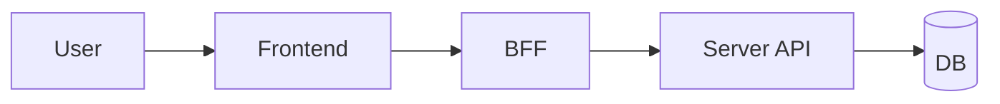

# FEATURE-{번호}: {기능명}

## TL;DR

- 

## 배경과 문제

- 

## 목표

- 

## 사용자 시나리오

1. 
2. 
3. 

## 기능 요구사항

| ID | 요구사항 | 우선순위 | 상태 |
|---|---|---|---|
| FR-1 |  | Must | Draft |

## 비기능 요구사항

| 구분 | 요구사항 |
|---|---|
| 성능 |  |
| 접근성 |  |
| 보안 |  |
| 장애 처리 |  |
| 관측성 |  |

## UX 상태

- Loading:
- Empty:
- Error:
- Unauthorized:
- Success:

## 정책과 제약

- 

## 화면/프론트엔드 영향

| App | Route/Component | 변경 내용 |
|---|---|---|
| shell |  |  |

## BFF/API 영향

| Method | Path | Auth | Request | Response | Status |
|---|---|---|---|---|---|
| GET |  |  |  |  | Draft |

## 서버/DB/Worker 영향

| Layer | 위치 | 영향 |
|---|---|---|
| Server |  |  |
| DB |  |  |
| Worker |  |  |

## 이벤트/상태 흐름

## Trace Matrix

| 요구사항 | 화면/컴포넌트 | BFF/API | 서버/API | DB/Worker | 검증 |
|---|---|---|---|---|---|
| FR-1 |  |  |  |  |  |

## 수용 기준

- [ ] 

## 검증 계획

- 

## Open Questions

- 

## 변경 이력

| 날짜 | 변경 |
|---|---|
| YYYY-MM-DD | 초안 작성 |
