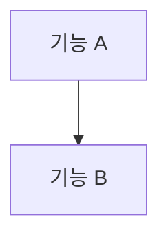
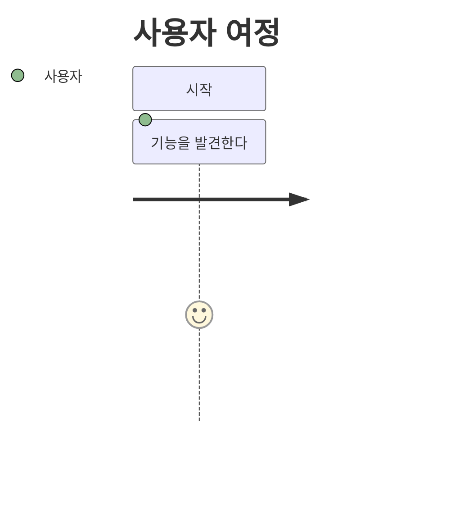

# {기능군} 기능 명세 보고서

작성일: YYYY-MM-DD  
문서 목적: 이 기능군이 사용자에게 제공하는 가치, 요구사항, UX 상태, 우선순위를 PM 관점에서 정리한다.  
주의: 이 문서는 코드 설명서가 아니라 제품 기능 명세다.

## TL;DR

- 

## 제품 컨셉

- 이 기능군이 해결하는 문제:
- 사용자에게 주는 핵심 가치:
- 제품 내 역할:

## 대상 사용자

### 1. {사용자 유형}

- 

## 기능 전체 맵

## 기능 목록

| 기능 | 설명 | 사용자 이점 | 우선순위 |
|---|---|---|---|
|  |  |  | Must |

## {기능명}

### 기능 설명

- 

### 사용자 이점

- 

### 주요 요구사항

| ID | 요구사항 |
|---|---|
| FR-1 |  |

### UX 상태

- Loading:
- Empty:
- Error:
- Unauthorized:
- Success:

### 우선순위

Must / Should / Could

## 사용자 여정

## 제품 리스크와 정책

| 리스크 | 설명 | 정책 |
|---|---|---|
|  |  |  |

## 핵심 성공 지표

| 지표 | 의미 |
|---|---|
|  |  |

## MVP 범위

1. 

## 후속 확장

1. 
