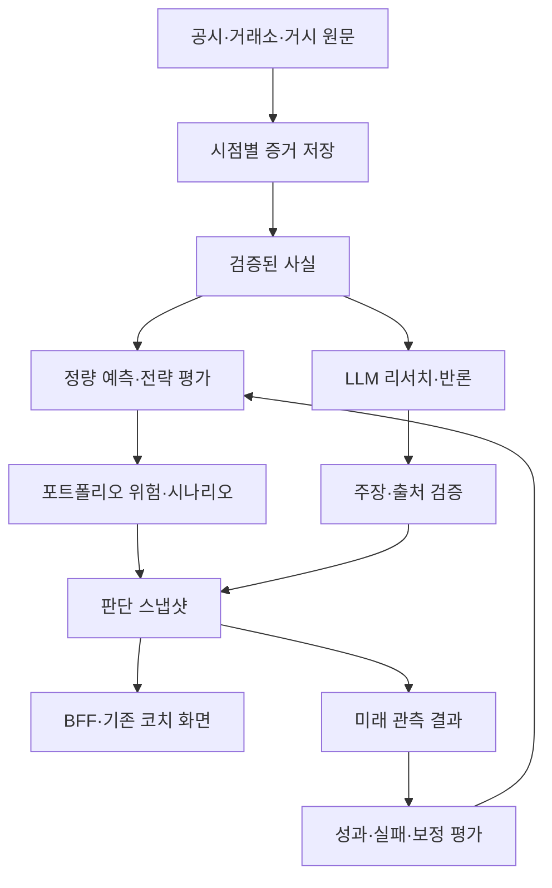

# SALT AI 투자 워크벤치 — 구현 설계 초안

작성: 2026-09-24 · 상태: 제안, 미구현 · 근거: [코드·웹 심층 조사](../../reports/feature-audits/2026-09-24-ai-investment-deep-research.md)

기존 F004·F008을 확장하는 설계다. 새 기능 ID나 채택된 ADR로 간주하지 않는다. 숫자는 서버/예측 엔진, 문장은 LLM, 전망은 기존 소유자 권한을 따른다. 자동 주문은 범위에 포함하지 않는다.

## 1. 제품이 대답할 질문

종목을 열었을 때 사용자는 “어떤 사실이 달라졌는가, 투자 논리는 무엇인가, 무엇이 그 논리를 깨뜨리는가, 내 자산에는 어떤 영향인가, 과거에도 도움이 됐는가”를 한 흐름으로 읽는다.

첫 화면은 **오늘의 판단 메모**다. 그 아래 근거·반론·시나리오·내 위험·검증 성적을 펼친다. 코치·해설·변동 범위·사건이 같은 판단 스냅샷을 공유한다. 설명이 길어졌다는 이유로 분석이 더 정확해 보이게 만들지 않는다.

예시 문구는 실제 분석 결과가 아닌 화면 설계다:

> BTC · 1주 관점 · 기준 시각 표시
>
> 관찰 유지 — 비용 후 방향 우위가 아직 검증되지 않았습니다.
>
> 확인된 변화 / 상승 논리 / 하락 논리 / 판단을 바꿀 조건
>
> 현재 보유 비중과 하락 시 계좌 영향 / 다음 점검 사건 / 원문 자료

자료 부족이면 “관망 추천”을 지어내지 않고 **판단 보류·부족한 자료·재점검 시점**을 표시한다.

## 2. 기능 사양

### W01. 출처가 연결된 딥 리서치 메모

- 입력: 자산 식별자, 투자 기간, 기준 시각, 질문, 허용 데이터 범위.
- 조회: 공시·공식 통계·거래소 공지 우선. 뉴스는 원문 존재·발표 시각·중복·자산 관련성을 확인.
- 출력: 핵심 변화 3개 이내, 상승·하락 논리 각각, 논리를 무효화하는 관측 조건, 미확인 정보, 출처 링크.
- 주장마다 `claimType = fact | interpretation | hypothesis`, `sourceIds`, `asOf`를 연결.
- 동일 보도 재전송은 독립 근거로 세지 않는다. 오래된 기사 재발행은 원 발표일을 보존한다.
- 사실과 해석을 연결하되 “가격이 올랐다”에서 “이 뉴스 때문에 올랐다”로 자동 비약하지 않는다.
- 문서 안의 명령은 자료로만 취급한다. 검색·다운로드 도구는 허용 도메인·크기·타임아웃을 제한한다.
- 숫자는 검증된 `factId`를 통해 서버 렌더러가 삽입한다. 금융 수치의 단위·부호·기간이 일치해야 한다.
- 실패: 일부 출처 실패는 누락 표시, 핵심 가격/공시 충돌은 관련 판단 보류. 이전 메모 재사용 시 이전 기준 시각 표시.

**수용:** 잘못된 종목 공시·부호 반전·수정 공시·중복 기사·근거 없는 인과·기사 내 프롬프트 명령을 포함한 고정 평가 묶음에서 검증한다. 핵심 사실 출처 연결률은 100%를 제품 요구사항으로 삼되 이것이 사실 정확도 100%라는 뜻은 아니다. 사람 평가에서 사실 일치·반론 누락·읽기 유용성을 별도 측정한다.

### W02. 포트폴리오 위험 지도

- 입력: 기준 시각이 있는 보유 수량/가격/통화, 현금, 투자 기간, 손실 예산, 자산별 가격 이력.
- 기존 입력 포트폴리오 재사용. 계좌 연동 없이 수동 입력도 가능하며 평가 시각을 명시한다.
- 출력: 종목 집중·자산군 집중·공통 요인 노출·위험 기여도·과거/가정 스트레스 손실.
- 변동성은 `sqrt(wᵀΣw)`로 계산하고 공분산 추정 기간·빈도·수축 방법을 공개한다.
- 시장 공통 하락과 상관 상승을 반영한 스트레스도 제공한다. 정규분포만으로 꼬리 손실을 확정하지 않는다.
- 주식 휴장·코인 24시간 거래를 같은 시각 기준으로 맞춘다. 데이터가 없는 날을 무조건 0% 수익으로 채우지 않는다.
- 시계열·잔고·환율이 부족하면 부분 계산과 제외 금액을 표시한다. 전체 위험이 낮다고 결론 내리지 않는다.

**수용:** 동일 자산을 여러 줄로 나눠도 결과 불변, 완전 상관 자산 추가로 가짜 분산 개선 금지, 단일 종목 한도·현금·환율 반영, 데이터 누락 시 계산 불가 상태 확인.

### W03. 조건별 투자 금액 시뮬레이터

- 비교: 현재 유지 / 사용자가 정한 일부 비중 변경 / 현금 확대.
- 금액·평가손익·수수료·불리한 체결 비용·스트레스 손실은 서버 Decimal 계산.
- 매수 수량의 검토 상한: `min(손실 예산 / (진입가−손절가+단위당 비용·갭 가정), 비중 한도 수량, 유동성 한도 수량, 가용 현금 수량)`.
- 위 식은 진입가가 손절가보다 큰 현물 매수 시나리오의 한도식이며 최적 비중이나 최대 손실 보장이 아니다.
- 기간 말 가격 범위와 기간 중 손절/익절 도달 확률을 구별한다. 현재 주간 분위수만으로 장중 도달 확률을 만들지 않는다.
- 역사적 스트레스에는 확률을 붙이지 않는다. 모형 시나리오 확률은 별도 보정 검증이 있을 때만 제공한다.
- 사용자 제약이 없으면 임의의 적극적 배분 대신 입력 필요 상태를 반환한다.

**수용:** 현금 초과·음수/NaN/Infinity·손절가 역전·통화 혼합·비용 누락을 차단. 작은 가격·큰 금액·수량 정밀도·호가 단위 검사. 일봉 하나에서 익절·손절 모두 닿으면 유리한 체결 순서를 가정하지 않는다.

### W04. 비용 후 성과 연구실

- 전략 후보는 우선 단순 추세·변동성 조절·현재 코치 규칙. 주식 가치/퀄리티는 재무 데이터 준비 후 별도.
- 기록: 전략/모형/파라미터/특성/데이터 버전, 시도 수, 대상 집합, 분할 기간, 비용 가정, 결과.
- 예측 평가와 거래전략 평가를 분리한다. 분위수 개선만으로 “돈 버는 전략”으로 승격하지 않는다.
- 기준: 매수 후 보유, 동일 납입의 정기 적립, 현금, 동일 위험 수준의 단순 추세. 보유 비중 변화는 시차를 두고 다음 거래 가능한 시점에 반영.
- 보고: 순성과, 시간순 자산곡선 MDD, Sharpe/Sortino와 표본 불확실성, 회전율, 최악 구간, 노출, 비용 민감도, 보류 비율.
- 신규 투자금과 인출을 분리하고 기간 수익률을 현금흐름에 맞게 계산한다. 전략 비교는 공통 TWR 기준, 사용자 실제 경험은 필요 시 MWR 별도.
- 무위험률·연환산 기준·통화·거래일 달력·상폐 처리·체결 지연을 결과에 명시한다.
- 워크포워드·중첩 제거·엠바고·시간 블록 재추출을 적용하고 최종 검증 구간은 개발 중 반복 열람하지 않는다.
- 여러 코인의 같은 날 수익을 독립 표본으로 세지 않는다. 데이터가 짧으면 그 사실을 표시한다.

**승격 조건:** 데이터 무결성 → 사전 지정 OOS 기준 충족 → 비용 상승 민감도 → 최대 손실 예산 → 독립 모의운용 → 기록된 검토. 임계 수치는 실험 전에 전략별로 정한다. 유의하지 않으면 “우위 미확인”으로 남긴다. 기존 운영 앙상블은 새 모델이 이겼다는 증거 전까지 유지한다.

### W05. 사건·투자 논리 모니터

- 거시: 기존 FOMC/CPI/고용 일정 재사용. 실제 공개 기록과 일정 변경 이력 보완.
- 주식: 실적·가이던스·희석·채무·현금흐름 공시. 코인: 업그레이드·토큰 해제·상장/거래 중단·보안 사건.
- 컨센서스가 있을 때만 `실제−당시 예상`을 계산. 예상값이 없으면 서프라이즈 없음이 아니라 계산 불가.
- 이전 메모의 무효화 조건을 새 사실과 비교해 “어떤 논리가 왜 바뀌었는가” 알림.
- 뉴스 개수 증가나 가격 급등만으로 매매 알림을 보내지 않는다. 중복 제거·빈도 제한·사용자 보유/관심 관련성 적용.

**수용:** 일정 연기·공시 정정·동시 사건·오래된 기사·출처 실패를 처리하고 알림이 참조하는 이전 메모와 새 사실이 재현 가능해야 한다.

### W06. 판단 기록·성과 귀속

- 판단 전 `DecisionSnapshot` 저장: 입력 출처, 원문 버전, 판단/기각 이유, 보유 상태, 기간, 대안, 전략/프롬프트 버전.
- 결과는 새 `DecisionOutcome`으로 추가하고 이전 판단을 다시 쓰지 않는다. 수정이 필요하면 정정 레코드와 이유를 남긴다.
- `live`, `backtest`, `synthetic` 분리. 기록 시각 이전 결과를 실측 성과로 넣지 않는다.
- 성공·실패·관망 모두 같은 표본 정책으로 집계. 실현되지 않은 결과는 성과에 포함하지 않는다.
- 수익 원천을 시장 노출·종목 선택·비중 변경·비용으로 가능한 범위에서 분해. 분해 모형과 잔차 명시.
- 사용자 거래를 관찰하지 못하면 “제안의 모의 결과”이며 “실제 계좌 수익”이 아니다.

**수용:** 시드가 실측 게이트를 열지 않음, 버전 변경으로 예전 전략 결과가 새 전략 실적에 섞이지 않음, 같은 날짜 자산 묶음의 종속성 표시, 최악 관찰 수익률과 MDD 명칭 분리.

## 3. 데이터 계약 초안

기존 API를 즉시 바꾸는 문서가 아니다. 실제 구현 시 각 영역 REQ와 공용 DTO를 함께 확정한다.

| 객체 | 필수 내용 |
|---|---|
| AssetIdentity | 자산 ID, 자산군, 거래소, 호가 통화, 주식 CIK/고유번호 또는 체인·컨트랙트; ticker 단독 조인 금지 |
| EvidenceSnapshot | ID, 자산 ID, 관측/공개/수집 시각, 원문 URL, 문서 해시, 수정 버전, 공급자, 사용 범위 |
| VerifiedFact | ID, 지표명, 값, 단위, 부호, 대상 기간, 연결/별도 등 기준, evidence ID, 충돌/누락 상태 |
| ResearchMemo | snapshot ID, 기간, 주장·반론·무효화 조건, fact IDs, 모델/프롬프트 버전, 생성/만료 시각 |
| RiskSnapshot | portfolio ID/version, 기준 통화/시각, 포함/제외 자산, 가격 커버리지, 계산 모형/가정, 위험·스트레스 결과 |
| StrategyExperiment | 데이터/전략 버전, 실험 번호, train/validation/test 구간, 기준 전략, 비용 모형, 성과·신뢰구간 |
| DecisionSnapshot | 판단 시각, 자료 스냅샷, 보유 버전, 기간, 제안/보류, 이유, 제약, sampleOrigin |
| DecisionOutcome | 원 판단 ID, 성숙 시각, 결과 관측 시각, 평가 방식, 비용, 순성과, 기준 대비 차이 |

응답 공통: `asOf`, `horizon`, `currency`, `sourceRefs`, `dataQuality`, `modelVersion`, `status`, `limitations`.
상태: `ready | partial | insufficient_data | stale | unvalidated | unavailable`. 결측을 숫자 0으로 표현하지 않는다.

권장 신규 계약:

| 요청 | 동작 |
|---|---|
| `POST /api/coach/research` | 자산·기간·질문으로 작업 생성. 서버가 자료 조립, 202+jobId |
| `GET /api/coach/research/:jobId` | 작업/결과 조회. 사용자 권한 검증 |
| `GET /api/coach/research/:jobId/events` | 실제 수집·검증·조립 단계 SSE |
| `GET /api/coach/portfolio-risk` | 사용자 보유 버전의 위험 결과 |
| `POST /api/coach/scenarios` | 사용자 조건과 서버 보유 자료로 가상 비교 |
| `GET /api/coach/decision-history` | 본인 판단·결과 페이지 조회 |

기존 explain은 서버 snapshot ID 참조 방식으로 이행한다. 구버전 본문 사실을 새 신뢰 자료로 받아들이지 않는다. SSE에는 검증되지 않은 원문 LLM 출력을 흘리지 않는다. 준비된 사실 카드만 먼저 제공하고 최종 메모로 교체한다.

## 4. 기존 코드에 연결하는 위치

- `salt-forecast`: 수집·시점 고정·특성·통계·전략 평가. 모델 층이 DB나 UI 책임을 갖지 않도록 기존 층 규칙 유지.
- `salt-server/coach`: 서버 자료 조립, 사용자 제약, 판단 게이트, 리서치 작업, 계산된 위험/결과 제공.
- DB 변경은 `salt-server/prisma`가 소유. 전망 스키마의 뷰 계약 변경은 Python·서버 동시 검증.
- `bff`: 응답 조립·SSE·부분 실패 격리. 비용·위험·예측 재계산 금지.
- `entities/coach`: 사실/위험/성적표 타입과 표시. `features`: 시나리오 입력·리서치 실행. `widgets/symbol-analysis`: 기존 네 카드의 통합 구성.
- 금융 수치는 LLM 계산을 채택하지 않는다. 모델이 제안한 새 지표도 코드·데이터 검증 전에는 가설이다.

## 5. 단계별 구현 묶음

| 단계 | 범위 | 변경 영역 | 종료 기준 |
|---|---|---|---|
| A | C01~C06 신뢰성 수정 | 서버·DB·BFF·FE | 출처/기간/성과 정의 정합, 재현 문제 차단 |
| B | 불변 사실·판단 기록과 BTC/ETH 리서치 | Python·서버·DB·BFF·FE | W01/W06, 원문 클릭·보류·폴백·권한 검증 |
| C | 위험 지도·시나리오 | 서버·Python·FE | W02/W03, 단위/현금/상관/갭 손실 검사 |
| D | 비용 후 전략 연구실·모의 운용 | Python·DB·서버·FE | W04, 재현 가능한 평가·우위 미확인 표시 |
| E | 사건 변화·주식 공시 분석 | 수집·서버·FE | W05, 공시/기업행위/라이선스 준비 |
| F | 방향·기대손익 등 확장 | 예측·서버·FE | 해당 자산/기간 OOS 검증 후 소유자에게만 |

이 순서는 의존성 기준이며 일정 약속이 아니다. 개발 속도로 독립 실측 기간을 단축할 수 없다. 리서치 품질과 수익성의 완료 기준도 별개다.

## 6. 출시와 운영 기준

- 자동 주문·계좌 API 키 없이 구현한다. 현재 소유자 전용 전망 권한을 백엔드에서 유지한다.
- 사용자의 손실 한도·현금 필요·기간은 입력받고, 없으면 제약 기반 금액 제안을 보류한다.
- 공급자 장애는 빈 숫자 생성으로 덮지 않는다. 마지막 정상 결과의 기준 시각·만료·제외 자료를 표시한다.
- 요청당 검색/문서/토큰 예산, 중복 요청 결합, 취소 전파, 전역 재시도 시간 상한을 둔다.
- 메모 비용·p50/p95 지연·근거 오류율·보류율·사용자 수정률을 관측한다. 숫자 목표는 파일럿 측정 후 확정한다.
- 회귀 평가에서는 문장의 자연스러움보다 사실의 종목·기간·단위·부호 일치를 우선한다.
- 새 전략의 평가가 나쁘면 리서치·위험 화면은 제공하되 매매 우위는 표시하지 않는다.
- 서버/API 구현 전 영역별 REQ를 동기화하고, DB 마이그레이션·하위 호환·롤백·권한 테스트를 해당 묶음에 포함한다.

**완성의 의미:** 모든 미래 가격을 맞히는 상태가 아니라, 근거·계산·불확실성·성과가 연결되고 데이터가 부족하거나 틀렸을 때 이를 발견하고 판단을 철회할 수 있는 상태다.

## 7. 외부 심층 조사에서 추가된 요구사항 (2026-09-24)

근거: [외부 웹 조사](../../reports/feature-audits/2026-09-24-external-investment-research.md). 모두 미구현 제안이다.

- W01 출처 검증: 논문·공시의 버전, 정정·철회 상태를 보존한다. 철회된 결과는 검증된 성과의 근거로 사용하지 않는다.
- W01 주식 분석: 당시 컨센서스와 실제 발표·가이던스·추정치 수정을 구분한다. 역산 가치평가는 모형 가정으로 표시한다.
- W04 과거 평가: LLM이 과거 사건의 결과를 알고 있을 위험을 평가 한계에 포함한다. 날짜 프롬프트만으로 누수 제거를 주장하지 않는다.
- W05 수급 자료: 지갑 라벨의 최초 부여·탈락 시각을 보존한다. 현재 성공 지갑 목록을 과거 검증에 소급 적용하지 않는다.
- W05 사건 의미: 언락/유통/매도, 거래소 입금/체결, 모형 청산 히트맵/실제 청산을 별개 필드로 다룬다.
- W06 성과: 시장 공통 노출과 전략 추가 효과를 구별하고, 새 자료를 제거한 비교 실험으로 데이터 구매의 실효성을 검증한다.
