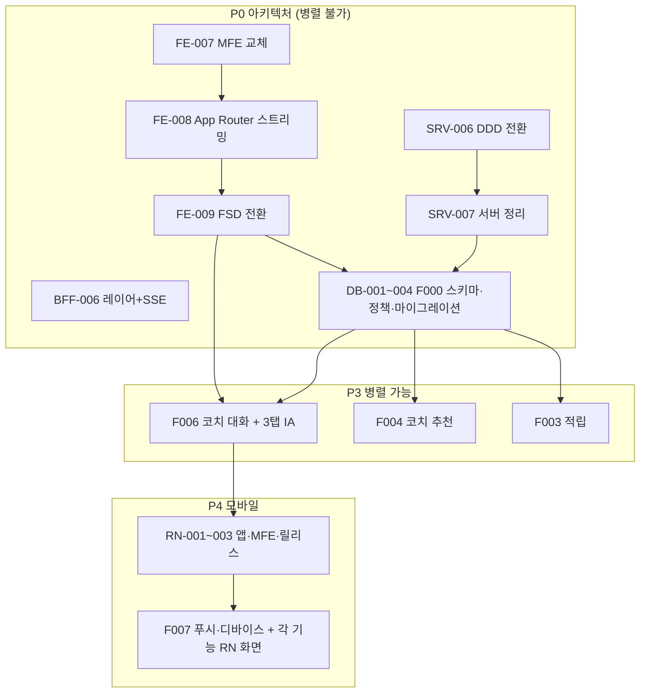

# SALT 요구사항 마스터 인덱스 — 조직이 이것만 보고 다 만들 수 있게

Created: 2026-09-09
Status: In Progress
선행 결정: `requirements/decisions/ADR-001-microfrontend-replacement.md`
제품 정의: `requirements/specs/in-progress/salt-solo-rebuild-global-plan.md`

## 0. 이 문서가 하는 일

기능 기획(PM)은 `pm/requirements/specs/**`에 있다. **이 문서는 그 기획을 영역별 실행 문서로 분해한 지도**다. 각 셀이 실제 파일 하나이고, 담당자는 자기 셀만 읽어도 착수할 수 있다.

## 1. 문서 축 — 기능 × 영역 × 종류

### 기능 (7)

| 코드 | 기능 | PM 기획서 |
|---|---|---|
| **F000** | 정리·편집 (죽은 코드 제거 · 자산군 확장 · 초대제 · 기존 화면 수리) | `FEATURE-000-scope-reset.md` |
| ~~**F001**~~ | ~~개입 청구서 (반사실 3트랙 · 거래별 귀속 · 원장 import)~~ — **폐기 2026-09-21 (`ADR-002`)** | 삭제됨 |
| ~~**F002**~~ | ~~세금 마감 콕핏 (자산군 3종 · 손실수확 솔버 · 환율 함정 · 스텝업)~~ — **폐기 2026-09-21 (`ADR-002`)** | 삭제됨 |
| **F003** | 밸류에이션 밴드 적립 (MVRV Z · CAPE · 김프 · 실패 이력) | `FEATURE-003-valuation-band-accumulation.md` |
| **F004** | AI 코치 추천 (3종 세트 게이트 · 성적표 · 익절 플랜 · preflight) | `FEATURE-004-ai-coach-screen.md` |
| **F006** | 코치 대화 & 3탭 IA (대화가 제품의 핵심 · PC MovableGrid) | `FEATURE-006-coach-conversation-ia.md` |
| **F007** | 모바일 앱 (React Native · iOS+Android · 푸시 · 번들 MFE) | `FEATURE-007-mobile-app.md` |

> F005는 결번이다. `FEATURE-005-home-briefing.md`의 5탭 IA는 2026-09-09 결정(탭 축소·대화 중심)으로 **F006이 대체**한다. 홈 블록 요구사항만 F006으로 흡수한다.

### 영역 (5)

| 코드 | 영역 | 경로 | 방법론 |
|---|---|---|---|
| `DB` | 데이터베이스 | `salt-server/prisma/**` | Prisma + PostgreSQL |
| `SRV` | 서버 | `salt-server/src/**` | **DDD (컨텍스트 우선)** |
| `BFF` | BFF | `bff/src/**` | 레이어드 + SSE |
| `FE` | 웹 | `salt-microFe/apps/web`, `apps/web-tax` | **FSD** + App Router + Multi-Zones |
| `RN` | 모바일 | `salt-microFe/apps/mobile` | **FSD** + Shared/Service 번들 |

### 종류 (4) — 영역마다 같은 자리를 채운다

| 자리 | DB | SRV | BFF | FE | RN |
|---|---|---|---|---|---|
| **형태** | `SCHEMA` 모델·컬럼·인덱스 | `DATA` 컨텍스트·모듈·워커·외부연동 | `UPSTREAM` 서버 호출 계약 | `UI` 화면·컴포넌트·상태·접근성 | `UI` 화면·네이티브·접근성 |
| **기능** | `FUNC` 제약·불변식·정책 | `FUNC` 도메인 로직·엔진 | `FUNC` 조립·격리·폴백 | `FUNC` 기능 규칙·클라이언트 로직 | `FUNC` 기능 규칙·오프라인 |
| **인터페이스** | `MIGRATION` 백필·롤백 | `API` REST 계약 | `API` 프론트 대면 계약 | `API` BFF 호출 계약·훅 | `API` BFF 호출·번들 로딩 |
| **성능** | `PERF` | `PERF` | `PERF` | `PERF` | `PERF` |

## 2. 전체 문서 지도 (145개 · 전부 작성 완료)

번호는 영역 안에서 연속이다. 기존 완료 REQ와 겹치지 않게 시작 번호를 잡았다: `DB` 001부터, `SRV` 006부터(001~005 done), `BFF` 006부터(001~005 done), `FE` 010부터(001~004 done, **005·006은 `feature/repo-ui-component` 브랜치에 done**), `RN` 001부터.

### 아키텍처 전환 (기능 무관 · 최우선)

| ID | 문서 | 내용 |
|---|---|---|
| `FE-REQ-007` | MFE 교체 | `nextjs-mf` 제거 → Multi-Zones 2 zone. 3앱 → `apps/web` + `apps/web-tax` |
| `FE-REQ-008` | App Router + 스트리밍 SSR | 라우팅 이관, RSC 경계, Suspense 스트리밍, SSE와 비교 측정 |
| `FE-REQ-009` | FSD 전환 | 레이어 5 + 슬라이스 레지스트리 + layer-check 훅 + `packages/tokens`·`core` 추출 |
| `SRV-REQ-006` | DDD 전환 | 컨텍스트 우선 4층. 현재 `modules/*` → `{context}/{domain,application,infrastructure,presentation}` |
| `SRV-REQ-007` | 서버 정리 (삭제·동면) | 삭제 5건 · 동면 4건 · 410 Gone. **grep 근거 첨부** |
| `BFF-REQ-006` | 레이어 정리 + SSE 기반 | route/controller/service 경계 재정의, 스트리밍 송신 |
| `RN-REQ-001` | RN 앱 신설 | `apps/mobile`, Expo prebuild, iOS+Android, FSD, `packages/ui-native` |
| `RN-REQ-002` | RN 마이크로프론트엔드 | Shared/Service 번들, ESBuild, CDN, 카나리 (토스 방식) |
| `RN-REQ-003` | 릴리스·스토어 | 코드 서명, TestFlight/Play 내부 테스트, OTA 정책, 버전 게이트 |

### 기능 × 영역 × 종류

| 기능 | DB (SCHEMA/FUNC/MIGRATION/PERF) | SRV (FUNC/API/DATA/PERF) | BFF (FUNC/API/UPSTREAM/PERF) | FE (UI/FUNC/API/PERF) | RN (UI/FUNC/API/PERF) |
|---|---|---|---|---|---|
| **F000** | `DB-001` `DB-002` `DB-003` `DB-004` | `SRV-008` `SRV-009` `SRV-010` `SRV-011` | `BFF-007` `BFF-008` `BFF-009` `BFF-010` | `FE-010` `FE-011` `FE-012` `FE-013` | `RN-004` `RN-005` `RN-006` `RN-007` |
| ~~F001~~ | 결번 (`ADR-002`) | 결번 | 결번 | 결번 | 결번 |
| ~~F002~~ | 결번 (`ADR-002`) | 결번 | 결번 | 결번 | 결번 |
| **F003** | `DB-013` `DB-014` `DB-015` `DB-016` | `SRV-020` `SRV-021` `SRV-022` `SRV-023` | `BFF-019` `BFF-020` `BFF-021` `BFF-022` | `FE-022` `FE-023` `FE-024` `FE-025` | `RN-016` `RN-017` `RN-018` `RN-019` |
| **F004** | `DB-017` `DB-018` `DB-019` `DB-020` | `SRV-024` `SRV-025` `SRV-026` `SRV-027` | `BFF-023` `BFF-024` `BFF-025` `BFF-026` | `FE-026` `FE-027` `FE-028` `FE-029` `FE-034` | `RN-020` `RN-021` `RN-022` `RN-023` |
| **F006** | `DB-021` `DB-022` `DB-023` `DB-024` | `SRV-028` `SRV-029` `SRV-030` `SRV-031` | `BFF-027` `BFF-028` `BFF-029` `BFF-030` | `FE-030` `FE-031` `FE-032` `FE-033` | `RN-024` `RN-025` `RN-026` `RN-027` |
| **F007** | `DB-025` `DB-026` `DB-027` `DB-028` | `SRV-032` `SRV-033` `SRV-034` `SRV-035` | `BFF-031` `BFF-032` `BFF-033` `BFF-034` | — | `RN-028` `RN-029` `RN-030` `RN-031` |

파일명 규칙: `<AREA>-REQ-<NNN>-<F기능>-<종류>.md`
예: `DB-REQ-005-F001-SCHEMA.md` · `FE-REQ-026-F004-UI.md` · `RN-REQ-024-F006-UI.md`

## 3. 규칙 문서 (하네스)

REQ가 참조하는 권위 문서다. **REQ보다 먼저 읽는다.**

### `salt-microFe/.claude/rules/`

| 문서 | 상태 | 내용 |
|---|---|---|
| `layered-architecture.md` | 신규 | 네 서피스(web · mobile · bff · server)와 슬라이스 레지스트리 |
| `fsd-shared.md` `fsd-entities.md` `fsd-features.md` `fsd-widgets.md` `fsd-pages.md` | 신규 | FSD 레이어별 import 규칙과 구조 |
| `microfrontend.md` | **개정** | `nextjs-mf` → Multi-Zones. zone 경계 기준 |
| `streaming-ssr.md` | 신규 | App Router RSC 경계 · Suspense 스트리밍 · SSE 소비 |
| `rn-architecture.md` | 신규 | RN 앱 구조 · 네이티브 모듈 경계 · 플랫폼 분기 |
| `rn-microfrontend.md` | 신규 | Shared/Service 번들 · ESBuild · CDN · 카나리 |
| `performance-frontend.md` | 신규 | 웹 예산 · RSC/스트리밍 성능 · 가상화 · 번들 |
| `performance-rn.md` | 신규 | 앱 시작 · 프레임 · 번들 로딩 · Hermes · 메모리 |
| `design-system.md` | **개정** | `packages/tokens` 도입, 웹/RN 어댑터 분리 |

### `salt-server/.claude/rules/`

| 문서 | 상태 | 내용 |
|---|---|---|
| `server-architecture.md` | 신규 | 컨텍스트 우선 DDD 4층 (Express + TS) · 컨텍스트 레지스트리 |
| `ddd-shared.md` `ddd-domain.md` `ddd-application.md` `ddd-infrastructure.md` `ddd-presentation.md` | 신규 | 레이어별 import 규칙 |
| `module-architecture.md` | **개정** | 기존 `modules/*` 패턴 → DDD 이관 매핑 |
| `performance-server.md` | 신규 | 예산 · 트랜잭션 · N+1 · 페이징 · 워커 풀 |
| `performance-database.md` | 신규 | 인덱스 · 실행계획 · 락 · Decimal · VACUUM |

### `bff/.claude/rules/`

| 문서 | 상태 | 내용 |
|---|---|---|
| `bff-architecture.md` | 신규 | 레이어 경계 · 뷰모델 소유권 · 부분 실패 격리 |
| `streaming-sse.md` | 신규 | SSE 계약 · 하트비트 · 재연결 · 취소 전파 |
| `performance-bff.md` | 신규 | 예산 · allSettled · 캐시 · WS 구독 정책 |

### 공통

| 문서 | 상태 | 내용 |
|---|---|---|
| `.claude/hooks/layer-check.mjs` | 신규 | 쓰기 시점 레이어 위반 차단 (DevAtlas 이식) |
| `requirements/decisions/ADR-*.md` | 신규 | 되돌리기 비용이 큰 결정 기록 |

## 4. 실행 순서 — 무엇이 무엇을 막는가

| 단계 | 내용 | 근거 |
|---|---|---|
| **P0** | 아키텍처 전환 + F000 정리 | 이 위에 100개 문서가 올라간다. 나중에 하면 전부 다시 쓴다 |
| ~~P1 · P2~~ | ~~F001 원장 · F002 세금~~ | **폐기 2026-09-21 (`ADR-002`).** P0 다음이 곧 P3 다 |
| **P3** | F003 · F004 · F006 병렬 | 서로 막지 않는다. F006은 FE-009(FSD) 완료 후 |
| **P4** | RN + F007 | 웹 계약이 확정된 뒤 시작한다. BFF 계약을 두 번 만들지 않기 위해 |

## 5. 하드 마감 (2026-09-09 기준) — **F002 폐기로 소멸 (2026-09-21, `ADR-002`)**. 기록으로 둔다

| 날짜 | 무엇 | D-Day |
|---|---|---|
| 2026-12-29 (화) | 미국주식 손실 수확 실무 권고 마감 | **D-111** |
| 2026-12-30 (수) | 미국주식 2026 귀속 마지막 매도(12/31 결제) | **D-112** |
| 2026-12-31 (목) | 크립토 비과세 매도 마감 / 의제취득가액 기준일 | **D-113** |
| 2027-01-01 00:10 KST | 크립토 2026-12-31 시가 스냅샷 수집 (1회성, 되돌릴 수 없음) | D-114 |
| 2027-05-01~06-01 | 2026 귀속 해외주식 양도소득세 신고 | — |

## 6. 전 영역 공통 수용 기준

기능별 수용 기준과 별도로, **모든 REQ가 이것을 만족해야 done**이다.

- [ ] 추천을 렌더하는 모든 화면에 **근거 · 과거 적중률 · 실패사례** 3종이 함께 있다. 하나라도 없으면 렌더하지 않는다 (글로벌 플랜 1-3절)
- [ ] **주문을 실행하는 코드 경로가 없다.** 거래소 API 키를 받지 않는다(계좌 연동은 영구 Non-Goal)
- [ ] 금액 계산은 **서버에서** 한다. 프론트는 표시만, LLM은 문장만
- [ ] 확신 표현("확실", "무조건", "보장", "100%")과 목표주가·수익률 예측이 0건이다
- [ ] 2인칭 인격 평가가 0건이다. 행동은 **사실 서술**로만 렌더한다
- [ ] 초대 코드 없이 계정이 생성되지 않는다
- [ ] 레이어 위반이 0건이다 (`layer-check` 훅 통과)
- [ ] 해당 영역 `PERF` 문서의 예산을 측정값으로 만족한다
- [ ] 원장 3종(`PortfolioTransaction` · `PortfolioHolding` · `PriceHistory`) row 수가 보존된다

## 7. 상태 추적

### 작성 현황 (2026-09-11)

**요구사항 문서 145개가 전부 작성되었다.** 구현 진행 상황:

| REQ | 상태 | 비고 |
|---|---|---|
| `FE-REQ-007` MFE 교체 | **done** | Multi-Zones 전환(`apps/web` + `apps/web-tax`). 미충족 6건 중 **2건이 닫혔다** — §4-6(브라우저 확인)은 `FE-REQ-008`, §4-4(레이어 검사 수단)는 `FE-REQ-009`. 남은 4건은 판정 대상(경로·배포 인프라·zone 넘나드는 기능·스트리밍 전제 화면)이 **아직 없어서** 이 REQ 안에서 닫을 방법이 없다. `checklists/FE-REQ-007.md` §4 |
| `FE-REQ-008` App Router + 스트리밍 SSR | **done** | 두 zone 모두 App Router. 스트리밍 게이트 **첫 블록 p95 31.9ms**(기준 300ms), 번들 증가 최대 +16.2 kB gzip(예산 40KB). 미충족 7건 중 **2건이 닫혔다**(§6-1 FSD pages 레이어 → `FE-REQ-009`, §6-7 Codex 미러 → 하네스 제거). **§6-4(인증 토큰이 `localStorage`)는 이 REQ 의 실제 미달**이고 `FE-REQ-013`이 담당한다. `checklists/FE-REQ-008.md` §6 |
| `FE-REQ-009` FSD 전환 | **done** | 두 zone 모두 6레이어. 슬라이스 8개(`auth`·`goal`·`market`·`portfolio` / `sign-in`·`add-goal` / `home-briefing`·`market-board`). `layer-check` 훅 + `@repo/fsd/layers` lint가 **같은 규칙 표 하나**를 읽는다(차단 8 · 통과 5 테스트). 렌더 동일성 4경로 × 3뷰포트 통과, 공통 청크 증가 **0**. 남은 것은 `checklists/FE-REQ-009.md` §8 — 이 REQ 미달 2건(FR-37 · `/investments` +7kB), 범위 밖 5건 |
| `SRV-REQ-006` DDD 전환 | **in-progress (4/4단계)** | `shared` Kernel + `layer-check` 훅·ESLint(1) · `coach/domain/policy` 추출 + 특성화 테스트 23건(2) · `news`·`market`·`portfolio` 이관(3, FR-32a) · **`coach` 통합(4, FR-32)**. 컨텍스트 **4개** · 동사형 유스케이스 **49개** · 공개 API **17개**. `modules` 15 → 12 → **8개**(원문 29파일 3,538줄 삭제). 테스트 18 → 85 → **137건**. 4단계에서 **같은 이름의 값이 경로마다 다르게 정의돼 있던 것**(기술 지표 주기 `m5` vs 무관)이 드러나 통일했다. 그 뒤 **미충족 8건을 닫았다**(§12) — **수익률 예측(`expectedReturn`) 제거**, 외부 호출 타임아웃·지수 백오프(캔들 수집 실패 **다수 → 0건**), `external/` 삭제, 한글 뉴스 언어 필터 복구, 공개 LLM 경로 요청 제한. 테스트 **153건**. 남은 12건은 전부 `ledger`(F001)·`DB-REQ-*`·**FR-33(`SRV-REQ-007`)**·프론트 계약을 기다린다. 상세는 `checklists/SRV-REQ-006.md` §10~§13 |
| `FE-REQ-010` F000 UI | **in-progress** | 수리 9건(FR-1~9)·표시·접근성·반응형에 이어 **초대 코드·온보딩 3스텝(FR-20~26·64)이 닫혔다**. 슬라이스 셋이 생겼다 — `features/accept-invite` · `widgets/onboarding-flow` · `pages/onboarding`. **회원가입 화면은 구현된 적이 없었다**(경로만 `PUBLIC_PATHS` 에 있었다). 남은 것은 FR-63 과 **브라우저 화면 실측**이다. FR-63 은 `role="tablist"` 대신 `role="group"`+`aria-pressed` 로 갔다(탭이 아니다 — tabpanel 이 없다). `checklists/FE-REQ-010.md` |
| `BFF-REQ-007` F000 FUNC | **in-progress** | D·E·F절(뉴스·관심 종목·`period`)에 이어 **G절(온보딩 3라우트·`register` 제거·rate limit)** · **A절 FR-1~5(동면 410, 2026-09-22)** 완료. A절 FR-6(1주 로그, 2026-09-29) · B·C절(홈 조립·알림) 남음. **테스트 러너가 이 작업에서 처음 생겼다**(23건) |
| `BFF-REQ-008` F000 API | **in-progress** | 신규 **7개 전부** 열렸다(`watchlist` 3 · `news` · `portfolio/summary` · 온보딩 3). 제거 목록도 닫혔다. 동면 경로 410(FR-11)도 2026-09-22 닫혔다. 남은 것은 `packages/core` 타입 공유(FR-13 — `bff` 가 workspace 밖이다) |
| `SRV-REQ-008` F000 FUNC | **in-progress** | 관심 목록·뉴스·`period`·포지션 요약에 이어 **초대(FR-1~7)·인증 축소(FR-10~12)·온보딩 상태(FR-13·14)** 완료. `auth` 가 DDD 컨텍스트로 섰고 `modules/auth` 를 지웠다. 알림 2종·`AssetType` 3값·환율·동면 남음 |
| `SRV-REQ-009` F000 API | **in-progress** | `/api/portfolio/summary` · `period` 422 에 이어 **초대 2경로 · `/api/onboarding/status` · 제거 3경로(404)** 완료. **시세 개요 기간 7 · 순서 2 가 실제로 동작**(`periodChange` 추가 · 모르는 기간 422). 동면 410(FR-7·8)·알림 422 남음 |
| `FE-REQ-011` F000 FUNC | **in-progress** | **세션(FR-62 · 63)** — 로그인이 MSW 목이었던 것을 실제 계약으로, 401 이면 갱신 1회 후 재시도, 리프레시까지 죽으면 로그인으로(2026-09-23 · `checklists/F000-web-session.md`). 실시간 수신 표시(FR-11~14) — BFF 가 끊기면 헤더가 **"연결 끊김 · 재연결 중"** 이고 기준 시각을 쓰지 않는다. FR-10 은 수신 시각을 `wsClient` 에 두는 것으로 다르게 갔다. `checklists/F000-realtime-reliability.md` |
| `FE-REQ-012` F000 API | **in-progress** | 호출 배치에 **`login` · `refresh`** 추가(표에 없던 두 호출, 2026-09-23). WS 절(FR-24~26) — 참조 카운트 구독으로 **떠난 화면의 구독을 해제**한다(원래는 리스너만 뗐다). 재연결 3s→30s 백오프 |
| `BFF-REQ-010` F000 PERF | **in-progress** | WS 절 — 측정(FR-15) 18.9건/초. **throttle(FR-11)은 만들지 않는다는 판정.** 시세가 조용히 멈추는 경로 넷을 닫았다. 시세 개요 A절 — 가격 캐시 **히트율 0%** 를 재고 덧씌우기를 걷어냈다(FR-2 는 다르게) |
| `DB-REQ-017` F004 SCHEMA | **in-progress** | 판단 스냅샷 · 성적표 · 게이지 적중률 집계 테이블(슬라이스 1·2). `checklists/F004-symbol-judgment.md` · `F004-zone-gauge.md` |
| `SRV-REQ-024` F004 FUNC | **in-progress** | 종목 판단을 스냅샷으로 남겨 성적표 표본을 쌓는다 · `zone`(내 규칙 가격/관찰 구간) · 게이지 적중률(슬라이스 1·2) · **성적표 그룹 · 수익률 분포 · 적중/실패 동등**(슬라이스 11) · **저장 추천 게이트 · 익절 거리 · 행동 기록 코드**(슬라이스 12) |
| `SRV-REQ-025` F004 API | **in-progress** | `GET /ai-coach` 에 `modes.*`(판단 · `renderable` · `zone`) · `gaugeTrackRecords` · `disclaimer`. `confidence` 없음. explain 인증 · 게이트 먼저 · abort, preflight `stopLossRate` · `maxLossOfTotalRate`(슬라이스 10). **`/api/coach/scoreboard` · `?groupBy=signalType`**(슬라이스 11). **`/api/coach/detail`** · `gapFromCurrent` · `factCode`(슬라이스 12) |
| `BFF-REQ-023` F004 FUNC | **in-progress** | `/api/app/ai-coach/detail` = `SymbolCoachViewModel` · 두 모드 한 응답 · 기본 라벨 제거(슬라이스 3). `explain` 인증 뒤로(슬라이스 5). 리포트 · `generation-status` 는 서버 엔드포인트 대기. `checklists/F004-bff-symbol-judgment.md` · `F004-bff-upstream-errors.md` |
| `BFF-REQ-024` F004 API | **in-progress** | 모드 블록 `renderable` 판별 union. **FR-30 `packages/core` 닫힘**(`@repo/core/coach`, 사본 — BFF 는 workspace 밖) |
| `BFF-REQ-025` F004 UPSTREAM | **in-progress** | 면책 없으면 502 · 모드 계약 깨지면 `null`. **서버 4xx · `Retry-After` 보존**(main 은 500) · `explain` 토큰 · 20s · 동시 2 · GET 재시도 1회(슬라이스 5). `generate` 1s · 202 는 서버 대기 |
| `BFF-REQ-026` F004 PERF | **in-progress** | p95 32ms · 클라이언트 종료 시 upstream 취소(코드 — 서버 로그 미확인) · `explain` 동시 2 초과 즉시 429(슬라이스 5) |
| `FE-REQ-026` F004 UI | **in-progress** | **L절 화면 마감**(2026-09-23 — 헤더 위계 · 요약 지표 · 카드/표 마감 · 하단 면책 띠). **K절 우측 AI 코치 패널**(슬라이스 4) · **L절 상세 분석 `/investments/[symbol]` + ⑦**(슬라이스 6) — 차트 구간 선 · 코치 카드 · 해설 · 수익 플랜. 주문 전 체크(**서버 선행 풀림**, 슬라이스 10) · M절 남음. `checklists/F004-fe-coach-panel.md` · `F004-fe-detail-page.md` |
| `FE-REQ-028` F004 API | **in-progress** | 패널 클라이언트 조회 · 키에 모드 없음 · 취소. 모드 전환은 `history.replaceState`(FR-83 개정) — 실측 요청 0건. 해설 버튼만 · 재시도 0 · 20s · 연타 1건(슬라이스 6). 상세도 클라이언트 조회(FR-84 다르게) |
| `FE-REQ-029` F004 PERF | **in-progress** | `/investments` First Load 135 → 136 kB · 취소 6~8/11. 상세 차트 p95 534ms · CLS 0.004(슬라이스 6). 행 선택 p95 · 표 리렌더 미측정 |
| `FE-REQ-034` F004 CHART | **in-progress** | 상세 분석 차트를 자체 구현 캔버스 차트(`@repo/ui/tradingChart`)로 — 캔들 · 이동평균 4 · 거래량 · 십자선 · 이동/확대 · 실시간. 포인터 이동 0.66ms · 1000봉 다시 그리기 4.1ms · CLS 0.001. 프리뷰 실시간 봉 버그 · 일봉 시각 NaN 수정, `lightweight-charts` 제거. 첫 페인트는 서버 차트 응답 요동에 걸림. `checklists/FE-REQ-034.md` |
| `FE-REQ-035` F004 CLEANUP | **in-progress** | 부채 정리 — axios 직접 호출 0 · `no-restricted-imports` 금지 · 의존성 제거(axios 든 지연 청크 gzip 21.5 KB 제거, First Load 변화 0). 봉 병합 → `@repo/core/market` + vitest 11(슬라이스 8) |
| `FE-REQ-036` F004 ZONE BAND | **in-progress** | 관찰 구간을 상세 · 패널 차트에 띠 + 이름표(`관찰 구간 … · 예측 아님`)로. 패널 차트 범위 = 캔들만. 상세 차트 버튼 캡슐. 차트 청크 +0.9 KB gzip(슬라이스 9) |
| `SRV-REQ-036` F006 MARKET SUMMARY | **in-progress** | `GET /api/investment/market/summary` — 종목은 설정(`MARKET_SUMMARY_SYMBOLS`), `wide_move` 태그 · 등락 금액은 도메인, 5분봉 1분 캐시 · 부분 실패(F006 슬라이스 1) |
| `BFF-REQ-035` F006 MARKET SUMMARY | **in-progress** | `/api/app/market/summary` 뷰모델(계산 없음) · WS `price_update.change24hAmount`(거래소 값) |
| `BFF-REQ-036` F000 CLEANUP | **in-progress** | 부채 정리 — 서버 4xx 보존을 error middleware 한 곳으로(컨트롤러 8곳, 만료 토큰 500 → 401) · 동면 경로 410 · Upbit 지연 연결 · 규칙 4곳 |
| `FE-REQ-037` F006 MARKET SUMMARY | **in-progress** | 투자 화면 시장 요약 띠 — 대표 1 + 항목 9(3열) + 오늘의 시장(종목 수 · 뉴스), 영역 스파크라인 · 점선 기준선(`@repo/ui` Sparkline 확장). 프론트 종목 상수 0 · First Load 변화 0 |
| 나머지 123개 | to-do | |

**P0 아키텍처 전환 3개(FE)가 끝났다.** `FE-REQ-007`→`008`→`009`.
**셋 다 `done/`이다.** `009`는 수용 기준을 전부 만족했고, `007`·`008`은 남은 항목이
**판정 대상이 존재하지 않아 이 REQ 안에서 닫을 방법이 없는 것들**이다 — 각각 담당 REQ 가
정해져 있고 체크리스트 §미충족 표가 "언제 닫히나"를 명시한다.

> **예외 하나를 숨기지 않는다.** `FE-REQ-008` §6-4 — 인증 토큰이 아직 `localStorage`에 있다.
> 명시된 AC 인데 구현하지 않았고, 사유는 "부를 BFF 가 없다"다. **`FE-REQ-013`이 닫는다.**
**F000 이 시작됐다 (2026-09-18).** 첫 **수직 슬라이스**(관심 종목 탭)를 서버→BFF→프론트로
관통시키고, 이어서 `FE-REQ-010` 의 수리 9건까지 닫았다. 범위와 근거는
`requirements/specs/in-progress/F000-watchlist-tab-slice.md`, 전 영역 통합 검증은
`requirements/reports/checklists/F000-watchlist-tab.md` 에 있다.

> **그 과정에서 죽어 있던 경로 셋이 드러났다** — `ListWatchlist` 가 `Decimal` 을 문자열로
> 내보내고 있었고, `/portfolio/internal/update-prices` 를 **아무도 부르지 않아** 보유
> 평가금액이 영원히 0 이었고, 목표 추가 제출이 `console.log` 두 줄이었다. 셋 다 빌드·
> lint·타입체크를 통과하고 있었다. **소비처가 없는 계약은 검증되지 않는다.**

**두 번째 수직 슬라이스가 끝났다 (2026-09-18).** 초대 코드 · 온보딩 3스텝을 서버→BFF→
프론트로 관통시켰다. 범위와 근거는 `requirements/specs/in-progress/F000-invite-onboarding-slice.md`,
전 영역 통합 검증은 `requirements/reports/checklists/F000-invite-onboarding.md` 에 있다.

> **공통 수용 기준 하나가 실제로 열려 있었다.** §6 의 "초대 코드 없이 계정이 생성되지
> 않는다"에 대해 `POST /api/auth/register` 가 이메일만 받으면 누구에게나 계정을 주고
> 있었다. 지금은 그 경로가 404 이고, 계정을 만드는 함수가 `InviteCodeStore.redeem`
> 하나인데 그것은 **코드 점유 없이 성공하지 않는다** — 규율이 아니라 구조다.

> **또 하나의 죽은 경로가 드러났다** — `ACCESS_TOKEN_KEY` 를 **읽는 코드만 있고 쓰는
> 코드가 없었다.** 로그인에 성공해도 `authHeader()` 가 빈 객체라 `/api/app/*` 를 부르는
> 화면이 전부 401 이었고, 화면은 그것을 "데이터 없음"으로 그렸다. 빌드·타입체크·lint 를
> 통과한 채였다. **읽는 쪽만 있고 쓰는 쪽이 없는 계약도 검증되지 않는다.**

컨텍스트가 **6개**가 됐다 — `news`·`market`·`portfolio`·`coach` 에 `auth` 와 조합
컨텍스트 `onboarding` 이 더해졌다. `modules` 는 8 → **7개**(`auth` 삭제).

**세 번째 수직 슬라이스 — 실시간 시세 신뢰성 (2026-09-21).** 사용자 결정으로
**Investment 쪽을 먼저** 한다. 범위는 `requirements/specs/in-progress/F000-realtime-reliability-slice.md`,
검증은 `requirements/reports/checklists/F000-realtime-reliability.md`.

> **에러 없이 틀린 것을 보여주던 자리 다섯.** 헤더가 멈춘 시세를 초록 점과 기준 시각으로
> 그렸고, BFF 가 WS 연결을 토큰으로 키잉해 **같은 사용자의 두 번째 탭이 첫 탭을 굶겼고**,
> Upbit 가 구독 요청을 **대체** 방식으로 처리하는데 추가분만 보냈고, 서버가 꺼지면 WS 가
> 0건을 보냈고, SIGTERM 을 받은 WS 프로세스가 **40초 넘게 살아서** 옛 코드로 시세를 보냈다.
> 서버는 기동 429 가 985 → **0건**이 됐다 — `SRV-REQ-006` 체크리스트의 "캔들 수집 실패
> 0건"이 한 회차만 본 거짓이었고, 이제 재현된다.

남은 F000 묶음은 **동면 route 410**(`SRV-REQ-009` FR-7·8 · `BFF-REQ-007` A·B절 — **BFF A절은 2026-09-22 닫힘**, 아래)과
**알림 2종**(`SRV-REQ-008` FR-20~25 · `BFF-REQ-007` C절)이다. Investment 쪽 다음 후보는
`AssetType` 3값(`DB-REQ-003` · `SRV-REQ-008` FR-32)과 `FE-REQ-012` A절(`period` enum 4종)이다.

**네 번째 수직 슬라이스 — 시세 표 필터 · 기간 변동률 · 레이아웃 (2026-09-21).** 범위는
`requirements/specs/in-progress/F000-market-table-slice.md`, 검증은
`requirements/reports/checklists/F000-market-table.md`.

> **버튼은 반응하는데 목록이 같았다.** 기간 7개는 서버가 `period` 를 읽지 않았고, "오름차순"은
> 빈 문자열이라 내림차순으로 받았다. BFF 는 **다른 프로세스에서만 차는 캐시**를 읽어 히트율
> 0% 로 돌았다. 레이아웃은 2026-09-18 에 375/390/1440 만 보고 닫아 1280 에서 페이지가 가로로
> 밀리던 것을 놓쳤다.

**BFF 부채 정리 슬라이스 (BFF, 2026-09-22)** — `BFF-REQ-036` · `BFF-REQ-007` A절 · `BFF-REQ-008` FR-11. 범위
`F000-bff-cleanup-slice.md`, 검증 `checklists/F000-bff-cleanup.md`. 서버 4xx 를 컨트롤러 8곳이 제각각 옮기거나 500 으로
뭉갰다 — **토큰 만료 401 이 "서버 오류"로 보였다.** error middleware 한 곳으로 모았다. 동면 경로는 규칙만 410 이고
살아 있던 proxy 를 410 으로 바꿨다(서버 쪽 `SRV-REQ-009` FR-7·8 은 남음).

~~**다음은 투자 화면 우측 AI 코치 패널의 요구사항이다.**~~ 2026-09-21 REQ 로 내렸고(스토리보드 갭 감사)
F004 슬라이스 1~4 로 서버 → BFF → 프론트까지 이었다(아래).

**F004 수직 슬라이스 1~4 — 투자 우측 AI 코치 패널 (2026-09-21 ~ 22).** 서버가 판단을 스냅샷으로
남겨 성적표 표본을 쌓고(1) `zone` · 게이지 적중률을 내고(2), BFF 가 `renderable` 판별 union 뷰모델로
접고(3), 프론트가 시세 프리뷰 슬롯에 ①②③ · 게이지 한 줄을 그린다(4). 범위 ·
검증은 `requirements/specs/in-progress/F004-*-slice.md` · `requirements/reports/checklists/F004-*.md`.

> **지금은 전부 막혀 있고 그게 정상이다.** 판단 유형당 표본 20건 전에는 `insufficient_sample` 이라
> 패널의 주 화면이 `BlockedNotice` 다. 판단이 열린 화면은 실데이터로 본 적이 없다.

**슬라이스 5 (BFF, 2026-09-22)** — BFF 가 서버 4xx 를 전부 500 으로 바꾸던 것을 고치고(`Retry-After`
포함), `explain` 을 인증 뒤로(20s · 동시 2), 조회 GET 재시도 1회를 넣었다. `/coach/report` ·
`scoreboard` · `generation-status` · `generate` 202 는 **부를 서버 엔드포인트가 없어** 서버 선행이다. (2026-09-23: `scoreboard` · `detail` 은 열렸다 — 슬라이스 11 · 12)

**슬라이스 6 (FE, 2026-09-22)** — 패널 ⑦ 이 가는 상세 분석 `/investments/[symbol]`. 같은 뷰모델로 차트 구간 선 ·
코치 카드(근거 · 위험 · 3종) · 수익 플랜을 그리고 [해설 보기]를 눌러야 `explain` 을 부른다. 주문 전 체크는
서버가 손절 % · 총자산 대비 손실을 주지 않아 **서버 선행**이고, 화면을 떠나도 **서버 Gemini 호출은 끝까지 돈다**
(서버 `explain` 에 abort 가 없다).

**슬라이스 7 (FE, 2026-09-22)** — 상세 차트를 자체 구현 캔버스 차트(`@repo/ui/tradingChart`, `FE-REQ-034`)로
바꿨다. 패널은 프리뷰 그대로. 만들다 기존 버그 둘을 고쳤다 — 프리뷰 실시간 봉이 틱마다 붙던 것, 서버 일봉 시각 키가
`date` 라 1일 탭 시각이 NaN 이던 것. 첫 페인트는 **서버 차트 응답 요동**(0.02~2.9초)에 걸려 있다.

**슬라이스 8 (FE, 2026-09-22)** — 부채 정리(`FE-REQ-035`). 화면 동작은 그대로. axios 직접 호출 둘을 `apiFetch` 로
옮기고 import 를 lint 로 막았다(번들 회귀 3회의 원인). 봉 시각 · 병합을 `@repo/core/market` 으로 옮기고 vitest 를
붙였다 — 이 레포 첫 `@repo/core` 단위 테스트이고 루트 `pnpm test` 가 생겼다.

**슬라이스 9 (FE, 2026-09-22)** — 관찰 구간을 차트 띠로(`FE-REQ-036`). 패널 차트에 구간이 처음 들어갔다. 참고 화면의
"스마트 바이 존" 이름표는 금지 문구(`FEATURE-004` FR-21)라 **"관찰 구간 · 예측 아님"** 으로 그렸다. 상세 차트 버튼을
캡슐 하나로 묶었다.

**F006 슬라이스 1 (서버 · BFF · FE, 2026-09-22)** — 투자 화면 시장 요약 띠(`SRV-REQ-036` · `BFF-REQ-035` · `FE-REQ-037`).
처음엔 프론트가 종목 · 임계를 정했는데 **무엇을 요약할지는 서버 설정**으로 옮겼다 — 그 덕에 등락 금액이 서버 계산으로
들어왔다. 태그는 방향을 말하지 않는다(`변동 큼`). 디자인은 참고 화면을 실측한 치수다.

**슬라이스 10 (서버 · FE, 2026-09-22)** — explain · preflight(`SRV-REQ-025`). 즉석 해설이 인증 뒤로 갔고, 판단이 막히면
**LLM 을 부르지 않으며**, 화면을 떠나면 끊는다. 주문 전 체크가 손절 칩(%)을 받아 서버가 가격으로 환산한다 — 프론트
FR-150~156 을 막던 계약이 풀렸다. 해설 응답이 합 타입이 돼 프론트가 짝으로 바뀌었다.

**슬라이스 11 (서버, 2026-09-23)** — 판단 성적표 그룹(`SRV-REQ-025` FR-15 · 53). `GET /api/coach/scoreboard` 와
`signal-performance?groupBy=signalType` 이 같은 표를 준다 — FE 추천 근거 상세와 BFF 성적표가 이걸 기다리고 있었다.
분포 기간을 **30 고정에서 그룹의 관찰 기간으로 고쳤다**(단타 표본은 24시간이라 30일이라고 쓰면 거짓이다).
함께 넣은 `npm run judgments:seed` 로 표본 20건 게이트가 로컬에서 처음 열려, 슬라이스 10 이 남긴
**LLM 렌더 경로 미검증 2건이 닫혔다**.

**슬라이스 12 (서버, 2026-09-23)** — 코치 상세(`SRV-REQ-025` FR-1~9 · 16~18). `GET /api/coach/detail` 이 저장 추천 ·
성적 · 익절 계획 · 행동 기록 코드 · 국내 주식 제외 사실을 한 응답으로 준다. **저장 추천에 종목 판단 성적을
빌려 오지 않는다** — 실패사례 출처(`IndicatorTrackRecord`, F003)가 생길 때까지 추천 블록은 `failure_cases_missing`
으로 막히고 그것이 스펙이 정한 정상이다(`DB-REQ-019` FR-45). 나머지 블록은 그대로 간다.

다음 F004 는 서버 쿨다운 · 프로필 축(`generate` 202 · 429 · `defaultMode` — 마이그레이션 2개), BFF `/api/app/coach/report`,
주문 전 체크 화면이다.

**세션 슬라이스 (FE, 2026-09-23)** — 사용자가 "코치가 안 뜬다"고 했고 원인은 코치가 아니었다.
**로그인이 MSW 목**(`POST /api/v1/auth/login` → `token: "mock-jwt-token"`)이었고 화면은 그 문자열을
세션으로 저장했다 — `/api/app/*` 가 전부 401 이고 화면은 그것을 "데이터 없음"으로 그렸다.
실제 계약(`POST /api/auth/login`)에 붙이고 목을 지웠으며, 액세스 토큰 15분에 맞춰 **401 이면
`apiFetch` 가 갱신하고 한 번 다시 보낸다**(`FE-REQ-011` FR-62 · 63). 규칙은 `@repo/core/auth` 에
테스트와 함께 있다. **목이 남아 있으면 그것이 계약이 된다** — 이 레포에서 세 번째 같은 모양이다
(관심 목록 · `ACCESS_TOKEN_KEY` 미저장 · 이번 로그인 목).

세션을 고쳐 화면이 실제로 뜨자 **디자인이 드러났다.** 같은 브랜치에서 로그인 · 상세 분석을 다시
세우고(`FE-REQ-011` FR-63 · `FE-REQ-026` FR-131 · L), 관찰 구간 띠를 보이게 하고(`FE-REQ-036` FR-1 —
채움 9%→14% + 경계선, 상세 · 패널 동시), 상세에서 돌아오면 표 · 패널이 잘리던 것을 닫았다
(`FE-REQ-010` FR-53 — 상자 높이는 뷰포트 기준인데 위치가 문서 기준이었다). `@repo/ui` 에
`TextField` **`filled` 변형**이 생겼다. 근거 `checklists/F000-web-session.md`.

**레이어 규칙은 이제 실행된다.** 새 프론트 작업은 쓰기 시점에 `layer-check` 훅을 통과해야 한다.
새 슬라이스는 `layered-architecture.md` §4 표 → `packages/eslint-plugin-fsd/layer-rules.cjs`의
`REGISTRY` 순서로 추가한다. 표만 고치면 훅이 막는다.

**서버는 4단계까지 왔다.** `SRV-REQ-006`의 `shared` Kernel과 강제 수단 위에 **컨텍스트 4개가
실제로 섰다** — `news`·`market`·`portfolio`·`coach`. 점수 엔진·추천·행동 분석·주문 전 계산·
성적표가 한 컨텍스트로 모였고, 코치가 남의 테이블을 직접 뒤지던 조회 여섯 곳이 **공개 API +
ACL** 로 바뀌었다. 남은 것은 FR-33(`auth`·`goal`·`notification`·동면 4종)이고 `SRV-REQ-007` 이다.
새 서버 작업도 쓰기 시점에 `layer-check` 훅을 통과해야 한다.

**조립 지점은 `src/composition.ts` 하나다.** 레이어 규칙상 구현을 아는 코드를 컨텍스트 안에 둘
자리가 없어서 나온 답이고(1단계 Open Question), DI 컨테이너를 쓰지 않는다 — 조립 순서가 곧
컨텍스트 의존 방향이다. 규칙은 `server-architecture.md` §5.

**스트리밍 판정은 화면 단위다.** `FE-REQ-008`이 통과시킨 것은 프레임워크와 측정 방법이고,
홈 5블록·세금 콕핏·청구서의 판정은 그 화면이 생길 때(`FE-REQ-030`~`033` · `018`~`021` · `014`~`017`)
`salt-microFe/apps/web/scripts/measure-streaming.mjs`로 다시 한다. 기준 미달이면 **1콜 집계로 되돌린다.**

배포 대상은 **자체 호스팅**으로 확정했다(FE-REQ-007 FR-21). cross-zone 전환 지점은
`apps/web/src/components/Zone/CrossZoneLink.tsx` 한 파일로 가둬 두었다.

| 영역 | 개수 | 범위 | 위치 |
|---|---|---|---|
| `DB` | 28 | 001~028 | `salt-server/requirements/specs/to-do/` |
| `SRV` | 30 | 006~035 (2개 ARCH) | `salt-server/requirements/specs/to-do/` |
| `BFF` | 29 | 006~034 (1개 ARCH) | `bff/requirements/specs/to-do/` |
| `FE` | 27 | 007~033 (3개 ARCH) | `salt-microFe/requirements/specs/to-do/` |
| `RN` | 31 | 001~031 (3개 ARCH) | `salt-microFe/requirements/specs/to-do/` |
| **합계** | **145** | 아키텍처 9 + 기능 매트릭스 136 | |

기능 매트릭스 136 = F000·F001·F002·F003·F004·F006 각 20 + **F007 16**(F007은 웹 화면이 없으므로 FE 사분면 결번).

부속 산출물: `.claude/rules/` 24개(전부 200줄 이하) · `requirements/decisions/ADR-001-microfrontend-replacement.md` · PM `FEATURE-006` · `FEATURE-007`.

### 이동 규칙

각 REQ는 `to-do/` → `in-progress/` → `done/`으로 이동한다. done 조건:

1. 수용 기준 전부 체크
2. `requirements/reports/checklists/<REQ-ID>.md` 작성 (측정값 포함)
3. `requirements/reports/retrospects/<REQ-ID>.md` 작성
4. 해당 영역 검증 명령 통과

## 8. 변경 이력

| 날짜 | 변경 |
|---|---|
| 2026-09-09 | 초안. 기능 7 × 영역 5 × 종류 4 = 140개 지도. 아키텍처 전환 9개 + 규칙 24개 |
| 2026-09-10 | **145개 전부 작성 완료.** F007에 FE 사분면이 없어 실제 총계는 140 → 145(아키텍처 9 + 매트릭스 136)로 정정 |
| 2026-09-11 | `FE-REQ-008`(App Router + 스트리밍 SSR) 구현. 측정 게이트 통과 — §7 상태표 갱신 |
| 2026-09-11 | `FE-REQ-009`(FSD 전환) 구현. **P0 프론트 아키텍처 전환 완료** — §7 상태표 갱신 |
| 2026-09-11 | `FE-REQ-007`·`FE-REQ-008`을 `done/`으로. `FE-REQ-009`가 두 REQ 의 미충족 2건(레이어 검사 수단 · FSD `pages` 레이어)을 닫았다 |
| 2026-09-11 | `SRV-REQ-006` 1단계(`shared` Kernel + 강제 수단). 서버 빌드가 이전부터 **에러 17건으로 깨져 있던 것을 발견하고 별도 커밋으로 0건으로 고쳤다**(워커 2종이 런타임에도 실패 중이었다) |
| 2026-09-11 | `SRV-REQ-006` 2단계 안전망(`coach` 정책 추출 + 특성화 테스트). REQ 본문 4항목 정정 — FR-12 · FR-31 · FR-32 · NFR |
| 2026-09-11 | `SRV-REQ-006` 3단계 — `news`·`market`·`portfolio` 이관(FR-32a). 조립 지점을 `src/composition.ts` 로 정하고 `server-architecture.md` §5 에 규칙화. `ErrorKind` 에 `Forbidden`(403) 추가 — FR-22 의 네 값으로는 이관이 **응답 코드를 바꾸거나 레이어 규칙을 깨는 것** 중 하나를 해야 했다 |
| 2026-09-18 | `SRV-REQ-006` 4단계 — `coach` 통합(FR-32). 원문 29파일 3,538줄을 지우고 컨텍스트 하나로 합쳤다. 공개 API 를 9개 늘려 **남의 테이블 직접 조회를 0으로** 만들었고, 특성화 테스트 52건 중 **18건(점수 엔진)이 첫 실행에 통과**했다. **LLM 해설의 수익률 예측은 계약이라 그대로 옮기고 §11-2 에 크게 적었다** — 이관이 제품 규칙 위반을 고치는 자리는 아니지만, 그 위반이 이제 `coach` 안에 있다 |
| 2026-09-18 | `SRV-REQ-006` 미충족 8건 처리 — **LLM 해설에서 수익률 예측을 없앴다**(공통 수용 기준 4). 외부 클라이언트 넷에 **타임아웃이 아예 없던 것**을 찾아 `shared/infrastructure/retry` 와 함께 넣었고 기동 시 캔들 수집 실패가 **다수 → 0건**이 됐다. 한글 뉴스 언어 필터는 **살리는 쪽**으로 정했다(3단계 특성화 테스트가 그 변경을 한 번 걸렀다). `AppError` 하위 클래스의 `instanceof` 가 전부 거짓이던 것도 함께 고쳤다 |
| 2026-09-18 | **초대 코드 · 온보딩 3스텝 수직 슬라이스.** `auth`(DDD)와 `onboarding`(조합) 컨텍스트 신설, BFF 온보딩 3계약, 프론트 온보딩 화면. `register`·`password`·`account` 세 경로가 404 다. `ErrorKind` 에 `Unauthenticated`(401)를 더했고, **이 레포의 첫 `$transaction`** 이 나왔다 — 규칙상 트랜잭션을 열 자리가 없어 원자성을 Port 계약(`redeem`)으로 올렸다 |
| 2026-09-21 | **실시간 시세 신뢰성 수직 슬라이스.** `FE-REQ-011`·`FE-REQ-012`·`BFF-REQ-010` 을 `in-progress` 로. 서버 거래소 호출에 출발 간격 제한(`shared/infrastructure/pacer`), BFF WS 결함 넷, 프론트 연결 상태·끊김 표시·구독 해제. 계약 변경 없음(`connected` 메시지 `userId` 제거, 소비처 0건) |
| 2026-09-22 | **F000 BFF 부채 정리 슬라이스 — `BFF-REQ-036` 신설 · 구현.** 4xx 보존 일원화(컨트롤러 8곳) · Upbit 지연 연결 · 동면 410(`BFF-REQ-007` A절 FR-1~5 · `BFF-REQ-008` FR-11) · BFF 규칙 4곳. 매트릭스 밖 추가 REQ 1 |
| 2026-09-22 | **F006 슬라이스 1 (서버 · BFF · FE) — `SRV-REQ-036` · `BFF-REQ-035` · `FE-REQ-037` 신설 · 구현.** 시장 요약 띠. 새 경로 2(서버 · BFF) · WS 필드 1 추가(하위 호환). `FEATURE-006` FR-64~67. 매트릭스 밖 추가 REQ 3 |
| 2026-09-22 | **F004 슬라이스 9 (FE) — `FE-REQ-036` 신설 · 구현.** 관찰 구간 띠 · 이름표(상세 · 패널), 패널 차트 범위 = 캔들만, 상세 차트 버튼 캡슐. `FE-REQ-034` FR-23 · `FE-REQ-026` FR-132 개정 |
| 2026-09-22 | **F004 슬라이스 10 (서버 · FE) — `SRV-REQ-025` FR-11 · 12 · 14 · 20 · 32 · 50~52 구현.** explain 인증 · 게이트 먼저 · abort · 뉴스 요약 상한, preflight `stopLossRate` · `maxLossOfTotalRate`. 해설 응답 합 타입(BREAKING — 프론트 짝) · 서버 규칙 2곳 |
| 2026-09-22 | **F004 슬라이스 8 (FE) — `FE-REQ-035` 신설 · 구현.** axios 제거 · lint 금지 · 의존성 제거, 봉 병합 `@repo/core/market` 이관 + vitest, 프론트 규칙 6곳(`FE-REQ-034` 회고 후보 2 · 낡은 문구 4) |
| 2026-09-22 | **`FE-REQ-034` 신설 · 구현(FE).** 상세 차트를 자체 캔버스 차트로(프리뷰는 SVG 그대로). 기존 버그 둘 수정 — 프리뷰가 실시간 틱마다 봉을 붙이던 것(WS ms vs REST KST 문자열 `===`), 서버 일봉 시각 키 `date` 로 슬라이스 6 1일 탭 시각 NaN. `lightweight-charts` 의존성 3곳 제거. 매트릭스 밖 추가 REQ(F004 FE 사분면 5번째) |
| 2026-09-22 | **F004 슬라이스 6 (FE).** 상세 분석 페이지 `/investments/[symbol]` · 해설 카드 · 패널 ⑦. `@repo/ui` `PreviewChart` 에 `priceLines` · `@repo/core/http` 에 429. 계약 변경 없음(기존 `detail` · `explain` 소비). 주문 전 체크 · 차트 1주 · 해설 abort 는 서버 선행 |
| 2026-09-22 | **F004 슬라이스 5 (BFF).** 서버 4xx(429 포함)를 500 대신 원 status · `code` · `Retry-After` 로 전달 — `/api/app/**` 전체의 에러 계약 변경(프론트 전역 401 처리 없음 확인). `POST /api/app/ai-coach/explain` 인증 필수(PM 프로토타입 무인증 호출은 401). 리포트 · 성적표 · 재생성 상태는 서버 엔드포인트가 없어 보류 |
| 2026-09-22 | **F004 슬라이스 1~4 상태 반영.** 서버 판단 스냅샷 · `zone` · 게이지 적중률, BFF `SymbolCoachViewModel`, 프론트 우측 AI 코치 패널. 10개 REQ `in-progress`(1~3 슬라이스는 이 표에 늦게 올렸다). `@repo/core/coach` · `@repo/ui/segmentedControl` 신설 |
| 2026-09-21 | **시세 표 필터 · 기간 변동률 · 레이아웃 수직 슬라이스.** 계약 변경(추가): overview 항목 `periodChange` · 모르는 기간 422 — BFF 가 4xx 를 그대로 전달한다. `FE-REQ-010` 반응형 판정을 정정(1280·1024 누락). 우측 AI 코치 패널이 REQ 에 없다는 것을 확인 |
| 2026-09-23 | **F004 슬라이스 12 (서버) 코치 상세.** `GET /api/coach/detail`(`SRV-REQ-025` FR-1~9 · 16~18) — 상태표 · 슬라이스 단락 갱신. 저장 추천 블록은 실패사례 출처(F003 `IndicatorTrackRecord`)가 생길 때까지 막힌다. 근거 `requirements/reports/checklists/F004-server-coach-detail.md` |
