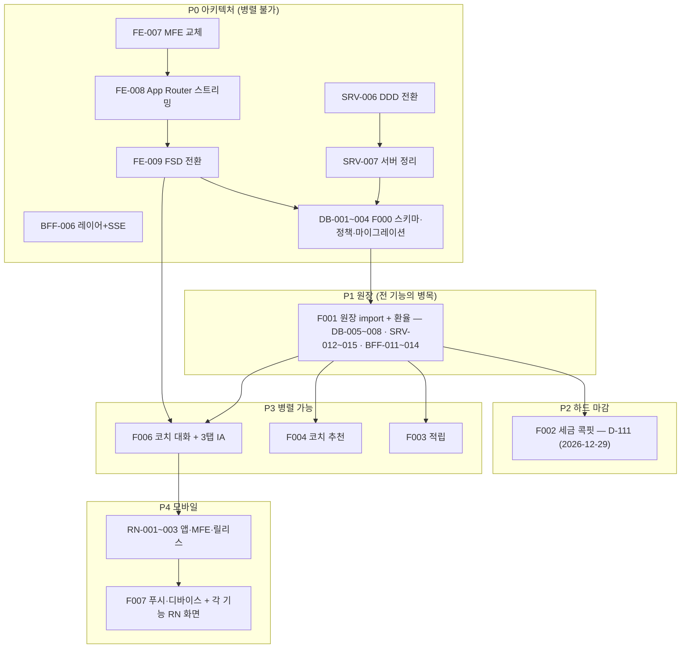

# SALT 요구사항 마스터 인덱스 — 조직이 이것만 보고 다 만들 수 있게

Created: 2026-09-09
Status: In Progress
선행 결정: `requirements/decisions/ADR-001-microfrontend-replacement.md`
제품 정의: `requirements/specs/in-progress/salt-solo-rebuild-global-plan.md`

## 0. 이 문서가 하는 일

기능 기획(PM)은 `pm/requirements/specs/**`에 있다. **이 문서는 그 기획을 영역별 실행 문서로 분해한 지도**다. 각 셀이 실제 파일 하나이고, 담당자는 자기 셀만 읽어도 착수할 수 있다.

## 1. 문서 축 — 기능 × 영역 × 종류

### 기능 (7)

| 코드 | 기능 | PM 기획서 |
|---|---|---|
| **F000** | 정리·편집 (죽은 코드 제거 · 자산군 확장 · 초대제 · 기존 화면 수리) | `FEATURE-000-scope-reset.md` |
| **F001** | 개입 청구서 (반사실 3트랙 · 거래별 귀속 · 원장 import) | `FEATURE-001-intervention-invoice.md` |
| **F002** | 세금 마감 콕핏 (자산군 3종 · 손실수확 솔버 · 환율 함정 · 스텝업) | `FEATURE-002-tax-deadline-cockpit.md` |
| **F003** | 밸류에이션 밴드 적립 (MVRV Z · CAPE · 김프 · 실패 이력) | `FEATURE-003-valuation-band-accumulation.md` |
| **F004** | AI 코치 추천 (3종 세트 게이트 · 성적표 · 익절 플랜 · preflight) | `FEATURE-004-ai-coach-screen.md` |
| **F006** | 코치 대화 & 3탭 IA (대화가 제품의 핵심 · PC MovableGrid) | `FEATURE-006-coach-conversation-ia.md` |
| **F007** | 모바일 앱 (React Native · iOS+Android · 푸시 · 번들 MFE) | `FEATURE-007-mobile-app.md` |

> F005는 결번이다. `FEATURE-005-home-briefing.md`의 5탭 IA는 2026-09-09 결정(탭 축소·대화 중심)으로 **F006이 대체**한다. 홈 블록 요구사항만 F006으로 흡수한다.

### 영역 (5)

| 코드 | 영역 | 경로 | 방법론 |
|---|---|---|---|
| `DB` | 데이터베이스 | `salt-server/prisma/**` | Prisma + PostgreSQL |
| `SRV` | 서버 | `salt-server/src/**` | **DDD (컨텍스트 우선)** |
| `BFF` | BFF | `bff/src/**` | 레이어드 + SSE |
| `FE` | 웹 | `salt-microFe/apps/web`, `apps/web-tax` | **FSD** + App Router + Multi-Zones |
| `RN` | 모바일 | `salt-microFe/apps/mobile` | **FSD** + Shared/Service 번들 |

### 종류 (4) — 영역마다 같은 자리를 채운다

| 자리 | DB | SRV | BFF | FE | RN |
|---|---|---|---|---|---|
| **형태** | `SCHEMA` 모델·컬럼·인덱스 | `DATA` 컨텍스트·모듈·워커·외부연동 | `UPSTREAM` 서버 호출 계약 | `UI` 화면·컴포넌트·상태·접근성 | `UI` 화면·네이티브·접근성 |
| **기능** | `FUNC` 제약·불변식·정책 | `FUNC` 도메인 로직·엔진 | `FUNC` 조립·격리·폴백 | `FUNC` 기능 규칙·클라이언트 로직 | `FUNC` 기능 규칙·오프라인 |
| **인터페이스** | `MIGRATION` 백필·롤백 | `API` REST 계약 | `API` 프론트 대면 계약 | `API` BFF 호출 계약·훅 | `API` BFF 호출·번들 로딩 |
| **성능** | `PERF` | `PERF` | `PERF` | `PERF` | `PERF` |

## 2. 전체 문서 지도 (145개 · 전부 작성 완료)

번호는 영역 안에서 연속이다. 기존 완료 REQ와 겹치지 않게 시작 번호를 잡았다: `DB` 001부터, `SRV` 006부터(001~005 done), `BFF` 006부터(001~005 done), `FE` 010부터(001~004 done, **005·006은 `feature/repo-ui-component` 브랜치에 done**), `RN` 001부터.

### 아키텍처 전환 (기능 무관 · 최우선)

| ID | 문서 | 내용 |
|---|---|---|
| `FE-REQ-007` | MFE 교체 | `nextjs-mf` 제거 → Multi-Zones 2 zone. 3앱 → `apps/web` + `apps/web-tax` |
| `FE-REQ-008` | App Router + 스트리밍 SSR | 라우팅 이관, RSC 경계, Suspense 스트리밍, SSE와 비교 측정 |
| `FE-REQ-009` | FSD 전환 | 레이어 5 + 슬라이스 레지스트리 + layer-check 훅 + `packages/tokens`·`core` 추출 |
| `SRV-REQ-006` | DDD 전환 | 컨텍스트 우선 4층. 현재 `modules/*` → `{context}/{domain,application,infrastructure,presentation}` |
| `SRV-REQ-007` | 서버 정리 (삭제·동면) | 삭제 5건 · 동면 4건 · 410 Gone. **grep 근거 첨부** |
| `BFF-REQ-006` | 레이어 정리 + SSE 기반 | route/controller/service 경계 재정의, 스트리밍 송신 |
| `RN-REQ-001` | RN 앱 신설 | `apps/mobile`, Expo prebuild, iOS+Android, FSD, `packages/ui-native` |
| `RN-REQ-002` | RN 마이크로프론트엔드 | Shared/Service 번들, ESBuild, CDN, 카나리 (토스 방식) |
| `RN-REQ-003` | 릴리스·스토어 | 코드 서명, TestFlight/Play 내부 테스트, OTA 정책, 버전 게이트 |

### 기능 × 영역 × 종류

| 기능 | DB (SCHEMA/FUNC/MIGRATION/PERF) | SRV (FUNC/API/DATA/PERF) | BFF (FUNC/API/UPSTREAM/PERF) | FE (UI/FUNC/API/PERF) | RN (UI/FUNC/API/PERF) |
|---|---|---|---|---|---|
| **F000** | `DB-001` `DB-002` `DB-003` `DB-004` | `SRV-008` `SRV-009` `SRV-010` `SRV-011` | `BFF-007` `BFF-008` `BFF-009` `BFF-010` | `FE-010` `FE-011` `FE-012` `FE-013` | `RN-004` `RN-005` `RN-006` `RN-007` |
| **F001** | `DB-005` `DB-006` `DB-007` `DB-008` | `SRV-012` `SRV-013` `SRV-014` `SRV-015` | `BFF-011` `BFF-012` `BFF-013` `BFF-014` | `FE-014` `FE-015` `FE-016` `FE-017` | `RN-008` `RN-009` `RN-010` `RN-011` |
| **F002** | `DB-009` `DB-010` `DB-011` `DB-012` | `SRV-016` `SRV-017` `SRV-018` `SRV-019` | `BFF-015` `BFF-016` `BFF-017` `BFF-018` | `FE-018` `FE-019` `FE-020` `FE-021` | `RN-012` `RN-013` `RN-014` `RN-015` |
| **F003** | `DB-013` `DB-014` `DB-015` `DB-016` | `SRV-020` `SRV-021` `SRV-022` `SRV-023` | `BFF-019` `BFF-020` `BFF-021` `BFF-022` | `FE-022` `FE-023` `FE-024` `FE-025` | `RN-016` `RN-017` `RN-018` `RN-019` |
| **F004** | `DB-017` `DB-018` `DB-019` `DB-020` | `SRV-024` `SRV-025` `SRV-026` `SRV-027` | `BFF-023` `BFF-024` `BFF-025` `BFF-026` | `FE-026` `FE-027` `FE-028` `FE-029` | `RN-020` `RN-021` `RN-022` `RN-023` |
| **F006** | `DB-021` `DB-022` `DB-023` `DB-024` | `SRV-028` `SRV-029` `SRV-030` `SRV-031` | `BFF-027` `BFF-028` `BFF-029` `BFF-030` | `FE-030` `FE-031` `FE-032` `FE-033` | `RN-024` `RN-025` `RN-026` `RN-027` |
| **F007** | `DB-025` `DB-026` `DB-027` `DB-028` | `SRV-032` `SRV-033` `SRV-034` `SRV-035` | `BFF-031` `BFF-032` `BFF-033` `BFF-034` | — | `RN-028` `RN-029` `RN-030` `RN-031` |

파일명 규칙: `<AREA>-REQ-<NNN>-<F기능>-<종류>.md`
예: `DB-REQ-005-F001-SCHEMA.md` · `FE-REQ-026-F004-UI.md` · `RN-REQ-024-F006-UI.md`

## 3. 규칙 문서 (하네스)

REQ가 참조하는 권위 문서다. **REQ보다 먼저 읽는다.**

### `salt-microFe/.claude/rules/`

| 문서 | 상태 | 내용 |
|---|---|---|
| `layered-architecture.md` | 신규 | 네 서피스(web · mobile · bff · server)와 슬라이스 레지스트리 |
| `fsd-shared.md` `fsd-entities.md` `fsd-features.md` `fsd-widgets.md` `fsd-pages.md` | 신규 | FSD 레이어별 import 규칙과 구조 |
| `microfrontend.md` | **개정** | `nextjs-mf` → Multi-Zones. zone 경계 기준 |
| `streaming-ssr.md` | 신규 | App Router RSC 경계 · Suspense 스트리밍 · SSE 소비 |
| `rn-architecture.md` | 신규 | RN 앱 구조 · 네이티브 모듈 경계 · 플랫폼 분기 |
| `rn-microfrontend.md` | 신규 | Shared/Service 번들 · ESBuild · CDN · 카나리 |
| `performance-frontend.md` | 신규 | 웹 예산 · RSC/스트리밍 성능 · 가상화 · 번들 |
| `performance-rn.md` | 신규 | 앱 시작 · 프레임 · 번들 로딩 · Hermes · 메모리 |
| `design-system.md` | **개정** | `packages/tokens` 도입, 웹/RN 어댑터 분리 |

### `salt-server/.claude/rules/`

| 문서 | 상태 | 내용 |
|---|---|---|
| `server-architecture.md` | 신규 | 컨텍스트 우선 DDD 4층 (Express + TS) · 컨텍스트 레지스트리 |
| `ddd-shared.md` `ddd-domain.md` `ddd-application.md` `ddd-infrastructure.md` `ddd-presentation.md` | 신규 | 레이어별 import 규칙 |
| `module-architecture.md` | **개정** | 기존 `modules/*` 패턴 → DDD 이관 매핑 |
| `performance-server.md` | 신규 | 예산 · 트랜잭션 · N+1 · 페이징 · 워커 풀 |
| `performance-database.md` | 신규 | 인덱스 · 실행계획 · 락 · Decimal · VACUUM |

### `bff/.claude/rules/`

| 문서 | 상태 | 내용 |
|---|---|---|
| `bff-architecture.md` | 신규 | 레이어 경계 · 뷰모델 소유권 · 부분 실패 격리 |
| `streaming-sse.md` | 신규 | SSE 계약 · 하트비트 · 재연결 · 취소 전파 |
| `performance-bff.md` | 신규 | 예산 · allSettled · 캐시 · WS 구독 정책 |

### 공통

| 문서 | 상태 | 내용 |
|---|---|---|
| `.claude/hooks/layer-check.mjs` | 신규 | 쓰기 시점 레이어 위반 차단 (DevAtlas 이식) |
| `requirements/decisions/ADR-*.md` | 신규 | 되돌리기 비용이 큰 결정 기록 |

## 4. 실행 순서 — 무엇이 무엇을 막는가

| 단계 | 내용 | 근거 |
|---|---|---|
| **P0** | 아키텍처 전환 + F000 정리 | 이 위에 100개 문서가 올라간다. 나중에 하면 전부 다시 쓴다 |
| **P1** | F001 원장 import + 환율 원장 | **원장이 부정확하면 청구서·세금이 전부 거짓말이 된다.** 글로벌 플랜 9절이 S1을 병목으로 명시 |
| **P2** | F002 세금 콕핏 | **하드 마감이 있다.** 2026-12-29 미국주식 손실수확 권고 마감 = 오늘(2026-09-09) 기준 **D-111** |
| **P3** | F003 · F004 · F006 병렬 | 서로 막지 않는다. F006은 FE-009(FSD) 완료 후 |
| **P4** | RN + F007 | 웹 계약이 확정된 뒤 시작한다. BFF 계약을 두 번 만들지 않기 위해 |

## 5. 하드 마감 (2026-09-09 기준)

| 날짜 | 무엇 | D-Day |
|---|---|---|
| 2026-12-29 (화) | 미국주식 손실 수확 실무 권고 마감 | **D-111** |
| 2026-12-30 (수) | 미국주식 2026 귀속 마지막 매도(12/31 결제) | **D-112** |
| 2026-12-31 (목) | 크립토 비과세 매도 마감 / 의제취득가액 기준일 | **D-113** |
| 2027-01-01 00:10 KST | 크립토 2026-12-31 시가 스냅샷 수집 (1회성, 되돌릴 수 없음) | D-114 |
| 2027-05-01~06-01 | 2026 귀속 해외주식 양도소득세 신고 | — |

## 6. 전 영역 공통 수용 기준

기능별 수용 기준과 별도로, **모든 REQ가 이것을 만족해야 done**이다.

- [ ] 추천을 렌더하는 모든 화면에 **근거 · 과거 적중률 · 실패사례** 3종이 함께 있다. 하나라도 없으면 렌더하지 않는다 (글로벌 플랜 1-3절)
- [ ] **주문을 실행하는 코드 경로가 없다.** 거래소 API 키는 조회 전용만 저장되고, 주문·출금 권한 키는 등록이 거부된다
- [ ] 금액 계산은 **서버에서** 한다. 프론트는 표시만, LLM은 문장만
- [ ] 세금 화면 전체에 면책 문구가 있고, 세율·공제·시행일·기준일·환율 소스가 **설정값으로 화면에 노출**된다
- [ ] 확신 표현("확실", "무조건", "보장", "100%")과 목표주가·수익률 예측이 0건이다
- [ ] 2인칭 인격 평가가 0건이다. 행동은 **사실 서술**로만 렌더한다
- [ ] 초대 코드 없이 계정이 생성되지 않는다
- [ ] 레이어 위반이 0건이다 (`layer-check` 훅 통과)
- [ ] 해당 영역 `PERF` 문서의 예산을 측정값으로 만족한다
- [ ] 원장 3종(`PortfolioTransaction` · `PortfolioHolding` · `PriceHistory`) row 수가 보존된다

## 7. 상태 추적

### 작성 현황 (2026-09-11)

**요구사항 문서 145개가 전부 작성되었다.** 구현 진행 상황:

| REQ | 상태 | 비고 |
|---|---|---|
| `FE-REQ-007` MFE 교체 | **in-progress** | Multi-Zones 전환 완료(`apps/web` + `apps/web-tax`), 빌드·린트·타입·프록시 검증 통과. 미충족 6건 중 §4-6(브라우저 확인)은 `FE-REQ-008`에서 닫혔다. 나머지는 `checklists/FE-REQ-007.md` §4 |
| `FE-REQ-008` App Router + 스트리밍 SSR | **in-progress** | 두 zone 모두 App Router. 스트리밍 게이트 **첫 블록 p95 31.9ms**(기준 300ms), 총 완료 악화 없음. 번들 증가 최대 +16.2 kB gzip(예산 40KB). 미충족 8건은 `checklists/FE-REQ-008.md` §6 |
| 나머지 143개 | to-do | |

**스트리밍 판정은 화면 단위다.** `FE-REQ-008`이 통과시킨 것은 프레임워크와 측정 방법이고,
홈 5블록·세금 콕핏·청구서의 판정은 그 화면이 생길 때(`FE-REQ-030`~`033` · `018`~`021` · `014`~`017`)
`salt-microFe/apps/web/scripts/measure-streaming.mjs`로 다시 한다. 기준 미달이면 **1콜 집계로 되돌린다.**

배포 대상은 **자체 호스팅**으로 확정했다(FE-REQ-007 FR-21). cross-zone 전환 지점은
`apps/web/src/components/Zone/CrossZoneLink.tsx` 한 파일로 가둬 두었다.

| 영역 | 개수 | 범위 | 위치 |
|---|---|---|---|
| `DB` | 28 | 001~028 | `salt-server/requirements/specs/to-do/` |
| `SRV` | 30 | 006~035 (2개 ARCH) | `salt-server/requirements/specs/to-do/` |
| `BFF` | 29 | 006~034 (1개 ARCH) | `bff/requirements/specs/to-do/` |
| `FE` | 27 | 007~033 (3개 ARCH) | `salt-microFe/requirements/specs/to-do/` |
| `RN` | 31 | 001~031 (3개 ARCH) | `salt-microFe/requirements/specs/to-do/` |
| **합계** | **145** | 아키텍처 9 + 기능 매트릭스 136 | |

기능 매트릭스 136 = F000·F001·F002·F003·F004·F006 각 20 + **F007 16**(F007은 웹 화면이 없으므로 FE 사분면 결번).

부속 산출물: `.claude/rules/` 24개(전부 200줄 이하) · `requirements/decisions/ADR-001-microfrontend-replacement.md` · PM `FEATURE-006` · `FEATURE-007`.

### 이동 규칙

각 REQ는 `to-do/` → `in-progress/` → `done/`으로 이동한다. done 조건:

1. 수용 기준 전부 체크
2. `requirements/reports/checklists/<REQ-ID>.md` 작성 (측정값 포함)
3. `requirements/reports/retrospects/<REQ-ID>.md` 작성
4. 해당 영역 검증 명령 통과

## 8. 변경 이력

| 날짜 | 변경 |
|---|---|
| 2026-09-09 | 초안. 기능 7 × 영역 5 × 종류 4 = 140개 지도. 아키텍처 전환 9개 + 규칙 24개 |
| 2026-09-10 | **145개 전부 작성 완료.** F007에 FE 사분면이 없어 실제 총계는 140 → 145(아키텍처 9 + 매트릭스 136)로 정정 |
| 2026-09-11 | `FE-REQ-008`(App Router + 스트리밍 SSR) 구현. 측정 게이트 통과 — §7 상태표 갱신 |
