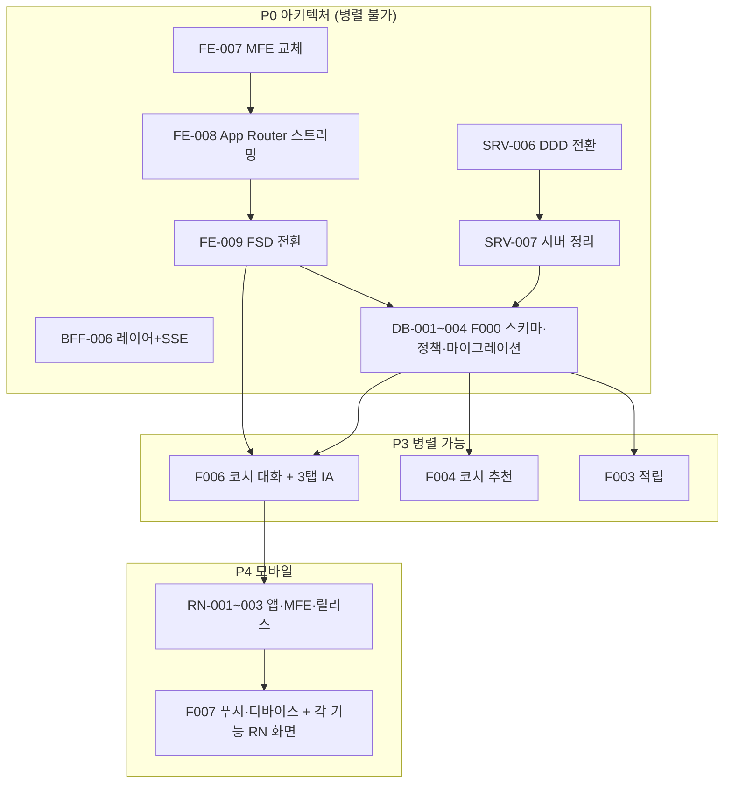

# SALT 요구사항 마스터 인덱스 — 조직이 이것만 보고 다 만들 수 있게

Created: 2026-09-09
Status: In Progress
선행 결정: `requirements/decisions/ADR-001-microfrontend-replacement.md`
제품 정의: `requirements/specs/in-progress/salt-solo-rebuild-global-plan.md`

## 0. 이 문서가 하는 일

기능 기획(PM)은 `pm/requirements/specs/**`에 있다. **이 문서는 그 기획을 영역별 실행 문서로 분해한 지도**다. 각 셀이 실제 파일 하나이고, 담당자는 자기 셀만 읽어도 착수할 수 있다.

### F004 · F008 확장 조사 (2026-09-24)

- [AI 투자 심층 조사](../../reports/feature-audits/2026-09-24-ai-investment-deep-research.md): 현재 네 기능의 코드 진단 12건, 투자 연구·데이터 출처, 기존 테스트 255개 및 별도 재현 결과.
- [외부 웹 심층 조사](../../reports/feature-audits/2026-09-24-external-investment-research.md): 논문 철회·장기 성과 검증, 주식/코인 분석, 공식 투자 도구 8종 비교, 기능 10개와 데이터 요구사항.
- [AI 투자 워크벤치 설계](ai-investment-workbench-design.md): 근거 연결 리서치·포트폴리오 위험·비용 후 성과·판단 기록의 기능/계약/수용 기준. **제안·미구현**이며 기존 REQ 완료 상태나 ADR을 변경하지 않는다.
- [1인 펀드매니저 코치 딥리서치](../../reports/research/2026-09-24-fund-manager-coach.md): 잃는 사람 · 버는 사람의 증거(행동 · 사이징 · 사전 약속), 크립토 신호 근거 · 우선순위 10, LLM 실효성, 한국 규제 선(개별성), 기능 20개 · 슬라이스 순서 제안. **제안 · 미구현.**

## 1. 문서 축 — 기능 × 영역 × 종류

### 기능 (9)

| 코드 | 기능 | PM 기획서 |
|---|---|---|
| **F000** | 정리·편집 (죽은 코드 제거 · 자산군 확장 · 초대제 · 기존 화면 수리) | `FEATURE-000-scope-reset.md` |
| ~~**F001**~~ | ~~개입 청구서 (반사실 3트랙 · 거래별 귀속 · 원장 import)~~ — **폐기 2026-09-21 (`ADR-002`)** | 삭제됨 |
| ~~**F002**~~ | ~~세금 마감 콕핏 (자산군 3종 · 손실수확 솔버 · 환율 함정 · 스텝업)~~ — **폐기 2026-09-21 (`ADR-002`)** | 삭제됨 |
| **F003** | 밸류에이션 밴드 적립 (MVRV Z · CAPE · 김프 · 실패 이력) | `FEATURE-003-valuation-band-accumulation.md` |
| **F004** | AI 코치 추천 (3종 세트 게이트 · 성적표 · 익절 플랜 · preflight) | `FEATURE-004-ai-coach-screen.md` |
| **F006** | 코치 대화 & 3탭 IA (대화가 제품의 핵심 · PC MovableGrid) | `FEATURE-006-coach-conversation-ia.md` |
| **F007** | 모바일 앱 (React Native · iOS+Android · 푸시 · 번들 MFE) | `FEATURE-007-mobile-app.md` |
| **F008** | AI 전망 · 인텔리전스 (파이프라인 → 온톨로지 → 에이전트 · 확률 구간 · 채점 · 소유자 전용) — 2026-09-23 `ADR-003` · `ADR-004` | `FEATURE-008-forecast-intelligence.md` |
| **F009** | 1인 펀드매니저 코치 (IPS · 리스크 예산 · 사이즈 계산 · 계획 기록 · 준수율 · 행동 미러 · 월간 복기) — 2026-09-24. 통제 · 차단 없음, 수동 입력 전제 | `FEATURE-009-behavior-risk-coach.md` |
| **F011** | 국내 주식 시세 · 분석 연동 (한국투자증권 Open API — 조회 TR 만 · 시세 · 일봉 · 5분봉 누적 · 자산군 분리 채점 · 장 상태 표시) — 2026-09-27 기획, **to-do**. F010 은 판정 엔진 v2 예약 | `FEATURE-011-kr-stock-kis.md` |

> F005는 결번이다. `FEATURE-005-home-briefing.md`의 5탭 IA는 2026-09-09 결정(탭 축소·대화 중심)으로 **F006이 대체**한다. 홈 블록 요구사항만 F006으로 흡수한다.

### 영역 (5)

| 코드 | 영역 | 경로 | 방법론 |
|---|---|---|---|
| `DB` | 데이터베이스 | `salt-server/prisma/**` | Prisma + PostgreSQL |
| `SRV` | 서버 | `salt-server/src/**` | **DDD (컨텍스트 우선)** |
| `BFF` | BFF | `bff/src/**` | 레이어드 + SSE |
| `FE` | 웹 | `salt-microFe/apps/web`, `apps/web-tax` | **FSD** + App Router + Multi-Zones |
| `RN` | 모바일 | `salt-microFe/apps/mobile` | **FSD** + Shared/Service 번들 |
| `FC` | 예측 · 데이터 파이프라인 | `salt-forecast/**` | Python 배치 · `import-linter` 층 · DB 스키마 계약 (`ADR-004`) |

### 종류 (4) — 영역마다 같은 자리를 채운다

| 자리 | DB | SRV | BFF | FE | RN |
|---|---|---|---|---|---|
| **형태** | `SCHEMA` 모델·컬럼·인덱스 | `DATA` 컨텍스트·모듈·워커·외부연동 | `UPSTREAM` 서버 호출 계약 | `UI` 화면·컴포넌트·상태·접근성 | `UI` 화면·네이티브·접근성 |
| **기능** | `FUNC` 제약·불변식·정책 | `FUNC` 도메인 로직·엔진 | `FUNC` 조립·격리·폴백 | `FUNC` 기능 규칙·클라이언트 로직 | `FUNC` 기능 규칙·오프라인 |
| **인터페이스** | `MIGRATION` 백필·롤백 | `API` REST 계약 | `API` 프론트 대면 계약 | `API` BFF 호출 계약·훅 | `API` BFF 호출·번들 로딩 |
| **성능** | `PERF` | `PERF` | `PERF` | `PERF` | `PERF` |

## 2. 전체 문서 지도 (145개 · 전부 작성 완료)

번호는 영역 안에서 연속이다. 기존 완료 REQ와 겹치지 않게 시작 번호를 잡았다: `DB` 001부터, `SRV` 006부터(001~005 done), `BFF` 006부터(001~005 done), `FE` 010부터(001~004 done, **005·006은 `feature/repo-ui-component` 브랜치에 done**), `RN` 001부터.

### 아키텍처 전환 (기능 무관 · 최우선)

| ID | 문서 | 내용 |
|---|---|---|
| `FE-REQ-007` | MFE 교체 | `nextjs-mf` 제거 → Multi-Zones 2 zone. 3앱 → `apps/web` + `apps/web-tax` |
| `FE-REQ-008` | App Router + 스트리밍 SSR | 라우팅 이관, RSC 경계, Suspense 스트리밍, SSE와 비교 측정 |
| `FE-REQ-009` | FSD 전환 | 레이어 5 + 슬라이스 레지스트리 + layer-check 훅 + `packages/tokens`·`core` 추출 |
| `SRV-REQ-006` | DDD 전환 | 컨텍스트 우선 4층. 현재 `modules/*` → `{context}/{domain,application,infrastructure,presentation}` |
| `SRV-REQ-007` | 서버 정리 (삭제·동면) | 삭제 5건 · 동면 4건 · 410 Gone. **grep 근거 첨부** |
| `BFF-REQ-006` | 레이어 정리 + SSE 기반 | route/controller/service 경계 재정의, 스트리밍 송신 |
| `RN-REQ-001` | RN 앱 신설 | `apps/mobile`, Expo prebuild, iOS+Android, FSD, `packages/ui-native` |
| `RN-REQ-002` | RN 마이크로프론트엔드 | Shared/Service 번들, ESBuild, CDN, 카나리 (토스 방식) |
| `RN-REQ-003` | 릴리스·스토어 | 코드 서명, TestFlight/Play 내부 테스트, OTA 정책, 버전 게이트 |

### 기능 × 영역 × 종류

| 기능 | DB (SCHEMA/FUNC/MIGRATION/PERF) | SRV (FUNC/API/DATA/PERF) | BFF (FUNC/API/UPSTREAM/PERF) | FE (UI/FUNC/API/PERF) | RN (UI/FUNC/API/PERF) |
|---|---|---|---|---|---|
| **F000** | `DB-001` `DB-002` `DB-003` `DB-004` | `SRV-008` `SRV-009` `SRV-010` `SRV-011` | `BFF-007` `BFF-008` `BFF-009` `BFF-010` | `FE-010` `FE-011` `FE-012` `FE-013` | `RN-004` `RN-005` `RN-006` `RN-007` |
| ~~F001~~ | 결번 (`ADR-002`) | 결번 | 결번 | 결번 | 결번 |
| ~~F002~~ | 결번 (`ADR-002`) | 결번 | 결번 | 결번 | 결번 |
| **F003** | `DB-013` `DB-014` `DB-015` `DB-016` | `SRV-020` `SRV-021` `SRV-022` `SRV-023` | `BFF-019` `BFF-020` `BFF-021` `BFF-022` | `FE-022` `FE-023` `FE-024` `FE-025` | `RN-016` `RN-017` `RN-018` `RN-019` |
| **F004** | `DB-017` `DB-018` `DB-019` `DB-020` | `SRV-024` `SRV-025` `SRV-026` `SRV-027` | `BFF-023` `BFF-024` `BFF-025` `BFF-026` | `FE-026` `FE-027` `FE-028` `FE-029` `FE-034` | `RN-020` `RN-021` `RN-022` `RN-023` |
| **F006** | `DB-021` `DB-022` `DB-023` `DB-024` | `SRV-028` `SRV-029` `SRV-030` `SRV-031` | `BFF-027` `BFF-028` `BFF-029` `BFF-030` | `FE-030` `FE-031` `FE-032` `FE-033` | `RN-024` `RN-025` `RN-026` `RN-027` |
| **F007** | `DB-025` `DB-026` `DB-027` `DB-028` | `SRV-032` `SRV-033` `SRV-034` `SRV-035` | `BFF-031` `BFF-032` `BFF-033` `BFF-034` | `FE-043`(웹 좁은 화면 안내) | `RN-028` `RN-029` `RN-030` `RN-031` |

파일명 규칙: `<AREA>-REQ-<NNN>-<F기능>-<종류>.md`
예: `DB-REQ-005-F001-SCHEMA.md` · `FE-REQ-026-F004-UI.md` · `RN-REQ-024-F006-UI.md`

## 3. 규칙 문서 (하네스)

REQ가 참조하는 권위 문서다. **REQ보다 먼저 읽는다.**

### `salt-microFe/.claude/rules/`

| 문서 | 상태 | 내용 |
|---|---|---|
| `layered-architecture.md` | 신규 | 네 서피스(web · mobile · bff · server)와 슬라이스 레지스트리 |
| `fsd-shared.md` `fsd-entities.md` `fsd-features.md` `fsd-widgets.md` `fsd-pages.md` | 신규 | FSD 레이어별 import 규칙과 구조 |
| `microfrontend.md` | **개정** | `nextjs-mf` → Multi-Zones. zone 경계 기준 |
| `streaming-ssr.md` | 신규 | App Router RSC 경계 · Suspense 스트리밍 · SSE 소비 |
| `rn-architecture.md` | 신규 | RN 앱 구조 · 네이티브 모듈 경계 · 플랫폼 분기 |
| `rn-microfrontend.md` | 신규 | Shared/Service 번들 · ESBuild · CDN · 카나리 |
| `performance-frontend.md` | 신규 | 웹 예산 · RSC/스트리밍 성능 · 가상화 · 번들 |
| `performance-rn.md` | 신규 | 앱 시작 · 프레임 · 번들 로딩 · Hermes · 메모리 |
| `design-system.md` | **개정** | `packages/tokens` 도입, 웹/RN 어댑터 분리 |

### `salt-server/.claude/rules/`

| 문서 | 상태 | 내용 |
|---|---|---|
| `server-architecture.md` | 신규 | 컨텍스트 우선 DDD 4층 (Express + TS) · 컨텍스트 레지스트리 |
| `ddd-shared.md` `ddd-domain.md` `ddd-application.md` `ddd-infrastructure.md` `ddd-presentation.md` | 신규 | 레이어별 import 규칙 |
| `module-architecture.md` | **개정** | 기존 `modules/*` 패턴 → DDD 이관 매핑 |
| `performance-server.md` | 신규 | 예산 · 트랜잭션 · N+1 · 페이징 · 워커 풀 |
| `performance-database.md` | 신규 | 인덱스 · 실행계획 · 락 · Decimal · VACUUM |

### `bff/.claude/rules/`

| 문서 | 상태 | 내용 |
|---|---|---|
| `bff-architecture.md` | 신규 | 레이어 경계 · 뷰모델 소유권 · 부분 실패 격리 |
| `streaming-sse.md` | 신규 | SSE 계약 · 하트비트 · 재연결 · 취소 전파 |
| `performance-bff.md` | 신규 | 예산 · allSettled · 캐시 · WS 구독 정책 |

### 공통

| 문서 | 상태 | 내용 |
|---|---|---|
| `.claude/hooks/layer-check.mjs` | 신규 | 쓰기 시점 레이어 위반 차단 (DevAtlas 이식) |
| `requirements/decisions/ADR-*.md` | 신규 | 되돌리기 비용이 큰 결정 기록 |

## 4. 실행 순서 — 무엇이 무엇을 막는가

```mermaid
flowchart TB
  subgraph P0["P0 아키텍처 (병렬 불가)"]
    A1["FE-007 MFE 교체"] --> A2["FE-008 App Router 스트리밍"] --> A3["FE-009 FSD 전환"]
    B1["SRV-006 DDD 전환"] --> B2["SRV-007 서버 정리"]
    C1["BFF-006 레이어+SSE"]
    D1["DB-001~004 F000 스키마·정책·마이그레이션"]
  end
  subgraph P3["P3 병렬 가능"]
    G["F003 적립"]
    H["F004 코치 추천"]
    I["F006 코치 대화 + 3탭 IA"]
  end
  subgraph P4["P4 모바일"]
    J["RN-001~003 앱·MFE·릴리스"] --> K["F007 푸시·디바이스 + 각 기능 RN 화면"]
  end
  A3 --> D1
  B2 --> D1
  D1 --> G & H & I
  A3 --> I
  I --> J
```

| 단계 | 내용 | 근거 |
|---|---|---|
| **P0** | 아키텍처 전환 + F000 정리 | 이 위에 100개 문서가 올라간다. 나중에 하면 전부 다시 쓴다 |
| ~~P1 · P2~~ | ~~F001 원장 · F002 세금~~ | **폐기 2026-09-21 (`ADR-002`).** P0 다음이 곧 P3 다 |
| **P3** | F003 · F004 · F006 병렬 | 서로 막지 않는다. F006은 FE-009(FSD) 완료 후 |
| **P4** | RN + F007 | 웹 계약이 확정된 뒤 시작한다. BFF 계약을 두 번 만들지 않기 위해 |

## 5. 하드 마감 (2026-09-09 기준) — **F002 폐기로 소멸 (2026-09-21, `ADR-002`)**. 기록으로 둔다

| 날짜 | 무엇 | D-Day |
|---|---|---|
| 2026-12-29 (화) | 미국주식 손실 수확 실무 권고 마감 | **D-111** |
| 2026-12-30 (수) | 미국주식 2026 귀속 마지막 매도(12/31 결제) | **D-112** |
| 2026-12-31 (목) | 크립토 비과세 매도 마감 / 의제취득가액 기준일 | **D-113** |
| 2027-01-01 00:10 KST | 크립토 2026-12-31 시가 스냅샷 수집 (1회성, 되돌릴 수 없음) | D-114 |
| 2027-05-01~06-01 | 2026 귀속 해외주식 양도소득세 신고 | — |

## 6. 전 영역 공통 수용 기준

기능별 수용 기준과 별도로, **모든 REQ가 이것을 만족해야 done**이다.

- [ ] 추천을 렌더하는 모든 화면에 **근거 · 과거 적중률 · 실패사례** 3종이 함께 있다. 하나라도 없으면 렌더하지 않는다 (글로벌 플랜 1-3절)
- [ ] **주문을 실행하는 코드 경로가 없다.** 거래소 API 키를 받지 않는다(계좌 연동은 영구 Non-Goal)
- [ ] 금액 계산은 **서버에서** 한다. 프론트는 표시만, LLM은 문장만
- [ ] 확신 표현("확실", "무조건", "보장", "100%") · 한 점 목표가 · 명령형 매매 지시가 0건이다. 전망은 `ADR-003`(2026-09-23)의 확률 · 구간 + 전망 3종만, 소유자 전용
- [ ] 2인칭 인격 평가가 0건이다. 행동은 **사실 서술**로만 렌더한다
- [ ] 초대 코드 없이 계정이 생성되지 않는다
- [ ] 레이어 위반이 0건이다 (`layer-check` 훅 통과)
- [ ] 해당 영역 `PERF` 문서의 예산을 측정값으로 만족한다
- [ ] 원장 3종(`PortfolioTransaction` · `PortfolioHolding` · `PriceHistory`) row 수가 보존된다

## 7. 상태 추적

### 작성 현황 (2026-09-11)

**요구사항 문서 145개가 전부 작성되었다.** 구현 진행 상황:

| REQ | 상태 | 비고 |
|---|---|---|
| `FE-REQ-007` MFE 교체 | **done** | Multi-Zones 전환(`apps/web` + `apps/web-tax`). 미충족 6건 중 **2건이 닫혔다** — §4-6(브라우저 확인)은 `FE-REQ-008`, §4-4(레이어 검사 수단)는 `FE-REQ-009`. 남은 4건은 판정 대상(경로·배포 인프라·zone 넘나드는 기능·스트리밍 전제 화면)이 **아직 없어서** 이 REQ 안에서 닫을 방법이 없다. `checklists/FE-REQ-007.md` §4 |
| `FE-REQ-008` App Router + 스트리밍 SSR | **done** | 두 zone 모두 App Router. 스트리밍 게이트 **첫 블록 p95 31.9ms**(기준 300ms), 번들 증가 최대 +16.2 kB gzip(예산 40KB). 미충족 7건 중 **2건이 닫혔다**(§6-1 FSD pages 레이어 → `FE-REQ-009`, §6-7 Codex 미러 → 하네스 제거). **§6-4(인증 토큰이 `localStorage`)는 이 REQ 의 실제 미달**이고 `FE-REQ-013`이 담당한다. `checklists/FE-REQ-008.md` §6 |
| `FE-REQ-009` FSD 전환 | **done** | 두 zone 모두 6레이어. 슬라이스 8개(`auth`·`goal`·`market`·`portfolio` / `sign-in`·`add-goal` / `home-briefing`·`market-board`). `layer-check` 훅 + `@repo/fsd/layers` lint가 **같은 규칙 표 하나**를 읽는다(차단 8 · 통과 5 테스트). 렌더 동일성 4경로 × 3뷰포트 통과, 공통 청크 증가 **0**. 남은 것은 `checklists/FE-REQ-009.md` §8 — 이 REQ 미달 2건(FR-37 · `/investments` +7kB), 범위 밖 5건 |
| `SRV-REQ-006` DDD 전환 | **done** (4/4단계) | `shared` Kernel + `layer-check` 훅·ESLint(1) · `coach/domain/policy` 추출 + 특성화 테스트 23건(2) · `news`·`market`·`portfolio` 이관(3, FR-32a) · **`coach` 통합(4, FR-32)**. 컨텍스트 **4개** · 동사형 유스케이스 **49개** · 공개 API **17개**. `modules` 15 → 12 → **8개**(원문 29파일 3,538줄 삭제). 테스트 18 → 85 → **137건**. 4단계에서 **같은 이름의 값이 경로마다 다르게 정의돼 있던 것**(기술 지표 주기 `m5` vs 무관)이 드러나 통일했다. 그 뒤 **미충족 8건을 닫았다**(§12) — **수익률 예측(`expectedReturn`) 제거**, 외부 호출 타임아웃·지수 백오프(캔들 수집 실패 **다수 → 0건**), `external/` 삭제, 한글 뉴스 언어 필터 복구, 공개 LLM 경로 요청 제한. 테스트 **153건**. 남은 12건은 전부 `ledger`(F001)·`DB-REQ-*`·**FR-33(`SRV-REQ-007`)**·프론트 계약을 기다린다. 상세는 `checklists/SRV-REQ-006.md` §10~§13 |
| `FE-REQ-010` F000 UI | **in-progress** | 수리 9건(FR-1~9)·표시·접근성·반응형에 이어 **초대 코드·온보딩 3스텝(FR-20~26·64)이 닫혔다**. 슬라이스 셋이 생겼다 — `features/accept-invite` · `widgets/onboarding-flow` · `pages/onboarding`. **회원가입 화면은 구현된 적이 없었다**(경로만 `PUBLIC_PATHS` 에 있었다). 남은 것은 FR-63 과 **브라우저 화면 실측**이다. FR-63 은 `role="tablist"` 대신 `role="group"`+`aria-pressed` 로 갔다(탭이 아니다 — tabpanel 이 없다). `checklists/FE-REQ-010.md` · **홈 보유 아이콘 · 지출 막대 삭제**(2026-09-23, 목 제거) |
| `BFF-REQ-007` F000 FUNC | **in-progress** | D·E·F절(뉴스·관심 종목·`period`)에 이어 **G절(온보딩 3라우트·`register` 제거·rate limit)** · **A절 FR-1~5(동면 410, 2026-09-22)** 완료. A절 FR-6(1주 로그, 2026-09-29) · B·C절(홈 조립·알림) 남음. **테스트 러너가 이 작업에서 처음 생겼다**(23건) |
| `BFF-REQ-008` F000 API | **in-progress** | 신규 **7개 전부** 열렸다(`watchlist` 3 · `news` · `portfolio/summary` · 온보딩 3). 제거 목록도 닫혔다. 동면 경로 410(FR-11)도 2026-09-22 닫혔다. 남은 것은 `packages/core` 타입 공유(FR-13 — `bff` 가 workspace 밖이다) · **보유 요약 `logoUrl` 추가**(2026-09-23) |
| `SRV-REQ-008` F000 FUNC | **in-progress** | 관심 목록·뉴스·`period`·포지션 요약에 이어 **초대(FR-1~7)·인증 축소(FR-10~12)·온보딩 상태(FR-13·14)** 완료. `auth` 가 DDD 컨텍스트로 섰고 `modules/auth` 를 지웠다. 알림 2종·`AssetType` 3값·환율·동면 남음 |
| `SRV-REQ-009` F000 API | **in-progress** | `/api/portfolio/summary` · `period` 422 에 이어 **초대 2경로 · `/api/onboarding/status` · 제거 3경로(404)** 완료. **시세 개요 기간 7 · 순서 2 가 실제로 동작**(`periodChange` 추가 · 모르는 기간 422). 동면 410(FR-7·8)·알림 422 남음 |
| `FE-REQ-011` F000 FUNC | **in-progress** | **세션(FR-62 · 63)** — 로그인이 MSW 목이었던 것을 실제 계약으로, 401 이면 갱신 1회 후 재시도, 리프레시까지 죽으면 로그인으로(2026-09-23 · `checklists/F000-web-session.md`). 실시간 수신 표시(FR-11~14) — BFF 가 끊기면 헤더가 **"연결 끊김 · 재연결 중"** 이고 기준 시각을 쓰지 않는다. FR-10 은 수신 시각을 `wsClient` 에 두는 것으로 다르게 갔다. `checklists/F000-realtime-reliability.md` |
| `FE-REQ-012` F000 API | **in-progress** | 호출 배치에 **`login` · `refresh`** 추가(표에 없던 두 호출, 2026-09-23). WS 절(FR-24~26) — 참조 카운트 구독으로 **떠난 화면의 구독을 해제**한다(원래는 리스너만 뗐다). 재연결 3s→30s 백오프 · **MSW 목 전부 제거 · 목표 조회 BFF 실경로 · 공개 시세 서버 조회**(2026-09-23) |
| `FE-REQ-013` F000 PERF | **in-progress** | 첫 로드 실측(2026-09-23) — 리포트 134 → 109 kB · 상세 134 → 113 kB(목 게이트 제거 · 머리 서버 컴포넌트). 쿠키 세션(서버 조회)은 남음. `checklists/FE-REQ-013.md` |
| `BFF-REQ-010` F000 PERF | **in-progress** | WS 절 — 측정(FR-15) 18.9건/초. **throttle(FR-11)은 만들지 않는다는 판정.** 시세가 조용히 멈추는 경로 넷을 닫았다. 시세 개요 A절 — 가격 캐시 **히트율 0%** 를 재고 덧씌우기를 걷어냈다(FR-2 는 다르게) |
| `DB-REQ-017` F004 SCHEMA | **in-progress** | 판단 스냅샷 · 성적표 · 게이지 적중률 집계 테이블(슬라이스 1·2). `checklists/F004-symbol-judgment.md` · `F004-zone-gauge.md` |
| `SRV-REQ-024` F004 FUNC | **in-progress** | 종목 판단을 스냅샷으로 남겨 성적표 표본을 쌓는다 · `zone`(내 규칙 가격/관찰 구간) · 게이지 적중률(슬라이스 1·2) · **성적표 그룹 · 수익률 분포 · 적중/실패 동등**(슬라이스 11) · **저장 추천 게이트 · 익절 거리 · 행동 기록 코드**(슬라이스 12) · **재생성 쿨다운**(슬라이스 13) |
| `SRV-REQ-025` F004 API | **in-progress** | `GET /ai-coach` 에 `modes.*`(판단 · `renderable` · `zone`) · `gaugeTrackRecords` · `disclaimer`. `confidence` 없음. explain 인증 · 게이트 먼저 · abort, preflight `stopLossRate` · `maxLossOfTotalRate`(슬라이스 10). **`/api/coach/scoreboard` · `?groupBy=signalType`**(슬라이스 11). **`/api/coach/detail`** · `gapFromCurrent` · `factCode`(슬라이스 12). **`generate` 202 · 쿨다운 429 · `/api/coach/generation-status` · 프로필 영속화 · 기본 모드**(슬라이스 13) |
| `BFF-REQ-023` F004 FUNC | **in-progress** | `/api/app/ai-coach/detail` = `SymbolCoachViewModel` · 두 모드 한 응답 · 기본 라벨 제거(슬라이스 3). `explain` 인증 뒤로(슬라이스 5). `checklists/F004-bff-symbol-judgment.md` · `F004-bff-upstream-errors.md` · **코치 리포트 · 생성 상태 · 429 본문**(슬라이스 14) |
| `BFF-REQ-024` F004 API | **in-progress** | 모드 블록 `renderable` 판별 union. **FR-30 `packages/core` 닫힘**(`@repo/core/coach`, 사본 — BFF 는 workspace 밖) |
| `BFF-REQ-025` F004 UPSTREAM | **in-progress** | 면책 없으면 502 · 모드 계약 깨지면 `null`. **서버 4xx · `Retry-After` 보존**(main 은 500) · `explain` 토큰 · 20s · 동시 2 · GET 재시도 1회(슬라이스 5). `generate` 1s · 202 는 서버 대기 |
| `BFF-REQ-026` F004 PERF | **in-progress** | p95 32ms · 클라이언트 종료 시 upstream 취소(코드 — 서버 로그 미확인) · `explain` 동시 2 초과 즉시 429(슬라이스 5) |
| `FE-REQ-026` F004 UI | **in-progress** | **L절 화면 마감**(2026-09-23 — 헤더 위계 · 요약 지표 · 카드/표 마감 · 하단 면책 띠). **K절 우측 AI 코치 패널**(슬라이스 4) · **L절 상세 분석 `/investments/[symbol]` + ⑦**(슬라이스 6) — 차트 구간 선 · 코치 카드 · 해설 · 수익 플랜. 주문 전 체크(**서버 선행 풀림**, 슬라이스 10) 남음. **M절 코치 리포트 `/coach/report` · 추천 게이트 카드 · 재생성**(슬라이스 15 — 성적표 표 · 근거 상세 · 피드백 · 성향 남음). `checklists/F004-fe-coach-panel.md` · `F004-fe-detail-page.md` · `F004-fe-coach-report.md` · **M절 후속 — 진입 투자 화면 · 행 클릭 · 이름 링크 · 머리 서버 렌더 · 참고 화면 실측 디자인**(FR-119 · 140 개정) |
| `FE-REQ-027` F004 FUNC | **in-progress** | (2026-09-23 to-do 에서 옮김) 게이트 재확인 `renderGate` · 쿨다운 서버 판정 · 폴링 중단 4 · 코드 → 문장 · 부분 실패(슬라이스 15). 패널 · 상세 FR-80~93 은 슬라이스 4 · 6 |
| `FE-REQ-028` F004 API | **in-progress** | 패널 클라이언트 조회 · 키에 모드 없음 · 취소. 모드 전환은 `history.replaceState`(FR-83 개정) — 실측 요청 0건. 해설 버튼만 · 재시도 0 · 20s · 연타 1건(슬라이스 6). 상세도 클라이언트 조회(FR-84 다르게) · 리포트 조회 · 재생성 202 → `generation-status` 폴링 · 429 남은 시간(슬라이스 15) |
| `FE-REQ-029` F004 PERF | **in-progress** | `/investments` First Load 135 → 136 kB · 취소 6~8/11. 상세 차트 p95 534ms · CLS 0.004(슬라이스 6). 행 선택 p95 · 표 리렌더 미측정 · **상세 113 kB · 리포트 109 kB**(슬라이스 15 후속, 중간 회귀 161 kB 닫음) |
| `FE-REQ-034` F004 CHART | **in-progress** | 상세 분석 차트를 자체 구현 캔버스 차트(`@repo/ui/tradingChart`)로 — 캔들 · 이동평균 4 · 거래량 · 십자선 · 이동/확대 · 실시간. 포인터 이동 0.66ms · 1000봉 다시 그리기 4.1ms · CLS 0.001. 프리뷰 실시간 봉 버그 · 일봉 시각 NaN 수정, `lightweight-charts` 제거. 첫 페인트는 서버 차트 응답 요동에 걸림. `checklists/FE-REQ-034.md` |
| `FE-REQ-035` F004 CLEANUP | **done** | 부채 정리 — axios 직접 호출 0 · `no-restricted-imports` 금지 · 의존성 제거(axios 든 지연 청크 gzip 21.5 KB 제거, First Load 변화 0). 봉 병합 → `@repo/core/market` + vitest 11(슬라이스 8) |
| `FE-REQ-036` F004 ZONE BAND | **in-progress** | 관찰 구간을 상세 · 패널 차트에 띠 + 이름표(`관찰 구간 … · 예측 아님`)로. 패널 차트 범위 = 캔들만. 상세 차트 버튼 캡슐. 차트 청크 +0.9 KB gzip(슬라이스 9) |
| `SRV-REQ-036` F006 MARKET SUMMARY | **done** | `GET /api/investment/market/summary` — 종목은 설정(`MARKET_SUMMARY_SYMBOLS`), `wide_move` 태그 · 등락 금액은 도메인, 5분봉 1분 캐시 · 부분 실패(F006 슬라이스 1) |
| `BFF-REQ-035` F006 MARKET SUMMARY | **done** | `/api/app/market/summary` 뷰모델(계산 없음) · WS `price_update.change24hAmount`(거래소 값) |
| `BFF-REQ-036` F000 CLEANUP | **done** | 부채 정리 — 서버 4xx 보존을 error middleware 한 곳으로(컨트롤러 8곳, 만료 토큰 500 → 401) · 동면 경로 410 · Upbit 지연 연결 · 규칙 4곳 |
| `FE-REQ-037` F006 MARKET SUMMARY | **in-progress** | 투자 화면 시장 요약 띠 — 대표 1 + 항목 9(3열) + 오늘의 시장(종목 수 · 뉴스), 영역 스파크라인 · 점선 기준선(`@repo/ui` Sparkline 확장). 프론트 종목 상수 0 · First Load 변화 0 |
| 나머지 123개 | to-do | |

**P0 아키텍처 전환 3개(FE)가 끝났다.** `FE-REQ-007`→`008`→`009`.
**셋 다 `done/`이다.** `009`는 수용 기준을 전부 만족했고, `007`·`008`은 남은 항목이
**판정 대상이 존재하지 않아 이 REQ 안에서 닫을 방법이 없는 것들**이다 — 각각 담당 REQ 가
정해져 있고 체크리스트 §미충족 표가 "언제 닫히나"를 명시한다.

> **예외 하나를 숨기지 않는다.** `FE-REQ-008` §6-4 — 인증 토큰이 아직 `localStorage`에 있다.
> 명시된 AC 인데 구현하지 않았고, 사유는 "부를 BFF 가 없다"다. **`FE-REQ-013`이 닫는다.**
**F000 이 시작됐다 (2026-09-18).** 첫 **수직 슬라이스**(관심 종목 탭)를 서버→BFF→프론트로
관통시키고, 이어서 `FE-REQ-010` 의 수리 9건까지 닫았다. 범위와 근거는
`requirements/specs/done/F000-watchlist-tab-slice.md`, 전 영역 통합 검증은
`requirements/reports/checklists/F000-watchlist-tab.md` 에 있다.

> **그 과정에서 죽어 있던 경로 셋이 드러났다** — `ListWatchlist` 가 `Decimal` 을 문자열로
> 내보내고 있었고, `/portfolio/internal/update-prices` 를 **아무도 부르지 않아** 보유
> 평가금액이 영원히 0 이었고, 목표 추가 제출이 `console.log` 두 줄이었다. 셋 다 빌드·
> lint·타입체크를 통과하고 있었다. **소비처가 없는 계약은 검증되지 않는다.**

**두 번째 수직 슬라이스가 끝났다 (2026-09-18).** 초대 코드 · 온보딩 3스텝을 서버→BFF→
프론트로 관통시켰다. 범위와 근거는 `requirements/specs/done/F000-invite-onboarding-slice.md`,
전 영역 통합 검증은 `requirements/reports/checklists/F000-invite-onboarding.md` 에 있다.

> **공통 수용 기준 하나가 실제로 열려 있었다.** §6 의 "초대 코드 없이 계정이 생성되지
> 않는다"에 대해 `POST /api/auth/register` 가 이메일만 받으면 누구에게나 계정을 주고
> 있었다. 지금은 그 경로가 404 이고, 계정을 만드는 함수가 `InviteCodeStore.redeem`
> 하나인데 그것은 **코드 점유 없이 성공하지 않는다** — 규율이 아니라 구조다.

> **또 하나의 죽은 경로가 드러났다** — `ACCESS_TOKEN_KEY` 를 **읽는 코드만 있고 쓰는
> 코드가 없었다.** 로그인에 성공해도 `authHeader()` 가 빈 객체라 `/api/app/*` 를 부르는
> 화면이 전부 401 이었고, 화면은 그것을 "데이터 없음"으로 그렸다. 빌드·타입체크·lint 를
> 통과한 채였다. **읽는 쪽만 있고 쓰는 쪽이 없는 계약도 검증되지 않는다.**

컨텍스트가 **6개**가 됐다 — `news`·`market`·`portfolio`·`coach` 에 `auth` 와 조합
컨텍스트 `onboarding` 이 더해졌다. `modules` 는 8 → **7개**(`auth` 삭제).

**세 번째 수직 슬라이스 — 실시간 시세 신뢰성 (2026-09-21).** 사용자 결정으로
**Investment 쪽을 먼저** 한다. 범위는 `requirements/specs/done/F000-realtime-reliability-slice.md`,
검증은 `requirements/reports/checklists/F000-realtime-reliability.md`.

> **에러 없이 틀린 것을 보여주던 자리 다섯.** 헤더가 멈춘 시세를 초록 점과 기준 시각으로
> 그렸고, BFF 가 WS 연결을 토큰으로 키잉해 **같은 사용자의 두 번째 탭이 첫 탭을 굶겼고**,
> Upbit 가 구독 요청을 **대체** 방식으로 처리하는데 추가분만 보냈고, 서버가 꺼지면 WS 가
> 0건을 보냈고, SIGTERM 을 받은 WS 프로세스가 **40초 넘게 살아서** 옛 코드로 시세를 보냈다.
> 서버는 기동 429 가 985 → **0건**이 됐다 — `SRV-REQ-006` 체크리스트의 "캔들 수집 실패
> 0건"이 한 회차만 본 거짓이었고, 이제 재현된다.

남은 F000 묶음은 **동면 route 410**(`SRV-REQ-009` FR-7·8 · `BFF-REQ-007` A·B절 — **BFF A절은 2026-09-22 닫힘**, 아래)과
**알림 2종**(`SRV-REQ-008` FR-20~25 · `BFF-REQ-007` C절)이다. Investment 쪽 다음 후보는
`AssetType` 3값(`DB-REQ-003` · `SRV-REQ-008` FR-32)과 `FE-REQ-012` A절(`period` enum 4종)이다.

**네 번째 수직 슬라이스 — 시세 표 필터 · 기간 변동률 · 레이아웃 (2026-09-21).** 범위는
`requirements/specs/done/F000-market-table-slice.md`, 검증은
`requirements/reports/checklists/F000-market-table.md`.

> **버튼은 반응하는데 목록이 같았다.** 기간 7개는 서버가 `period` 를 읽지 않았고, "오름차순"은
> 빈 문자열이라 내림차순으로 받았다. BFF 는 **다른 프로세스에서만 차는 캐시**를 읽어 히트율
> 0% 로 돌았다. 레이아웃은 2026-09-18 에 375/390/1440 만 보고 닫아 1280 에서 페이지가 가로로
> 밀리던 것을 놓쳤다.

**BFF 부채 정리 슬라이스 (BFF, 2026-09-22)** — `BFF-REQ-036` · `BFF-REQ-007` A절 · `BFF-REQ-008` FR-11. 범위
`F000-bff-cleanup-slice.md`, 검증 `checklists/F000-bff-cleanup.md`. 서버 4xx 를 컨트롤러 8곳이 제각각 옮기거나 500 으로
뭉갰다 — **토큰 만료 401 이 "서버 오류"로 보였다.** error middleware 한 곳으로 모았다. 동면 경로는 규칙만 410 이고
살아 있던 proxy 를 410 으로 바꿨다(서버 쪽 `SRV-REQ-009` FR-7·8 은 남음).

~~**다음은 투자 화면 우측 AI 코치 패널의 요구사항이다.**~~ 2026-09-21 REQ 로 내렸고(스토리보드 갭 감사)
F004 슬라이스 1~4 로 서버 → BFF → 프론트까지 이었다(아래).

**F004 수직 슬라이스 1~4 — 투자 우측 AI 코치 패널 (2026-09-21 ~ 22).** 서버가 판단을 스냅샷으로
남겨 성적표 표본을 쌓고(1) `zone` · 게이지 적중률을 내고(2), BFF 가 `renderable` 판별 union 뷰모델로
접고(3), 프론트가 시세 프리뷰 슬롯에 ①②③ · 게이지 한 줄을 그린다(4). 범위 ·
검증은 `requirements/specs/in-progress/F004-*-slice.md` · `requirements/reports/checklists/F004-*.md`.

> **지금은 전부 막혀 있고 그게 정상이다.** 판단 유형당 표본 20건 전에는 `insufficient_sample` 이라
> 패널의 주 화면이 `BlockedNotice` 다. 판단이 열린 화면은 실데이터로 본 적이 없다.

**슬라이스 5 (BFF, 2026-09-22)** — BFF 가 서버 4xx 를 전부 500 으로 바꾸던 것을 고치고(`Retry-After`
포함), `explain` 을 인증 뒤로(20s · 동시 2), 조회 GET 재시도 1회를 넣었다. `/coach/report` ·
`scoreboard` · `generation-status` · `generate` 202 는 **부를 서버 엔드포인트가 없어** 서버 선행이다. (2026-09-23: `scoreboard` · `detail` 은 열렸다 — 슬라이스 11 · 12)

**슬라이스 6 (FE, 2026-09-22)** — 패널 ⑦ 이 가는 상세 분석 `/investments/[symbol]`. 같은 뷰모델로 차트 구간 선 ·
코치 카드(근거 · 위험 · 3종) · 수익 플랜을 그리고 [해설 보기]를 눌러야 `explain` 을 부른다. 주문 전 체크는
서버가 손절 % · 총자산 대비 손실을 주지 않아 **서버 선행**이고, 화면을 떠나도 **서버 Gemini 호출은 끝까지 돈다**
(서버 `explain` 에 abort 가 없다).

**슬라이스 7 (FE, 2026-09-22)** — 상세 차트를 자체 구현 캔버스 차트(`@repo/ui/tradingChart`, `FE-REQ-034`)로
바꿨다. 패널은 프리뷰 그대로. 만들다 기존 버그 둘을 고쳤다 — 프리뷰 실시간 봉이 틱마다 붙던 것, 서버 일봉 시각 키가
`date` 라 1일 탭 시각이 NaN 이던 것. 첫 페인트는 **서버 차트 응답 요동**(0.02~2.9초)에 걸려 있다.

**슬라이스 8 (FE, 2026-09-22)** — 부채 정리(`FE-REQ-035`). 화면 동작은 그대로. axios 직접 호출 둘을 `apiFetch` 로
옮기고 import 를 lint 로 막았다(번들 회귀 3회의 원인). 봉 시각 · 병합을 `@repo/core/market` 으로 옮기고 vitest 를
붙였다 — 이 레포 첫 `@repo/core` 단위 테스트이고 루트 `pnpm test` 가 생겼다.

**슬라이스 9 (FE, 2026-09-22)** — 관찰 구간을 차트 띠로(`FE-REQ-036`). 패널 차트에 구간이 처음 들어갔다. 참고 화면의
"스마트 바이 존" 이름표는 금지 문구(`FEATURE-004` FR-21)라 **"관찰 구간 · 예측 아님"** 으로 그렸다. 상세 차트 버튼을
캡슐 하나로 묶었다.

**F006 슬라이스 1 (서버 · BFF · FE, 2026-09-22)** — 투자 화면 시장 요약 띠(`SRV-REQ-036` · `BFF-REQ-035` · `FE-REQ-037`).
처음엔 프론트가 종목 · 임계를 정했는데 **무엇을 요약할지는 서버 설정**으로 옮겼다 — 그 덕에 등락 금액이 서버 계산으로
들어왔다. 태그는 방향을 말하지 않는다(`변동 큼`). 디자인은 참고 화면을 실측한 치수다.

**슬라이스 10 (서버 · FE, 2026-09-22)** — explain · preflight(`SRV-REQ-025`). 즉석 해설이 인증 뒤로 갔고, 판단이 막히면
**LLM 을 부르지 않으며**, 화면을 떠나면 끊는다. 주문 전 체크가 손절 칩(%)을 받아 서버가 가격으로 환산한다 — 프론트
FR-150~156 을 막던 계약이 풀렸다. 해설 응답이 합 타입이 돼 프론트가 짝으로 바뀌었다.

**슬라이스 11 (서버, 2026-09-23)** — 판단 성적표 그룹(`SRV-REQ-025` FR-15 · 53). `GET /api/coach/scoreboard` 와
`signal-performance?groupBy=signalType` 이 같은 표를 준다 — FE 추천 근거 상세와 BFF 성적표가 이걸 기다리고 있었다.
분포 기간을 **30 고정에서 그룹의 관찰 기간으로 고쳤다**(단타 표본은 24시간이라 30일이라고 쓰면 거짓이다).
함께 넣은 `npm run judgments:seed` 로 표본 20건 게이트가 로컬에서 처음 열려, 슬라이스 10 이 남긴
**LLM 렌더 경로 미검증 2건이 닫혔다**.

**슬라이스 12 (서버, 2026-09-23)** — 코치 상세(`SRV-REQ-025` FR-1~9 · 16~18). `GET /api/coach/detail` 이 저장 추천 ·
성적 · 익절 계획 · 행동 기록 코드 · 국내 주식 제외 사실을 한 응답으로 준다. **저장 추천에 종목 판단 성적을
빌려 오지 않는다** — 실패사례 출처(`IndicatorTrackRecord`, F003)가 생길 때까지 추천 블록은 `failure_cases_missing`
으로 막히고 그것이 스펙이 정한 정상이다(`DB-REQ-019` FR-45). 나머지 블록은 그대로 간다.

**슬라이스 13 (서버, 2026-09-23)** — 쿨다운 · 프로필(`SRV-REQ-025` FR-10 · 13 · 48 · `DB-REQ-017` FR-13~15 · 20~22).
수동 재생성이 **202 로 바로 돌아오고** 뒤에서 생성한다(BREAKING — 본문 없음, 소비처는 BFF 프록시뿐). 5분 안에 다시 누르면
429 + 남은 초, 상태는 `generation-status`. 프로필의 기본 모드가 저장되고 종목 판단이 그것을 따른다. 마이그레이션 2개 · 추가뿐.
**서버 F004 계약은 FR-19(부분) · 31 · 54 만 남았다.**

**슬라이스 14 (BFF, 2026-09-23)** — 코치 리포트(`BFF-REQ-023` FR-10~14 · 60~63). `/api/app/coach/report` 가 서버 상세를
화면 계약으로 접는다 — 막힌 추천은 사유와 표본 수만 남기고 행동 · 종목 · 점수를 떨군다. 재생성 202 · 429 가 **본문까지**
전달된다(에러 미들웨어가 `retryAfterSeconds` 를 떨구고 있었다). 서버 12 · 13 의 인증 HTTP 미검증이 BFF 경유 실측으로 닫혔다.

**슬라이스 15 (FE, 2026-09-23)** — 코치 리포트 `/coach/report`(`FE-REQ-026` M · A~J 카드 본체). 서버 저장 추천이 전부
막혀 있어(실패사례 출처 F003) **첫 화면은 "표본이 쌓이는 중" + 막힘 사유**다 — 오류가 아니라 정상 상태로 그린다(FR-143).
재생성은 202 뒤 `generation-status` 를 2초 · 최대 15회 폴링하고 429 는 남은 시간으로 보인다. **후보 목록은 그리지 않는다**
(3종 세트 없는 추천 — 공통 수용 기준 1). 24시간 임계를 프론트에 두지 않았다. 로그인 상태 실측은 사용자 스크린샷 대기.

**슬라이스 15 후속 (FE · BFF, 2026-09-23, 같은 브랜치)** — 사용자 검수 왕복. 참고 화면 12페이지를 Playwright 로 열어
계산된 스타일을 뽑아 상세 · 리포트를 다시 만들었다(회색 바탕 · 흰 패널 · 헤어라인 · 종목 로고 — 로고는 종목이 나오는
모든 자리). 리포트 진입은 투자 화면, 상세 이동은 표 행 클릭 · 종목 이름 링크(패널 버튼 삭제). **MSW 목을 전부 지웠다** —
목표 조회는 BFF 실경로로, 서버에 데이터가 없는 지출 막대는 삭제(`FE-REQ-012`). **공개 페이지 SEO** — 상세 머리 서버 렌더 ·
페이지별 메타데이터 · JSON-LD · sitemap(290) · robots, 개인 페이지 noindex. 그 과정의 번들 회귀(161 kB)를 서버 컴포넌트 ·
배럴 규칙으로 닫았다(상세 113 kB). BFF 는 보유 요약 `logoUrl` 추가뿐(`BFF-REQ-008`). 이동 · 뒤로 가기 간헐 실패는 QA 단계.

다음 F004 는 주문 전 체크 화면과 성적표 · 추천 근거 상세(BFF 성적표 그룹 먼저)다.

**세션 슬라이스 (FE, 2026-09-23)** — 사용자가 "코치가 안 뜬다"고 했고 원인은 코치가 아니었다.
**로그인이 MSW 목**(`POST /api/v1/auth/login` → `token: "mock-jwt-token"`)이었고 화면은 그 문자열을
세션으로 저장했다 — `/api/app/*` 가 전부 401 이고 화면은 그것을 "데이터 없음"으로 그렸다.
실제 계약(`POST /api/auth/login`)에 붙이고 목을 지웠으며, 액세스 토큰 15분에 맞춰 **401 이면
`apiFetch` 가 갱신하고 한 번 다시 보낸다**(`FE-REQ-011` FR-62 · 63). 규칙은 `@repo/core/auth` 에
테스트와 함께 있다. **목이 남아 있으면 그것이 계약이 된다** — 이 레포에서 세 번째 같은 모양이다
(관심 목록 · `ACCESS_TOKEN_KEY` 미저장 · 이번 로그인 목).

세션을 고쳐 화면이 실제로 뜨자 **디자인이 드러났다.** 같은 브랜치에서 로그인 · 상세 분석을 다시
세우고(`FE-REQ-011` FR-63 · `FE-REQ-026` FR-131 · L), 관찰 구간 띠를 보이게 하고(`FE-REQ-036` FR-1 —
채움 9%→14% + 경계선, 상세 · 패널 동시), 상세에서 돌아오면 표 · 패널이 잘리던 것을 닫았다
(`FE-REQ-010` FR-53 — 상자 높이는 뷰포트 기준인데 위치가 문서 기준이었다). `@repo/ui` 에
`TextField` **`filled` 변형**이 생겼다. 근거 `checklists/F000-web-session.md`.

**레이어 규칙은 이제 실행된다.** 새 프론트 작업은 쓰기 시점에 `layer-check` 훅을 통과해야 한다.
새 슬라이스는 `layered-architecture.md` §4 표 → `packages/eslint-plugin-fsd/layer-rules.cjs`의
`REGISTRY` 순서로 추가한다. 표만 고치면 훅이 막는다.

**서버는 4단계까지 왔다.** `SRV-REQ-006`의 `shared` Kernel과 강제 수단 위에 **컨텍스트 4개가
실제로 섰다** — `news`·`market`·`portfolio`·`coach`. 점수 엔진·추천·행동 분석·주문 전 계산·
성적표가 한 컨텍스트로 모였고, 코치가 남의 테이블을 직접 뒤지던 조회 여섯 곳이 **공개 API +
ACL** 로 바뀌었다. 남은 것은 FR-33(`auth`·`goal`·`notification`·동면 4종)이고 `SRV-REQ-007` 이다.
새 서버 작업도 쓰기 시점에 `layer-check` 훅을 통과해야 한다.

**조립 지점은 `src/composition.ts` 하나다.** 레이어 규칙상 구현을 아는 코드를 컨텍스트 안에 둘
자리가 없어서 나온 답이고(1단계 Open Question), DI 컨테이너를 쓰지 않는다 — 조립 순서가 곧
컨텍스트 의존 방향이다. 규칙은 `server-architecture.md` §5.

**스트리밍 판정은 화면 단위다.** `FE-REQ-008`이 통과시킨 것은 프레임워크와 측정 방법이고,
홈 5블록·세금 콕핏·청구서의 판정은 그 화면이 생길 때(`FE-REQ-030`~`033` · `018`~`021` · `014`~`017`)
`salt-microFe/apps/web/scripts/measure-streaming.mjs`로 다시 한다. 기준 미달이면 **1콜 집계로 되돌린다.**

배포 대상은 **자체 호스팅**으로 확정했다(FE-REQ-007 FR-21). cross-zone 전환 지점은
`apps/web/src/components/Zone/CrossZoneLink.tsx` 한 파일로 가둬 두었다.

| 영역 | 개수 | 범위 | 위치 |
|---|---|---|---|
| `DB` | 28 | 001~028 | `salt-server/requirements/specs/to-do/` |
| `SRV` | 30 | 006~035 (2개 ARCH) | `salt-server/requirements/specs/to-do/` |
| `BFF` | 29 | 006~034 (1개 ARCH) | `bff/requirements/specs/to-do/` |
| `FE` | 27 | 007~033 (3개 ARCH) | `salt-microFe/requirements/specs/to-do/` |
| `RN` | 31 | 001~031 (3개 ARCH) | `salt-microFe/requirements/specs/to-do/` |
| **합계** | **145** | 아키텍처 9 + 기능 매트릭스 136 | |

기능 매트릭스 136 = F000·F001·F002·F003·F004·F006 각 20 + **F007 16**(F007은 웹 화면이 없으므로 FE 사분면 결번).

부속 산출물: `.claude/rules/` 24개(전부 200줄 이하) · `requirements/decisions/ADR-001-microfrontend-replacement.md` · PM `FEATURE-006` · `FEATURE-007`.

### F008 AI 전망 · 인텔리전스 (2026-09-23)

| REQ | 상태 | 비고 |
|---|---|---|
| `DB-REQ-029` F008 SCHEMA | **in-progress** | `forecast` 스키마 — SQL 전용 마이그레이션 7건(차트 일봉 뷰 · 주요 사건 3테이블 + 뷰, 2026-09-24 · 쏠림 신호 2테이블 + 뷰 2, 2026-09-27). `checklists/DB-REQ-029.md` |
| `FC-REQ-001` 기준 모델 · 채점 | **in-progress** | 90% 구간 커버리지 90.0~90.7%, 기준 대비 +0.7~1% — 예측력 거의 없음(정상). 방향 적중은 기저율과 같았다 → `direction_base_rate` |
| `FC-REQ-004` 수집 · 트리거 | **done** | 바이낸스 224종목 · FRED 8 · DefiLlama. launchd 실패(macOS 권한) → 서버 부팅 트리거 |
| `SRV-REQ-037` F008 전망 API | **done** | `GET /api/coach/forecast` · `/events` · 소유자 404 · 원화 환산 · 3종 게이트 · 해설 말투 · 숫자 검증기 · 템플릿 · **해설 SSE**(템플릿 먼저 → 검증 통과 LLM 교체, 2026-09-24) |
| `BFF-REQ-037` F008 전망 중계 | **done** | 404 그대로 · 전망 3종 막기 · 기간 4개 · 해설 SSE 중계 · 주요 사건 뷰모델 |
| `FE-REQ-038` F008 변동 범위 카드 | **done** | 상세 분석 우측 — 선 + 부채꼴 차트 · 실시간 점 · 해설 스트림 · 주요 사건 카드. 소유자만. 2026-09-27 판단이 막힌 모드에도 해설 자리 · 이유 · 표본 수를 남기고 해설을 거래 기록 폼 위로(FR-7) |
| `FC-REQ-005` 주요 사건(거시 일정) | **done** | 슬라이스 22 를 코인으로 좁힘 — FOMC · CPI · 고용보고서 일정 · 선반영도 · 1 · 5 · 20일 반응 분포(워크포워드) · 평소 대비. BTC 9조합 전부 게이트 통과(표본 33 · 48). 발표일 움직임 평소의 1.25~1.48배, 5일 뒤엔 0.98~1.07배 |
| `FC-REQ-007` 쏠림 신호(펀딩비 · 김프) | **done** | 슬라이스 23 — ECB 원/달러 · 펀딩비 1년 백분위(중간 순위) · 김프 3일 확정 0 교차 · 신호 뒤 반응(주요 사건과 같은 게이트). 224종목 · 5초. BTC 김프 교차 · 숏 쏠림 9조합 통과, 롱 쏠림은 빗나간 때 없어 막힘 |
| `FC-REQ-002` LightGBM | **done** (챔피언과 동률 — 도전자로 채점만) | v0.1 −6.7~−9.1% → v0.5 · 0.6 변동성 배율로 단순 기준 +0.8~1.1%, 챔피언과 동률. 실험 6회에서 중단 |

**슬라이스 16 · 16b · 20** — 새 영역 `salt-forecast`(Python). 데이터 → 채점 장치가 먼저 섰다. 좋아 보인 숫자 둘(방향 58~64%, 게이트 200/1,156)이
가짜였고 둘 다 장치가 잡았다. 화면(17a · 18 · 19)은 아직 없다. 근거 `requirements/reports/checklists/F008-forecast-baseline.md`

**F008 슬라이스 23 — 쏠림 신호 (2026-09-27, `feat/f008-heat-badge-kimchi`)** — 종목 상세 "쏠림 신호" 카드(소유자 전용): 선물 펀딩비의 1년 중 위치(상위 · 하위 N%, 중간 순위) · 미결제약정 7일 변화 · 김치 프리미엄과 3일 연속 확정 부호 · 지금 이어진 신호(지금 쏠림 · 20일 안 교차)의 1 · 5 · 20일 과거 반응(주요 사건과 같은 함수 · 게이트 · 그림 — `ReactionDetail` 분리). 기획 정정: "과열 배지"는 판정이 아니라 백분위 구간 + 통상 해석 · 원/달러는 FRED(9일 지연) 대신 ECB · 미결제약정은 이력 30일이라 7일 변화만. 사용자 결정(2026-09-27): P2 에서 과열 배지 + 김프 먼저. `FC-REQ-007` · `DB-REQ-029` FR-16 · 17 · `SRV-REQ-037` FR-11 · `BFF-REQ-037` FR-9 · `FE-REQ-038` FR-14. 범위 · 검증은 `F008-slice23-positioning-slice.md` · `reports/checklists/F008-slice23-positioning.md`.

### F009 1인 펀드매니저 코치 (2026-09-24)

| REQ | 상태 | 비고 |
|---|---|---|
| `DB-REQ-031` F009 SCHEMA | **done** (슬라이스 1 FR-1~7 · 슬라이스 2 FR-8 `realized_vol` · 슬라이스 6 FR-11 `monthly_reviews` · FR-12 계획 `checklist` 완료) | `TradePlan` · `DecisionOutcome` · `UserInvestmentProfile` +3(월 손실 예산 · 1회 최대 손실 · 목표 변동성) · `hidePurchasePrice` · `forecast.realized_vol` 뷰 · 월간 복기 스냅샷. 추가만 — 롤백 가능 |
| `SRV-REQ-038` F009 사이즈 · 계획 · 미러 | **in-progress** (슬라이스 1 FR-1~8 · 슬라이스 2 FR-11 · 슬라이스 4 FR-9 판정 · 결과 · 미러 · 슬라이스 5 FR-12 입력 중 미리보기 · FR-13 행동 측정 · 슬라이스 6 FR-10 복기 · Brier · 체크리스트 · 한 종목 상한 · 시나리오 · 슬라이스 7 FR-14a · 14b 연승 · 연패 · 시간대 · 요일 완료) | `sizing` · `adherence` · `mirror` · `riskBudget` · `monthlyReview` 순수 함수 · `/api/coach/size-check` · `/plans` · `/risk-budget` · `/mirror` · `/review/monthly` · 일 1회 배치 · `languageGuard` 금지어 추가 · 프롬프트 개인 금액 0건 |
| `FC-REQ-006` 실현 변동성 | **in-progress** (FR-1~8 완료 · GARCH 승격 FR-9 는 26주 라이브 뒤) | EWMA(λ 0.94) 값 · GARCH(1,1) 도전자 · 180일 QLIKE 채점 · 60일 분산 기준에 지면 막음 → `forecast.realized_vol`. 289종목 중 통과 182 |
| `BFF-REQ-038` F009 중계 | **done** (슬라이스 3 FR-1~6 · 슬라이스 5 FR-7 미러 · FR-8 결과 · 태그 확정 · FR-9 size-check `behavior` · 슬라이스 6 FR-10 복기 · FR-11 · 12 · 슬라이스 7 FR-13 미러 연승 · 시간대 완료) | 뷰모델 조립 · 격리 · 재계산 금지 · 거래 + 계획 조립(`/api/app/coach/trades`) · 비소유자 응답에 도달 확률 필드 없음 |
| `FE-REQ-039` F009 카드 | **in-progress** (슬라이스 3 FR-1~12 · 슬라이스 5 FR-14~20 미러 · 태그 확정 · 폼 한 줄 · 슬라이스 6 FR-21~24 복기 · IPS 3문항 · 시나리오 · 진입 전 체크 · 슬라이스 7 FR-25 · 26 연승 · 연패 · 진입 시간대 · 요일 완료 · 매입가 숨김 보류) | 거래 폼 "계획(선택)" + 결과 라인 · "내 계획" 카드 · 리스크 게이지 3 · 매입가 숨김 · "내 거래 미러" · 월간 복기 · `DisclosureSlot`. 새 라우트 0 · 입력 30초 · WCAG AA |

**선행**: Codex Astra 코드 진단 C01~C06(`feature-audits/2026-09-24-ai-investment-deep-research.md`) — 성적표 정의(C04 MDD 오명 · C05 기간 · C06 시드 분리)를 먼저 고친다. 기존 F004 · F008 REQ 개정으로 처리.

**F009 슬라이스 0 — 신뢰성 수정 (2026-09-24 ~, `feat/f009-slice0-reliability`)** — C04 → C05 → C06 → C02 → C03 → C01 순. **C04 완료**: 성적표 `maxDrawdown` → `worstObservedReturn`(라벨 "가장 나빴던 수익률"). 값은 표본 최저 단일 수익률이라 MDD 가 아니었다 — 계산은 그대로, 이름만. 서버 FR-30 예외 2건째(`SRV-REQ-025` FR-55 · `BFF-REQ-024` FR-39 · `FE-REQ-026` FR-163). **C05 완료**: 모드 기간 = 채점 기간(단타 24시간 · 장기 30일, 사용자 결정) — 해설 "약 25분" · 판단 "1주~1년" 삭제, `validity.code` 값 `scalp_24h` · `long_term_30d`, 해설 기간은 LLM 대신 주입(`SRV-REQ-025` FR-56 · `SRV-REQ-024` FR-103 · `FE-REQ-026` FR-164). **C06 완료**: 판단 표본에 `sample_origin`(live · backtest · synthetic) — 실측 성적은 live 만, 운영에서 합성 집계 설정을 켜면 기동이 막힌다. 로컬 시드 240행은 이제 게이트를 열지 않는다(`DB-REQ-017` FR-60 · `SRV-REQ-024` FR-172). **C02 완료**: 해설 캐시 키 = 모델 · 시스템 지시 · 프롬프트 전체의 해시(옛 키는 가격 200 이상이면 늘 같았다, `SRV-REQ-025` FR-57). **C03 완료**(지표 이름 제외): 해설 숫자를 값 · 단위 · 방향으로 대조하고 근거 숫자 없는 인과 문장을 버린다(`SRV-REQ-037` FR-7a). `FEATURE-008` FR-42 · 43 상태를 실제에 맞췄다. **C01 완료 — 슬라이스 0 끝**: 해설 요청이 `{ symbol, mode }` 로 줄고 사실은 판단 게이트와 같은 재료로 서버가 조립한다 · 응답 `facts.hash`(`SRV-REQ-025` FR-58 · `FEATURE-008` FR-40 완료). 범위 · 검증은 `F009-slice0-reliability-slice.md` · `reports/checklists/F009-slice0-reliability.md`.

**F009 슬라이스 1 — 계획 · 사이즈 · 리스크 예산 서버 (2026-09-24, `feat/f009-slice1-plan-sizing`)** — 화면 없음. `POST /api/coach/size-check`(최대 손실 · 1회 · 월 예산 대비 · 참고 수량 상한 · 변동성 타깃 · 5연속 손절 · 켈리, 못 구한 값은 `null` + 사유), `GET · PUT /api/coach/risk-budget`(이번 달 낙폭 · 종목 집중도 · 회전율 · 올해 수수료 — 넘어도 막지 않는다), `/api/coach/plans`(전부 선택 · 거래 연결 뒤 손절가 · 계획 수량 · 오를 확률 잠금). 월 손익은 평단 없이 시가 평가 항등식(KST 월). 실현 변동성은 슬라이스 2 전까지 `insufficient_data`. DB: `trade_plans` · `decision_outcomes`(쓰기는 슬라이스 4) · 프로필 예산 +5 · 매입가 숨김(`DB-REQ-031` FR-1~7 · `SRV-REQ-038` FR-1~8). 범위 · 검증은 `F009-slice1-plan-sizing-slice.md` · `reports/checklists/F009-slice1-plan-sizing.md`.

**F009 슬라이스 2 — 실현 변동성 (2026-09-24, `feat/f009-slice2-realized-vol`)** — 화면 없음. `salt-forecast` 작업 `volatility`(매일 배치 마지막)가 업비트 일봉 289종목의 EWMA 연율 변동성을 계산하고 마지막 180일 다음 날 분산 예측을 QLIKE 로 채점한다. 값은 EWMA 고정 · GARCH(1,1) 은 도전자로 저장만(채점 창으로 고르면 검증이 아니다). 60일 이동 분산에 지면 막는다 — 통과 182 · 이력 부족 64 · 기준에 짐 43(ETH 포함). 서버 `realizedVolatility` 가 `forecast.v_realized_vol` 을 읽어 사이즈 계산 변동성 타깃이 산다(3일 넘으면 `null`). `FC-REQ-006` FR-1~8 · `DB-REQ-031` FR-8 · `SRV-REQ-038` FR-11. 범위 · 검증은 `F009-slice2-realized-vol-slice.md` · `reports/checklists/F009-slice2-realized-vol.md`.

**F009 슬라이스 3 — 거래 기록 폼 · 게이지 (2026-09-24, `feat/f009-slice3-trade-form`)** — 사용자가 처음 쓴다. 종목 상세 우측에 "내 계획" 카드와 거래 기록 카드(구분 · 수량 · 단가 · 날짜 + 접힌 "계획(선택)" 손절가 · 이유, 300ms 뒤 서버 사이즈 계산 결과 줄), 코치 리포트에 리스크 예산 패널(게이지 3 + 월 · 1회 기준 입력, 리포트와 따로 실패). BFF 가 거래 → 계획을 조립하고(`/api/app/coach/trades`, 계획만 실패하면 "계획만 다시 저장") 사이즈 · 예산 · 계획을 모양 검사만 해 옮긴다. `@repo/ui` `DisclosureSlot`(3종 고지 고정) · `TextField` `compact`(참고 화면 실측 32px). 손절 % 프리셋 · 매입가 숨김은 보류(프론트 금액 계산 · 평단 화면 없음). `BFF-REQ-038` FR-1~6 · `FE-REQ-039` FR-1~12. 범위 · 검증은 `F009-slice3-trade-form-slice.md` · `reports/checklists/F009-slice3-trade-form.md`.

**F009 슬라이스 4 — 준수 판정 · 미러 (2026-09-27, `feat/f009-slice4-adherence-mirror`)** — 화면 없음. 서버가 사용자 거래 전체를 한 번 되감아(FIFO + 매수 수수료) 연결된 매수 계획마다 준수 라벨(업비트 일봉 종가 · 24시간 유예, `stop_not_honored` > `stop_slipped` > `size_exceeded` > `honored`)을, 매도마다 결정 결과(순손익 · 수수료 · 보유일 · R · 청산 30일 뒤 보유 수익률 · 자동 태그 4종 과반 규칙)를 6시간마다 멱등으로 다시 만든다. 사용자는 라벨(`PATCH /plans/:id`)과 태그(`PUT /outcomes/:id/tags`)를 고치고 원본은 남는다. `GET /api/coach/mirror` 가 준수율 · PGR/PLR · 실제 TWR vs 보유 · 회전율 기준선 · 태그 비용 · 엣지 없음을 요청 때 센다(표본 < 20 도 값을 준다). 마이그레이션 없음. `SRV-REQ-038` FR-9. 범위 · 검증은 `F009-slice4-adherence-mirror-slice.md` · `reports/checklists/F009-slice4-adherence-mirror.md`.

**F009 슬라이스 5 — 내 거래 미러 화면 (2026-09-27, `feat/f009-slice5-mirror-screen`)** — 사용자가 본인 데이터로 규칙의 값을 본다. 코치 리포트에 "내 거래 미러" 섹션(익절 · 손절 보유일 + PGR/PLR · 그냥 들고 있었으면 vs 실제 · 계획 지킴 · 실수 태그별 손익 · 엣지 없음 배지 · 회전율 + 기준선 출처 · 최근 행동, 줄마다 표본 배지)과 청산별 태그 확정(자동 후보 → 체크박스로 확정, 모달 없음). 거래 폼 아래에 엣지 없음 한 줄(매수)과 "오늘 처음 본다면" + 계획 손절 vs 지금(매도) — 차단 아님. 서버는 size-check 에 `behavior`(배치와 같은 되감기로 태그 후보 · 엣지 없음 · 매도 프레이밍, 저장 안 함)를 더하고, 행동 3규칙을 저장 · 알림하지 않는 요청 시 측정으로 바꿨다(FR-21 — 코치 상세 · 행동 코치 · 추천 점수 감점이 같은 판정을 본다). 사용자 결정(2026-09-27): 서버 포함 · 알림 이번에 끔 · 추격 판정 입력 시점 저장 안 함. 마이그레이션 없음. `SRV-REQ-038` FR-12 · 13 · `BFF-REQ-038` FR-7~9 · `FE-REQ-039` FR-14~20. 범위 · 검증은 `F009-slice5-mirror-screen-slice.md` · `reports/checklists/F009-slice5-mirror-screen.md`.

**F009 슬라이스 6 — 월간 복기 · Brier · 진입 전 체크 · IPS · 시나리오 (2026-09-27, `feat/f009-slice6-monthly-review`)** — 학습 루프가 닫힌다. 코치 리포트에 월간 복기(월초에 지난달 KST 를 한 번 정리해 `monthly_reviews` 에 저장, 고치지 않음 — 이번 달 한 가지 · 그달 거래 · 비용 최대 태그 · 내 기준을 넘은 날(지금 설정 기준) · 계획 지킴 · 처분효과 · 보유 대비 · 회전율 · 오를 확률 Brier, 달 고르기), 리스크 예산 패널에 IPS 3문항(원/% · 한 종목 상한)과 "내리면 얼마"(−10/−30/−50% · 2022-11 FTX 구간, 확률 없음), 거래 폼 계획 안에 진입 전 체크(본인 실수 태그 질문 + 프리모템 → 무효화 조건, 기록만), 미러에 오를 확률 채점 줄. 서버는 보유 대비와 이탈 일수가 같은 일별 평가금을 보게 `portfolioSeries` 를 뽑았다(값 불변). 사용자 결정(2026-09-27): 서버 포함 · 다섯 가지 한 슬라이스 · 3문항은 게이지 패널 · Brier 는 서버 채점만 · 복기 월초 저장. 마이그레이션 2(추가만). `DB-REQ-031` FR-11 · 12 · `SRV-REQ-038` FR-10 · `BFF-REQ-038` FR-10~12 · `FE-REQ-039` FR-21~24. 범위 · 검증은 `F009-slice6-monthly-review-slice.md` · `reports/checklists/F009-slice6-monthly-review.md`.

**F009 슬라이스 7 — 연승 · 연패 · 진입 시간대 · 요일 (2026-09-27, `feat/f009-slice7-streak-timeofday`)** — 미러에 두 줄이 더해진다. 지금 이어지는 연승 · 연패와 최장 기록, 연속 3건 뒤 매수 금액 ÷ 평소(비율 ≥ 1.2 이고 연속 뒤 매수 ≥ 20 일 때만 서버가 `observed` — 화면은 이때만 문장 + 금액 비교의 한계 한 줄). 청산을 진입 시각(KST) 새벽 · 오전 · 오후 · 저녁과 요일로 묶은 이익 비율 · 평균 수익률 · 손익, 줄마다 표본 배지. 순손익 0 청산은 연속을 끊고, 연속 상태는 매수 전에 닫힌 청산만 본다. 기획 정정: KST 0시 정각 진입은 날짜만 적은 거래라 시간대에서만 빼고 요일은 센다(FR-22 "시각이 없으면 섹션 없음" → 요일은 늘). 새 경로 · 새 쿼리 · 저장 · 마이그레이션 없음. 같은 브랜치에 AI 해설 카드 고침 — C06 뒤 판단이 막힌 모드에서 카드가 자리째 사라지던 것을 자리 · 이유 · 표본 수로 남기고(버튼 · 성적 · 사례 없음) 거래 기록 폼 위로 올렸다(`FE-REQ-038` FR-7 · `FE-REQ-026` FR-135, 사용자 신고). 사용자 결정(2026-09-27): 슬라이스 7(FR-20 · 22) 착수 · CVaR(FR-26)은 주식 확장 때 · 해설은 게이트 유지 + 이유 + 위로. `SRV-REQ-038` FR-14a · 14b · `BFF-REQ-038` FR-13 · `FE-REQ-039` FR-25 · 26. 범위 · 검증은 `F009-slice7-streak-timeofday-slice.md` · `reports/checklists/F009-slice7-streak-timeofday.md`.

### F010 판정 AI (2026-09-28)

근거 `requirements/reports/research/2026-09-27-ai-judgment-upgrade.md` §10. PM 기획서 `pm/requirements/specs/in-progress/FEATURE-010-judgment-engine-v2.md`(슬라이스 4 에서 작성) — 슬라이스 0~3 은 기존 REQ 개정 + 영역 신규 REQ.

| REQ | 상태 | 비고 |
|---|---|---|
| `FC-REQ-008` 규칙 항목별 IC | **in-progress** (FR-1~9 완료 · 판정 반영 `mode-decision@2` 완료 · 라이브 IC 2026-11-23) | 사전등록 `rule-ic@1` · 일봉 2017~ · 공포탐욕 · 테이커 · 대형 체결 1년 · 규칙 재현 · 삼중 장벽 · 블록 부트스트랩. 단타 총점 반대 · 장기 총점 유지 · 고래 · 공포탐욕 가중 0 |
| `FC-REQ-010` 국면 · 변동성 | **done** (FR-1~9 완료 · `regime-gate@2` 는 원장 국면 재료 뒤) | 사전등록 `regime-gate@1` · 2상태 HMM(forward 필터) · 200일선 · 이벤트일 σ · σ 손절 도달 · 매일 국면 행 · BTC 베타. 게이트 · 이벤트 축소 채택 없음 |
| `FC-REQ-011` 메타 모델 · 보정 | **in-progress** (FR-1~8 · 10 완료 · **두 등록 모두 채택 안 함** — FR-9 발행 미생성 · 다음 등록은 라이브 새 표본으로만) | 사전등록 `meta-model@1` · `@2`(기저율 + 종목 간 순위) · CPCV · L2 로지스틱 vs 단조 LightGBM · Beta 보정 · ECE · BSS · BY-FDR · DSR. BSS CI 0 포함 → 확률 미발행 |
| `FC-REQ-012` 목표 비중 규칙 과거 성적 | **done** (FR-1~5 완료 · 채택 판정 아님 — 3종 고지 근거) | 사전등록 `target-weight@1` · 역변동성 × 목표 σ × 상한 주간 시뮬레이션 · 기준 3 · claims. core σ 15% 연 +11.5% · MDD −36%(BTC −86%) · 타이밍 몫 증명 못 함 · 알트 섞으면 CAGR ≈ 0 |
| `FC-REQ-013` 알트 위험 몫 · 라이브 원장 | **in-progress** (FR-1~6 완료 · **채택 없음** — 라이브 결과는 2026-10-12~) | 사전등록 `target-weight@2` · 두 묶음 규칙 · Bonferroni 판정(a 0.10 · 0.20 전부 ✗) · core 모델 포트폴리오 주간 불변 원장 · `v_target_weight_live` |
| `FC-REQ-014` 독립 데이터 1차 | **in-progress** (FR-1~6 완료 · `dvol-sigma@1` **채택 없음** · FR-7 `market-warning@1` 라이브 통계 2026-11-25) | Deribit DVOL 수집 · 보정 σ 후보 QLIKE 판정(예측 ✓ · 비중 Calmar ✗) · 업비트 거래 유의/주의 불변 스냅샷 |
| `BFF-REQ-039` 판정 화면 계약 | **done** (FR-1~6 완료) | 베타 합 · 국면 · 손실 비대칭 · `basis` 뷰모델 · `/api/app/coach/scoreboard` 중계 · 거래소 투자유의 막힘 · `exchangeFlag` |
| `FE-REQ-040` 판정 화면 재배치 | **done** (FR-1~8 · 11~14 완료 · FR-9 [오늘의 판정]은 `FE-REQ-042` · FR-10 다음 화면 슬라이스) | `/investments` **요약 띠**(목표 비중 · 위험 · 성적표 → 리포트 앵커) · 성적표는 리포트로 · 위험 카드 삭제(리포트와 중복) · 종목 상세 판정 먼저 · σ 근거 · 국면 참고 · 손실 비대칭 |
| `BFF-REQ-041` 목표 비중 안내 중계 | **done** (FR-1~6 완료) | `/api/app/coach/target-weights` · 3종 고지 게이트 · 투자금 칸 · 알트 `no_record` · 라이브 문턱 30 |
| `FE-REQ-042` 이번 주 목표 비중 | **done** (FR-1~7 · 9~13 완료 · FR-8 홈 한 줄 범위 밖) | 본문 `/coach/report` 첫 패널 · 투자 화면 요약 한 칸(고지 한 줄) · 차 원 · 수량 · 무효화 3조건 · 알트 "목표 비중 없음" + 근거 · 현금 없음 · 라이브 n/30 |
| `FE-REQ-043` 좁은 화면 안내 | **done** | 768px 미만이면 모든 라우트 대신 "더 큰 화면으로" 한 장(스크린샷 · PC 링크 복사). 휴대폰 화면은 RN 앱 |
| `SRV-REQ-024` FR-182~186 · `DB-REQ-031` FR-9 | **완료** | `GET /api/coach/target-weights` · σ = EWMA · 투자금 `investable_capital` · 기록 상수 |
| `SRV-REQ-024` FR-187~190 · `DB-REQ-029` FR-21 | **완료** | 알트 규칙 밖(`no_record`) · 쓸 수 있는 돈 안에서만(`no_room`) · 판정 기록 상수 · `v_target_weight_live` 읽기 · 라이브 원장 표 3 |

**F010 슬라이스 1 — 예측 원장 + 규칙 IC (2026-09-29, `feat/f010-slice1-prediction-ledger`)** — 화면 없음. 결과를 보기 전에 판정 규칙을 사전등록하고(`836018b`), 구현된 코치 규칙을 그대로 재현해 8년치 업비트 원화 시장에서 항목별 IC 를 쟀다: **단타 점수는 거꾸로 맞힌다**(−0.018 — 하루 급등 가점이 단기 반전과 반대), 장기 점수는 약하게 맞다(+0.015), 고래(바이낸스 덤프 1년 30종목) · 공포탐욕 · 장기 심리는 0 과 구별되지 않는다. 앞으로는 서버가 추적 종목 × 두 모드 판단을 매일 불변 원장(`judgment_ledger`)에 항목 기여 · 재료 발생 시각 · 국면과 함께 남기고, 대형 체결은 화면 호출 때만 저장되던 것을 5분 워커 수집으로 바꿨다(체결 시각 · 체결 id). 판정은 `mode-decision@2` 로 반영했다(사용자 결정 "베스트 케이스로") — 단타 24h · 심리 반전, 고래 · 장기 심리 가중 0, 후보 문턱 70 유지(낮추면 후보 칸 초과 수익 0 — 지금 규칙의 가치는 "피하기"), 성적표는 v2 표본만. `FC-REQ-008` · `SRV-REQ-024` FR-177~179 · `DB-REQ-017` FR-62~64 · `DB-REQ-029` FR-19. 범위 · 검증은 `F010-slice1-prediction-ledger-slice.md` · `reports/checklists/F010-slice1-prediction-ledger.md`.

**F010 슬라이스 2 — 국면 · 변동성 (2026-09-29, `feat/f010-slice2-regime-vol`)** — 화면 없음. 리서치가 권한 200일선 · HMM 게이트 · 이벤트일 축소를 결과 전에 사전등록(`regime-gate@1`, `b9cc8d0`)하고 업비트 7년으로 쟀다: **게이트 채택 없음**(`both` 가 BTC 낙폭 −74% → −37% 였지만 상승 포착 0.47 < 0.5, 동일가중에선 HMM 이 해로움) · **이벤트일 축소 없음**(σ 비율 1.09, CI 1 포함). 국면은 라벨로만(리스크 예산 `market` · 원장 재료). 익절 계획은 삼중 장벽과 같은 정의로 **손절 −1σ · 1차 익절 +2σ · 추세 +3σ(20일)** — 고정 % 는 20일 안 94% 가 어느 한쪽에 닿는 잡음이었다(대신 손절 한 번 손실 −7.8% → −16%, 개선 주장 없음). 측정 둘: 리스크 예산 **BTC 베타 합** · 미러 **손실 비대칭**(최근 20건 최대 손실 ÷ 최대 이익). `FC-REQ-010` · `DB-REQ-029` FR-20 · `SRV-REQ-024` FR-180 · 181 · `SRV-REQ-025` FR-60 · `SRV-REQ-038` FR-15 · 16. 루트 `requirements/specs/done/F010-slice2-regime-vol-slice.md` · 체크리스트 · 회고. BFF · 프론트 무변경(표시는 슬라이스 3).

**F010 슬라이스 3 — 화면 재배치 (2026-09-29, `feat/f010-slice3-judgment-screen`)** — 서버 무변경. `/investments` 시세 보드 머리 아래 카드 2장: **[위험에 노출된 돈]**(이번 달 손실 예산 · 종목 집중도 · 회전율 · BTC 베타 합 + 시장 국면 참고 칸 — "판정 · 비중에 쓰지 않아요" 고정) · **[판정 성적표]**(신호 유형별 적중 · 기준 대비 · 평균 · 채점 수 · 기간, 표본 부족이면 감춘 이유, 최근 빗나간 판정 3). 종목 상세는 코치 판단이 첫 카드, 변동 범위 · 주요 사건 · 쏠림은 "자세히" 뒤로. 수익 플랜 · 보유 구간 · 익절 플랜에 σ 가격선 근거 한 줄, 미러에 손실 비대칭. 새 위젯 `judgment-overview`(레지스트리 추가). [오늘의 판정](목표 비중 대비 할 일)은 슬라이스 5. `BFF-REQ-039` · `FE-REQ-040`. 루트 `requirements/specs/done/F010-slice3-judgment-screen-slice.md` · 체크리스트 · 회고.

**F010 슬라이스 4 — 메타 모델 · 보정 (2026-09-29, `feat/f010-slice4-meta-calibration`)** — 화면 없음 · 서버 무변경. 규칙 점수 위에 피처 11개 메타 모델을 얹어 화면 익절 계획(+2σ / −1σ · 20일)의 "익절 먼저" 확률을 보정해 낼 수 있는지 결과 전에 사전등록(`meta-model@1`, `8846a4f`)하고 업비트 원화 8년 주 격자 42,654행으로 쟀다. CPCV(15분할 · 퍼지 20일 · 엠바고 7일) 로지스틱 AUC 0.652 — 규칙만(0.525)보다 확실히 낫고 LightGBM 과는 구별 안 됨. 하지만 walk-forward Beta 보정 확률이 그 시점 기저율을 못 이겼다(BSS −0.005 [−0.025, +0.019]) → **채택 안 함 · 확률 미발행.** 셔플 점검 실패(0.609)는 누수가 아니라 점검 정의 오류로 진단(종목 간 0.491 · 전체 셔플 0.495). 부차: DSR 0.12 · 종목별 BSS BY 통과 21/262 · rule-ic@1 탐색 BY 통과 37/94. 사용자 "베스트 케이스로" → 원인 진단에서 나온 가설 하나로 `meta-model@2`(시점 몫 = 기저율, 모델은 날짜 안 순위만 · 셔플 점검 종목 간 AUC)를 결과 전 등록(`4163e18`): 종목 간 AUC 0.599 · 셔플 둘 다 깨끗이지만 BSS −0.018 [−0.042, +0.007] → **역시 채택 안 함.** 슬라이스 5 는 확률 없이(σ 타깃 · 리스크 예산) 간다(`FEATURE-010` OQ 1 닫힘). `FC-REQ-011`. 루트 `requirements/specs/in-progress/F010-slice4-meta-calibration-slice.md` · 체크리스트 · 회고.

**F010 슬라이스 5 — 확률 없는 목표 비중 안내 (2026-09-29, `feat/f010-slice5-target-weight`)** — 사용자 결정: 전체 = 투자금(현금 포함) 수동 입력 · 과거 성적 = 사전등록 기록 그대로 고지 · 대상 = 보유 + BTC · ETH. 규칙은 방향을 보지 않는다(역변동성 × min(1, 목표 σ ÷ 묶음 σ) × 한 종목 상한, 남는 몫 현금, 매주 월요일). 사전등록 `target-weight@1`(`766e08d`, 결과 전)에 **화면이 쓸 수 있는 문장 조건**까지 걸고 업비트 원화 2018~ 로 쟀다: BTC · ETH · 목표 σ 15% 연 +11.5% · 최대 낙폭 −36%(BTC 보유 +18.6% · −86%) · 상승 포착 0.33 — **덜 빠짐 ✓ · 타이밍 몫 ✗**(같은 평균 비중 고정과 구별 안 됨) · 알트 10개를 섞으면 전 목표 CAGR ≈ 0(화면에 쓰지 않음). 서버 `GET /api/coach/target-weights`(σ = 게이트 없는 EWMA — 실데이터에서 ETH 가 채점 게이트에 빠지던 것을 고침) · 무효화 3조건(다음 월요일 · σ ±25% · −1σ 손절선) · 손절 손실 ÷ 남은 월 예산. `/investments` 첫 카드 [이번 주 목표 비중] — 차는 원 · 수량 · 부족/초과/맞음 글자, 3종 고지 접지 않음, 확률 · 기대 R · 명령형 0. `FC-REQ-012` · `DB-REQ-031` FR-9 · `SRV-REQ-024` FR-182~186 · `BFF-REQ-041` · `FE-REQ-042`. 루트 `requirements/specs/done/F010-slice5-target-weight-slice.md` · 체크리스트 · 회고.

**F010 target-weight@2 — 알트 위험 몫 · 라이브 원장 · 투자 화면 요약 띠 (2026-09-29, `feat/f010-target-weight-v2`)** — 슬라이스 5 의 열린 질문(보유 알트에도 비중을 주는데 알트 섞인 기록은 나빴다)을 결과 전 사전등록(`target-weight@2`, `2e28f15`)으로 닫았다. 알트에 목표 σ 의 일부(위험 몫 0.10 · 0.20)만 따로 역변동성으로 주는 규칙을 BTC · ETH 만(a = 0)과 같은 부트스트랩으로 비교 — 5개 목표 전부 Calmar 가 나빠 **채택 없음**(0.15 에서 98.75% CI [−0.11, −0.00] · [−0.22, −0.01], 상장폐지 종목을 수집하지 않아 알트에 유리한 표본인데도). 서버는 보유 알트를 규칙에서 빼고 "기록이 비중을 뒷받침하지 않아 목표 비중이 없어요"(`no_record`)로만 알린다 — 목표 0 을 "초과"로 두면 매도 지시가 되기 때문. 부족분도 쓸 수 있는 돈(현금 + core 초과분) 안에서만 원으로 옮긴다(`no_room`). core 모델 포트폴리오(BTC · ETH × 목표 5)는 2026-10-05 부터 매주 불변 원장에 비중 · 결과를 쌓고, 30주가 되면 화면의 과거 성적 자리를 라이브로 바꾼다. 작업 중 사용자 지적으로 `/investments` 카드 셋(목표 비중 876px · 시세 표 1890px 에서 시작)을 **요약 띠 한 줄**(108px, 목표 비중 칸엔 3종 고지 한 줄)로 바꾸고 본문은 `/coach/report` 앵커 섹션으로 옮겼다. `FC-REQ-013` · `DB-REQ-029` FR-21 · `SRV-REQ-024` FR-187~190 · `BFF-REQ-041` FR-4~6 · `FE-REQ-042` FR-9~13 · `FE-REQ-040` FR-11~13. 루트 `requirements/specs/in-progress/F010-target-weight-v2-slice.md` · 체크리스트 · 회고.

**F010 슬라이스 6 (1차) — DVOL · 거래소 유의/주의 (2026-09-30, `feat/f010-slice6-independent-data`)** — 리서치 §10 슬라이스 6 중 공개 API 2종만(사용자 결정, 업비트 공지 JSON 은 2026-09-23 결정대로 안 씀). DVOL 은 방향이 아니라 목표 비중 σ 예측으로 사전등록(`dvol-sigma@1`, `f368464`): blend 가 7일 실현 분산에서 EWMA 를 이겼지만(BTC −0.085 · ETH −0.074, 98.75% 상한 < 0) 그 σ 로 비중을 돌리면 Calmar 0.29 → 0.26 → **채택 없음**, σ 무변경. `market_event` 는 이력이 없어 매일 불변 스냅샷(`DB-REQ-029` FR-22) + `market-warning@1` 라이브 등록. 투자유의 종목은 판정 게이트 첫 검사 `exchange_warning` · 추천 후보 제외(`SRV-REQ-024` FR-191~193), 주의만이면 판정 아래 사실 한 줄(`BFF-REQ-039` FR-6 · `FE-REQ-040` FR-14). main 에서 깨져 있던 `lint-imports` 층 계약도 복구. 루트 3종 `F010-slice6-independent-data`.

### F011 국내 주식 시세 · 분석 연동 (2026-09-27)

| REQ | 상태 | 비고 |
|---|---|---|
| `SRV-REQ-040-F011-KR-STOCK` | **to-do** | `KisClient`(허용 TR · 페이서 · 마스킹 · 토큰 캐시) · 마스터 · 휴장일 · 일봉 백필 · 폴링 · WS 41 슬롯 · 5분 집계 · `/api/market/kr/*` · degrade. 주문 TR 0건 테스트 |
| `DB-REQ-033-F011-KR-STOCK` | **to-do** | `AssetType` + `kr_stock` · `KrStockMaster` · `ExternalApiToken` · `MarketHoliday` · `MarketAsset` 확장 · `PriceHistory` 재사용 |
| `BFF-REQ-040-F011-KR-STOCK` | **to-do** | `/api/app/market/kr/*` 뷰모델 · SSE → WS `price_update`(`assetType`) · 소유자 판정 통과 |
| `FE-REQ-041-F011-KR-STOCK` | **to-do** | `/investments` 자산군 탭 · 장 상태 줄 · 상태 배지 · 상세 · 검색 · 거래 폼 `kr_stock` |
| `FC-REQ-009-F011-KR-STOCK` | **to-do** | `price_history(kr_stock)` → `forecast` · 거래일 격자 · `available_at = 장 마감` · kr_stock 보정 · 채점 풀 분리 |

현재 있는 것은 `salt-server/src/shared/config/env.ts` 의 `KIS_*` env 4개뿐(`2218d32`). 2026-09-27 실전 도메인 프로브로 토큰 · 현재가 · 승인키 · WS 구독을 확인했다. 영역 REQ 파일은 슬라이스 착수 때 쓴다 — 번호만 예약.

### 이동 규칙

각 REQ는 `to-do/` → `in-progress/` → `done/`으로 이동한다. done 조건:

1. 수용 기준 전부 체크
2. `requirements/reports/checklists/<REQ-ID>.md` 작성 (측정값 포함)
3. `requirements/reports/retrospects/<REQ-ID>.md` 작성
4. 해당 영역 검증 명령 통과

## 8. 변경 이력

| 날짜 | 변경 |
|---|---|
| 2026-09-09 | 초안. 기능 7 × 영역 5 × 종류 4 = 140개 지도. 아키텍처 전환 9개 + 규칙 24개 |
| 2026-09-10 | **145개 전부 작성 완료.** F007에 FE 사분면이 없어 실제 총계는 140 → 145(아키텍처 9 + 매트릭스 136)로 정정 |
| 2026-09-11 | `FE-REQ-008`(App Router + 스트리밍 SSR) 구현. 측정 게이트 통과 — §7 상태표 갱신 |
| 2026-09-11 | `FE-REQ-009`(FSD 전환) 구현. **P0 프론트 아키텍처 전환 완료** — §7 상태표 갱신 |
| 2026-09-11 | `FE-REQ-007`·`FE-REQ-008`을 `done/`으로. `FE-REQ-009`가 두 REQ 의 미충족 2건(레이어 검사 수단 · FSD `pages` 레이어)을 닫았다 |
| 2026-09-11 | `SRV-REQ-006` 1단계(`shared` Kernel + 강제 수단). 서버 빌드가 이전부터 **에러 17건으로 깨져 있던 것을 발견하고 별도 커밋으로 0건으로 고쳤다**(워커 2종이 런타임에도 실패 중이었다) |
| 2026-09-11 | `SRV-REQ-006` 2단계 안전망(`coach` 정책 추출 + 특성화 테스트). REQ 본문 4항목 정정 — FR-12 · FR-31 · FR-32 · NFR |
| 2026-09-11 | `SRV-REQ-006` 3단계 — `news`·`market`·`portfolio` 이관(FR-32a). 조립 지점을 `src/composition.ts` 로 정하고 `server-architecture.md` §5 에 규칙화. `ErrorKind` 에 `Forbidden`(403) 추가 — FR-22 의 네 값으로는 이관이 **응답 코드를 바꾸거나 레이어 규칙을 깨는 것** 중 하나를 해야 했다 |
| 2026-09-18 | `SRV-REQ-006` 4단계 — `coach` 통합(FR-32). 원문 29파일 3,538줄을 지우고 컨텍스트 하나로 합쳤다. 공개 API 를 9개 늘려 **남의 테이블 직접 조회를 0으로** 만들었고, 특성화 테스트 52건 중 **18건(점수 엔진)이 첫 실행에 통과**했다. **LLM 해설의 수익률 예측은 계약이라 그대로 옮기고 §11-2 에 크게 적었다** — 이관이 제품 규칙 위반을 고치는 자리는 아니지만, 그 위반이 이제 `coach` 안에 있다 |
| 2026-09-18 | `SRV-REQ-006` 미충족 8건 처리 — **LLM 해설에서 수익률 예측을 없앴다**(공통 수용 기준 4). 외부 클라이언트 넷에 **타임아웃이 아예 없던 것**을 찾아 `shared/infrastructure/retry` 와 함께 넣었고 기동 시 캔들 수집 실패가 **다수 → 0건**이 됐다. 한글 뉴스 언어 필터는 **살리는 쪽**으로 정했다(3단계 특성화 테스트가 그 변경을 한 번 걸렀다). `AppError` 하위 클래스의 `instanceof` 가 전부 거짓이던 것도 함께 고쳤다 |
| 2026-09-18 | **초대 코드 · 온보딩 3스텝 수직 슬라이스.** `auth`(DDD)와 `onboarding`(조합) 컨텍스트 신설, BFF 온보딩 3계약, 프론트 온보딩 화면. `register`·`password`·`account` 세 경로가 404 다. `ErrorKind` 에 `Unauthenticated`(401)를 더했고, **이 레포의 첫 `$transaction`** 이 나왔다 — 규칙상 트랜잭션을 열 자리가 없어 원자성을 Port 계약(`redeem`)으로 올렸다 |
| 2026-09-21 | **실시간 시세 신뢰성 수직 슬라이스.** `FE-REQ-011`·`FE-REQ-012`·`BFF-REQ-010` 을 `in-progress` 로. 서버 거래소 호출에 출발 간격 제한(`shared/infrastructure/pacer`), BFF WS 결함 넷, 프론트 연결 상태·끊김 표시·구독 해제. 계약 변경 없음(`connected` 메시지 `userId` 제거, 소비처 0건) |
| 2026-09-22 | **F000 BFF 부채 정리 슬라이스 — `BFF-REQ-036` 신설 · 구현.** 4xx 보존 일원화(컨트롤러 8곳) · Upbit 지연 연결 · 동면 410(`BFF-REQ-007` A절 FR-1~5 · `BFF-REQ-008` FR-11) · BFF 규칙 4곳. 매트릭스 밖 추가 REQ 1 |
| 2026-09-22 | **F006 슬라이스 1 (서버 · BFF · FE) — `SRV-REQ-036` · `BFF-REQ-035` · `FE-REQ-037` 신설 · 구현.** 시장 요약 띠. 새 경로 2(서버 · BFF) · WS 필드 1 추가(하위 호환). `FEATURE-006` FR-64~67. 매트릭스 밖 추가 REQ 3 |
| 2026-09-22 | **F004 슬라이스 9 (FE) — `FE-REQ-036` 신설 · 구현.** 관찰 구간 띠 · 이름표(상세 · 패널), 패널 차트 범위 = 캔들만, 상세 차트 버튼 캡슐. `FE-REQ-034` FR-23 · `FE-REQ-026` FR-132 개정 |
| 2026-09-22 | **F004 슬라이스 10 (서버 · FE) — `SRV-REQ-025` FR-11 · 12 · 14 · 20 · 32 · 50~52 구현.** explain 인증 · 게이트 먼저 · abort · 뉴스 요약 상한, preflight `stopLossRate` · `maxLossOfTotalRate`. 해설 응답 합 타입(BREAKING — 프론트 짝) · 서버 규칙 2곳 |
| 2026-09-22 | **F004 슬라이스 8 (FE) — `FE-REQ-035` 신설 · 구현.** axios 제거 · lint 금지 · 의존성 제거, 봉 병합 `@repo/core/market` 이관 + vitest, 프론트 규칙 6곳(`FE-REQ-034` 회고 후보 2 · 낡은 문구 4) |
| 2026-09-22 | **`FE-REQ-034` 신설 · 구현(FE).** 상세 차트를 자체 캔버스 차트로(프리뷰는 SVG 그대로). 기존 버그 둘 수정 — 프리뷰가 실시간 틱마다 봉을 붙이던 것(WS ms vs REST KST 문자열 `===`), 서버 일봉 시각 키 `date` 로 슬라이스 6 1일 탭 시각 NaN. `lightweight-charts` 의존성 3곳 제거. 매트릭스 밖 추가 REQ(F004 FE 사분면 5번째) |
| 2026-09-22 | **F004 슬라이스 6 (FE).** 상세 분석 페이지 `/investments/[symbol]` · 해설 카드 · 패널 ⑦. `@repo/ui` `PreviewChart` 에 `priceLines` · `@repo/core/http` 에 429. 계약 변경 없음(기존 `detail` · `explain` 소비). 주문 전 체크 · 차트 1주 · 해설 abort 는 서버 선행 |
| 2026-09-22 | **F004 슬라이스 5 (BFF).** 서버 4xx(429 포함)를 500 대신 원 status · `code` · `Retry-After` 로 전달 — `/api/app/**` 전체의 에러 계약 변경(프론트 전역 401 처리 없음 확인). `POST /api/app/ai-coach/explain` 인증 필수(PM 프로토타입 무인증 호출은 401). 리포트 · 성적표 · 재생성 상태는 서버 엔드포인트가 없어 보류 |
| 2026-09-22 | **F004 슬라이스 1~4 상태 반영.** 서버 판단 스냅샷 · `zone` · 게이지 적중률, BFF `SymbolCoachViewModel`, 프론트 우측 AI 코치 패널. 10개 REQ `in-progress`(1~3 슬라이스는 이 표에 늦게 올렸다). `@repo/core/coach` · `@repo/ui/segmentedControl` 신설 |
| 2026-09-21 | **시세 표 필터 · 기간 변동률 · 레이아웃 수직 슬라이스.** 계약 변경(추가): overview 항목 `periodChange` · 모르는 기간 422 — BFF 가 4xx 를 그대로 전달한다. `FE-REQ-010` 반응형 판정을 정정(1280·1024 누락). 우측 AI 코치 패널이 REQ 에 없다는 것을 확인 |
| 2026-09-23 | **F004 슬라이스 12 (서버) 코치 상세.** `GET /api/coach/detail`(`SRV-REQ-025` FR-1~9 · 16~18) — 상태표 · 슬라이스 단락 갱신. 저장 추천 블록은 실패사례 출처(F003 `IndicatorTrackRecord`)가 생길 때까지 막힌다. 근거 `requirements/reports/checklists/F004-server-coach-detail.md` |
| 2026-09-23 | **F004 슬라이스 13 (서버) 쿨다운 · 프로필.** `generate` 202 · 429 · `generation-status` · 프로필 영속화 · 기본 모드 — 상태표 · 슬라이스 단락 갱신. 근거 `requirements/reports/checklists/F004-server-coach-cooldown.md` |
| 2026-09-23 | **F004 슬라이스 14 (BFF) 코치 리포트.** `/api/app/coach/report` · `generation-status` · 429 본문 전달 — 슬라이스 단락 갱신. 서버 12 · 13 의 인증 HTTP 미검증 닫힘. 근거 `requirements/reports/checklists/F004-bff-coach-report.md` |
| 2026-09-23 | **F004 슬라이스 15 (FE) 코치 리포트.** `/coach/report` · 추천 게이트 카드 · 재생성 폴링 — 상태표(`FE-REQ-026` · `028`, **`FE-REQ-027` 행 추가 · in-progress**) · 슬라이스 단락 갱신. zone `/coach` 추가. 근거 `requirements/reports/checklists/F004-fe-coach-report.md` |
| 2026-09-23 | **F004 슬라이스 15 후속.** 참고 화면 실측 디자인 · 진입 투자 화면 · 행 링크 · MSW 목 제거(`FE-REQ-012`) · 공개 SEO · 번들 규칙 — 상태표(`FE-REQ-010` · `012` · `026` · `BFF-REQ-008`) · 슬라이스 단락 갱신. 근거 `requirements/reports/checklists/F004-fe-coach-report.md` §후속 |
| 2026-09-23 | **F008 신설 — AI 전망 · 인텔리전스.** 사용자 요구(전망 · 주간 시나리오 · 외신 · 고래 · 자사주 · 내부자 · 파이프라인 → 온톨로지 → 에이전트 · 스트리밍). `ADR-003`(확률 · 구간 · 소유자 전용 — §6 기준 4 개정) · `ADR-004`(다섯 번째 영역 `salt-forecast` Python) · 리서치 `requirements/reports/research/2026-09-23-ai-forecast.md`. 슬라이스 16~21 계획(`FEATURE-008` §슬라이스 순서) |
| 2026-09-23 | **F008 슬라이스 16 · 16b · 20.** `salt-forecast` 첫 구현 — 스키마 · 수집(업비트 · 바이낸스 · FRED · DefiLlama) · 기준 모델 · 보정 · 워크포워드 · 게이트(변동 범위 / 전망 분리 · 부트스트랩 하한) · LightGBM 도전자(기준 미달). 서버 부팅 트리거. 상태표 F008 절 추가 |
| 2026-09-23 | **F008 도전자 실험 v0.2~v0.6.** 변동성 배율 모델이 단순 기준을 처음 이김(+0.8~1.1%) · 챔피언과 동률 · 날짜 역할 피처 제거 · 실험 중단(같은 구간 과적합 방지) |
| 2026-09-24 | **F008 슬라이스 17a-1 (서버).** 가격 변동 범위 API — 소유자 전용 · 원화 환산 · 전망 3종. 서버 매시 배치 트리거 동작 확인(`ops/daily.log` 2회) |
| 2026-09-24 | **F008 슬라이스 17a-2 · 18 · 19.** 해설 검증기 · 템플릿(서버) · 전망 중계(BFF) · 변동 범위 카드(FE). 앱에서 처음 보인다 — 소유자에게만 |
| 2026-09-24 | **F009 신설 — 1인 펀드매니저 코치.** 리서치 `reports/research/2026-09-24-fund-manager-coach.md`(행동 · 사이징 · 사전 기록 증거, 크립토 신호 우선순위, LLM 실효성, 한국 규제 선) + Codex Astra 조사 3건(코드 진단 C01~C12 · 외부 조사 · 워크벤치 W01~W06). W02 · W03 · W05 · W06 을 F009 로 흡수, W01 · W04 는 F008. 사용자 결정: 계좌 연동 없음 · 수동 입력, 통제 · 차단 없음(2026-09-08 유지), 수익 보장 문구 금지(법). REQ 5개 to-do(`DB-031` · `SRV-038` · `FC-006` · `BFF-038` · `FE-039`) |
| 2026-09-24 | **F009 슬라이스 0 — C04.** 성적표 `maxDrawdown` → `worstObservedReturn` 서버 · BFF · FE 동시(BREAKING, 소비처 전부 이 레포). 상태표 변경 없음 — 기존 REQ 개정 |
| 2026-09-24 | **F009 슬라이스 0 — C05.** 모드 기간 = 채점 기간(24시간 · 30일). `validity.code` 값 변경 · 서버 `COACH_HORIZON` 한 표. 상태표 변경 없음 |
| 2026-09-24 | **F009 슬라이스 0 — C06.** 판단 표본 출처 열 · 실측 성적은 live 만(마이그레이션 `20260924130000`, 롤백 = 열 삭제). 상태표 변경 없음 |
| 2026-09-24 | **F009 슬라이스 0 — C02.** 해설 캐시 키를 입력 전체 해시로 · 캐시 상한. 계약 변경 없음 · 상태표 변경 없음 |
| 2026-09-24 | **F009 슬라이스 0 — C03.** 해설 숫자 검증 값 · 단위 · 방향 · 인과. 계약 변경 없음 · 상태표 변경 없음 |
| 2026-09-24 | **F009 슬라이스 0 — C01 · 슬라이스 0 완료.** 해설 사실을 서버가 조립(요청 `{ symbol, mode }`). `FEATURE-008` FR-40 완료. 상태표 변경 없음 |
| 2026-09-24 | **F009 슬라이스 1 — 계획 · 사이즈 · 리스크 예산 서버.** `DB-REQ-031` · `SRV-REQ-038` to-do → in-progress. 새 API 5경로(`/api/coach/size-check` · `risk-budget` GET/PUT · `plans` GET/POST · `plans/:id` PATCH) + 프로필 `hidePurchasePrice`. 마이그레이션 `20260924150000`(추가만, 롤백 = 두 테이블 · 6컬럼 삭제) |
| 2026-09-24 | **F009 슬라이스 2 — 실현 변동성.** `FC-REQ-006` to-do → in-progress. `forecast.realized_vol` · `v_realized_vol`(마이그레이션 `20260924170000`, 추가만, 롤백 = 뷰 · 테이블 삭제). 서버 메서드 하나 — 응답 계약 변경 없음 |
| 2026-09-24 | **F009 슬라이스 3 — 거래 기록 폼 · 게이지.** `BFF-REQ-038` · `FE-REQ-039` to-do → in-progress. BFF 새 경로 7(`/api/app/coach/size-check` · `risk-budget` GET/PUT · `plans` GET/POST · `plans/:id` PATCH · `trades` POST) + 프로필 `hidePurchasePrice` 통과. 서버 변경 없음. FSD `set-risk-budget` 슬라이스 추가 |
| 2026-09-27 | **F009 슬라이스 4 — 준수 판정 · 결정 결과 · 미러 서버.** `SRV-REQ-038` FR-9. 새 API 3경로(`GET /api/coach/mirror` · `GET /outcomes` · `PUT /outcomes/:id/tags`) + `PATCH /plans/:id` `userAdherenceLabel` · `market` 공개 API `highestCloseBetween`. 마이그레이션 없음. 상태표 변경은 `SRV-REQ-038` 괄호만 |
| 2026-09-27 | **F009 슬라이스 5 — 내 거래 미러 화면.** `SRV-REQ-038` FR-12 · 13 · `BFF-REQ-038` FR-7~9 · `FE-REQ-039` FR-14~20. BFF 새 경로 3(`GET /api/app/coach/mirror` · `GET /outcomes` · `PUT /outcomes/:id/tags`) · size-check 요청 `hasPlan` · 응답 `behavior`(서버 · BFF 짝). 행동 인사이트(`behavior_analysis`) 쓰기 · 워커 단계 삭제. FSD `confirm-outcome-tags` 추가 · `BehaviorFactList` 삭제. 마이그레이션 없음 |
| 2026-09-27 | **F009 슬라이스 6 — 월간 복기 · Brier · 진입 전 체크 · IPS · 시나리오.** `DB-REQ-031` FR-11 · 12 · `SRV-REQ-038` FR-10 · `BFF-REQ-038` FR-10~12 · `FE-REQ-039` FR-21~24. 새 API 1경로(`GET /api/coach/review/monthly` · BFF `/api/app/coach/review/monthly`) · risk-budget 응답 `scenarios` · `settings.maxSingleAssetWeight` · PUT `maxSingleAssetWeight` · mirror `brier` · size-check `behavior.checklist` · plans `checklist` · 거래 기록 계획 `invalidation` · `checklist`. 마이그레이션 `20260927120000` · `20260927120100`(추가만, 롤백 = 테이블 · 컬럼 삭제). 워커 단계 1(매일 06:40). `fsd-features.md` `set-risk-budget` 설명 갱신. F009 슬라이스 0~6 완료 |
| 2026-09-27 | **F009 슬라이스 7 — 연승 · 연패 · 진입 시간대 · 요일.** `SRV-REQ-038` FR-14a · 14b · `BFF-REQ-038` FR-13 · `FE-REQ-039` FR-25 · 26. 새 경로 없음 — `GET /api/coach/mirror` · BFF `/api/app/coach/mirror` 응답에 `streak` · `timing` 추가(서버 · BFF 짝, BFF 는 없으면 `null`). 마이그레이션 없음. 같은 브랜치 `FE-REQ-038` FR-7 · `FE-REQ-026` FR-135 — 막힌 모드 해설 자리 · 카드 순서. F009 슬라이스 0~7 완료 |
| 2026-09-27 | **F008 슬라이스 23 — 쏠림 신호.** `FC-REQ-007`(신규) · `DB-REQ-029` FR-16 · 17 · `SRV-REQ-037` FR-11 · `BFF-REQ-037` FR-9 · `FE-REQ-038` FR-14. 새 경로 `GET /api/coach/positioning` · BFF `/api/app/coach/positioning`(서버 · BFF 짝). 마이그레이션 `20260927130000_forecast_market_signal`(추가만). 새 외부 소스 ECB 기준 환율(키 없음) |
| 2026-09-27 | **F011 신설 — 국내 주식 시세 · 분석 연동(한국투자증권 Open API).** 사용자 앱 키 발급 · 실전 프로브 성공. 거래 연동 아님(§6-2 조회 TR 만) · 유니버스 보유 ∪ 관심 ∪ 시총 N · 일봉 백필 + 5분봉 누적 · 자산군 분리 채점 · `COACH_EXCLUDED` 조건부 해제(장기 먼저) · 전망은 별도 FC 슬라이스 · 키 서버 전용. F008 "국내 주식 TBA" 를 잇는다. REQ 5개 to-do(`SRV-040` · `DB-033` · `BFF-040` · `FE-041` · `FC-009`), 기능 표 9개 |
| 2026-09-28 | **F010 슬라이스 0 — 성적표 신뢰성**(판정 AI 리서치 `requirements/reports/research/2026-09-27-ai-judgment-upgrade.md` §10 의 0번). 기존 REQ 개정: `SRV-REQ-024` FR-173~176 · `SRV-REQ-025` FR-59 · `DB-REQ-017` FR-61 · `DB-REQ-029` FR-18 · `FC-REQ-001` FR-11 · `BFF-REQ-024` FR-40 · `FE-REQ-026` FR-165. **지표가 한 번도 계산되지 않던 버그**(캔들 `5m`·`1d` vs 조회 `m5`·`h1`) 수정 · 판단 지표 모드별 봉 · 채점에 왕복 0.1% · 기저율 대비 초과 적중률 · 저장 추천 불변 원장(30일 채점, 표본 20 게이트) · 라이브 게이트 주 격자 · 카드 뷰 kind 필터. 마이그레이션 `20260928100000`(뷰) · `20260928100100`(재판정) · `20260928101000`(추가만). 계약: `signal-performance` 응답 모양 변경(화면 소비처 없음) · 추천 사유 `insufficient_sample` 추가(서버 · BFF · core 동시). `FEATURE-010`(판정 엔진 v2)은 슬라이스 4 에서 작성. 상태표 변경 없음 |
| 2026-09-29 | **F010 슬라이스 1 — 예측 원장 + 규칙 IC.** `FC-REQ-008`(신규) · `SRV-REQ-024` FR-177 · 178 · `DB-REQ-017` FR-62 · 63 · `DB-REQ-029` FR-19. 사전등록 `rule-ic@1` 결과 전 커밋 · 긴 이력(일봉 2017~ · 공포탐욕 2018~ · 테이커 · 대형 체결 1년 — 사용자 결정) · 규칙 IC 1차 10개(단타 총점 반대 · 장기 총점 유지 · 고래 · 공포탐욕 가중 0) · 매일 불변 원장 · 대형 체결 워커 수집. 마이그레이션 `20260929100000` · `20260929100100`(추가만). 새 외부 소스 공포탐욕 이력(alternative.me) · 바이낸스 공개 덤프(키 없음). 계약 무변화(BFF · 프론트). 상태표에 F010 절 신설 |
| 2026-09-29 | **F010 슬라이스 1 — 판정 반영 `mode-decision@2`.** `SRV-REQ-024` FR-179 · `DB-REQ-017` FR-64 · `FC-REQ-008` FR-9. 마이그레이션 `20260929100200`(열 추가 · 인덱스 교체, 행 손실 0). 화면 판단 내용이 바뀐다(응답 모양 무변화) — 판단 블록은 v2 표본 20 까지 막힌다 |
| 2026-09-29 | **F010 슬라이스 2 — 국면 · 변동성.** `FC-REQ-010`(신규) · `DB-REQ-029` FR-20 · `SRV-REQ-024` FR-180 · 181 · `SRV-REQ-025` FR-60 · `SRV-REQ-038` FR-15 · 16. 사전등록 `regime-gate@1` 결과 전 커밋 → 게이트 · 이벤트 축소 채택 없음. σ 익절 계획(화면 익절 가격 값이 바뀐다 · 모양은 `basis` 추가) · BTC 베타 합 · 국면 라벨 · 손실 비대칭 · 원장 국면 재료. 마이그레이션 `20260929110000`(추가만) |
| 2026-09-29 | **F010 슬라이스 3 — 화면 재배치.** `BFF-REQ-039`(신규) · `FE-REQ-040`(신규). 계약: BFF 응답 필드 추가(`gauges.btcBeta` · `market` · `lossAsymmetry` · `basis`) · 새 경로 `/api/app/coach/scoreboard` · core 타입 동시. 새 위젯 `judgment-overview`(`.claude/rules` 레지스트리). 종목 상세 카드 순서 변경. 상태표 F010 절에 두 REQ |
| 2026-09-29 | **F010 슬라이스 4 — 메타 모델 · 보정.** `FC-REQ-011`(신규) · PM `FEATURE-010`(신규). 사전등록 `meta-model@1` 결과 전 커밋(`8846a4f`) → **채택 안 함**(BSS −0.005 [−0.025, +0.019]). 확률 미발행 — 서버 · BFF · 프론트 · DB 무변경. 계약 변경 없음 |
| 2026-09-29 | **F010 슬라이스 4 — `meta-model@2`.** `FC-REQ-011` FR-10. 사전등록 결과 전 커밋(`4163e18`) → 채택 안 함(BSS −0.018 [−0.042, +0.007]). 계약 변경 없음 |
| 2026-09-29 | **F010 슬라이스 5 — 확률 없는 목표 비중 안내.** `FC-REQ-012` · `BFF-REQ-041` · `FE-REQ-042`(신규 — 040 · 041 은 F011 예약) · `SRV-REQ-024` FR-182~186 · `DB-REQ-031` FR-9. 사전등록 `target-weight@1` 결과 전 커밋. 계약: 새 경로(서버 · BFF) · 리스크 예산 `investableCapital` · core 타입 · `SymbolRisk.ewma`. 마이그레이션 `20260929120000`(추가만). `.claude/rules` 위젯 · feature 레지스트리 설명 갱신 |
| 2026-09-29 | **F010 target-weight@2 — 알트 채택 없음 · 라이브 원장 · 요약 띠.** `FC-REQ-013`(신규) · `DB-REQ-029` FR-21 · `SRV-REQ-024` FR-187~190 · `BFF-REQ-041` FR-4~6 · `FE-REQ-042` FR-9~13 · `FE-REQ-040` FR-11~13. 사전등록 · 실행 코드 결과 전 커밋. 계약: **서버 응답 BREAKING**(보유 알트 `rows` → `excluded`) · 새 뷰 `v_target_weight_live` · 마이그레이션 `20260929130000`(추가만). `/investments` 배치 변경(카드 → 요약 띠). `.claude/rules` 위젯 설명 2곳 |
| 2026-09-30 | **F010 슬라이스 6 (1차) — DVOL 채택 없음 · 거래소 투자유의 판정 미발행.** `FC-REQ-014`(신규) · `DB-REQ-029` FR-22 · `SRV-REQ-024` FR-191~193 · `BFF-REQ-039` FR-6 · `FE-REQ-040` FR-14. 사전등록 결과 전 커밋 `f368464` · 실행 코드 `b751e05` · 리포트 `0b24f6c` |
| 2026-09-30 | **REQ 정리 — 56개를 done/ 으로.** 전 영역 감사(FR 완료 · 체크리스트 · 회고 · 시간 게이트). 영역 23 · 루트 슬라이스 33. 회고가 없던 5건(`FC-REQ-002` · `005` · 루트 `F000-web-session` · `F004-server-scoreboard` · `F008-server-forecast`)은 작성 후 이동. 시간 게이트(10-01 · 10-05 · 10-28 · 11-23 · 11-25)와 체크리스트 미검증이 남은 것은 유지(`FC-REQ-001` · `DB-REQ-029` · `SRV-REQ-038` · `FE-REQ-036` · `037` 포함). 문서 52개의 경로 참조를 같이 고쳤다. 신규 `FE-REQ-043` 좁은 화면 안내 |
| 2026-09-30 | **PM 기획서 정리 · 로그인 QA REQ.** `FEATURE-003` · `007` · `011` → to-do(착수 전), `FEATURE-005` → done(폐기 — `FEATURE-006` 이 대체). 신규 루트 `QA-001` 로그인 QA — 체크리스트 28개 · 70곳의 "로그인 QA(사용자)" 가 이 REQ 를 가리킨다(날짜 · REQ 없는 "언제 닫히나" 해소) |
