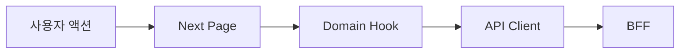

# 스터디 보고서 작성 규칙

## 목적

프론트엔드 요구사항 구현 과정을 나중에 다시 공부할 수 있는 블로그형 보고서로 남긴다. 단순 변경 요약이 아니라, "왜 이 구조를 선택했는지", "대안은 무엇이었는지", "무엇을 더 공부하면 좋은지"까지 설명한다.

## 저장 위치

```text
requirements/reports/studies/REQ-{번호}.md
```

REQ 번호가 없으면 작업명 기반 kebab-case 파일명을 사용한다.

```text
requirements/reports/studies/{topic}.md
```

## 작성 전 확인

- `salt-microFe/CLAUDE.md`
- 관련 `.claude/rules/**`
- 요구사항 파일: `requirements/specs/**/REQ-{번호}.md`
- 구현 diff: `git diff -- salt-microFe/`
- 검증 결과: build, lint, check-types, Storybook, MFE 실행 결과 중 실제 수행한 것
- 외부 참고 자료: 공식 문서 우선, 보조 자료는 작성 스타일과 사례 참고용

## 글 구조

아래 순서를 기본으로 한다.

```md
# {REQ 제목}: 구현 과정 스터디

## TL;DR
- 3~5줄로 핵심만 요약한다.

## 문제 상황
- 사용자가 겪는 문제 또는 개발자가 해결해야 했던 구조적 문제를 먼저 쓴다.

## 요구사항 정리
- 기능 요구사항과 비기능 요구사항을 나눠 쓴다.

## 선택지 비교
| 선택지 | 장점 | 단점 | 판단 |
|---|---|---|---|

## 왜 이 방식으로 구축했나
- 채택한 구조, 라이브러리, 브라우저 API, 상태 관리, MFE 통신 방식을 이유 중심으로 설명한다.

## 구현 흐름
- 데이터 흐름, 컴포넌트 구조, 이벤트 흐름을 단계별로 설명한다.

## 다이어그램
- Mermaid를 우선 사용하고, Mermaid로 과하면 ASCII를 사용한다.

## 핵심 코드 읽기
- 실제 파일 경로와 핵심 코드 조각을 짧게 연결한다.

## 검증과 결과
- 실행한 명령과 관찰 결과를 쓴다.

## 더 공부하면 좋은 것
- 공식 문서와 좋은 글을 링크한다.

## 회고
- 다음에 개선할 점과 남은 리스크를 쓴다.
```

## 작성 톤

- 독자가 처음 보는 사람이라고 가정하고 쉬운 말로 쓴다.
- "무엇을 했다"보다 "왜 필요했고 그래서 어떻게 했다"를 우선한다.
- 구현 세부사항은 코드 전체 복붙 대신 핵심 흐름만 인용한다.
- 대안 비교는 최소 2개 이상 쓴다.
- 장점만 쓰지 말고 포기한 것과 비용도 같이 쓴다.
- TL;DR은 바쁜 사람이 읽어도 결론을 알 수 있게 쓴다.

## 블로그형 서술 규칙

- 토스 기술 블로그 스타일처럼 문제 배경, 제약, 선택지, 의사결정, 구현 모델, 결과 순서로 설명한다.
- Velog 회고형 글처럼 "당시 헷갈렸던 점", "구현하며 배운 점", "다음에 다시 본다면 확인할 것"을 남긴다.
- 독자의 학습 동선을 위해 섹션 끝에 "여기서 배울 점"을 짧게 둘 수 있다.

## 다이어그램 규칙

Mermaid 예시:



ASCII 예시:

```text
Shell(host)
  ├─ goals remote
  ├─ investments remote
  └─ shared packages
```

## 참고 링크 규칙

- 브라우저 API는 MDN 링크를 우선한다.
- React 개념은 React 공식 문서를 우선한다.
- Next.js 개념은 Next.js 공식 문서를 우선한다.
- Module Federation은 공식 문서 또는 `@module-federation/nextjs-mf` 문서를 우선한다.
- Turborepo, pnpm, Vanilla Extract, Storybook, TanStack Query는 각 공식 문서를 우선한다.
- 특정 라이브러리를 채택했다면 "왜 이 라이브러리인지", "대안은 무엇인지", "현재 프로젝트에서 얻는 이점"을 함께 쓴다.

## 기본 참고 링크

- [MDN Web APIs](https://developer.mozilla.org/en-US/docs/Web/API)
- [MDN JavaScript](https://developer.mozilla.org/en-US/docs/Web/JavaScript)
- [React Documentation](https://react.dev/)
- [Next.js Documentation](https://nextjs.org/docs)
- [Module Federation Documentation](https://module-federation.io/)
- [@module-federation/nextjs-mf](https://module-federation.io/guide/framework/nextjs.html)
- [Turborepo Documentation](https://turbo.build/repo/docs)
- [pnpm Workspaces](https://pnpm.io/workspaces)
- [Vanilla Extract](https://vanilla-extract.style/)
- [Storybook Documentation](https://storybook.js.org/docs)
- [TanStack Query Documentation](https://tanstack.com/query/latest)
- [Zustand Documentation](https://zustand.docs.pmnd.rs/)
- [Frontend Fundamentals](https://frontend-fundamentals.com/)
- [Toss Tech - Frontend](https://toss.tech/tech?category=frontend)

## 품질 체크리스트

- [ ] TL;DR이 있다.
- [ ] 문제와 요구사항이 분리되어 있다.
- [ ] 선택지 비교와 채택 이유가 있다.
- [ ] 구현 흐름이 다이어그램으로 설명되어 있다.
- [ ] 실제 파일 경로가 포함되어 있다.
- [ ] 검증 명령과 결과가 있다.
- [ ] 더 공부할 링크가 공식 문서 중심으로 정리되어 있다.
- [ ] 과장된 성과 대신 실제 결과를 썼다.
