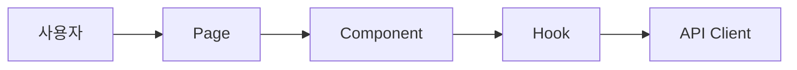

# {REQ 제목}: 구현 과정 스터디

## TL;DR

- 무엇을 만들었는지 1줄.
- 왜 이 방식으로 만들었는지 1줄.
- 구현에서 가장 중요한 흐름 1줄.
- 검증 결과 1줄.

## 문제 상황

사용자 또는 개발자가 어떤 불편을 겪었는지 먼저 설명한다.

## 요구사항 정리

### 기능 요구사항

- 

### 비기능 요구사항

- 성능:
- 접근성:
- 유지보수:
- MFE/SSR 영향:

## 선택지 비교

| 선택지 | 장점 | 단점 | 판단 |
|---|---|---|---|
| A |  |  |  |
| B |  |  |  |

## 왜 이 방식으로 구축했나

채택한 구조, 라이브러리, API, 상태 관리 방식의 이유를 적는다.

## 구현 흐름

1. 
2. 
3. 

## 다이어그램



## 핵심 코드 읽기

- `파일 경로` — 어떤 책임을 맡는지 설명
- `파일 경로` — 왜 이렇게 나눴는지 설명

## 검증과 결과

```bash
pnpm build
pnpm lint
```

실행 결과:

- 

## 더 공부하면 좋은 것

- [MDN Web APIs](https://developer.mozilla.org/en-US/docs/Web/API)
- [React Documentation](https://react.dev/)
- [Next.js Documentation](https://nextjs.org/docs)
- [Module Federation Documentation](https://module-federation.io/)
- [Turborepo Documentation](https://turbo.build/repo/docs)
- [pnpm Workspaces](https://pnpm.io/workspaces)
- [Vanilla Extract](https://vanilla-extract.style/)
- [Frontend Fundamentals](https://frontend-fundamentals.com/)

## 회고

- 헷갈렸던 점:
- 배운 점:
- 다음에 개선할 점:
