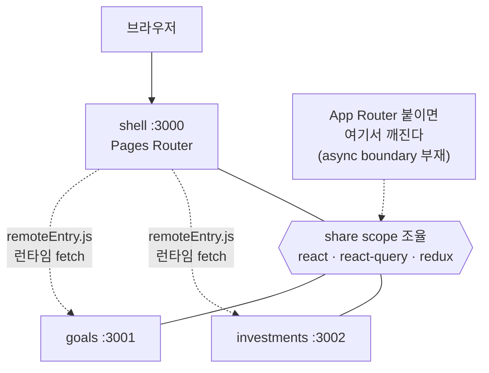
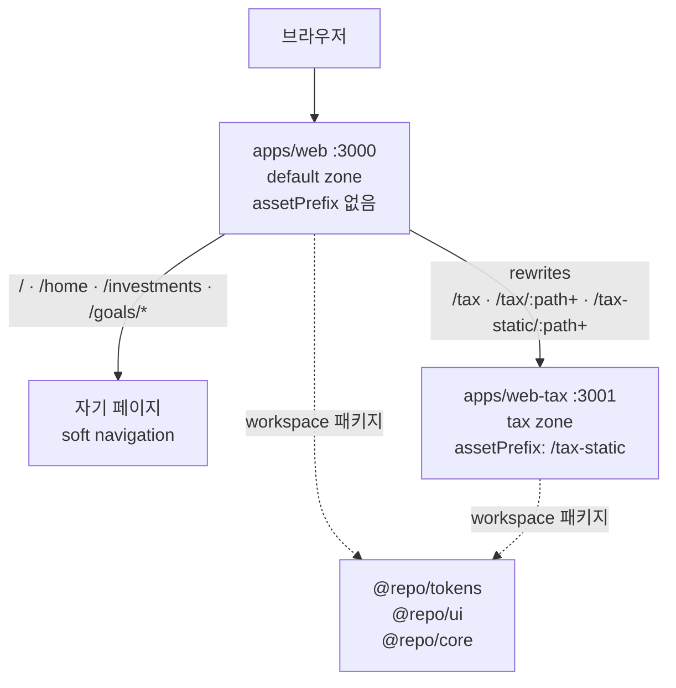

# Module Federation을 버리고 Multi-Zones로: 구현 과정 스터디

작성: 2026-09-11 · REQ: `FE-REQ-007` · 브랜치: `feature/fe-req-007-multi-zones`

## TL;DR

- Next 앱 3개를 `@module-federation/nextjs-mf`로 런타임에 합치고 있었는데, 그 플러그인 **공식 문서에 `App Router Not Supported`와 `Support for Next.js is ending`이 적혀 있다.** 스트리밍 SSR과 MFE를 동시에 가질 방법이 없었다.
- 후보 5개를 비교해 **Next.js Multi-Zones**를 골랐다. 조립 지점이 **런타임 번들 → 요청 라우팅**으로 바뀌고, zone은 그냥 평범한 Next 앱이 된다.
- 옮기고 보니 **잃는 기능이 없었다.** 우리는 remote를 페이지 통째로 마운트하는 4곳으로만 쓰고 있었다 — 비싼 능력을 사고 싼 기능만 쓰던 상태였다.
- 앱 3개 → zone 2개(`apps/web` + `apps/web-tax`), Next 14 → 15, `packages/tokens`·`packages/core` 신설, cross-zone `<Link>`를 막는 ESLint 규칙 추가. 빌드·린트·타입 전부 통과, `/tax` 프록시를 curl로 확인했다.
- **아직 App Router가 아니다.** 이 REQ는 zone 재편까지고, 스트리밍 SSR은 `FE-REQ-008`이다.

---

## 문제 상황

SALT 웹은 Next 앱 3개였다.

```
apps/shell        (host, 3000)   — 로그인 · 홈 · 레이아웃
apps/goals        (remote, 3001) — 목표 저축
apps/investments  (remote, 3002) — 투자 분석
```

`shell`이 `NextFederationPlugin`으로 두 remote의 `remoteEntry.js`를 런타임에 불러 합쳤다. 동작은 했다. 그런데 앞으로 올릴 요구사항이 **145개**고, 그중 홈 5블록·세금 콕핏·청구서는 **소스가 여럿이고 지연이 제각각인 화면**이다.

이런 화면은 가장 느린 소스에 전체가 묶이면 안 된다. 총자산은 100ms에 오는데 청구서 스냅샷이 미스나면 1.5초가 걸린다. 그러면 총자산부터 먼저 보여줘야 한다. Next에서 그걸 하는 방법은 **App Router의 RSC + Suspense 스트리밍**이다.

여기서 막혔다.

### 막힌 지점 — 사실 네 개

**1. 공식 문서에 "App Router 미지원"이 박혀 있다.**
[Module Federation의 Next.js 통합 문서](https://module-federation.io/integrations/framework/nextjs/) 상단에 `App Router Not Supported`가 있고, 본문은 Pages Router만 지원한다고 적는다. 공식 예제도 전부 Pages Router다.

**2. 같은 문서가 "Next.js 지원 종료"를 선언한다.**
같은 페이지에 `Support for Next.js is ending`(근거 이슈 `module-federation/core#3153`). 지금 동작해도 REQ 145개와 모바일 앱이 **유지보수가 끝난 빌드 플러그인**에 묶인다.

**3. 붙이면 깨진다.**
`Compiling RuleSet failed: Expected condition but got falsy value` — Next 14.1 + App Router에서 재현되고, App Router를 빼면 같은 설정이 동작한다([core#2122](https://github.com/module-federation/core/issues/2122)). App Router 지원 요청은 미해결([core#1183](https://github.com/module-federation/core/issues/1183)).

**4. 근본 원인이 설정 문제가 아니다.**
Next에 **async boundary가 없어서** webpack이 share scope를 조율하는 동안 앱을 "일시 정지"시킬 수 없다([vercel/next.js#33327](https://github.com/vercel/next.js/discussions/33327)). 번들러와 프레임워크 경계의 문제라 옵션으로 우회할 수 없다.

> **한 줄:** `nextjs-mf`를 유지하면 스트리밍 SSR을 포기해야 하고, 그러고도 지원이 끝난 플러그인에 남는다.

---

## 요구사항 정리

### 기능 요구사항

| ID | 내용 |
|---|---|
| FR-1 | `shell`+`goals`+`investments` → **`apps/web`** 하나. default zone, `assetPrefix` 없음 |
| FR-2 | **`apps/web-tax`** 신설. `assetPrefix: '/tax-static'`, 담당 경로 `/tax/*` |
| FR-3 | default zone의 `rewrites`가 `/tax`·`/tax/:path+`·`/tax-static/:path+`를 세금 zone으로 프록시 |
| FR-4 | zone 간 경로는 **유일**하다 |
| FR-5 | zone 간 링크는 `<a>`. **ESLint로 강제** |
| FR-6~7 | `nextjs-mf`·`message-event-bus` 제거 |
| FR-8 | Next 15+ |
| FR-30 | `packages/tokens` — 플랫폼 중립 토큰 (RN이 import 가능해야 한다) |
| FR-32 | `packages/core` — 플랫폼 무관 모델·상수 |
| FR-33 | zone 간 코드 공유는 workspace 패키지로만 |

### 비기능 요구사항

- zone **내부** 이동은 soft navigation. zone **간** 이동(1회, `/tax`)은 성능 예산에서 제외하고 별도 측정
- `nextjs-mf` 제거는 **커밋 하나로 되돌릴 수 있게** 단일 커밋. 앱 통합은 별도 커밋
- zone별 첫 페인트·cross-zone 이동 횟수·프록시 지연 측정

---

## 선택지 비교

| | A. `nextjs-mf` 유지 | B. MF 2.0 + Rspack | **C. Multi-Zones** | D. Vite + MF | E. MFE 폐기 |
|---|---|---|---|---|---|
| App Router | ✗ 명시적 미지원 | 실험적 | **✓ 공식** | 해당 없음 | ✓ |
| 스트리밍 SSR | ✗ | 실험적 | **✓ zone별로 온전히** | 직접 구현 | ✓ |
| 독립 배포 | ✓ | ✓ | **✓ zone 단위** | ✓ | ✗ |
| 조립 지점 | 런타임 번들 | 런타임 번들 | **요청 라우팅** | 런타임 번들 | 없음 |
| 유지보수 상태 | **지원 종료 중** | 진화 중 | **공식 문서 + Vercel Public Beta** | 안정 | — |
| 지금 코드 보존 | 전부 | 빌드 설정 재작성 | **라우트 이관만** | 전면 재작성 | 라우트 이관 |
| 학습·운영 비용 | 낮음 | 높음 | **낮음 — `assetPrefix` + `rewrites`뿐** | 높음 | 가장 낮음 |

### B를 버린 게 제일 아까웠다

[Rspack 2.0](https://www.rspack.dev/blog/announcing-2-0)은 이 방향에 가장 가깝다. RSC 지시어(`"use client"`, `"use server"`)를 처리하고, Module Federation `shared`에 **export 레벨 tree shaking**이 붙었고(`lodash-es`에서 `debounce`만 남기는 수준), 10k 벤치에서 프로덕션 캐시 적용 1.4초다.

**그런데 같은 발표문이 RSC 지원을 "실험적 저수준 빌드 지원"이라고 적는다.** stability 선언이 없고, `next-rspack`의 상태가 명시되지 않는다.

버린 진짜 이유는 기술이 아니라 **인력**이었다. 우리는 지금부터 REQ 145개와 모바일 앱을 이 위에 올린다. 그 전부의 실패 원인이 빌드 층에서 나올 수 있는 조합을 기반으로 깔 수 없다. 빌드 툴체인 전담이 없다 — 토스는 RN 플랫폼 팀이 4명이다.

> **다시 볼 조건:** `next-rspack` 안정 선언 + `@module-federation/enhanced`의 App Router 공식 지원. 그때는 `web-tax` zone **하나만** 실험 대상으로 삼을 수 있다 — Multi-Zones가 그 실험을 zone 단위로 격리해 준다는 것도 C의 장점이다.

### D(Vite + MF)를 버린 이유

동작은 안정적이다. 하지만 Next를 떠나면 SSR·이미지 최적화·라우팅을 직접 만들어야 한다. 이 제품은 비공개·초대제라 **SEO 요구가 없고**, SSR을 자작해서 얻을 게 없다. 이미 있는 Next 자산을 버리는 비용만 남는다.

### E(MFE 폐기)를 버린 이유

사용자가 "모듈 페더레이션 그럼 최신방식으로 대체"를 명시했다. 그리고 다음 절에서 보듯 **zone 경계가 실제로 하나 있다.**

---

## 왜 이 방식으로 구축했나

일반론이 아니라 **이 제품의 제약**에 비춘 이유 넷.

### 이유 1 — 조립이 빌드가 아니라 라우팅에서 일어난다

Module Federation은 **런타임에 번들을 합친다.** 그래서 share scope·버전 정렬·async boundary가 문제가 된다.

Multi-Zones는 **HTTP 경로를 프록시로 나눈다.** zone은 그냥 평범한 Next 앱이다. 번들러가 서로를 알 필요가 없으므로 **각 zone이 자기 RSC·Suspense 스트리밍을 온전히 갖는다.** "스트리밍 SSR을 원한다"와 "MFE를 유지한다"는 두 요구가 서로를 막지 않게 되는 구조적 이유가 이것이다.

### 이유 2 — 우리가 MFE를 쓰던 방식이 이미 Multi-Zones와 같았다

**이게 이번 작업에서 확인된 것 중 가장 중요하다.** 옮기기 전에 실제 사용처를 세어 봤다.

```
$ grep -rn 'import("goals/\|import("investments/' apps/shell/src
apps/shell/src/pages/goals/addgoals/index.tsx:9:const AddGoals = dynamic(() => import("goals/AddGoals"), {
apps/shell/src/pages/home/index.tsx:11:const Goals = dynamic(() => import("goals/GoalsApp"), {
apps/shell/src/pages/home/index.tsx:14:const Investments = dynamic(() => import("investments/InvestmentsApp"), {
apps/shell/src/pages/investments/index.tsx:13:const InvestmentPage = dynamic(() => import("investments/Investment"), {
```

**네 곳. 전부 페이지를 통째로 마운트한다.** 한 페이지 안에서 컴포넌트 단위로 remote를 섞은 자리가 하나도 없었다.

즉 **런타임 번들 조립이라는 비싼 능력을 사고, 경로 단위 분리라는 싼 기능만 쓰고 있었다.** Multi-Zones로 옮기면 실제로 쓰던 것은 그대로 남고 안 쓰던 비용만 사라진다. **잃는 기능이 없다는 걸 코드로 확인한 것**이 판단의 핵심이었다.

### 이유 3 — 우리에게 zone 경계가 실제로 하나 있다: 세금

| | 세금 콕핏 | 나머지 화면 |
|---|---|---|
| 방문 빈도 | 연말 + 신고 기간(5월) | 매일 |
| 릴리스 이유 | **법령 파라미터 변경** (시행일·세율·공제·기준일) | 기능 추가 |
| 코드 무게 | 취득가액 lot 엔진 · 손실수확 솔버 · 환율 함정 탐지 | — |

법이 바뀌면 **세금 zone만 배포**한다. 반대로 세금 솔버 코드가 매일 쓰는 홈·코치 번들에 실려 갈 이유가 없다. "MFE가 필요한가"에 대한 답이 여기서 나왔다 — **하나는 필요하다.**

### 이유 4 — 탭으로 zone을 자르지 않으면 대가를 안 치른다

Multi-Zones의 대가는 **zone 간 이동이 hard navigation**이라는 것이다. 리소스를 내리고 다시 받는다. [공식 지침](https://nextjs.org/docs/app/guides/multi-zones)이 *"자주 함께 방문되는 페이지는 같은 zone에 둔다"*이다.

3탭 IA(`홈`/`코치`/`자산`)를 zone 3개로 자르면 **탭 전환마다 full reload**가 된다 — 이 제품에서 가장 잦은 이동이다. 그래서 **탭 경계로 자르지 않았다.** 3탭은 전부 `apps/web` 한 zone에 두고 soft navigation을 유지한다.

세금은 홈의 `세금 D-Day` 한 줄에서 진입하고 방문 빈도가 낮으므로, 그 한 번의 hard navigation은 **치를 만한 대가**다. 대가를 회피할 수 있는 경계가 IA에 이미 있었다는 것이 마지막 근거였다.

---

## 구현 흐름

커밋 5개로 나눴다. NFR이 "`nextjs-mf` 제거는 커밋 하나로 되돌릴 수 있게, 앱 통합은 별도 커밋"을 요구했다.

| # | 커밋 | 무엇을 |
|---|---|---|
| 1 | `31de64e` | `@repo/tokens` — 토큰을 순수 TS 객체로 추출 |
| 2 | `c1576e3` | `@repo/core/zones` 레지스트리 + `@repo/zone/no-cross-zone-link` |
| 3 | `5a0276c` | 3앱 → zone 2개 통합 |
| 4 | `d425cbe` | **`nextjs-mf`·`message-event-bus` 제거 + Next 15** ← revert 지점 |
| 5 | `3e2cfba` | 규칙 문서 27개 + 요구사항 리포트 |

### 1단계 — 토큰을 CSS에서 떼어냈다

`packages/ui/src/styles/tokens.css.ts`가 `createGlobalTheme(':root', { … })` **호출**이었다. 값이 함수 인자 안에 있으니 [React Native](https://reactnative.dev/)에서 import할 방법이 없다 — RN에는 `:root`도 CSS도 없다.

값을 객체로 빼서 웹은 그것으로 `createGlobalTheme`을, RN은 `StyleSheet`를 만들게 했다. `RN-REQ-001`의 공동 선행 조건이기도 하다.

### 2단계 — "어느 경로가 어느 zone인가"를 한 곳에 뒀다

Multi-Zones에서 조립이 라우팅에서 일어난다는 건, **경로 소유권이 아키텍처가 된다**는 뜻이다. 그 정보를 세 곳(앱 설정, 링크 컴포넌트, lint 규칙)이 각자 알면 반드시 어긋난다.

### 3단계 — 앱 통합

remote 페이지를 로컬 컴포넌트로 내렸다. 세 앱에 각각 있던 `QueryClientProvider`·`ReduxProvider` 중첩이 사라지고 `_app.tsx` 한 곳으로 모였다.

| 이전 | 지금 |
|---|---|
| `goals/GoalsApp` remote | `src/component/GoalsApp/GoalsApp.tsx` |
| `goals/AddGoals` remote | `src/component/AddGoals/AddGoalsContent.tsx` |
| `investments/InvestmentsApp` remote | `src/component/InvestmentsApp/InvestmentsApp.tsx` |
| `investments/Investment` remote | `src/component/Investment/Investment.tsx` |
| `RemoteBoundary` | `src/components/Section/SectionBoundary.tsx` |

세 앱에 **글자 단위로 똑같이** 복사돼 있던 `QueryClientProvider.tsx`·`uiStore.ts`·`types/store/ui/types.ts`는 하나로 합쳤고, `api.ts`의 HTTP 상수와 인증 키는 `@repo/core`로 올렸다.

### 4단계 — 제거와 Next 15

`message-event-bus`를 지우려고 사용처를 찾았는데 **한 곳뿐이었다.**

```
$ grep -rn "message-event-bus" apps --include="*.tsx"
apps/goals/src/component/AddGoals/AddGoalsContent.tsx:9:  useMessageEventBus
```

`account.selected`를 **구독**하고 있었다. 그런데 **publish하는 쪽이 없었다.** 즉 `accountData`는 항상 `null`이었고, `console.log(accountData)` 하나로 끝나고 있었다. 게다가 계좌 연동 자체가 `FEATURE-000`에서 제품 범위에서 빠졌다(원장 100% 수기 입력). 대체 구현 없이 지웠다.

### 5단계 — 문서가 코드보다 넓게 퍼져 있었다

이게 예상보다 컸다. `.claude`/`.codex` 양쪽에 remote·shell·federation 서술이 남아 있었고, 그대로 두면 **다음 세션이 없는 구조를 전제로 작업한다.** 규칙 9개 개정, 1개 삭제, 스킬 5개 수정, 앱 문서 3개 갱신.

---

## 다이어그램

### 이전 — 런타임 번들 조립



### 지금 — 요청 라우팅 조립



**두 zone이 서로를 번들 수준에서 모른다.** 공유는 workspace 패키지로만 흐르고, 런타임 결합이 없다.

### `/tax` 요청 한 번이 지나는 길

```text
브라우저  GET localhost:3000/tax
   │
   ▼
apps/web (default zone)
   │  next.config.js  rewrites
   │  { source: '/tax', destination: `${TAX_ZONE_ORIGIN}/tax` }
   ▼
apps/web-tax :3001  →  src/pages/tax/index.tsx 렌더
   │  assetPrefix: '/tax-static'
   │  HTML 안의 자산 경로가 /tax-static/_next/... 로 나간다
   ▼
브라우저  GET localhost:3000/tax-static/_next/static/chunks/polyfills.js
   │
   ▼
apps/web  rewrites  { source: '/tax-static/:path+', … }  →  web-tax  →  200
```

`assetPrefix`가 없으면 두 zone의 `_next/...`가 같은 경로에서 충돌한다. **`assetPrefix`와 `rewrites`는 반드시 짝으로 존재한다.**

---

## 핵심 코드 읽기

### zone 레지스트리 — 단일 소스

`packages/core/src/zones/registry.ts`

```ts
export const ZONES: Readonly<Record<ZoneId, ZoneDescriptor>> = {
  default: { app: 'web',     devPort: 3000, pathPrefixes: ['/', '/home', '/investments', '/goals'], assetPrefix: null },
  tax:     { app: 'web-tax', devPort: 3001, pathPrefixes: ['/tax'],                                 assetPrefix: '/tax-static' },
};

export const crossZonePathPrefixes = (from: ZoneId): readonly string[] =>
  ZONE_IDS.filter((id) => id !== from).flatMap(ownedPrefixes);
```

여기서 걸린 자잘한 함정 하나. default zone의 `'/'`를 prefix로 그냥 쓰면 **모든 경로를 삼킨다.** 그래서 `'/'`는 정확히 일치할 때만 걸리게 예외를 뒀다.

```ts
export const isCrossZonePath = (href: string, from: ZoneId = 'default'): boolean => {
  if (!href.startsWith('/')) return false;
  return crossZonePathPrefixes(from).some((prefix) =>
    prefix === '/' ? href === '/' : matchesPrefix(href, prefix)
  );
};
```

`matchesPrefix`는 `href === prefix || href.startsWith(prefix + '/')`다. **`/tax`는 걸리고 `/taxes`는 걸리지 않는다** — 단순 `startsWith`였다면 `/taxes`가 오탐이 된다.

### zone을 넘는 `<Link>`를 막는 규칙

`packages/eslint-plugin-zone/rules/no-cross-zone-link.js`

`next/link`의 **default import에 붙은 지역 이름**을 추적한다. `import L from 'next/link'`로 이름을 바꿔도 잡힌다.

```js
ImportDeclaration(node) {
  if (node.source.value !== 'next/link') return;
  for (const s of node.specifiers) {
    if (s.type === 'ImportDefaultSpecifier') nextLinkNames.add(s.local.name);
  }
},
```

`href`는 정적으로 값을 알 수 있을 때만 판정한다. 템플릿 리터럴은 **첫 quasi**만 보면 zone 판정에 충분하다.

```js
if (expression.type === 'TemplateLiteral' && expression.quasis.length > 0) {
  return expression.quasis[0].value.cooked;   // `/tax/${id}` → "/tax/"
}
```

동작 확인:

| 코드 | 결과 |
|---|---|
| `<Link href="/tax">` | **error** |
| ``<Link href={`/tax/${id}`}>`` | **error** |
| `<Link href="/tax-static/x">` | **error** |
| `<Link href="/taxes">` | pass — prefix가 아니다 |
| `<Link href="/home">` | pass — 같은 zone |
| `<a href="/tax">` | pass |

### 전환 비용을 파일 하나에 가뒀다

배포 대상이 **자체 호스팅**으로 정해졌다(아래 참조). 그러면 cross-zone 이동이 hard navigation이고 완화 수단이 없다. 대신 클릭 직후 로딩 상태를 노출한다.

`apps/web/src/components/Zone/CrossZoneLink.tsx`

```tsx
/**
 * > Vercel 로 옮길 때(FR-20) 바꾸는 곳은 이 파일 하나다.
 * > `@vercel/microfrontends` 의 확장 `Link` 로 내부 구현을 교체하고,
 * > 루트에 `PrefetchCrossZoneLinksProvider` 를 건다. 호출부는 그대로 둔다.
 */
```

새 탭·수정키 클릭에서는 현재 문서가 그대로 남으므로 대기 상태를 켜지 않는다 — 안 그러면 "이동 중…"이 영원히 남는다.

```tsx
if (event.metaKey || event.ctrlKey || event.shiftKey || event.altKey || rest.target === '_blank') return;
setIsPending(true);
```

### 프록시 설정 — 이게 전부다

`apps/web/next.config.js`

```js
async rewrites() {
  return [
    { source: '/tax',               destination: `${TAX_ZONE_ORIGIN}/tax` },
    { source: '/tax/:path+',        destination: `${TAX_ZONE_ORIGIN}/tax/:path+` },
    { source: '/tax-static/:path+', destination: `${TAX_ZONE_ORIGIN}/tax-static/:path+` },
  ];
}
```

`shell`의 `NextFederationPlugin` 설정 44줄이 이 9줄로 바뀌었다. **학습·운영 비용이 낮다는 게 비교표의 빈말이 아니었다.**

---

## 검증과 결과

### 실행한 명령

| 명령 | 결과 |
|---|---|
| `pnpm build` | **2/2 성공** (`web` 5.4s, `web-tax` 2.4s) |
| `pnpm lint` | **6/6 성공** |
| `pnpm check-types` | **6/6 성공** |
| `pnpm dev` | 두 zone 동시 기동, 둘 다 Ready 1.4s |

### 프록시가 실제로 도는지 — curl

```bash
$ curl -s -o /dev/null -w "%{http_code}" http://localhost:3000/tax
200

$ curl -s http://localhost:3000/tax | grep -o "세금 마감 콕핏"
세금 마감 콕핏                        # 세금 zone 마크업이 default zone 을 통해 왔다

$ curl -s http://localhost:3000/tax | grep -o '/tax-static/_next/[^"]*' | head -1
/tax-static/_next/static/chunks/polyfills.js

$ curl -s -o /dev/null -w "%{http_code} %{content_type}" \
    http://localhost:3000/tax-static/_next/static/chunks/polyfills.js
200 application/javascript; charset=UTF-8

$ curl -s http://localhost:3000/home | grep -o '<a[^>]*href="/tax"[^>]*>'
<a href="/tax">                       # <Link> 가 아니다
```

### 번들 — 분리가 성립했나

**`apps/web`** (default zone)

| Route | Size | First Load JS |
|---|---|---|
| `/` | 2 kB | 113 kB |
| `/home` | 29.9 kB | 139 kB |
| `/investments` | 2.51 kB | 112 kB |
| `/goals/addgoals` | 3.88 kB | 114 kB |
| shared | | **103 kB** |

**`apps/web-tax`** (tax zone)

| Route | Size | First Load JS |
|---|---|---|
| `/tax` | 988 B | 85.9 kB |
| shared | | **86.2 kB** |

두 zone이 번들을 공유하지 않는다. 아직 세금 화면이 껍데기라 수치 자체는 작지만, **F002에서 들어올 취득가액 lot 엔진·손실수확 솔버가 매일 쓰는 번들에 실리지 않는다**는 격리가 지금 성립해 있다는 게 요점이다.

> before 수치는 없다. 3앱 구성이 이 브랜치에서 삭제돼 동일 조건 재빌드가 안 된다. 필요하면 `main`에서 `pnpm build`를 돌려 얻는다.

### Next 14 → 15에서 깨진 것

**1건뿐이었다.** `next-env.d.ts`에 Next 15가 추가한 `/// <reference path="./.next/types/routes.d.ts" />`가 `@typescript-eslint/triple-slash-reference`에 걸린다. Next가 생성하고 "편집하지 말라"고 주석에 적어 둔 파일이라 고칠 수 없어서, 두 앱 `.eslintrc.json`에 `ignorePatterns`로 뺐다.

`next-i18next` 같은 까다로운 의존성이 없었던 게 컸다.

### 미충족 — 3건

| 항목 | 왜 | 언제 |
|---|---|---|
| `/coach`·`/assets` soft navigation 실측 | **두 경로가 아직 없다** | F006 (`FE-REQ-030`~`033`) |
| 관측성 NFR | 배포 인프라가 없어 보낼 곳이 안 정해졌다 | 배포 환경 확정 시 |
| FR-24 기능 플래그 (Should) | zone을 넘나드는 기능이 아직 없다 | F002 |

그래서 REQ를 `done/`이 아니라 **`in-progress/`**로 옮겼다.

### 배포 대상 결정 — Open Question 해소

REQ가 "착수 전 확정 필요"로 표시했던 항목이다. **자체 호스팅(FR-21)**으로 정했다.

| 근거 | |
|---|---|
| 규모 | 비공개·초대제 ≤10명. `@vercel/microfrontends`의 cross-zone prefetch가 사는 값이 트래픽 규모에서 나오는데 그 규모가 없다 |
| 안정성 | FR-20은 [Public Beta 기능](https://vercel.com/docs/microfrontends)에 배포 구조를 묶는다. Rspack을 버린 논리가 여기에도 걸린다 |
| 대가 | `/tax`는 연말·5월 진입. hard navigation 1회의 대가가 작다 |

---

## 더 공부하면 좋은 것

- [Guides: Multi-zones — Next.js](https://nextjs.org/docs/app/guides/multi-zones) — `assetPrefix`/`rewrites` 짝, 경로 유일성, "자주 함께 방문되는 페이지는 같은 zone에" 지침
- [Next.js Documentation](https://nextjs.org/docs) — `rewrites`, `assetPrefix`, `experimental.serverActions.allowedOrigins`
- [vercel-labs/microfrontends-nextjs-app-multi-zone](https://github.com/vercel-labs/microfrontends-nextjs-app-multi-zone) — App Router 기준 공식 예제. `FE-REQ-008`에서 다시 볼 것
- [Vercel Microfrontends](https://vercel.com/docs/microfrontends) — FR-20으로 갈 때의 완화 수단
- [Module Federation — Next.js Integration](https://module-federation.io/integrations/framework/nextjs/) — `App Router Not Supported`·`Support for Next.js is ending` 원문
- [vercel/next.js#33327](https://github.com/vercel/next.js/discussions/33327) — async boundary 부재. **왜 설정으로 못 고치는지**의 근원
- [Announcing Rspack 2.0](https://www.rspack.dev/blog/announcing-2-0) — 다시 볼 때의 출발점
- [React Documentation](https://react.dev/) — `Suspense`·error boundary. `FE-REQ-008` 선행 학습
- [Vanilla Extract](https://vanilla-extract.style/) — `createGlobalTheme`이 왜 RN에서 안 되는지
- [Turborepo](https://turbo.build/repo/docs) · [pnpm Workspaces](https://pnpm.io/workspaces) — `workspace:*`, `transpilePackages`
- [Writing ESLint Rules](https://eslint.org/docs/latest/extend/custom-rules) — AST 방문자, `meta.schema`, `messageId`
- [Toss Tech — Frontend](https://toss.tech/tech?category=frontend) · [Frontend Fundamentals](https://frontend-fundamentals.com/)

---

## 회고

### 배운 것 1 — "기능이 필요한가"보다 "그 기능을 실제로 쓰고 있나"

Module Federation을 버릴지 판단할 때 가장 결정적이었던 건 스펙 비교표가 아니라 **`grep`으로 사용처를 센 것**이었다. 네 곳, 전부 페이지 단위. 컴포넌트 단위 조립을 한 번도 안 쓰고 있었다.

만약 한 페이지 안에서 remote 컴포넌트를 섞어 쓰고 있었다면 Multi-Zones로 옮기는 순간 그 기능을 잃는다. 그때는 판단이 달라졌을 것이다. **비교표를 만들기 전에 지금 코드가 그 능력을 쓰는지부터 세는 게 맞다.**

`message-event-bus`도 같은 패턴이었다. "MFE 간 통신"이라는 그럴듯한 이름의 패키지였는데, 구독 1곳 / 발행 0곳 — **죽은 코드였다.**

### 배운 것 2 — 아키텍처 전환에서 문서가 코드보다 넓다

코드 변경은 앱 3개와 패키지 몇 개였는데, **문서는 27개 파일을 고쳤다.** `.claude`/`.codex` 양쪽 규칙에 "shell의 server remote는 `/_next/static/ssr/remoteEntry.js`를 참조한다" 같은 문장이 흩어져 있었다.

이걸 안 고치면 다음 세션이 **없는 구조를 전제로 설계한다.** 아키텍처 전환 REQ는 문서 갱신을 산출물로 명시해야 한다. `FE-REQ-008`·`FE-REQ-009`에도 같은 크기의 문서 작업이 따라온다고 봐야 한다.

### 당시 헷갈렸던 것 — `'/'`를 prefix로 쓰면 안 된다

zone 레지스트리에 default zone의 경로를 적을 때 `'/'`를 그냥 넣었다가, `isCrossZonePath('/tax')`가 tax zone에서 `true`를 내는 걸 보고서야 알았다. `'/tax'.startsWith('/')`는 항상 참이다.

`'/'`만 정확히 일치로 처리하는 예외를 넣고, 10개 케이스로 검증표를 만들어 확인했다. **경로 prefix 매칭은 눈으로 맞다고 판단하지 말고 케이스를 나열해 돌려 보는 게 빠르다.**

### 포기한 것과 그 비용

| 포기한 것 | 비용 | 감수한 이유 |
|---|---|---|
| 컴포넌트 단위 런타임 조립 | 이론상 있음 | **실제로 안 쓰고 있었다** |
| `/tax` 진입의 soft navigation | hard navigation 1회 | 연말·5월에만 들어간다. `CrossZoneLink`가 로딩 상태를 준다 |
| Vercel cross-zone prefetch | 없음 (아직 Vercel이 아니다) | 전환 지점을 파일 하나로 가둬 뒀다 |
| Rspack의 빌드 속도·tree shaking | 큼 | 실험적 조합을 감당할 인력이 없다 |

### 남은 리스크 — 다음 사람이 밟을 것

1. **`/tax`에 인증이 필요해지는 순간 막힌다.** 토큰이 `localStorage`(`ACCESS_TOKEN_KEY`)에 있어 zone을 넘지 못한다. 지금 `/tax`가 인증 없는 화면이라 안 터지는 것뿐이다. `FE-REQ-013`의 쿠키 이관이 F002보다 먼저 끝나야 한다. 키는 `@repo/core/auth` 한 곳에 모아 이관 지점을 좁혀 뒀다.
2. **lint 규칙의 zone 경로가 두 곳에 있다.** 플러그인이 CommonJS라 TS 레지스트리를 import할 수 없어 `zonePaths` 옵션으로 받는다. 어긋나면 빌드가 깨지는 게 아니라 **lint가 조용히 느슨해진다** — 조용한 실패라 더 나쁘다. `FE-REQ-009`에서 flat config로 옮길 때 합친다.
3. **아직 Pages Router다.** 이 REQ는 zone 재편까지고, 애초의 동기였던 **스트리밍 SSR은 `FE-REQ-008`에서 얻는다.** 순서를 바꾸면 라우트를 두 번 옮긴다.

### 다음에 다시 본다면 확인할 것

- `next-rspack` 안정 선언과 `@module-federation/enhanced`의 App Router 지원 상태. 들어왔으면 **`web-tax` zone 하나만** 실험 대상으로 삼는다 — Multi-Zones가 그 실험을 격리해 준다.
- `pnpm dev`가 zone 수만큼 포트를 먹는다. zone이 3개를 넘으면 로컬 개발 경험을 다시 봐야 한다. (그럴 일이 없게 zone 추가 기준이 세 조건 전부인 것이다.)
